LM1903060403\_14v1

# 03 반도체용 가스 재료 제조

대분류 / 19 전기 · 전자 전자기기개발 소분류 / 06 반도체개발 세분류 / 04 반도체재료 확습모듈 / 03

# 반도체재료 학습모듈

#### 01. 반도체용 웨이퍼 재료 제조

O5. 반도체용 습식화공약품(Wet Chemical)재료 제조

BROWN REPORT REPORT

U5 반도체용 습식화공약품 (Wet Chemical)재료 제조

9

02. 반도체용 리소그래피 재료 제조

**03.** 반도체용 가스 재료 제조

**07**. 반도체용 나노 소재 제조

A BOOM MANY AND AND AND AND AND AND AND AND AND AND

07 반도체용 나노 소재 제조

9

#### 04. 반도체용 금속(Target)재료 제조

#### **08**. 반도체 재료 개발

06. 반도체용 패키지 재료 제조

10. 반도체 재료 품질관리

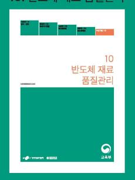

**09.** 반도체 재료 생산

11. 반도체 재료 안전관리

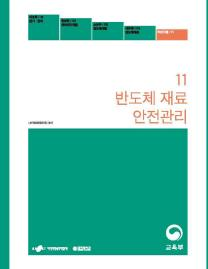

## NCS 학습모듈의 이해

\* 본 학습모듈은 「NCS 국가직무능력표준」사이트(http://www.ncs.go.kr) 에서 확인 및 다운로드 할 수 있습니다.

#### (1) NCS 학습모듈이란?

- 국가직무능력표준(NCS: National Competency Standards)이란 산업현장에서 직무를 수행하기 위해 요구되는 지식·기술·소양 등의 내용을 국가가 산업부문별·수준별로 체계화한 것으로 산업현장의 직무를 성공적으로 수행하기 위해 필요한 능력(지식, 기술, 태도)을 국가적 차원에서 표준화한 것을 의미합니다.
- 국가직무능력표준(이하 NCS)이 현장의 '직무 요구서'라고 한다면, NCS 학습모듈은 NCS의 능력단위를 교육훈련에서 학습할 수 있도록 구성한 '교수·학습 자료'입니다. NCS 학습모듈은 구체적 직무를 학습할 수 있도록 이론 및 실습과 관련된 내용을 상세하게 제시하고 있습니다.

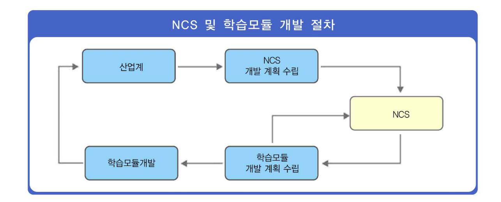

#### ● NCS 학습모듈은 다음과 같은 특징을 가지고 있습니다.

첫째, NCS 학습모듈은 산업계에서 요구하는 직무능력을 교육훈련 현장에 활용할 수 있도록 성취목표와 학습의 방향을 명확히 제시하는 가이드라인의 역할을 합니다. 둘째, NCS 학습모듈은 특성화고, 마이스터고, 전문대학, 4년제 대학교의 교육기관 및 훈련기관,

직장교육기관 등에서 표준교재로 활용할 수 있으며 교육과정 개편 시에도 유용하게 참고할 수 있습니다.

● NCS와 NCS 학습모듈 간의 연결 체제를 살펴보면 아래 그림과 같습니다.

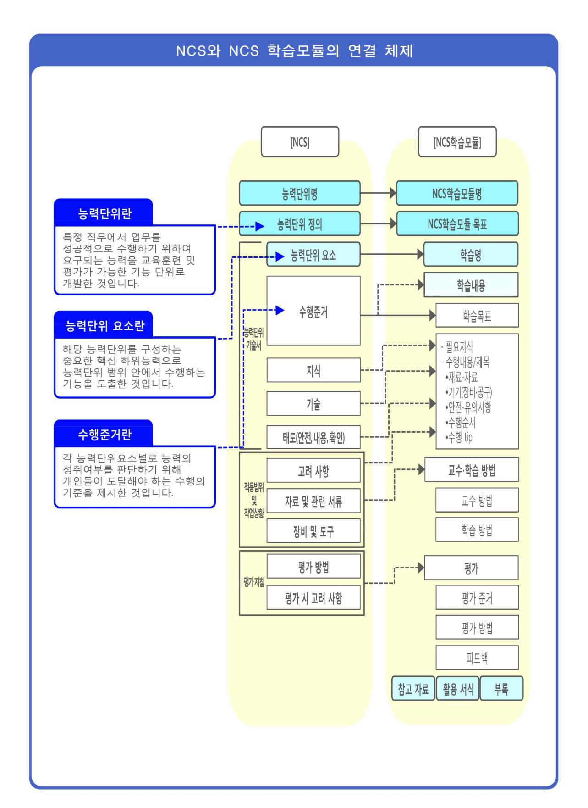

ii

#### (2) NCS 학습모듈의 체계

● NCS 학습모듈은 1.학습모듈의 위치 , 2.학습모듈의 개요 , 3.학습모듈의 내용 체계 , 4.참고 자료 ,
 5.활용 서식/부록 으로 구성되어 있습니다.

#### 1. NCS 학습모듈의 위치

NCS 학습모듈의 위치는 NCS 분류 체계에서 해당 학습모듈이 어디에 위치하는지를 한 눈에
 볼 수 있도록 그림으로 제시한 것입니다.

예시 : 이 · 미용 서비스 분야 중 네일미용 세분류

NCS-학습모듈의 위치

| 대분류 | 이용 · 숙박 · 여행 · 오락 · 스포츠 |          |
|-----|-------------------------|----------|
| 중분류 | 이・미용                    |          |
| 소분류 |                         | 이 미용 서비스 |

| 세 <del>분류</del> |             |           |
|-----------------|-------------|-----------|
| 헤어미용            | 능력단위        | 학습모듈명     |
| 피부미용            | 네일 샵 위생 서비스 | 네일숍 위생서비스 |
| 메이크업            | 네일 화장물 제거   | 네일 화장물 제거 |
| 네일미용            | 네일 기본 관리    | 네일 기본관리   |
| 이용              | 네일 랩        | 네일 랩      |
|                 | 네일 팁        | 네일 팁      |
|                 | 젤 네일        | 젤 네일      |
|                 | 아크릴릭 네일     | 아크릴 네일    |
|                 | 평면 네일아트     | 평면 네일아트   |
|                 | 융합 네일아트     | 융합 네일아트   |
|                 | 네일 샵 운영관리   | 네일숍 운영관리  |

| 학습모듈은                                                                                                                                                       |  |
|-------------------------------------------------------------------------------------------------------------------------------------------------------------|--|
| NCS 능력단위 1개당 1개의 학습모듈 개발을 원칙으로 합니다. 그러나 필요에 따라 고용 단위 및 교과단위를 고려하여 능력단위 몇 개를 묶어서 1개의 학습모듈로 개발할 수 있으며, NCS 능력단위 1개를 여러 개의 학습 모듈로 나누어 개발할 수도 있습니다. |  |

#### 2. NCS 학습모듈의 개요

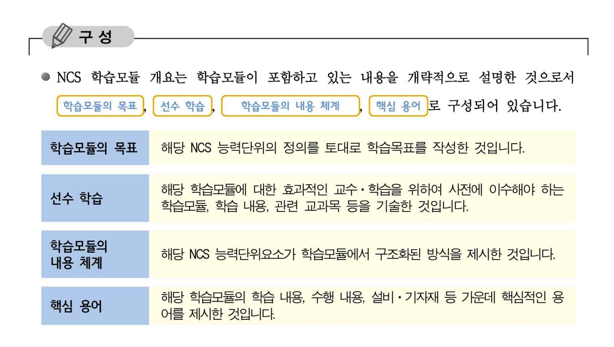

- 📿 활용안내

예시 : 네일미용 세분류의 '네일 기본관리' 학습모듈

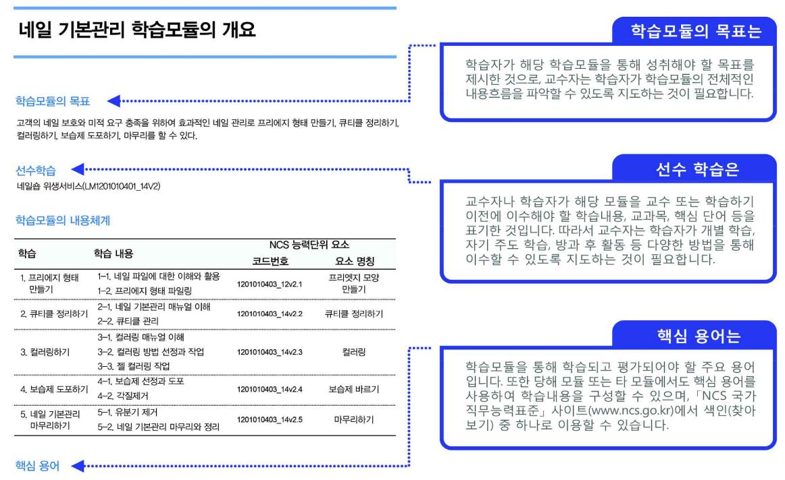

프리에지, 니퍼, 퓨셔, 폴리시, 네일 파일, 스퀘어형, 스퀘어 오프형, 라운드형, 오발형, 포인트형

#### 3. NCS 학습모듈의 내용 체계

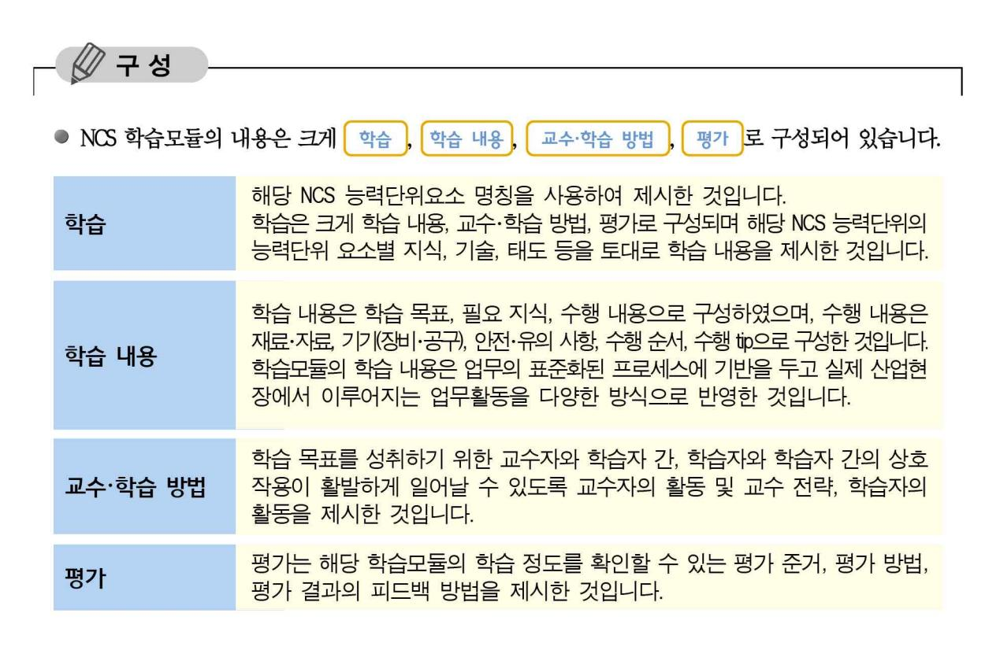

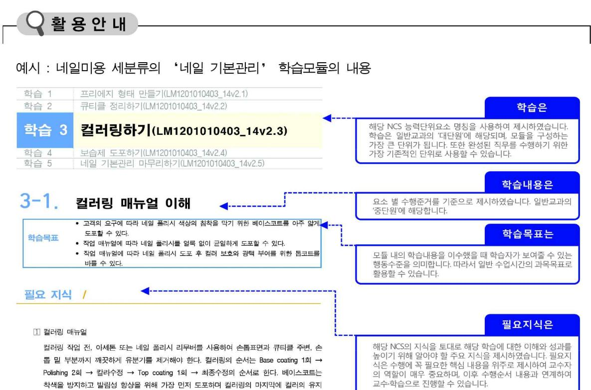

와 광택을 위해 톱코트를 도포한다. 네일 보강제(Nail Strengthner)를 바를 시에는 베이스코

트를 도포하기 전에 사용한다.

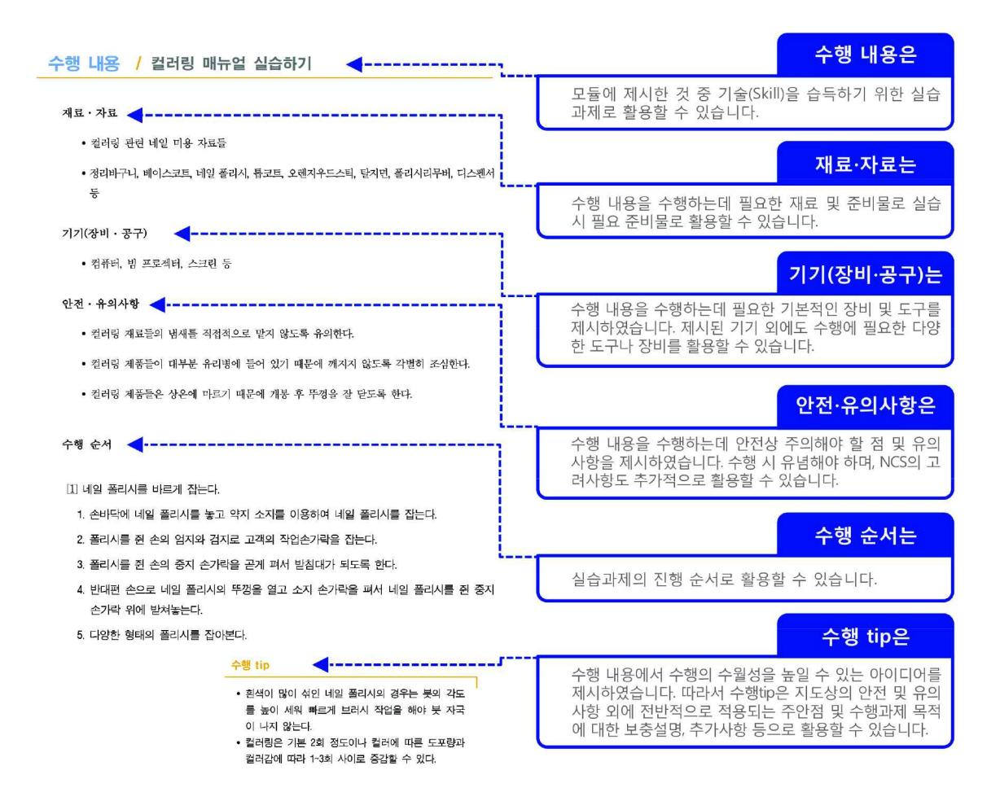

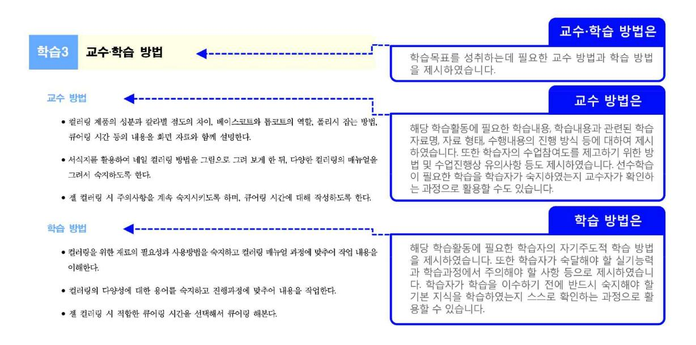

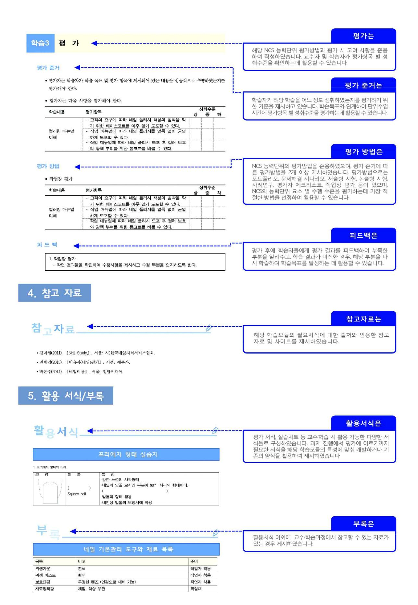

## [NCS-학습모듈의 위치]

| 대분류 | 전기・전자 |      |       |
|-----|-------|------|-------|
| 중분류 |       | 전자기기 | 기발    |
| 소분류 |       |      | 반도체개발 |

| 14 | ы | 2            |
|----|---|--------------|
|    | ᅚ | $\mathbf{T}$ |

| 반도체개발 | 능력단위                                       | 학습모듈명                                      |
|-------|--------------------------------------------|--------------------------------------------|
| 반도체제조 | 반도체용 웨이퍼 재료 제조                             | 반도체용 웨이퍼 재료 제조                             |
| 반도체장비 | 반도체용 리소그래피 재료 제조                        | 반도체용 리소그래피 재료 제조                        |
| 반도체재료 | 반도체용 가스 재료 제조                              | 반도체용 가스 재료 제조                              |
|       | 반도체용 금속(Target)재료 제조 반도체용 습식화공약품(Wet | 반도체용 금속(Target)재료 제조 반도체용 습식화공약품(Wet |
|       | Chemical)재료 제조                             | Chemical)재료 제조                             |
|       | 반도체용 패키지 재료 제조                             | 반도체용 패키지 재료 제조                             |
|       | 반도체용 나노 소재 제조                              | 반도체용 나노 소재 제조                              |
|       | 반도체용 재료 개발                                 | 반도체용 재료 개발                                 |
|       | 반도체용 재료 생산                                 | 반도체용 재료 생산                                 |
|       | 반도체용 재료 품질관리                               | 반도체용 재료 품질관리                               |
|       | 반도체용 재료 안전관리                               | 반도체용 재료 안전관리                               |

| 학습모듈의 개요                        | 1  |
|---------------------------------|----|
| 학습 1. 반도체용 가스 재료 요구사항 파악하기      |    |
| 1-1. 가스 공정 파악                   | 3  |
| 1-2. 가스 재료 파악                   | 12 |
| 1-3. 품질관리를 위한 문제점 파악            | 22 |
| • 교수・학습 방법                   | 26 |
| • 평가                         | 27 |
| 학습 2. 반도체용 가스 재료 선정하기           |    |
| 2-1. 가스 재료의 장단점 파악              | 29 |
| 2-2. 공정에 적합한 가스 재료선정            | 35 |
| 2-3. 가스 재료의 도출된 문제점에 대한 해결방안 강구 | 46 |
| • 교수・학습 방법                   | 51 |
| • 평가                         | 52 |
| 학습 3. 반도체용 가스 제조하기              |    |
| 3-1. 공정별 장단점 파악                 | 54 |
| 3-2. 가스 제조 파라미터 파악 및 적용         | 68 |
| 3-3. 도출된 문제점에 대한 해결방안 강구        | 73 |
| • 교수・학습 방법                   | 80 |
| • 평가                         | 81 |

|       | 학습 4. 반도체용 가스 제품특성 검증하기 |    |
|-------|-------------------------|----|
|       | 4-1. 반도체 공정가스의 제품특성 검증  | 83 |
|       | • 교수・학습 방법           | 92 |
|       | • 평가                 | 93 |
|       |                         |    |
| 참고 자료 |                         | 95 |

## 반도체용 가스 재료 제조 학습모듈의 개요

#### 학습모듈의 목표

반도체 제조에 필요한 가스 재료의 요구사항을 파악하여 선정하고, 제조 및 검증할 수 있다.

#### 선수학습

반도체 제조 공정 개발(1903060106\_15v4), 디스플레이 박막 공정개발(1903070104\_14v2), 디스플 레이 생산공정관리(1903070203\_14v2), 반도체 공정, 반도체 장비기술

#### 학습모듈의 내용체계

| 치스                      | 회소 내 이                             | NCS 능력 단위 요소      |                        |  |
|-------------------------|------------------------------------|-------------------|------------------------|--|
| 학습                      | 학습 내용                              | 코드 번호             | 요소 명칭                  |  |
| 1. 반도체용 가스              | 1-1. 가스 공정 파악                      |                   | 반도체용 가스재료 요구사항 파악하기 |  |
| 재료 요구사항 파악하기         | 1-2. 가스 재료 파악                      | 1903060403_14v1.1 |                        |  |
|                         | 1-3. 품질관리를 위한 문제점 파악               |                   |                        |  |
|                         | 2-1. 가스 재료의 장단점 파악                 |                   |                        |  |
| 2. 반도체용 가스 재료 선정하기   | 2-2. 공정에 적합한 가스 재료선정               | 1903060403_14v1.2 | 반도체용 가스재료              |  |
|                         | 2-3. 가스 재료의 도출된 문제점에 대한 해결방안 강구 | 100000000_1471.2  | 선정하기                   |  |
|                         | 3-1. 공정별 장단점 파악                    |                   | 반도체용 가스                |  |
| 3. 반도체용 가스 제조하기      | 3-2. 가스 제조 파라미터 파악 및 적용         | 1903060403_14v1.3 |                        |  |
| 세조아시                    | 3-3. 도출된 문제점에 대한 해결방안 강구        |                   | 제조하기                   |  |
| 4. 반도체용 가스 제품특성 검증하기 | 4-1. 반도체 공정가스의 제품특성 검증          | 1903060403_14v1.4 | 반도체용 가스 제품특성 검증하기   |  |

#### 핵심 용어

반도체 공정, 반도체 소자, 소자 제작, 공정 흐름도, 소자 특성, 소자 측정, 소자 분석, 반도체 장비, 공정 특성

| 학습 1 | 반도체용 가스 재료 요구사항 파악하기(LM1903060403_14v1.1) |
|------|----------------------------------------------|
| 학습 2 | 반도체용 가스 재료 선정하기(LM1903060403_14v1.2)         |
| 학습 3 | 반도체용 가스 제조하기(LM1903060403_14v1.3)            |
| 학습 4 | 반도체용 가스 제품특성 검증하기 (LM1903060403_14v1.4)   |

# **1-1.** 가스 공정 파악

학습 목표 • 최종 제품의 생산에 필요한 가스 공정을 파악할 수 있다.

#### 필요 지식 /

반도체 가스 공정 설명

반도체용 가스는 반도체의 특성을 만들기 위한 Doant, Etchant, Reactant, Purge 가스 등 으로 구분되며 그 종류가 다양하고 대부분 독성이며, 높은 순도를 필요로 하며, LSI, LED, LCD 등과 같은 반도체 및 Display panel의 제조에 사용되는 가스를 말한다. 이러한 반도체용 특수가스는 높은 가연성과 독성을 지니고 있어 극히 위험하므로 생산, 검사, 운송 시 고도의 관리가 요구된다. 따라서 반도체 제조에 사용되는 가스는 타 산업 분야에 사용되는 가스에 비해 더욱 철저한 품질관리와 정밀분석법이 요구된다.

#### 반도체 가스 공정 개요

여기서는 반도체 제조공정별 특수가스의 종류와 역할에 대해 알아보기로 한다. 1. 반도체 제조공정과 특수가스의 역할

일반적으로 특수가스란 산소(O ), 질소(N ), 아르곤(Ar), 탄산(CO ), 수소(H ) 등 보통의 산 업용 가스와 달리 특수한 목적으로 사용되는 가스를 의미하는데, 반도체용가스, 표준가스, 희귀가스, 고순도 및 초고순도가스, 혼합가스 등이 특수가스의 범주에 포함된다. 이러한 특수가스는 혼합비율에 따라 거의 무한대에 가까운 종(種)을 만들어낼 수 있는 혼합가스 를 제외한다 해도 어느 정도 표준화되어 있는 제품만 2백여 종에 이르고 있다. 그러나 수 많은 특수가스들 중에서 우리나라는 물론 전 세계 산업용 가스 업계로부터 가장 경제적으

로 고부가가치 재료로써 많은 관심을 받고 있는 가스는 반도체용 특수가스이다. 가격 측면에선 단연 정상을 차지하고 있지만, 수요와 공급에 한계가 있는 제논(Xe), 크립 톤(Kr), 헬륨(He) 등 희귀가스들과 달리 대부분의 반도체용 특수가스들은 고가(高價)인 데 다 수요도 많으며 공업적으로 대량생산이 가능하기 때문이다. 특히 반도체, TFT-LCD 등 전자특수가스 시장은 해당 산업의 무한한 성장성에 힘입어 매

년 괄목할 만한 시장 확대를 나타내고 있기도 하다.

90년대 중반까지만 해도 거의 수입에 의존해왔던 국내 특수가스 업계가 90년대 말 이후 자체 제조. 정제능력 확충에 힘을 쏟고 있는 것이나 산업용 가스와는 직접적 연관관계가 없었던 업체들이 속속 신규진입하고 있는 것도 특수가스 시장의 탁월한 성장성에 기인한

결과이다. 하지만 이러한 높은 관심에도 불구하고 종류의 다양성과 반도체 공정의 복잡성으로 인해 각각의 반도체용 특수가스들이 실제로 어떠한 공정에서 어떻게 쓰이고 있는지 정확히 이

해하기란 결코 쉽지 않다. 많은 업계종사자가 분위기용, 에칭용, CVD용 등으로 반도체용 특수가스를 분류하고 있지 만, 이 공정들이 반도체 제조에 어떠한 역할을 하는지는 잘 설명하지 못하는 것도 이러한

이유 때문이므로 수행내용에서 반도체 가스의 역할을 정확히 숙지하여야 한다. 반도체 가스 공정 특성은 다음과 같으며 특히 반도체 가스는 맹독성, 발화성 및 인화성 특성을 가진 가스가 대부분임에 따라 안전사항이 매우 중요하므로 그 내용을 정확히 숙지 하여야 한다.

반도체 공정에서 사용되어지는 원료 Gas는 독성, 부식성, 질식성, 비독성, 비부식성 등으 로 구분되며 대부분 고압의 용기에 충전되어 사용되어지는데, 이러한 특성을 가진 Gas들 을 각각의 공정에 맞게 사용하려면 우선 안전을 고려하면서 외부적인 오염으로부터 보호 된 상태에서 공급할 수 있어야 한다. 따라서 GAS CABINET에 넣어서 사용해야 하는데, 이 GAS CABINET은 고압가스 용기에 충전된 특수가스를 일정한 압력으로 안전한 상태에서 원료가스의 순도를 유지하며 반도체 제조설비에 연결되어 Operating Panel Switch에 의한 Process, Purge, PT Controller, Load Cell에 의한 경보 등 사용자가 편리하게 사용할 수 있 도록 구성되어 있다.

Gas Cabinet 외 VMB (Valve Manifold Box) SYSTEM이 있는데, 이는 일차적으로 GAS SUPPLY SYSTEM에서 공급된 GAS를 각각의 챔버로 안정적으로 공급하기 위해 Manifold 형태로 Gas Box를 구성하여 사용할 수 있도록 만든 장치이다. 반도체 제조설비에 연결되며 Operating Panel의 Switch에 의한 Process, Purge, PT

Controller에 의한 경보 등 사용자가 편리하게 사용할 수 있도록 구성되어 있다.

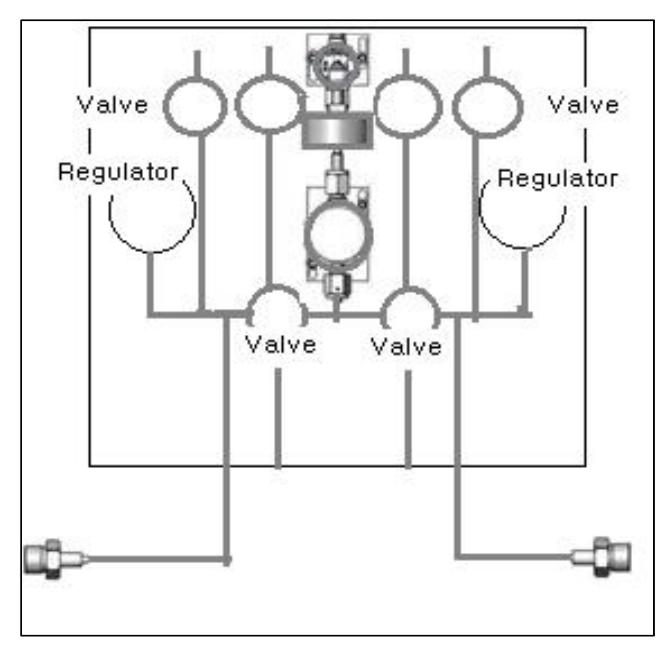

[그림 1-1] VMB System-1

#### 수행 내용 / 가스 공정 진행 이해하기

#### 재료·자료

Ÿ 반도체 가스 공정의 구조, 반도체 제조 장비

#### 기기(장비 ・ 공구)

- Ÿ 컴퓨터, 프린터
- Ÿ 문서 작성 프로그램

#### 안전 ・ 유의 사항

- Ÿ 반도체 가스 공정 파악을 위한 이론적 지식을 이해한다.
- Ÿ 부식성 가스, 맹독성 가스, 인화성 가스, 발화성 가스 등 위험물질이 있으니 해당 가스를 적용하게 되는 Gas Box, VMB Box, MFC (mass flow controller) 등과 연결된 Operating Panel Switch의 사용법을 사전에 숙지한다.

#### 수행 순서

 반도체 제품의 가스 공정 진행을 파악한다. 다음의 반도체 가스 공정 종류에 상세하게 설명이 되어 있으니 내용을 정확히 숙지하 도록 한다.

- 1. 다결정 실리콘 제조
- 2. 에피텍시(epitaxy)
- 3. 에칭(etching)
- 4. 클리닝(cleaning)
- 5. 이온주입(ion implantation)
- 6. 도핑(doping)
- 7. 어닐링(annealing)
- 8. 패시베이션(passivation)
- 9. 블랜켓팅(blanketing)

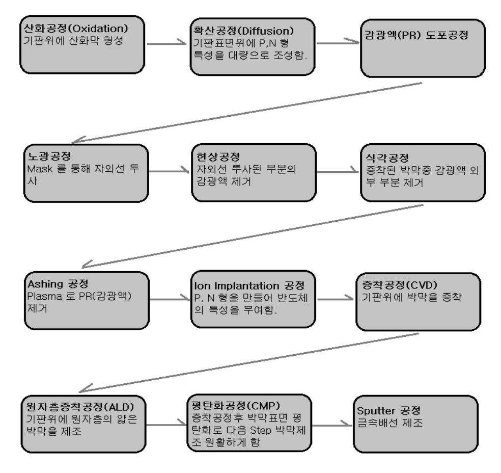

[그림 1-2] 반도체 전공정 Flow Chart

반도체 가스 공정 종류를 숙지한다. 다음은 반도체 가스 공정 종류에 대한 상세설명이니 내용을 정확히 숙지하도록 한다.

1. 다결정 실리콘 제조

반도체 제조공정은 D램, SD램, 플래시메모리, 실리콘 반도체 등 반도체의 종류에 따라 상 당한 차이가 있지만 가장 첫 단계는 반도체의 기본재료인 웨이퍼를 만들기 위한 '단결정 성장 공정'이다. 이 공정은 고순도로 정제된 실리콘 용융액에 씨앗(seed)의 역할을 하는 결정(結晶)을 넣어 회전시키는 공정으로 이렇게 하면 조개에 작은 핵을 넣어 진주가 되듯 작은 결정을 중심으로 실리콘 용융액이 뭉쳐지면서 웨이퍼(wafer)의 기본이 되는 고체형 단결정 규소봉이 만들어진다. 이와 관련 실리콘 반도체의 경우 단결정 규소봉 대신 '단 결정 실리콘'이 사용되는데 단결정 실리콘의 전 단계인 다결정 실리콘의 제조에 고순도 수소 (H ), 고순도 모노실란(SiH ) 또는 삼염화실란(SiHCl )이 사용된다.

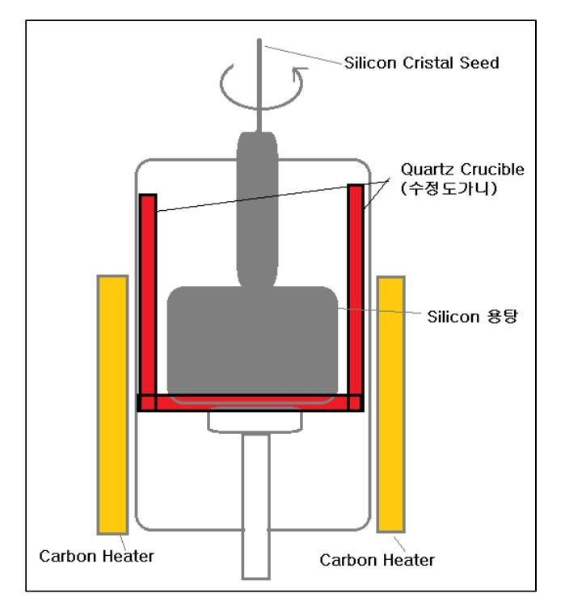

[그림 1-3] 다결정 실리콘 제조

#### 2. 에피텍시(epitaxy)

에피텍시(epitaxy) 공정은 단결정실리콘 위에 각종 반도체 관련 재료들을 올려놓기 위해 일 종의 얇은 필름으로 실리콘의 표면을 덮는 코팅공정이다. 각 재료가 특정 위치에 정확히 위 치할 수 있도록 기초공사를 하는 것으로 이해하면 된다. 특수가스를 활용해 화학적으로 코 팅 물질을 증착시킨다 하여 대개 CVD(Chemical Vapor Deposition) 공정으로 불린다.

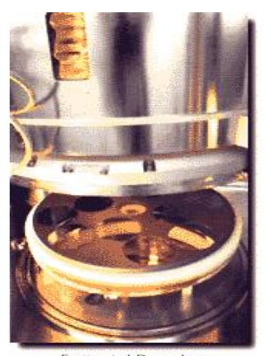

Epitaxial Reactor (Mitsubishi Materials Silicon)

[그림1-4] 에피텍시(epitaxy) 장비

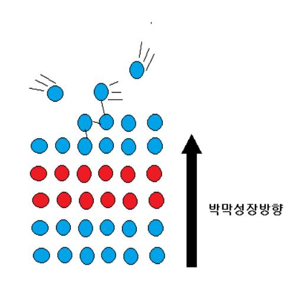

MBE(molecular Beam Epitaxy) 성장 단일박막 형성 모양

[그림1-5] 에피텍시(epitaxy) 공정 개념

구체적으로 에피텍시 공정은 낮은 압력에서 특수가스와의 화학반응을 통해 증착시키는 LPCVD(Low Pressure CVD), 일반대기압에서 증착시키는 APCVD(Atmospheric Pressure CVD), 고압에서 증착시키는 HPCVD(High Pressure CVD), 강력한 전압으로 플라즈마를 발 생시켜 증착시키는 PECVD(Plasma Enhanced CVD), 칼륨. 인. 알루미늄 등 금속 유기물을 증착시키는 MOCVD(금속 유기화학 기상 증착) 등으로 구분된다.

이 공정에는 고순도 SiH4, SiH2Cl2, SiHCl3, SiCl4, GeH4, B2H6, BBr3, BCl3, AsH3, PH3, TeH2, SnCl4, GeCl4, WF6, NH3, CH4, Cl2, MoF6 등의 특수가스가 사용되며 운반기체 (carrier gas)로서 고순도 수소(H2)와 질소(N2)가 사용된다.

3. 에칭(etching)

에칭(etching) 공정은 식각(蝕刻) 공정이라고도 하는데 명칭에서도 알 수 있듯이 웨이퍼에 불필요한 부분을 화학물질이나 특수가스를 사용해 제거해내는 공정을 의미한다. 과거에는 화학 수용액을 사용했었지만, 반도체의 정밀도를 낮춘다는 이유로 지금은 가스를 통한 건 식에칭(dry etching)이 일반적이다.

전식에칭은 다시 기상에칭, 플라즈마에칭, 이온빔에칭 등으로 나뉘는데 '기상에칭'의 경 우 HCl, HF, HBr, SF6, Cl2 등의 기체가스를 사용하지만, 기존의 습식에칭과 별다른 차이 가 없기 때문에 건식에칭에 포함시키지 않는 경우도 있다.

'플라즈마에칭'은 특수가스를 감압(減壓)시켜 방전함으로서 일반 대기압에서 얻을 수 없는 강한 반응성의 물질을 생성, 에칭 하는 방법으로 SiF4, CF4, C3F8, C2F6, CHF3, CCIF3, O2 등이 사용된다.

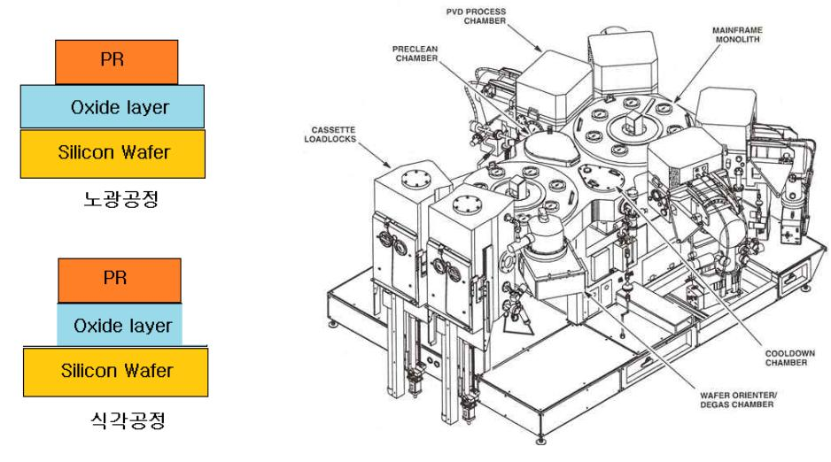

[그림 1-6] 에칭(etching) 공정 [그림 1-7] 에칭(etching) 장비

마지막으로 '이온빔에칭'은 가스의 이온(ion)을 가속해 이를 웨이퍼 기판 표면에 부딪치게 함으로써 식각을 이뤄내는 방식으로 C3F8, CHF3, CCF3, CF4 등의 특수가스가 활용된다.

4. 클리닝(cleaning)

클리닝(cleaning)은 웨이퍼 등을 화공 약품 및 순수한 물(De Ionized Water)로서 깨끗이 닦 아내는 공정으로 일정 부분에서는 에칭 공정과도 유사한 개념이라고 할 수 있다. 클리닝 공정에는 NF3, CF4, C2F6, C3F8, SF6 등이 사용된다.

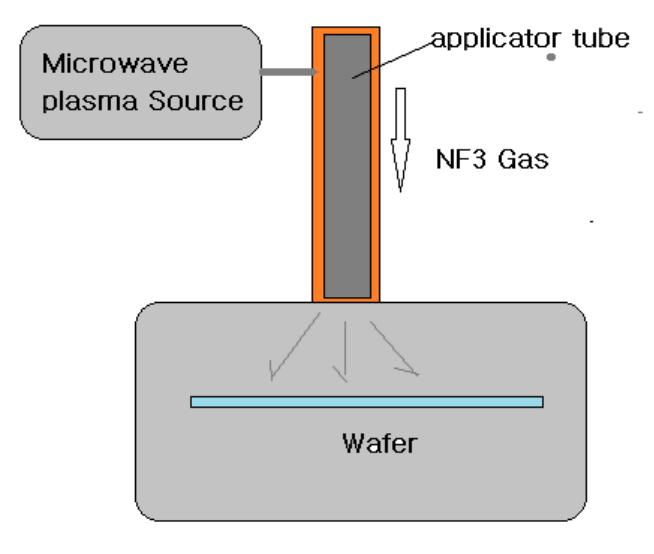

Chamber

[그림 1-8] 클리닝(cleaning)

#### 5. 이온주입(ion implantation)

이온주입(ion implantation)공정은 반도체 소자의 전기적 특성을 의도한 수준으로 조절하기 위해 반도체 웨이퍼의 특정 부분에만 수 keV ~ 수백 keV까지 고전압으로 가속시킨 이온 (ion)을 주입하는 공정이다. 이렇게 이온을 물리적으로 주입함으로써 전기저항 등과 같은 웨이퍼의 물리적 특성을 통제할 수 있다. 이온주입장치에 사용되는 특수가스로는 AsH3, PH3, PF5, BF3, AsF5, BCl3, SiF4, SF6 등이 있다.

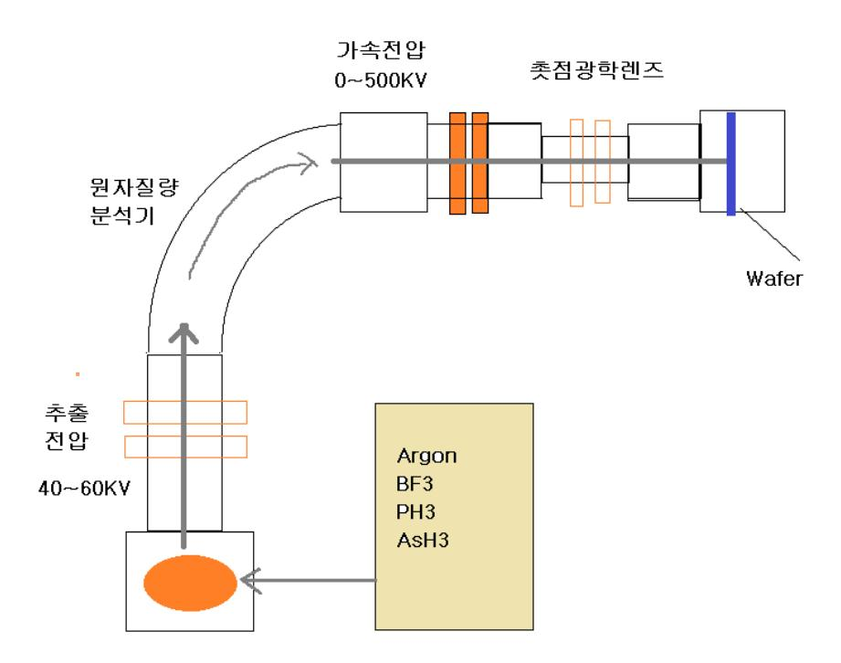

[그림 1-9] 이온주입 (ion implantation) 공정

[그림 1-10] 이온주입공정

#### 6. 도핑(doping)

도핑(doping) 공정은 반도체 웨이퍼에 붕소, 알루미늄, 인, 비소 등의 불순물(dopant)을 주입 하는 것을 말한다. 이러한 도핑공정을 통해 웨이퍼의 전도(傳導) 특성을 향상할 수 있으며 주입되는 불순물에 따라 'P형(positive-type) 반도체'와 'N형(negative-type) 반도체'가 만들어진다.

이러한 도핑 공정에는 AsH3, H2S, GeH3, SeH2, SbH3, AsCl3, AsF3, PH3, PCl3, B2H6, BF3 등의 특수가스가 쓰인다.

#### 7. 어닐링(annealing)

어닐링(annealing)은 쉽게 말해 에칭공정, 이온주입공정 등 각종 공정에서 반도체 웨이퍼 가 받았던 물리적, 화학적 스트레스를 열처리를 통해 풀어주는 공정이다. 적절한 온도로 웨이퍼를 가열한 후 충분한 시간 동안 서서히 냉각시킴으로써 최초 웨이퍼가 지녔던 가장 안정된 상태로 물성을 되돌리게 된다. 이 과정에 질소(N2)와 수소(H2)의 혼합가스를 사용 한다.

8. 패시베이션(passivation)

패시베이션(passivation)공정은 반도체 칩의 표면에 보호막을 코팅하는 작업으로 반도체제 조공정의 최후반부에 진행된다. SiO2(산화규소)가 보호막 역할을 수행하며 O2, SiH4, PH3 등이 공정용 가스로 사용된다.

#### 9. 블랜켓팅(blanketing)

블랜켓팅(blanketing)은 담요라는 의미의 'blanket'에서 유래한 것으로 완성된 반도체를 포장하기 직전에 오염물질로부터 반도체를 보호하기 위한 공정이다. 보호용 가스로 불활성 가스인 아르곤(Ar), 헬륨(He), 질소(N2) 등을 주입한다.

수행 tip

• 같은 공정이라도 용도에 따라서 Gas의 종류가 달라 질 수 있다.

# **1-2.** 가스 재료 파악

학습 목표 • 고객의 요구사항에 의한 가스 재료를 파악할 수 있다.

## 필요 지식 /

 반도체용 특수가스의 개요. 반도체용 특수가스는 다른 반도체 재료(예: Chemical, 나노 재료, Photo resist(감광액)) 등 에 비해 상대적으로 가격이 낮게 책정되는 경향이 있으므로 채산성이 빈약한 문제점을 가 지고 있다. 또한, 소량 다품종이고 경제성 단위에 미치지 못하는 품목이 많아 벌크 가스와

달리 전량 개별검사가 필요하다. 반도체용 가스는 일반적으로 화학적인 활성을 가지고 있으며 폭발성, 독성, 부식성이 강하 다. 그러므로 제조에서 소비에 이르기까지 총체적인 공급계통에 있어 고도의 안전대책이 필요하다. 가스는 대부분의 반도체 공정에서 사용되고 있으며 칩의 제조공정에 이용되는 가스의 종류를 용도별로 분류하면 분위기 가스, Epitaxiai, Doping 가스, 성막용 가스(CVD),

에칭 가스 등으로 나눌 수 있다. 다음의 표는 반도체 가스의 화학적 성질을 나타낸 표이다. 표의 특징은 가로축은 Gas의 종류 세로축은 1) 물과의 반응성, 2) 연소성, 3) 기타 물질과의 반응성, 4) 재료 사용상 주 의 등 4개 항목 등으로 분류한 점이다.

<표 1-1> 반도체가스의 화학적 성질

|                      | 실란                                                            | 디클로로 실란                                                                                | 3클로로 실란                     | 4염화규 소                      | 4불화규 소                                                                                                                              | 디실란                                                                              |
|----------------------|---------------------------------------------------------------|-------------------------------------------------------------------------------------------|--------------------------------|--------------------------------|----------------------------------------------------------------------------------------------------------------------------------------|----------------------------------------------------------------------------------|
| 분자식                  | ${f SiH}_4$                                                   | $\mathbf{SiH}_{2}\mathbf{Cl}_{2}$                                                         | SiHCl 3             | $\mathbf{SiCl}_4$              | ${\sf SiF}_4$                                                                                                                          | $\mathbf{Si}_{2}\mathbf{H}_{6}$                                                  |
| 물과의 반응성           | 가수분해 하여 4배의 수소가 생성. 특히 알칼리성 수용액으 로 분해 | 기수분해 하여 염산과 폴리실로 키산의 혼합물이 생성                                            | 물과 세차게 반응하여 염산을 생성 | 가수분해 하여 규산과 염산을 생성 | 물과 반응하여 H 2 SiF 6 , SiO 2 , H 2 O, HF를 생성                                | 순수와 산과는 반응 안 함 알칼리와 반응하여 수소와 규산을 생성                      |
| 연소성                  | 공기 중에서 자연발화                                             | 100°C 이상 때 공기 중에서 자연발화 (E.R. 4.1-98.8 %)                             | 공기 중에서 발연                |                                | 불연성                                                                                                                                    | 공기 중에서 순식간에 발화                                                          |
| 타 물질과 의 반응성 | Cl 2 등의 할로겐 가스와 거세게 반응                 | 아세톤과 반응                                                                                |                                | 알코올로 분해                     | 600° C에 서SiCl 4 와 반응하여 SiClF 3 , SiCl 2 F 2 , SiCl 3 F가 생성 | F2, Br2 NCl3, SF 6와 세게 반응                                            |
| 재료 사용상 의 주의 | 부식성은 없음                                                    | 미량수분 의 존재로 강산이 된다. 드라이 상태에서 불활성AI, 황동. 스테인리 스강 등은 부식됨 | 물의 존재로 강산이 된다         | 물의 존재로 강산이 된다         | 산화 및 환원에 대해서 안정                                                                                                               | 탄소강.S US,동. 모넬, 유리. 테프론, 나이론, 바이톤, Kel-F 등의 사용이 가능 |

|                      | 포스핀                                                              | 3염화인                                                                         | 3불화인                                 | 5불화인                                                                                              | 옥시염화 인                                    | 아르신                                                                               |
|----------------------|------------------------------------------------------------------|------------------------------------------------------------------------------|--------------------------------------|---------------------------------------------------------------------------------------------------|----------------------------------------------|-----------------------------------------------------------------------------------|
| 분자식                  | $\mathbf{PH}_3$                                                  | $\mathbf{PCI}_3$                                                             | $\mathbf{PF}_3$                      | $\mathbf{PF}_5$                                                                                   | $\mathbf{POCI}_3$                            | $AsH_3$                                                                           |
| 물과의 반응성           | 수화물을 생성                                                       | 물에 의하여 분해하여 염산이 생성                                               | 물에 의하여 서서히 분해               | 물이 소량 있어도 분해하여 HF와 POF 3 을 생성                                        | 물과 반응하여 인산과 염산을 발생               | 가압하에 서 수화물을 발생. 용존산소 에 의하여 As으로 분해                        |
| 연소성                  | 공기 중에서 자연발화                                                | 불연성. 산소와 서서히 화합하여 옥시염화 린이생성                                   | 공기 중에서 세게 발연 안함          | 공기 중에서 세게 발연함                                                                            | 젖은 공기 중에서 세게 발연                  | 공기 중에서 청백색 불꽃을 내어 타며 AS 2 O 3 를 발생     |
| 타 물질과 의 반응성 | Cl2등의 할로겐가 스와거세 게 반응                                 | HBr, HI와 반응. PCl 3 + 3HX -> PX 3 + 3HCl | 수소와 가열 하에 반응하여 阳₃을 발생 | 3메틸아 민과 강하게 반응. NH 3 , N 2 O 4 . NOF등과 도 반응 | 수산기를 가진 유기화함 물과 반응               | Cl 2 와 반응하여 HCl와 As가 된다. (E.R. 0.8 ~ 98%)         |
| 재료 사용상 의 주의 | NH3보다 강한 환원성. 탄소강, SUS, 모넬, 하스텔로 이등 사용가능 | 니켈강. 철,저함 금강.니 켈크롬강 .테프론, Ke-F등 사용가능                       | 철 또는 유리용기 에서 보존한다           | 모낼, 인코넬, 니켈, Ke-F 테프론등 사용가능                                                        | 스테인리 스도 부식당 함. 보통 유리가 사용가능 | 강환원 성. 탄소강, SUS, 모넬, 녹쇠,테 프론, 바이톤, 나이론 Kel-F 등 사용가능 |

| 〈표 | 1-2> | 반도체가스의 | 화학적 | 성질 |
|----|------|--------|-----|----|
|----|------|--------|-----|----|

반응

테프론은

사용가능.

|                   | 3염화비소                                                                                                           | 디보란                                                                | 3염화붕 소                                                        | 3불화붕소                                                                            | 스티핑                                                                                 | 셀 렌 화 수 소                                            |
|-------------------|-----------------------------------------------------------------------------------------------------------------|--------------------------------------------------------------------|------------------------------------------------------------------|----------------------------------------------------------------------------------|-------------------------------------------------------------------------------------|---------------------------------------------------------|
| 분 자 신       | $\mathbf{AsCI}_3$                                                                                               | $\mathbf{B}_{2}\mathbf{H}_{6}$                                     | $\mathbf{BCI}_3$                                                 | $BF_3$                                                                           | ${ m SbH}_3$                                                                        | $\mathbf{SeH}_2$                                        |
| ▲ 물 과 의 반 응 성  | 물로 분해하고 As(OH) 3 과 HCI이 생성                                                               | 신속하게 완전히 기수분해하 여 붕산과 수소로 된다                            | 용이하게 분해하여 염산이 생성                                        | 가수분해 하여 플루오르 붕산이 생성                                                  | 젖은 유리관 내에서 24시간으 로 완전히 분해                                            | 가수분해                                                    |
| 연 소 성       |                                                                                                                 | 공기 중에서 자연발화 특히 젖은공기40~ 50° C에서.                        | 불연성                                                              | 불연성                                                                              | 공기 중에서 연소하여 안티온이 생성                                                     | 공기 중에서 푸른색의 불꽃을 내며 연소하여 Se02생성        |
| 기 타 물 질 과 의 반 응 성 | AsCl 3 + NaOH $\rightarrow$ NaH 2 AsO 3 +3NaCl+H 2 O | HCI등의 할로겐 가스와 세게 반응. NH₃과도 반응.                      | 피리징. 니토로 벤젠과 부가화함 물을 생성                           | 알칼리 그리고 알칼리토 류 금속에 의해 붕소와 금속불화 물을 생성                        | 염소와 세게 반응하여 SbCl 3 와 HCl을 발생. 알칼리 반웅하여 급속히 분해 | 초산과 세게 반응. Cfe                                    |
| 재 료 사 용 상 주 의     | Mo, Ag, Au, P과는 반응을 아니하며 Mg. Zn. Al. Sn, Pb. Cu 과는 세게                                         | 일반의 금속은 좋다. 고무. 구리스, 윤활유는 불가. 사린, 폴리에틸렌, 테프론은 | 니켈크롬 강. 니켈강. 철 및 저함금강 니켈하스 테로이, 인코넬, 테프론 | dry 가스강, SUS. Cu, Ni 황금, Al. 모넬사용 가능. wet가스… Cu경질고 무, | -                                                                                   | AI, SUS,탄 소강. 황동. 테프론, 바이론. 나이콘의 사용가능 |

무,

가능

파이렉스

유리사용

KeH.

사용

가능.

유리는

사용가능

|  분             | 수 소 화 텔 루르                             | 4수소화게르 마늄                                                                                   | 염소                                                                                                             | 염화수소                                                                                        | 황화수소                                                                                                                                | 암모니아                                                                                                                |
|-------------------|-------------------------------------------|------------------------------------------------------------------------------------------------|----------------------------------------------------------------------------------------------------------------|---------------------------------------------------------------------------------------------|-------------------------------------------------------------------------------------------------------------------------------------|---------------------------------------------------------------------------------------------------------------------|
| 문 자 식       | TeH2                                      | Gel-U                                                                                          | CI2                                                                                                            | HCI                                                                                         | HzS                                                                                                                                 | NHg                                                                                                                 |
| 물 과 의 반 응 성    | 젖은 공기에 접하면 바로 분해                 | 실란과 비슷하지만 반응성은 작다.                                                                    | $CI_2$ + $H_2O$ ↔ HCIO+HCI HCIO-HCI +1/2O 2                                             | 반응은 안하여도 물에 잘 용해됨                                                                  | 수용액중 에서 전리평균 H 2 S ↔ H + + HS - HS - ↔ H + + S  | 비반응 물에 잘 용해                                                                                                   |
| 연 소 성       | 공기 중에서 점화하면 청백색의 불꽃을 내며 연소 | 시란과 같이 세게 연소안함E.R. 0.8-98%                                                            | 지연성                                                                                                            | 02에 대해서 안정                                                                            | 공기 중에서 청백색의 불꽃을 내며 연소                                                                                                   | 공기 중에서 섭씨 650도 이상에서 가연 (O 2 중에서 의 E.R.16-25 %)                                |
| 기 타 물 질 과 의 반 응 성 | 염소와 세게 반응하며 텔루르의 염화물을 생성   | -                                                                                              | H 2 와 폭발적으 로 반응, 대부분 금속과 반응                                                          | F 2 와 세차게 반응. 많은 금속과 반응하여 염화물과 수소를 생성                       | Cl 2 , Br 2 과 강하게 반응. 대부분 금속과 습기의 존재하에 반응                                                | 할로겐과 세게 반응한 Hg과 반응하여 폭발성 화함물을 생성                                                               |
| 재 료 사 용 상 의 주 의   | -                                         | 탄소강, SUS, 동, 황동. 모넬, 하스테로이, Kel-F. 테프론, 유리. 바이론. 나이론. 나이론 등 사용가능 | dry가스 (액) Steel, S US,주철 동함금, 니켈함금 ,연이 사용가 wet가스 모넬, 하스텔로 이C, 테프론이 사용가능 | 수분이 존재로 강산이 되며, 대부분의 금속을 부식. Baked carbon, graphite 가 사용가능 | Al, SUS316은 wet 에서도사 용가능. 건조하면 동도 사용가능                                                                         | 알칼리성, 부식성이 강하다. 철. SUS는 사용가능. 동. 석. 아연과 그의 함금은 불가능. packing는 연(鉛)아스 베스토가 좋다. |

| <표 - | 1-3> | 반도체가스의 | 화학적 | 성질 |  |
|------|------|--------|-----|----|--|
| ·    |      |        | -   | ΟE |  |

|                           | 아산화질소                | 4염화탄소                                                                                           | 3불화메탄                                            | <b>6플루오르에</b> 탄                               | 8플루오르프 로판                                 |
|---------------------------|----------------------|-------------------------------------------------------------------------------------------------|--------------------------------------------------|--------------------------------------------------|----------------------------------------------|
| 분 자 _ 식                | $N_2O$               | $\mathbf{CCl}_4$                                                                                | CHF 3                                 | $\mathbf{C}_{2}\mathbf{F}_{6}$                   | $C_3F_8$                                     |
| 물과 의반 응성            | 반응안함                 | 반응안함 그러나, Fe, AI의 작용으로 기수분해                                                         | 반응안함                                             | 약간 기수분해                                       |                                              |
| 연소 성                   | 지연성                  | 불연성                                                                                             | 불연성                                              | 불연성                                              | 고온의 공기 중에서도 불연                         |
| 기타 물질 과의 반응 성 | 유기물 알칼리금속 을 산화 | 알칼리와 가열 하면 분해                                                                             | 가연성가스 와 혼합하여 점화하면 분해하며 유독가스 발생 | 가연성가스 와 혼합하여 점화하면 분해하며 유독가스 발생 | 가연성가스와 혼합하여 점화하면 분해하며 유독가스 발생 |
| 재료 사용 상 주의       | 부식성은 없음           | 철과 알루미늄의 작용으로 기수분해 CCl 4 +H 2 O → CO 2 +4HCl | 부식성은 없음                                       | 부식성은 없음                                       | 부식성은 없음                                   |

#### 수행 내용 / 가스재료 파악하기

#### 재료·자료

- Ÿ 반도체 가스 공정의 흐름도
- Ÿ 반도체 가스 공정 제조 장비

#### 기기(장비 ・ 공구)

- Ÿ 인터넷
- Ÿ 문서 작성 프로그램
- Ÿ 프린터

#### 안전 ・ 유의 사항

Ÿ 가스 공정에 사용되는 가스의 취급 안전에 유의한다.

#### 수행 순서

CVD 및 PVD 공정에서의 가스 사용의 경우를 파악한다. \* [그림 1-11] 참조

#### 1. CVD(Chemical Vapor Deposition, 화학 기상 증착)

먼저 CVD 기술을 이해하기 전에 CVD 기술이 반도체 제조공정 중 어디에 위치하고 어떻 게 사용되는지를 이해할 필요가 있다. 이것은 CVD 기술 내에서 목적하는 공정과 사용되 는 용어를 이러한 전체 분류 내에서 생각하게 되면 상당히 알기 쉽고 또 어떻게 발전할지 도 생각해볼 수 있기 때문이다. 반도체 제조의 기본공정은 크게 여섯 가지 정도로 나눌 수 있는데 이들 기본공정을 반복적으로 사용하여 원하는 반도체 소자를 제조할 수 있다. 2. PVD(Physical Vapor Deposition, 물리적 기상 증착)

차세대 전자소자에 있어서 특히 기억소자 (Dynamic Random Access Memory : DRAM )는 회로 선폭이 90nm (nm : nano meter), 60nm, 50nm, 45nm 이하로 극미세화 되는 방향으 로 진행되고 있으며 미세화 하는 기억소자를 구성하는 컨택(contact)이나 비아(Via)의 단차 비가 점차 커지기 때문에 이들 컨택/비아홀에 성막 공정 시 높은 계단 회복성(Step Coverage)의 장점을 보여주는 CVD 방식이 기판의 극심한 굴곡에도 불구하고 비교적 균등 한 두께의 막을 형성하는 기술로 적합하다.

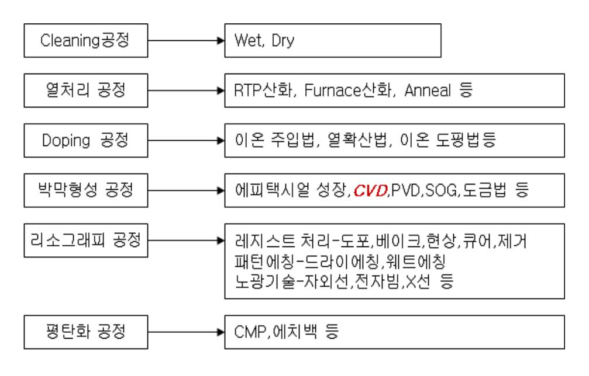

[그림 1-11] 반도체 제조 공정 기술의 분류

② 다음의 표에 표시된 반도체 가스 재료의 인체에 대한 독성에 대해서 파악한다.

| 가 스        | 독 성                                                                                          | 허 용 농 도 (ppm)    |
|------------|----------------------------------------------------------------------------------------------|---------------------|
| 시란         | 흡입으로 호흡기를 매섭게 자극. 급성의 국소자극작용이 강하며 전신 및 만성적인 영향에 대해서 미확인                                   | 0.5                 |
| 포스핀        | 급성…두통. 흉부 불안. 구토. 악감, 횡격막의 동통 만성… 소화기장해. 황달, 비인두 자극. 구내염. 빈혈                              | 0.3                 |
| 디보란        | 흡입하면 폐를 자극. 폐수종. 간장. 신장을 침범한다. 기침. 호흡곤란. 전흉부만의 고통, 구토                                     | 0.1                 |
| 알신         | 급성…헤모글로빈과 결합하여 급격한 적혈구의 저하를 시 키며 강한 용혈이 나온다. 두통, 구역질, 현기증 만성…점 차 적혈구가 파괴된다. 요에 단백이 난다. | 0.05                |
| 3염화붕소      | 습기로 기수분해하여 염산과 붕산을 생성하며 피부. 점막 (姑膜)을 침해한다. 폐기종, 기관 상부에의 자극                                | (BBr, 1) (BF, 1) |
| 디클로로시 란 | 흡입한 경우 호흡기 상부를 매섭게 자극하여 목이 메며 기침이 난다. 눈, 피부. 점막에 접촉하면 화상이 생긴다.                            | _                   |
| 암모니아       | 홉입으로 호홉기의 부종(浮腫), 성문의 경련. 질식을 일으 킨다. 피부, 점막에 대한 자극성. 부식성이 강하다.                            | 25                  |
| 스티핑        | 아르신의 생체에 미치는 독성과 같다. 과도의 피폭에서는 헤모글로빈 요(혈색요소)를 배설                                          | 0.1                 |
| 세렌화수소      | 점막 자극과 호흡 이상. 폐수종. 오심, 구토. 구강(囗歷)의 금속 취기 현기증. 호흡의 마늘 냄새. 사지 권태(四技倍急)                      | 0.05                |
| 염화수소       | 피부, 점막을 침해. 아픔을 동반하여 화상을 이른다. 눈에 접하면 자극. 흡입하면 호흡기 자극 시 질식이 나며 폐기 종. 인두경축               | 5                   |

<표 1-4> 반도체 가스 재료의 인체에 대한 독성 \* ppm (part per million)

반도체 소자의 가스 공정의 특성을 이해한다.

1. 가스 공정에 사용되는 가스의 종류

- (1) Diffusion 공정에 사용되는 Gas의 종류에 대해 알아본다.
- (2) CVD 공정에 사용되는 Gas의 종류에 대해 알아본다.
- (3) Sputter 공정에 사용되는 Gas의 종류에 대해 알아본다.
- (4) Ion Implant 공정에 사용되는 Gas의 종류에 대해 알아본다.
- (5) Etch 공정에 사용되는 Gas의 종류에 대해 알아본다.

#### 수행 tip

• 같은 제품이라도 공정에 따라 주요 변수가 달라질 수 있다.

# **1-3.** 품질관리를 위한 문제점 파악

학습 목표 • 품질관리를 위한 문제점을 파악할 수 있다.

### 필요 지식 /

개요

반도체 공정에 필요한 가스 재료의 품질관리에 대해 이해할 수 있다.

- 1. 순도 : 반도체 제조를 위한 초고순도를 유지하는지 여부
  - (1) 예를 들어 순도가 99.9999% 이상을 유지하는지 여부. 단 순도는 공정의 종류에 따 라 요구 수준이 다를 수 있으므로 그것에 맞게 유지한다.
- 2. 경년변화 여부:
  - (1) Gas의 종류에 따라 예를 들어 1년이 지나면 Gas 용기 내에서 화학작용에 의해 Particle 이 발생할 수 있다.
  - (2) 따라서 Particle counter로 측정하여 일정크기 이상의 Particle이 측정되면 즉시 새로운 Gas로 교체를 한다.
- 3. 점검

Gas 용기를 보관하는 Gas Cabinet 및 VMB system 내부 주기적으로 N2 purge 여부 및 clean 상태를 주기적으로 점검한다.

- (1) MFC 상태 점검한다.
- (2) Gas filter 교체 주기 확인 후 필요하면 교체한다.

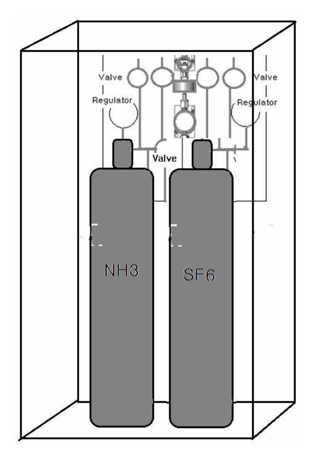

[그림 1-12] Gas cabinet

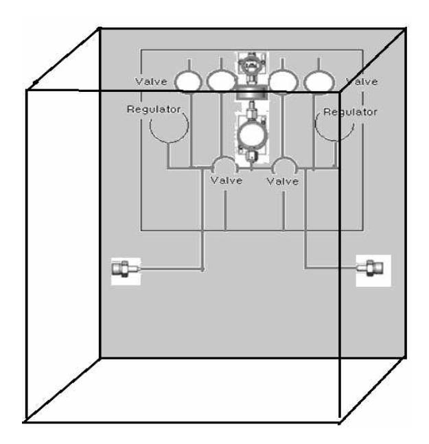

[그림 1-13] Gas VMB system

#### 수행 내용 / 품질관리를 위한 문제점 파악하기

#### 재료·자료

- Ÿ 반도체 가스 공정의 구조
- Ÿ 반도체 제조 장비

#### 기기(장비 ・ 공구)

- Ÿ 인터넷
- Ÿ 문서 작성 프로그램
- Ÿ 프린터

#### 안전 ・ 유의 사항

- Ÿ 반도체 가스 공정 파악을 위한 이론적 지식을 이해한다.
- Ÿ 부식성 가스, 맹독성 가스, 인화성 가스, 발화성 가스 등 위험물질이 있으니 해당 가스를 적용하게 되는 Gas Box, VMB Box, MFC (mass flow controller) 등과 연결된 Operating Panel Switch의 사용법을 사전에 숙지한다.

#### 수행 순서

 PVD(Physical Vapor Deposition, 물리적 기상 증착) 공정에서의 기술의 정의와 개요를 이해한다. 전자 산업에 있어 다양한 목적의 재료를 성막(film)화 하는 일반적 방법으로 화학 증착법 (Chemical Vapor Deposition: CVD), 물리 증착법 (Physical Vapor Deposition: PVD), sol-gel 법, 프린팅 및 전해/무전해도금 (electrolessplating)법 등을 주로 사용한다. 다양한 방법에 따라 형성되는 성막은, 두께에 따라 박막(thin film) 및 후막(thick film)으로 구분하여 볼 수 있으며 박막은 대략 수 ㎛ 두께 이하의 것으로 주로 CVD 및 PVD 법에 따 라 이루어진다. 그중에서 PVD 공정에 대해서 더 상세한 내용을 살펴보기로 한다. 반도체 산업에서 대표적 성막 공정으로 사용되어온 물리적 증착 공정은 막을 증착하고자 하는 금속 또는 세라믹스 타겟(타겟) 자체를 기체화하여 기판 위에 직접 증착하는 스퍼터 링(Sputtering) 방식이 일반적이다. 특히 Sputtering 공정은 전극과 타겟 사이에 Argon gas를 흘려 넣어주게 되는데 이 Argon gas는 순도가 매우 중요하다. 순도는 99.9999% 수준이다. 그런데 PVD 공정은 단차비(aspect ratio : depth/diameter)가 놓은 컨택 및 비아홀을 갖는 첨단 반도체 소자에 적용하기 위해서는 기판의 굴곡과 무관하게 균등한 두께의 막을 Void 없이 증착하는 Step Coverage 기술에서는 CVD 공정보다 열위에 있으므로 이 부분에서는 어느 정도 한계를 보여준다.

- 품질관리를 위한 문제점을 파악한다.
  - 1. 순도 : 반도체 제조를 위한 초고순도를 유지하는지 여부
  - 2. 경년변화 여부를 파악한다.
  - 3. Gas Cabinet 및 VMB system 내부 주기적으로 N2 purge 여부 및 clean 상태를 주기적으 로 점검한다. 4. Gas Cabinet 및 VMB system의 구성품인 MFC 및 Gas filter 등의 이상여부 및 Leak 여부
  - 를 주기적으로 점검한다.

#### 학습1 교수·학습 방법

#### 교수 방법

- 반도체에 가스 공정이 필요한 이유와 기술에 대한 이론적 지식을 충분히 설명한다.
- 가스 종류에 대한 상세한 이론 강의와 실습을 병행하여 학생의 이해를 높인다.
- 장비에 대한 실습이 불가능할 경우 동영상 및 시청각 강의 자료를 활용한다.
- 가스 공정 및 종류에 대해 기술적 토론을 유도하고 발표하여 이해하도록 한다.

#### 학습 방법

- 최신 반도체 가스 기술 동향에 대해 학습한다.
- 가스 공정 장비에 대해 이해하고 장단점에 대해 학습한다.
- 반도체 공정에 이용되는 가스 종류에 대해 학습한다.
- 주요 각 반도체 공정상 어떤 가스를 사용해야 하는지 학습한다.
- 가스 공정 시 재료에 따른 주의 사항에 대해 학습한다.
- 가스 재료에 품질에 문제없도록 신뢰성 부분에 대해 학습한다.

## 학습1 평 가

#### 평가 준거

• 평가자는 학습자가 학습 목표를 성공적으로 달성하였는지를 평가해야 한다.

#### • 평가자는 다음 사항을 평가해야 한다.

|                    |                                      | 성취수준 |   |   |  |
|--------------------|--------------------------------------|------|---|---|--|
| 학습 내용              | 평가 항목                                |      | 중 | 하 |  |
| 가스 공정 파악           | - 최종 제품의 생산에 필요한 가스 공정을 파악할 수 있다. |      |   |   |  |
| 가스 재료 파악           | - 고객의 요구사항에 의한 가스 재료를 파악할 수 있다.      |      |   |   |  |
| 품질관리를 위한 문제점 파악 | - 폼질관리를 위한 문제점을 파악할 수 있다.            |      |   |   |  |

#### 평가 방법

• 서술형 시험

| 학습 내용 평가 항목     |                              | 성취수준 |   |   |  |
|--------------------|------------------------------|------|---|---|--|
|                    |                              |      | 중 | 하 |  |
| 가스 공정 파악           | - 최종 제품의 생산에 필요한 가스 공정 파악 |      |   |   |  |
| 가스 재료 파악           | - 고객의 요구사항에 의한 가스 재료 파악   |      |   |   |  |
| 품질관리를 위한 문제점 파악 | - 품질 관리를 위한 문제점 파악        |      |   |   |  |

|                    |                              | 성취수준 |   |   |  |
|--------------------|------------------------------|------|---|---|--|
| 학습 내용              | 평가 항목                        |      | 중 | 하 |  |
| 가스 공정 파악           | - 최종 제품의 생산에 필요한 가스 공정 파악 |      |   |   |  |
| 가스 재료 파악           | - 고객의 요구사항에 의한 가스 재료 파악   |      |   |   |  |
| 품질관리를 위한 문제점 파악 | - 품질 관리를 위한 문제점 파악        |      |   |   |  |

• 구두발표

| 학습 내용              |                              | 성취수준 |   |   |  |
|--------------------|------------------------------|------|---|---|--|
|                    | 평가 항목                        |      | 중 | 하 |  |
| 가스 공정 파악           | - 최종 제품의 생산에 필요한 가스 공정 파악 |      |   |   |  |
| 가스 재료 파악           | - 고객의 요구사항에 의한 가스 재료 파악   |      |   |   |  |
| 품질관리를 위한 문제점 파악 | - 품질 관리를 위한 문제점 파악        |      |   |   |  |

피드백

- 1. 서술형 시험
- 평가 결과에 대한 일정 점수 누락에 해당하는 학생은 재평가를 통하여 학습을 이수할 수 있도록 지도한다.
- 2. 사례연구
- 학습한 내용이 효과적으로 전달되지 않은 경우 발표방법에 대한 추가 지도를 수행한다.
- 3. 구두발표
- 반도체 가스 공정이 필요한 이유에 질문하고 부족한 부분에 대해 보완하도록 한다. 반도체 가스 공정의 종류에 대해 질문하고 부족한 부분에 대해 보완하도록 한다. 반도체 가스 재료 종류에 대해 질문하고 미비한 부분에 대해 보완하도록 한다. 반도체 가스 재료의 품질을 확보하기 위한 방법을 질문하고 미비한 부분은 보완하도록 한다.

| 학습 1 | 반도체용 가스 재료 요구사항 파악하기 (LM1903060403_14v1.1) |
|------|-----------------------------------------------|
| 학습 2 | 반도체용 가스 재료 선정하기 (LM1903060403_14v1.2)      |
| 학습 3 | 반도체용 가스 제조하기 (LM1903060403_14v1.3)            |
| 학습 4 | 반도체용 가스 제품특성 검증하기 (LM1903060403_14v1.4)    |

# **2-1.** 가스 재료의 장단점 파악하기

학습 목표 • 반도체 공정별 가스 재료의 장단점을 파악할 수 있다.

### 필요 지식 /

반도체 가스 사용 공정의 이해

반도체 소자의 전기적인 특성은 재료에 따라 민감하게 변화하므로 소자구조와 직접적으로 관련이 있을수록 기술적 요구조건이 까다롭다. 따라서 반도체 칩에 직접 포함되는 재료, 소자제조 공정 중에 칩이 노출되게 되는 공정용 가스 등에 대한 요구조건이 칩을 보호하 는 구조재료들에 비해 훨씬 까다롭다.

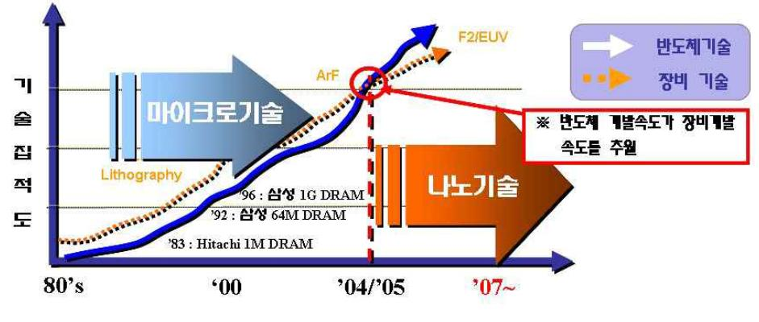

[그림 2-1] 나노 반도체 기술의 도입

 현재 기능재료는 합작생산 및 자체개발생산 하고 있으며, 공정재료는 주로 합작생산, 구조 재료는 자체개발 생산되고 있다. 특히 공정재료의 경우는 지속적인 수요증가와 함께 선진

국과의 합작생산 및 기술제휴를 통한 생산방식이 활성화되어 있으며, 일부 품목에 대해서 는 자체개발에 대한 노력이 계속되고 있다.

반도체 재료산업은 반도체 소자의 고집적화에 따라 높은 정밀도의 재료가 요구됨으로 3~5 년마다 새로운 재료의 개발을 위한 R&D 투자가 필수적이며, 정밀가공 및 분석을 위한 고 급기술 인력 및 고가의 장비가 필요하고, 신소재 개발 및 물성분석기술을 선도하기 때문 에 기술적 파급효과가 큰 첨단산업이라 할 수 있다.

특히 나노 기술 시대에 진입하면서, 차세대 반도체 소자의 개발에 필요한 재료들의 기능 이 매우 중요한 기술적 인자로 부각됨에 따라 반도체 재료산업이 첨단화 되어가고 있다.

### 수행 내용 / 가스 재료의 장단점 파악하기

#### 재료·자료

- Ÿ 외부 가스 유입에 대한 테스트 자료
- Ÿ 가스 시료
- Ÿ 가연성 도표에 기준하여 작성한 자료

#### 기기(장비 ・ 공구)

- Ÿ 외부 가스 유입 가연성 실험 KIT(장비)
- Ÿ 온도 및 압력 측정 및 기록장치
- Ÿ 진공 펌프
- Ÿ MFC (Mass Flow Controller)
- Ÿ RGA (Residual Gas Analyzer)

#### 안전 ・ 유의 사항

- Ÿ 폭발 및 연소 반응에 대한 방호를 한다.
- Ÿ MFC (Mass Flow Controller)의 취급에 유의한다.
- Ÿ 정밀 측정기기의 취급에 유의한다.

#### 수행 순서

 반도체 가스 재료를 이해하고 장단점을 파악한다. 아래 표에서와 같이 각 공정에 해당하는 가스의 특성을 파악하고 해당 가스의

- 1. 성분조합비율
- 2. 경년변화
- 3. 순도
- 4. 가스의 비중

등의 특성을 고려하여 공정에 사용할 수 있도록 해야 한다.

CVD 공정에서의 기술의 정의 및 개요를 파악한다. \* [그림 2-2] 참조

전자 산업에 있어 다양한 목적의 재료를 성막(film)화 하는 일반적 방법으로 화학 증착법 (Chemical Vapor Deposition: CVD), 물리 증착법 (Physical Vapor Deposition: PVD), sol-gel 법, 프린팅 및 전해/무전해도금 (electrolessplating)법 등을 주로 사용한다.

차세대 전자소자에 있어서 특히 기억소자(Dynamic Random Access Memory : DRAM )는 회로 선폭이 90nm(nm : nano meter), 60nm, 50nm, 45nm 이하로 극미세화 되는 방향으로 진행되고 있으며 미세화하는 기억소자를 구성하는 컨택(contact)이나 비아(Via)의 단차비가 점차 커지기 때문에 이들 컨택/비아홀에 성막 공정 시 높은 계단 회복성(Step Coverage)의 장점을 보여주는 CVD 방식이 기판의 극심한 굴곡에도 불구하고 비교적 균등한 두께의 막 을 형성하는 기술로 적합하다.

다양한 방법에 의해 형성되는 성막은, 두께에 따라 박막(thin film) 및 후막(thick film)으로 구분하여 볼 수 있으며 박막은 대략 수 ㎛ 두께 이하의 것으로 주로 CVD 및 PVD 법에 의해 이루어진다. 그 중에서 CVD 공정에 대해서 더 상세한 내용을 살펴보기로 한다.

이에 대해 수백 ㎛ 이상 두께의 막을 후막이라 칭하며 Ceramic Paste 또는 Silk printing과 같은 방법에 의해 성막화 한다. 박막과 후막 사이의 두께 막은 금속 알콕사이드(alkoxide) 또는 카르복실레이트 (carboxilate) 화합물 등으로부터 가수 분해 (hydrolysis)와 중합 반응 (condensation)의 과정을 거치는 Sol-gel 법 등에 의해 이루어진다.

<표 2-1> 박막과 후막의 성막 두께 및 방법 비교

| 구분    | 박막       | 중간 두께 막      | 후막                          |
|-------|----------|--------------|-----------------------------|
| 성막 두께 | < 수 μm   | 수 μm ~ 100μm | > 100μm                     |
| 성막 방법 | CVD, PVD | Sol-Gel      | Ceramic paste silk printing |

화학 증착법 (CVD)의 포괄적 정의는 박막을 도포하고자 하는 기판(Substrate)이 놓여있는 반응 용기(챔버) 내로 다양한 경로를 거쳐 기체상의 화합물을 도입한다. 그리고 가능한 증 착 메카니즘으로부터 발생하는 화합물의 분해 과정을 거쳐 원하는 물질의 박막을 형성하

는 방법이다. 간단하게 도식화하여보면 아래 [그림 2-2]과 같다. 이와 같은 CVD 법에 사용하는 화합물을 전구체 (Precursor : 프리커서)라 부르며 전구체는 상온에서 기체, 액체 또는 고체상으로 존재할 수 있고 유기 화합물, 무기화합물 또는 유기 금속화합물 중에서 선택된다. 이중 전구체가 유기금속(Organo metal) 화합물인 경우에는 공정을 MOCVD(Metal Organic Chemical Vapor Deposition) 또는 OMCVD(Organo metallic Chemical Vapor Deposition)라 부르기도 한다.

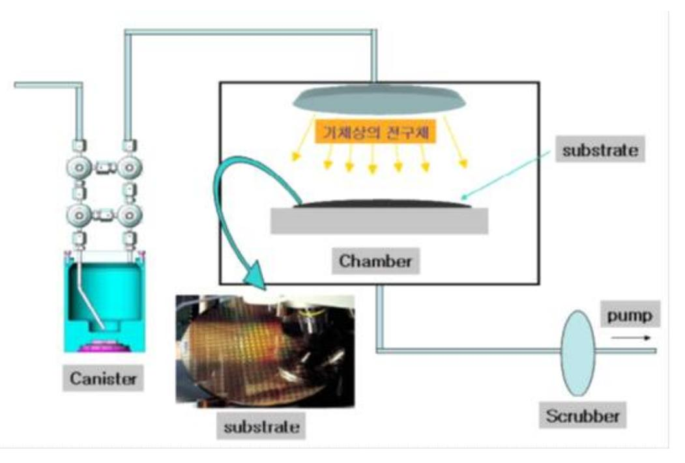

[그림 2-2] CVD 공정 개념도

화학 증착 공정 (CVD)의 성패에 있어서 전구체 선정의 중요성은 몇 번을 강조하여도 지나 치지 않다. 특히 전자 산업의 발전과 함께 3차원적으로 보다 복잡하여 세밀한 구조를 요 구하는 반도체 관련 CVD 에서는 더욱더 그러하다.

CVD 법의 사용으로부터 수많은 결정질 및 비정질 형태의 다양한 금속, 금속간 화합물, 산 화물, 질화물, 탄화물, 유기 고분자 박막 등을 증착할 수 있다. 이들 박막 증착을 위한 CVD 전구체가 갖추어야 할 가장 일반적인 조건들을 요약하여 보면 다음과 같다.

-증착 공정 조건에서 높은(충분한) 증기압을 가져야 한다.

- 고순도의 화합물이어야 한다.

- 증착 온도가 가능한 한 낮아야 한다.

- 원하는 조성의 박막 증착을 하여야 한다.
- 높은 증착 속도를 갖추어야 한다.
- 전구체 전달 조건에서 화학적 또는 열적으로 안정하여야 한다.
- 취급이 쉬워야 한다.
- 반응 부산물의 제거가 쉬워야 한다.
- 손쉬운 증착 반응 경로를 보이는 화합물이어야 한다.
- 가능한 액체 또는 기체의 전구체여야 한다.
- 경제적으로 유리하여야 한다.

전술한 전구체의 일반적 요구조건 이외에도 증착하고자 하는 박막의 전구체와 연관된 공 정 조건에 따라 추가적인 특성이 요구되기도 한다.

일례로 고유 전막 재료인 BST [(Ba,Sr)TiO ] 막의 증착을 위해 사용되는 전구체의 일부는 상온에서 고체상으로 존재한다. 고체상의 전구체를 사용하는 경우 일반적으로 전구체를 유기 용매에 녹여 용액의 상태로 만든 후, 전구체 용액 전달장치(Liquid Delivery System : LDS)를 이용하여 증착 공정을 진행한다. 앞서 기술된 조건을 모두 충족하는 이상적 CVD 전구체는 극히 드물게 볼 수 있으며 대부

분 최적의 전구체를 선정하여 CVD 공정을 진행한다. 선별된 전구체를 사용한 화학 증착 (CVD) 공정이 다른 성막 공정보다 첨단 반도체 산업에서 중요하게 자리매김을 하는 이유 는 아래 그림 (2)와 같은 CVD 공정이 가지고 있는 기판의 굴곡 및 3차원적 구조에도 무관 한 우수한 계단 피복성(step coverage) 와 달리 conformality(정형성)와 기판 종류에 따른 선택적 증착(selective deposition) 두 가지 특성 때문이다.

이러한 CVD 공정이 갖는 step coverage 은 일반적으로 화합물 및 분해 유기 리간드의 기 판 표면에 대한 sticking coefficiency 에 의해 결정되며, 선택성(selectivity)은 화합물의 분 해온도 window에 따른 서로 다른 기판과의 촉매적 반응 민감성에 의존하기 때문에 두 가 지 특성은 전구체의 종류와 공정에 따라 그 정도가 결정된다.

| 리간드(Ligand), 컨포멀 커버리지(Conformal coverage)                 |
|-----------------------------------------------------------|
| 리간드 : 배위결합하고 있는 화합물의 중심금속 이온의 주위에 결합하고 있는 분자나 이온을         |
| 뜻한다.                                                      |
| 컨포멀 커버리지 : 단면을 보았을 때 균일하게 막을 형성함을 뜻한다. 반대되는 개념은 라운디       |
| 드 커버리지(Rounded coverage)가 있는데 그 의미는 단면을 보았을 때 모서리 부위에는 너무 |
| 두껍거나 혹은 너무 얇게 막을 형성함을 뜻한다.                                |

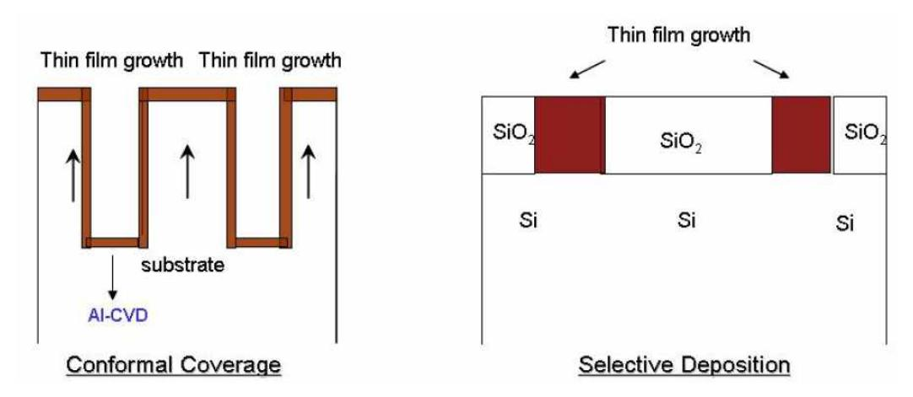

[그림 2-3] Step coverage (conformal coverage 로 우수함) 와 selective deposition

#### 수행 tip

- 반도체 가스 공정에 대한 문제점을 이해한다.
- 점검 포인트를 설정해본다.

# **2-2.** 공정에 적합한 가스 재료선정

학습 목표 • 반도체 집적회로 제조 공정에 적합한 가스 재료를 선정할 수 있다.

## 필요 지식 /

- 반도체 단위공정별 가스 사용
  - 1. 산화 공정용 가스
    - (1) 산화막의 용도
      - (가) MOS 소자의 게이트 산화층
      - (나) 비활성 영역인 절연층 (field oxide)
      - (다) Capacitor의 유전막
      - (라) 확산공정을 위한 마스크
      - (마) 반도체 칩 보호를 위한 표면 보호막
      - (바) 소자 간 전기적 격리(Isolation)를 위한 절연막 등
    - (2) 실리콘을 소모하는 산화

45% silicon oxidation → 100% SiO2

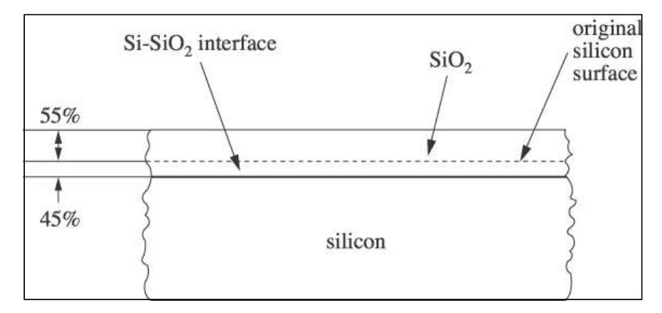

 [그림 2-4] 산화시의 실리콘 소모

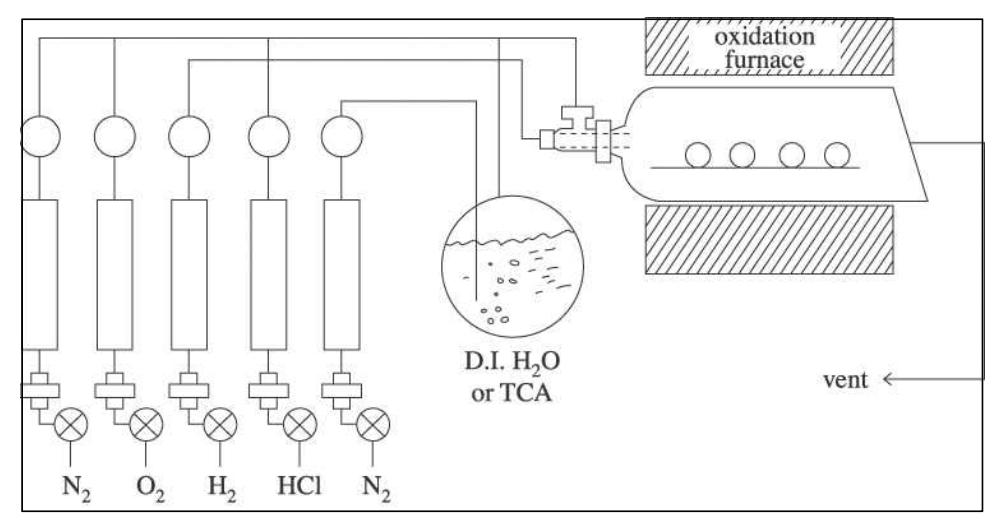

[그림 2-5] 산화장치

(3) 사용 가스

초고순도 O2 gas이며 순도는 99.9999% 이상이어야 한다.

#### 2. 확산공정용 가스

반도체의 전도성은 물질에 불순물을 주입하는 도핑 공정에 의해 증가하거나 감소할 수 있 다. 예를 들어 순수 Si + P 하면 전도성이 증가하지만 GaN + Fe 했을 때는 GaN은 전도성 이 감소한다. Diffusion과 Ion implant는 반도체 물질에 dopant를 주입하는 주요 공정들이 다. Diffusion은 밀도가 높은 지역에서 밀도가 낮은 지역으로 화학적 물질이 이동하는 현 상을 말한다. 실리콘에 dopant들이 확산되는 것을 제어하는 것이 P-N 접합의 기초가 된 다. Diffusion은 반도체 물질의 타입과 전도성의 레벨을 바꾸는 데 사용된다. 이는 바이폴 라 디바이스의 base, emitter, resistor를 형성하는 데 사용되며 MOS 디바이스의 source와 drain을 만드는 데 사용된다. 또한 polysilicon 층을 도핑하는 데도 쓰인다.

(1) Boron Doping

B은 SiO막으로 segregation(편석현상)하여 oxide bond (산소결합)의 결합력을 약화시켜 O / HO 가스의 확산 속도를 증가시킴

(2) P, As Doping

P, As은 SiO막으로 segregation(편석현상)하지 않음으로 parabolic rate constant는 P, As의 도핑 농도에 무관

P, As doping은 Si의 vacancy 농도를 증가시키고, 따라서 oxidation reaction rate를 증 가시킴

(3) 사용 가스

B, P, As 이며 순도는 99.9999% 이상이어야 한다.

- 3. Ion Implant 용 가스
  - (1) Ion Implant(불순물 이온주입공정)

반도체 역사 초기에 불순물 주입 기술은 Tube 내에 반도체 Wafer와 Gas를 넣고 Tube 를 높은 온도로 가열시킴으로써 dopant를 빗물이 땅으로 스며드는 것처럼 Mask 내 Hole을 통해 wafer로 확산되는 방법을 이용하였다. 그러나 회로 밀집도가 복잡해지고 커짐에 따라 Wafer에 불순물 주입에 있어서 높은

정확도가 요구됨에 따라 최초 영국에서 핵 연구로부터 시작하여 불순물을 이온화시켜 Ion Beam을 가속하여 Wafer에 투입 시키는 이온 주입기술이 개발된다. 이후 IBM과 Western Electric 같은 IC 제조업체는 초기에 많은 이온 주입 장치를 만들

었는데, 대부분 내부용으로만 사용되었다. 1970년대 초, 상업용 이온 주입기 시장이 신 생기업인 HVEC의 기술과 그들의 customer가 된 IC 제조업체들의 기술로 생성되었다. 보스턴에 위치한 Varian과 Axcelis가 모든 Implant 장비의 70%를 공급하고 있다.

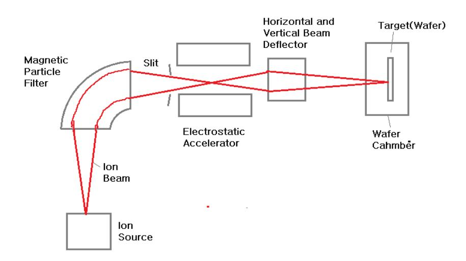

[그림 2-6] 이온주입공정 개념도

이온주입(Ion Implantation)은 물질의 이온을 Si과 같은 고체 물질에 주입하는 재료공학 적 공정이다. 이온 주입을 함으로써 고체의 물리적 특성을 바꾸는 것이다. 이온 주입 은 반도체 디바이스 제조 공정에 두루 쓰일 뿐 아니라 재료과학의 다양한 방면에 쓰 이고 있다. 타겟 물질에 이온을 주입하면 화학적 특성이 바뀌거나 다른 물질이 될 수 도 있으며 타겟의 결정 구조가 바뀌거나 결정구조에 Damage를 입거나 파괴 될 수도 있다. 근래 들어 이온 주입 기술은 물질을 도핑하는 열확산(thermal diffusion) 공정 보 다 많은 이점이 있어 지속해서 대체하고 있다. Diffusion보다 가장 큰 이점은 기판에 도핑되는 dopant 원자들을 좀 더 정확하게 제어할 수 있다는 것이다.

(2) 사용 가스

Ar, B, P, As 등이며 순도는 99.9999% 이상이어야 한다.

(1) CVD

CVD 기술은 외부와 차단된 반응실 안에 Substrate를 넣고 Gas를 공급하여 열, 플라즈 마, 빛(UV or LASER), 또는 임의의 에너지에 의하여 열분해를 일으켜 (Si 기판과 공급 된 O와 반응하여 산화막을 형성시키는 Diffusion과는 달리) 기판의 성질을 변화시키 지 않고 solid deposition을 이루는 합성 공정을 말한다.

다양한 재료에 적용 가능하며, 미세 구조의 조절이 가능하며 증착층의 성분 조절이 가 능할 뿐만 아니라 고농도의 증착층과 purity 조절이 가능하다. 또한, 복잡한 형태 위에 균일한 coating(step coverage)이 가능하다.

예: 반도체(Si, GaAs, SiC), 절연막(SiO , SiN ), 금속막(W, Al)

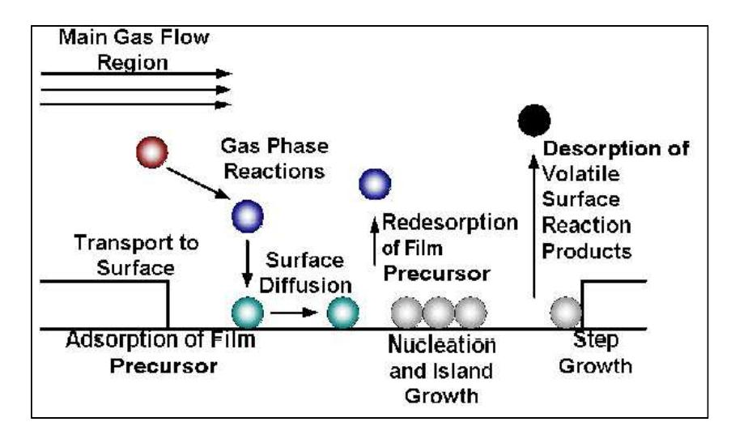

 [그림 2-7] CVD 과정

#### (2) ALD

화학 증착(CVD) 공정보다 더 축소된 범위의 성막 기술로서 새롭게 개발되었으며 차세 대 반도체소자 제조 공정에 중요하게 적용되기 시작한 원차층 증착법(Atomic Layer Deposition: ALD)을 이용한 성막 공정에 대해서 알아본다.

ALD 공정은 단순 CVD 공정에 비해 일반적으로 계단 회복성(Step coverage)의 특성이 더욱 우수하여 컨택/비아홀에 Void 없는 더욱 얇은 박막을 증착할 수 있다. ALD 공정 은 전구체가 기판표면에 흡착 후, 표면 반응(Surface reaction)에 의하여 박막을 증착하 기 때문에 표면 반응 이외에도 기상 반응(gas phase reaction)이 발생하는 CVD 공정에 비해 계단 회복성이 우수하며 박막 두께 조절 다성분계 박막의 조성조절이 용이하다. 이와 같은 CVD 공정과 ALD 공정의 과정을 도식화하여 보면 아래 [그림 2-8]과 같다. 이러한 ALD 공정에 사용이 적합한 이상적 전구체의 조건으로는 앞서 기술된 CVD 공 정용 전구체 조건에 더불어 아래와 같은 조건을 추가할 필요가 있다.

(가) Gas phase 증착 반응이 발생하여서는 안된다.

(나) 기판에 흡착 후에만 증착 반응이 일어나야 된다.

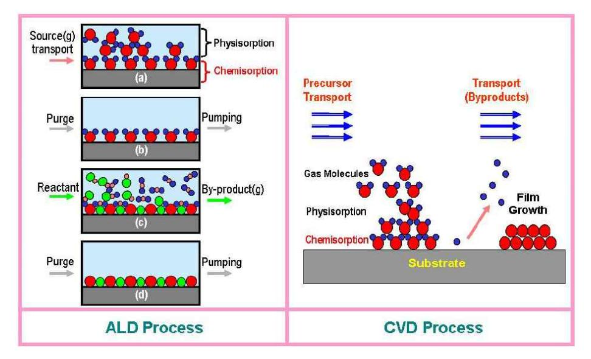

[그림 2-8] ALD와 CVD 공정의 기본적 차이점

#### 5. Sputter 용 가스

(1) Sputtering 장치

Sputtering 장치는 현재 산업체에서 가장 보편적으로 이용되고 있는 박막제조 장치이 며, 본 장비는 두 개의 타겟을 사용해서 co-sputtering을 할 수 있으며, 타겟에는 RF와 DC를 선택하여 사용할 수 있도록 설계되었다. 챔버 내에 Ar 혹은 기타 반응성 가스를 주입한 다음 플라즈마를 발생시켜 타겟에서 튕겨져 나온(sputter-out) 원자 및 분자가 기판에 도달되어 박막이 형성되는 장치로서 비교적 경제적이며, 양질의 박막을 제조할 수 있는 공정이다. 이 공정은 산화물 및 금속계 재료의 박막제조에 활용되고 있다.

#### (가) 원리

Sputtering법은 sputtering 가스를 진공 분위기로 이루어진 챔버 내로 주입하여 성막 하고자 하는 타겟 물질과 충돌시켜 플라즈마를 생성시킨 후 이를 기판(substrate)에 coating 시키는 방법이다. 일반적으로 사용되는 sputtering 가스는 불활성 가스(inert gas)인 Ar을 사용한다. Sputter장치의 시스템은 타겟 쪽을 음극(cathod)으로 하고 기 판 쪽을 양극(anode)로 한다. 전원을 인가하면 주입된 sputtering 가스(Ar)는 음극 쪽에서 방출된 전자와 충돌하여 여기(exite)되어 Ar로 되고 이 여기된 가스는 음 극인 타겟 쪽으로 끌려서 타겟과 충돌한다. 이때 여기된 가스 하나하나는 hυ 만큼의 에너지를 지고 있으며 충돌 시 에너지는

타겟 쪽으로 전이 되며 이때 타겟을 이루고 있는 원소의 결합력과 전자의 일함 수

(work function)를 극복할 수 있을 때 플라즈마는 방출된다. 발생한 플라즈마는 전 자의 자유 행정 거리만큼 부상하고 타겟과 기판과의 거리가 자유 행정 거리 이하 일 때 플라즈마는 성막된다. 따라서 sputtering 시 기판과 타겟과의 거리는 중요한

인자(factor)가 된다. 여기서 인가된 전원이 직류(direct current, DC)일 경우를 직류스퍼터링법(DC sputtering method)라 하며 일반적으로 전도체의 sputtering에 사용된다. 절연체와 같은 부도체는 교류 전원을 사용하여 박막을 제조한다. 이때 교류전원은 13.56㎒의 주파수를 가지며 이를 RF(Radio Frequency)라 한다. 이러한 교류 전원을 인가전원 으로 사용하는 스퍼터링법을 교류스퍼터링(RF sputterig)법이라 한다. RF sputtering 법은 다른 디지털 회로에 noise의 발생 원인이 될 수 있으므로 시스템적으로 noise filter나 절연체에 의한 차폐와 접지가 중요하다.

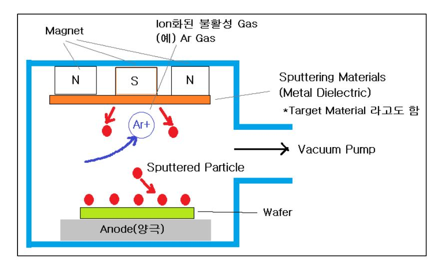

[그림 2-9] Sputter 공정 개념도

마그네트론 스퍼터링(magnetron sputtering)이란 발생한 플라즈마를 영구자석에서 발생하는 자속(flux)에 의해 집진하여 기판에 성막 시키는 방법이다. 이러한 집진이 이루어질 경우 전체가 발생한 플라즈마는 균일하게 되어 결과적으로 균일한 박막 을 제조할 수 있다. 영구자석은 NbFeB계가 주로 사용되며 과거에는 링(ring)형태를 여러 개 합쳐서 제조하였지만, 현재는 평판(plannar)형태로 제작한다. magnetron은 타겟 밑에 놓으며 인가된 전원에 따라 RF·DC magnetron sputtering이라 한다.

(나) 용도

- 1) 자성 박막제작
- 연자성 박막 (FeN thin film, Co/Sn Multilayer 등)
- 거대자기저항재료 제작 (Co/Cu, NiFe/Cu, CoFe/Cu multilayer 등)
- 광자기재료 제작 (MnSbAg, MnSbPt, CoPt 합금막 등)

(다) 사용 가스

초고순도 Ar gas이며 순도는 99.9999% 이상이어야 한다.

- 6. 식각공정용 가스
  - (1) 건식식각(Dry Etching)
    - (가) 반응가스를 진공 챔버에 주입시킨 후 Power를 인가해 플라즈마를 형성시켜서 이를 식각하고자 하는 막과 화학적 또는 물리적으로 반응시켜 막을 제거하는 공정
    - (나) 이온 및 래디컬(들뜬 원자)에 의해 물리적, 화학적 식각
    - (다) Power, 시간 등의 정확한 조절로 식각 제어력이 높음
    - (라) 이방성 식각(Anisotropic Etching) 가능
    - (마) 선택성 저하, 불순물에 의한 오염, 이온화 전자, X-선 등에 의한 손상 가능성
    - (바) 반응식 예

1)  $CF_4 \rightarrow CF_3$ , F,  $CF_3^+$ , F- 2)  $SiO_2 + F \rightarrow SiFx$ , O 3)  $SiO_2 + CFx \rightarrow SiFx$ , CO

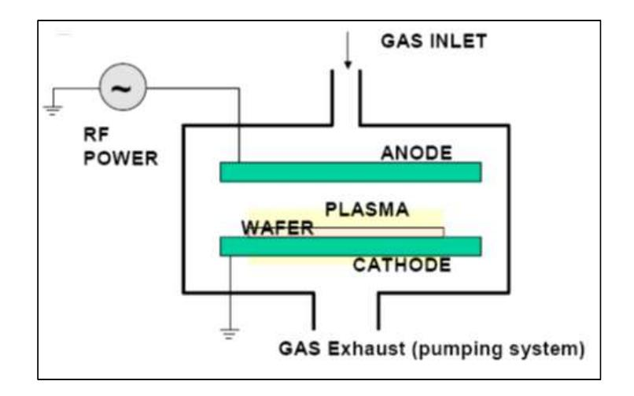

[그림 2-10] 식각공정 개념도

| <표 2-2> | 플라즈마 니 | ㅐ의 충돌 종류 |
|---------|--------|----------|
|---------|--------|----------|

| 전자 (electron)                               | 반응상태                    |
|---------------------------------------------|-------------------------|
| $e+A \rightarrow A^++2e$                    | Ionization              |
| $e+A \rightarrow A^* \rightarrow e+A+hv$    | Excitation              |
| $e+A^* \rightarrow A^++2e$                  | Penning ionization      |
| $e+A \rightarrow A+e$                       | Elastic scattering      |
| $e+AB \rightarrow e+A+B$                    | Dissociation            |
| $e+AB \rightarrow 2e+A^++B$                 | Dissociation ionization |
| $e+AB \rightarrow A-+B$                     | Dissociation attachment |
| $\_e+A^++B \rightarrow A+B$                 | Recombination           |
| 전자 (electron)                               | 반응상태                    |
| $A^+$ +B $\rightarrow$ A+B +     | Charge exchange         |
| $A^+$ + $B \rightarrow A^+$ + $B$           | Elastic scattering      |
| $A^+$ + $B \rightarrow A^+$ + $B^+$ + $e$   | Ionization              |
| $A^+$ +B $\rightarrow A^+$ +B*+ $A^+$ +B+hv | Excitation              |
| $A^+$ +e+ $B \rightarrow A$ + $B$           | Recombination           |
| $A^+$ +BC $\rightarrow A^+$ +B+C            | Dissociation            |
| $A+BC \rightarrow C+AB$                     | Chemical reaction       |

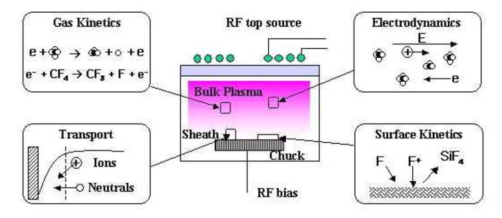

[그림 2-11] 플라즈마 식각에 영향을 미치는 변수들

<표 2-3> 반응성 lon 식각 가스

| Materials | Etching Gas                                                                                                                                                            |  |
|-----------|------------------------------------------------------------------------------------------------------------------------------------------------------------------------|--|
| Si3N4     | $CHF_3+CF_4+Ar+O_2,\ CF_4+He,\ C_2F_6,\ C_3F_8,\ CHF_3,\ SF_6,\ CF_4+H_2,\ NF_3$                                                                                       |  |
| Si        | $\begin{split} & HBr+SiF_4+HeO_2, \ \ HBr+NF_3+SiF_4+HeO_2, \ \ CF_4+O_2, \ \ SF_6+Ar, \ \ NF_3, \ \ C_2F_6+CF_3Cl, \\ & C_2F_6+Cl_2, \ \ HBr, \ \ CH_3Br \end{split}$ |  |
| Poly-Si   | $HBr+Cl_2,\ CF_4+O_2,\ SF_6+Ar,\ NF_3,\ C_2F_6+CF_3Cl,\ C_2F_6+Cl_2,\ HBr,\ CH_3Br$                                                                                    |  |
| Si02      | $CHF_3+CF_4+Ar,\ CF_4+H_2,\ C_3F_8,\ C_2F_6+CHF_3,\ CHF_3+CO_2,\ CH_3Br$                                                                                               |  |
| Al        | $Cl_2 + BCl_3 + N_2, \ CCl_4 + Ar, \ SiCl_4 + Ar, \ Cl_2 + BCl_3 + He, \ Cl_2 + BCl_3 + CHCl_3 + SiCl_4 + He$                                                          |  |
| Cu        | $CCIF_3$ , $C_2CI_2F_4$                                                                                                                                                |  |
| Au        | $\text{CCIF}_3$ , $\text{C}_2\text{Cl}_2\text{F}_4$                                                                                                                    |  |
| W         | $CF_4,\ CF_4\text{+}O_2,\ C_2F_6,\ C_2F_6\text{+}C_2H_4,\ CF_3Br\text{+}O_2$                                                                                           |  |
| Ti(TiW)   | $SF_6 + N_2, \ BCl_3 + SF_6 + N_2, \ CF_4, \ CF_4 + O_2, \ C_2F_6, \ C_2F_6 + C_2H_4, \ CF_3Br + O_2$                                                                  |  |
| Al2O3     | $CCl_4,  BCl_3, $ 주로 physical sputtering 이용 《 $Al_2O_3$ 가 매우 안정》                                                                                                       |  |

#### <표 2-4> 식각 시 첨가 가스의 영향

| 첨가가스                                                     | 현상                                                                                                                    |  |  |
|----------------------------------------------------------|-----------------------------------------------------------------------------------------------------------------------|--|--|
| He, Ar(Noble gas)                                        | Stabilize plasma, Dilute etchant: E/R 감소, 이방성 증가, Improve                                                             |  |  |
|                                                          | heat transfer                                                                                                         |  |  |
|                                                          | F-based gas의 F를 분리 (etchant 활성화)                                                                                      |  |  |
| 0 2 (환원가스)                                    | SiO $_2$ 형성 (sidewall passivation에 의한 국부적인 E/R 감소                                                                     |  |  |
|                                                          | 이방성은 일반적으로 증가하는 경향                                                                                                    |  |  |
| H 2 (F deficient 분위기 형성)                   | HF 형성 (F 농도감소에 의한 E/R 감소) 결함영역의 hydrogen passivation Poly Si나 PR의 E/R은 급격하게 감소, SiO 2 의 E/R는 완 만히 감소 |  |  |
| $N_2$                                                    | Noble gas와 유사                                                                                                         |  |  |
| $\begin{array}{c} C(CHF_3,C_2F_6,\\ C_3F_8) \end{array}$ | Polymer 형성에 의한 sidewall passivation 효과                                                                                |  |  |

#### 수행 내용 / 공정에 적합한 가스 재료 선정하기

#### 재료·자료

- Ÿ 외부 가스 유입에 대한 테스트 자료
- Ÿ 가스 시료
- Ÿ 가연성 도표에 기준하여 작성한 자료

#### 기기(장비 ・ 공구)

- Ÿ 외부 가스 유입 가연성 실험 KIT(장비)
- Ÿ 온도 및 압력 측정 및 기록장치
- Ÿ 진공 펌프
- Ÿ MFC (Mass Flow Controller)
- Ÿ RGA (Residual Gas Analyzer)

#### 안전 ・ 유의 사항

- Ÿ 폭발 및 연소 반응에 대한 방호를 한다.
- Ÿ MFC (Mass Flow Controller)의 취급에 유의한다.
- Ÿ 정밀 측정기기의 취급에 유의한다.

#### 수행 순서

- 반도체 가스 공정 원리를 이해하고, 공정에 쓰이는 가스 공정용 재료의 중요한 특성을 파 악하고 그 기술을 이해한다.
  - 1. 산화 공정용 가스
    - (1) 산화막의 용도를 파악 후 각 용도에 맞는 사용 가스를 확인한다.
    - (2) 진공 챔버의 압력 대비 가스의 유량 등이 안정되게 공급되는지를 Mass Flow Controller를 통해서 확인한다.
  - 2. 확산 공정용 가스
    - (1) B, P, As Doping의 각 용도를 파악 후 각 용도에 맞는 사용 가스를 확인한다.
    - (2) 진공 챔버의 압력 대비 가스 유량의 안정공급 여부를 MFC를 통해 확인한다.

- 3. ion Implant 용 가스
  - (1) B, P, As Doping의 각 용도를 파악 후 각 용도에 맞는 사용 가스를 확인한다.
  - (2) 진공 챔버의 압력 대비 가스의 유량 등이 안정되게 공급되는지를 Mass Flow Controller를 통해서 확인한다.
- 4. CVD/ALD 공정용 가스
  - (1) CVD와 ALD가 가스 적용에 있어서 어떻게 다른지에 대해서 알아본다. 예: 반도체(Si, GaAs, SiC), 절연막(SiO , SiN ), 금속막(W, Al)
  - (2) 진공 챔버의 압력 대비 가스의 유량 등이 안정되게 공급되는지를 Mass Flow Controller를 통해서 확인한다.
  - (3) RGA(Resisual Gas Analyzer)를 사용하여 내부에 잔류가스가 있는지 확인한다. 왜냐하면 진공 챔버 내에 만약 산소, 수분, hydrocarbon 등의 불순물 가스가 있으면 Particle source가 되기 때문이다.
- 5. Sputter 용 가스
  - (1) Sputter의 타겟과 전극 간의 거리 대비 RF Power, DC Power 등을 파악하고 Ar gas의 순도를 확인한다.
  - (2) 진공 챔버의 압력 대비 가스의 유량 등이 안정되게 공급되는지를 Mass Flow Controller를 통해서 확인한다.
  - (3) RGA(Resisual Gas Analyzer)를 사용하여 내부에 잔류가스가 있는지 확인한다. 왜냐하면 진공 챔버 내에 만약 산소, 수분, hydrocarbon 등의 불순물 가스가 있으면 Particle source가 되기 때문이다.
- 6. 식각공정용 가스
  - (1) Dry Etcher의 RF Power, DC Power 등을 파악하고 공정용 gas의 순도를 확인한다.
  - (2) 진공 챔버의 압력 대비 가스의 유량 등이 안정되게 공급되는지를 Mass Flow Controller를 통해서 확인한다.
  - (3) RGA(Resisual Gas Analyzer)를 사용하여 내부에 잔류가스가 있는지 확인한다. 왜냐하면 진공 챔버 내에 만약 산소, 수분, hydrocarbon 등의 불순물 가스가 있으면 Particle source가 되기 때문이다.

#### 수행 tip

- 반도체 가스 공정에 대한 문제점을 이해한다.
- 점검 포인트를 설정해본다.

# 2-3. 가스 재료의 도출된 문제점에 대한 해결방안 강구

학습 목표 • 선정된 반도체 가스 재료의 도출된 문제점에 대한 해결 방안을 제시할 수 있다.

### 필요 지식 /

1 개요

반도체 가스 공정 원리를 이해하고, 공정에 쓰이는 가스 재료의 중요한 특성을 파악하고 그 기술을 이해하여야 한다.

- 2 도출된 공정상 문제점
  - 1. 이온주입공정의 경우
    - (1) B10, B11은 동일 가속전압인 경우라도 Wafer 내 Ion 주입의 깊이가 서로 달라진다. 해결방안 : B10, B11의 원자량 (AMU: Atomic mas unit)이 달라 전압차에 의한 움직임 또한 다르기 때문이다. 따라서 AMU 조정을 서로에게 맞게 해주어야 한다.
    - (2) 동일한 가스라도 lon의 '전하가'가 달라짐에 따라 동일 가속전압인 경우 Wafer 내 lon 주입의 깊이가 달라진다.
      예: P+, P++의 경우
      해결방안 : P+는 Single charge ion, P++는 Double charge ion이므로 ion의 무게가 다 르다. 따라서 가속 전압의 크기도 서로 다르게 해주어야 한다.
    - (3) B와 BF2의 원자량 대비 동일 가속전압인 경우라도 Wafer 내 Ion 주입의 농도가 달라진다. \*[그림 2-11] 참조
      - (가)그림 설명
        - Low dose <1E13 일 때는 BF2, B의 차이는 없다. (Rp & △Rp 모두 동일) 따라 서 Vt dose정도의 <1E13 에서는 BF2, B 둘 다 사용 가능하다.
        - High dose일 때는 F가 Si를 amorphization 시키므로 B의 tail이 매우 작아진다.
           (Montecarlo Sim. 참조) 따라서 shallow junction을 만들 때 BF2가 B 대비 유리 하다.
        - BF2에서는 F로 인해 B이 segregation 되어 B 확산이 적게 된다는 說과 F가 boron 확산을 증가시키기 때문에 특히 dual poly 구조에서 Boron penetration이 증가함으로 공정 margin이 줄어든다는 說이 있다.

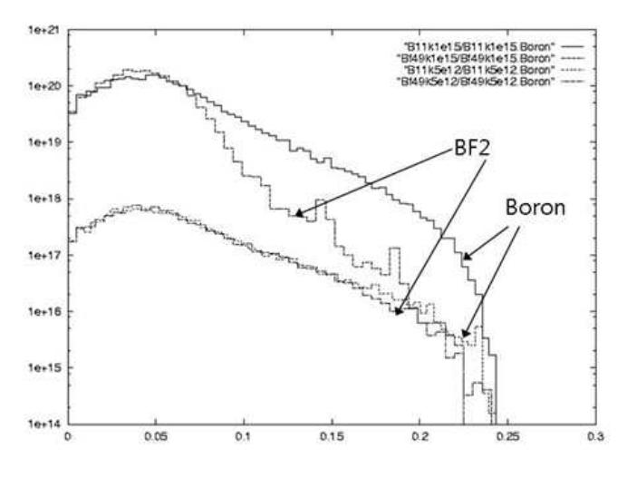

[그림 2-12] B 와 BF의 이온주입 농도 차이

(4) 맹독성 가스로서 안전관리에 많은 노력이 필요하다.

(가) 해결방안

SDS (Safety delivery system) 가스를 사용하는 것 이 안전하다. 이 가스는 압력이 수백 PSI 로 충진된 일반가스와는 다음과 같이 많은 점에서 다르다고 할 수 있다.

(나) SDS (Safety delivery system) 가스 설명

1) 1994년에 도입된 Safe Delivery System 기술은 주로 Ion Implanter 장비에 사용 되는 독성가스를 안전하게 저장하고 공급하는 데 있어 세계적으로 그 안정성과 효 율성을 높이 인정받고 있다. 또한, 혁신적인 반도체 가스 공급기술로 장비의 가동 중지시간을 최소화하는 동시에 가스 누출사고의 위험을 Zero화 하고 있다.

2) 지난 20년 동안 SDS 기술은 독성가스 취급분야에서 가장 안전하고 효과적으로 가스를 저장 및 공급하는 시스템으로 자리 잡고 있다. 그 이유는 SDS 가스 실린더 시스템은 반도체의 이온 주입공정에서 대기압보다 낮은 압력으로 유해 가스를 탄 소 흡착제 재료를 통해 저장하고 전달하므로 외부로 가스 누출이 되지 않기 때문 이다. SDS는 이러한 유해 가스를 저장하고 전달하는 방법을 통해 반도체 제조업체 들은 더욱 안전하고 더욱 효율적이면서 더 적은 비용으로 작업을 실현할 수 있다.

#### 재료・자료

- 외부 가스 유입에 대한 테스트 자료
- 가스 시료
- 가연성 도표에 기준하여 작성한 자료

#### 기기(장비・공구)

- 외부 가스 유입 가연성 실험 KIT(장비)
- 온도 및 압력 측정 및 기록장치
- 진공 펌프
- MFC (Mass Flow Controller)
- RGA (Residual Gas Analyzer)

#### 안전·유의 사항

- 폭발 및 연소 반응에 대한 방호
- MFC (Mass Flow Controller)의 취급
- 정밀 측정기기의 취급

#### 수행 순서

- 반도체 가스 공정 원리를 이해하고, 공정에 쓰이는 가스 공정용 재료의 적용상 도출된 문 제점을 파악하고 그 해결방안 및 원리를 이해한다.
  - 1. 이온주입공정의 경우
    - (1) B10, B11 은 동일 가속전압인 경우라도 Wafer 내 Ion 주입의 깊이가 서로 달라지는 이유와 실제로 공정상 어떻게 해결하는지에 대한 과정을 알아본다.
    - (2) 동일한 가스라도 lon의 '전하가가 달라짐에 따라 동일 가속전압인 경우 Wafer 내 lon 주입의 깊이가 달라지는 이유와 실제로 공정상 어떻게 해결하는지에 대한 과정 을 알아본다.

예: P+, P++의 경우

(3) B10, B11의 원자량 대비 동일 가속전압인 경우라도 Wafer 내 lon 주입의 농도가 달 라지는 이유와 실제로 공정상 어떻게 해결하는지에 대한 과정을 알아본다.

2 반도체 가스 공정에 사용되는 가스캐비닛과 MFC(mass flow controller) 원리를 이해한다.

1. 가스캐비닛 \* [그림 2-13] 참조

Gas Bombe는 주로 아래와 같은 가스캐비닛에 장착하여 사용하게 된다. 이 캐비닛 내부에 는 전자식 회로 및 가스 누출감지용 Sensor가 내장되어 있어 비상 상황이 발생하면 자동 으로 모든 Valve를 Close 시켜 Stand By 상태로 만들어 주게 된다.

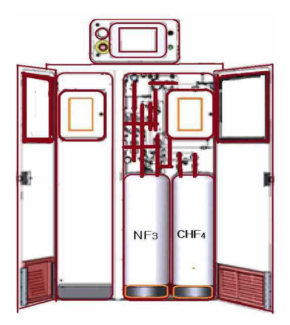

[그림 2-13] 가스 캐비닛

2. MFC(mass flow controller : 가스 유량 조절장치)Gas는 [그림 2-14]와 같은 MFC를 통하여 흐르게 된다.

[그림 2-14] MFC (mass flow controller : 가스 유량 조절장치) 내부구조

MFC(mass flow controller : 가스 유량 조절장치)의 Flow Sensor 구조는 다음의 그림과 같 으며 원리는 대부분의 Gas는 Gas Bypass way (가스 상시통과 유로)를 통해 흐르며 일부 Gas는 인입부 센서 코일이 감겨져 있는 Tube로 흐르는 동안 코일의 열(이 코일에는 미소 전류가 흘러 일정 온도의 열을 유지하고 있다)을 빼앗아 출구부 센서 코일이 감겨져 있는 Tube로 흐를 때, 이번에는 출구부 센서 코일에 열을 더해주게 되며, 이때의 차이가 크면 클수록 더 많은 Gas가 흐르게 된다는 의미이며 항시 일정한 Gas를 흐르게 하기 위해서 이 차이를 감지한 값을 전류로 바꾸어 출구에 위치한 Solenoid valve (전자석 방식 작동 밸브)에 입력으로서 Feedback Signal(되먹임 신호)을 주면 자동으로 Solenoid valve가 작동 하여 Orifice (밸브 미세구멍)를 Control을 하여 출력되는 gas를 더 많이 혹은 더 적게 자 동으로 조절해주게 된다.

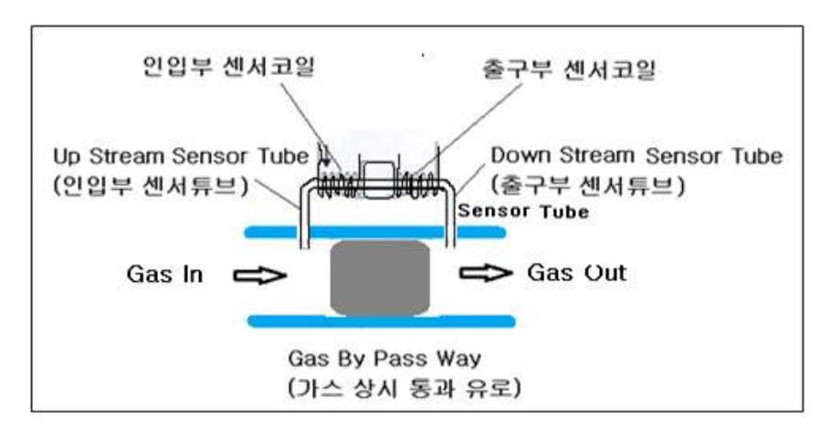

[그림 2-15] MFC (mass flow controller) 내부의 Flow Sensor 구조

#### 수행 tip

- 반도체 가스 공정에 대한 문제점을 이해한다.
- 점검 포인트를 설정해본다.

#### 학습2 교수·학습 방법

#### 교수 방법

- 반도체 가스 공정이 필요한 이유와 기술에 대한 이론적 지식을 충분히 설명한다.
- 반도체 가스 제조공정을 쉽게 설명한다.
- 디스플레이 박막 제조공정을 쉽게 설명한다.
- 반도체 제조공정용 동영상을 통해 시청할 수 있도록 한다.
- 교수 주도로 현장에서 표준화한 공정 매뉴얼과 관련 공정 재료에서 제공되는 자료 등의 내용을 PPT 자료로 제시한 후에 설명한다.
- 가능한 한 사전에 제조 현장에서 사용하는 사례를 수집하여 자료를 준비하고 이해하기 쉬운 방법을 논의하는 방식의 문제 해결식 수업을 하도록 한다.
- 가스 종류에 대한 상세한 이론 강의와 실습을 병행하여 학생의 이해를 높여야 한다.
- 장비에 대한 실습이 불가능할 경우 동영상 및 시청각 강의 자료를 활용하여야 한다.
- 가스 공정 및 종류에 대해 기술적 토론을 유도하고 발표하여 이해하도록 해야 한다.

#### 학습 방법

- 생산에 필요한 금속 공정 파악을 스스로 점검하고 알려는 적극적인 태도를 가져야 한다.
- 고객의 요청에 적극적인 수용 태도로 스스로 점검하고 알려는 자세를 가져야 한다.
- 새로운 기술에 대한 학습 자세를 스스로 점검하고 알아야 한다.
- 최신 반도체 기술 동향 파악 능력을 스스로 점검하고 알려는 태도를 지녀야 한다.
- 최신 반도체 시장 동향 파악 능력을 스스로 점검하고 알려는 태도를 지녀야 한다.
- 가스 품질을 이해할 수 있도록 공정에 이용되는 가스 종류에 대해 알려는 태도를 지녀야 한다.
- 가스 품질에 문제없도록 신뢰성 항목 부분에 대해 알려는 태도를 지녀야 한다.

## 학습2 평 가

#### 평가 준거

• 평가자는 학습자가 학습 목표를 성공적으로 달성하였는지를 평가해야 한다.

#### • 평가자는 다음 사항을 평가해야 한다.

| 학습 내용                              | 평가 항목                                               | 성취수준 |   |   |
|------------------------------------|-----------------------------------------------------|------|---|---|
|                                    |                                                     | 상    | 중 | 하 |
| 가스 재료의 장단점 파악                   | - 반도체 공정별 가스 재료의 장단점을 파악할 수 있다.                  |      |   |   |
| 공정에 적합한 가스 재료선정                 | - 반도체 집적회로 제조 공정에 적합한 가스 재료를 선 정할 수 있다.       |      |   |   |
| 가스재료의 도출된 문제점에 대한 해결방안 강구 | - 선정된 반도체 가스 재료의 도출된 문제점에 대한 해 결방안을 제시할 수 있다. |      |   |   |

#### 평가 방법

• 서술형 시험

|                                    |                                              |   | 성취수준 |   |  |
|------------------------------------|----------------------------------------------|---|------|---|--|
| 학습 내용                              | 평가 항목                                        | 상 | 중    | 하 |  |
| 가스 재료의 장단점 파악                   | - 반도체 공정별 가스 재료의 장단점 파악                   |   |      |   |  |
| 공정에 적합한 가스 재료선정                 | - 반도체 집적회로 제조 공정에 적합한 가스 재료 선정            |   |      |   |  |
| 가스재료의 도출된 문제점에 대한 해결방안 강구 | - 선정된 반도체 가스 재료의 도출된 문제점에 대한 해 결방안의 제시 |   |      |   |  |

#### • 사례연구

|                                    |                                              | 성취수준 |   |   |
|------------------------------------|----------------------------------------------|------|---|---|
| 학습 내용                              | 평가 항목                                        | 상    | 중 | 하 |
| 가스 재료의 장단점 파악                   | - 반도체 공정별 가스 재료의 장단점 파악                   |      |   |   |
| 공정에 적합한 가스 재료선정                 | - 반도체 집적회로 제조 공정에 적합한 가스 재료 선정            |      |   |   |
| 가스재료의 도출된 문제점에 대한 해결방안 강구 | - 선정된 반도체 가스 재료의 도출된 문제점에 대한 해 결방안의 제시 |      |   |   |

#### • 평가자 체크리스트

|                                    |                                              | 성취수준 |   |   |
|------------------------------------|----------------------------------------------|------|---|---|
| 학습 내용                              | 평가 항목                                        | 상    | 중 | 하 |
| 가스 재료의 장단점 파악                   | - 반도체 공정별 가스 재료의 장단점 파악                   |      |   |   |
| 공정에 적합한 가스 재료선정                 | - 반도체 집적회로 제조 공정에 적합한 가스 재료 선정            |      |   |   |
| 가스재료의 도출된 문제점에 대한 해결방안 강구 | - 선정된 반도체 가스 재료의 도출된 문제점에 대한 해 결방안의 제시 |      |   |   |

#### 피드백

#### 1. 서술형 시험

- 평가 결과에 대한 일정 점수 누락에 해당하는 학생은 재평가를 통하여 학습을 이수할 수 있도록 지도한다.
- 2. 사례연구
- 학습한 내용이 효과적으로 전달되지 않은 경우에는 발표방법에 대한 추가 지도를 수행 한다.
- 3. 평가자 페크리스트
- 평가 결과, 일정 점수 이하인 학생들은 추가 학습 후, 결과를 제출하도록 한다.

|      | 반도체용 가스 재료 요구사항 파악하기                   |
|------|----------------------------------------|
| 학습 1 | (LM1903060403_14v1.1)                  |
| 학습 2 | 반도체용 가스 재료 선정하기(LM1903060403_14v1.2)   |
| 학습 3 | 반도체용 가스 제조하기 (LM1903060404_14v1.3)  |
| 학습 4 | 반도체용 가스 제품특성 검증하기(LM1903060403_14v1.4) |

# **3-1.** 공정별 장단점 파악

학습 목표 • 반도체 가스의 제조 공정별 장점과 단점을 파악할 수 있다.

#### 필요 지식 /

개요

반도체 가스 제조공정의 특징은 다음과 같다.

#### 1. 반도체용 가스

(1) 반도체용 가스의 특징

반도체용 가스는 반도체의 특성을 만들기 위한 Dopant, Etchant, Reactant, Reactant, Purge 가스 등으로 구분되며 그 종류가 다양하고 대부분 독성이며, 높은 순도를 필요 로 하며, VLSI, LED, LCD 등과 같은 반도체 장치의 제조에 사용되는 가스를 말한다. 이러한 반도체용 특수가스는 높은 가연성과 독성을 지니고 있어 극히 위험하므로 생 산, 검사, 운송 시 고도의 관리가 요구된다. 또한 반도체 공정에 적용되는 표준가스는 철저한 품질관리와 정밀분석법으로 사용 시 적용공정에 문제가 없도록 해야 한다.

- (2) 반도체 제조용 가스의 공급 개념 요약
  - (가) Clean화(CleanRoom-Class10) : 용기 내면 초순수 처리-10MΩ, 완전 Dry 진공계 의 채용, Ultra Clean Technology의 채택 등
  - (나) 고품질화(가스의 고순도화, 품질의 안정화, PaticleLess 등
  - (다) 자동화(전자동 충전 및 용기 내면처리 등)
  - (라) 생산비용 절감(가스의 저장, 수송, 공급시스템 등)
  - (마) 사용자에 대한 교육(On-Site, Management, 안전교육 등)

(바) 안전성의 확보(가스안전 Management, 안전공급 등)

(사) 환경보전(중앙감시시스템, 배출가스 완전처리, 전용 재해 방지장치의 설치 등)

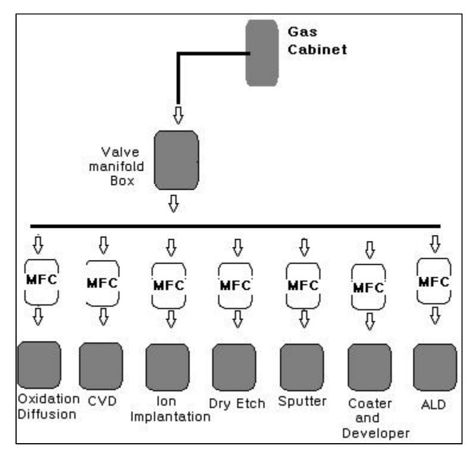

[그림 3-1] 반도체 각 공정별 가스 공급 방식 개념도

다음은 반도체용 특수가스에 대해 Group별로 분류한 List이다.

<표 3-1> 반도체용 특수가스의 종류

| Gas Group         | Gas 종류                        | 국어표기      | 영어표기                      |
|----------------------|-------------------------------|-----------|---------------------------|
|                      | ${\rm SiH}_4$                 | 모노실란      | Silane                    |
|                      | $Si_2H_6$                     | 디실란       | Disilane                  |
| Silicon              | ${\sf SiF}_4$                 | 4불화규소     | Silicon Tetrafluorosilane |
| Group                | SiCl 4             | 4염화규소     | Silicon Trichlorosilane   |
|                      | SiHCl 3            | 3염화실란     | Trichlorosilane           |
|                      | $\mathrm{SiH}_2\mathrm{Cl}_2$ | 디클로로실란    | Diclorosilane             |
| Aresenic Group    | $AsH_3$                       | 알신        | Arsine                    |
| Phosphoru s Group | $PH_3$                        | 포스핀(인화수소) | Phosphine                 |
|                      | $B2_2H_6$                     | 디보란       | Diborane                  |
| Boron Group       | $BF_3$                        | 3불화붕소     | Boron trifluoride         |
|                      | $BCl_3$                       | 3염화붕소     | Boron trichoride          |

| $r_{3}$ $r_{4}$ Se $r_{3}$ $r_{3}$ $r_{3}$ $r_{2}$ $r_{3}$ $r_{2}$ $r_{3}$ $r_{4}$ $r_{5}$ $r_{8}$ $r_{8}$ $r_{8}$ $r_{8}$ $r_{8}$ $r_{8}$ $r_{8}$ $r_{8}$ $r_{8}$ $r_{8}$ $r_{8}$ $r_{8}$ $r_{8}$ $r_{8}$ $r_{8}$ $r_{8}$ $r_{8}$ $r_{8}$ $r_{8}$ $r_{8}$ $r_{8}$ $r_{8}$ $r_{8}$ $r_{8}$ $r_{8}$ $r_{8}$ $r_{8}$ $r_{8}$ $r_{8}$ $r_{8}$ $r_{8}$ $r_{8}$ $r_{8}$ $r_{8}$ $r_{8}$ $r_{8}$ $r_{8}$ $r_{8}$ $r_{8}$ $r_{8}$ $r_{8}$ $r_{8}$ $r_{8}$ $r_{8}$ $r_{8}$ $r_{8}$ $r_{8}$ $r_{8}$ $r_{8}$ $r_{8}$ $r_{8}$ $r_{8}$ $r_{8}$ $r_{8}$ $r_{8}$ $r_{8}$ $r_{8}$ $r_{8}$ $r_{8}$ $r_{8}$ $r_{8}$ $r_{8}$ $r_{8}$ $r_{8}$ $r_{8}$ $r_{8}$ $r_{8}$ $r_{8}$ $r_{8}$ $r_{8}$ $r_{8}$ $r_{8}$ $r_{8}$ $r_{8}$ $r_{8}$ $r_{8}$ $r_{8}$ $r_{8}$ $r_{8}$ $r_{8}$ $r_{8}$ $r_{8}$ $r_{8}$ $r_{8}$ $r_{8}$ $r_{8}$ $r_{8}$ $r_{8}$ $r_{8}$ $r_{8}$ $r_{8}$ $r_{8}$ $r_{8}$ $r_{8}$ $r_{8}$ $r_{8}$ $r_{8}$ $r_{8}$ $r_{8}$ $r_{8}$ $r_{8}$ $r_{8}$ $r_{8}$ $r_{8}$ $r_{8}$ $r_{8}$ $r_{8}$ $r_{8}$ $r_{8}$ $r_{8}$ $r_{8}$ $r_{8}$ $r_{8}$ $r_{8}$ $r_{8}$ $r_{8}$ $r_{8}$ $r_{8}$ $r_{8}$ $r_{8}$ $r_{8}$ $r_{8}$ $r_{8}$ $r_{8}$ $r_{8}$ $r_{8}$ $r_{8}$ $r_{8}$ $r_{8}$ $r_{8}$ $r_{8}$ $r_{8}$ $r_{8}$ $r_{8}$ $r_{8}$ $r_{8}$ $r_{8}$ $r_{8}$ $r_{8}$ $r_{8}$ $r_{8}$ $r_{8}$ $r_{8}$ $r_{8}$ $r_{8}$ $r_{8}$ $r_{8}$ $r_{8}$ $r_{8}$ $r_{8}$ $r_{8}$ $r_{8}$ $r_{8}$ $r_{8}$ $r_{8}$ $r_{8}$ $r_{8}$ $r_{8}$ $r_{8}$ $r_{8}$ $r_{8}$ $r_{8}$ $r_{8}$ $r_{8}$ $r_{8}$ $r_{8}$ $r_{8}$ $r_{8}$ $r_{8}$ $r_{8}$ $r_{8}$ $r_{8}$ $r_{8}$ $r_{8}$ $r_{8}$ $r_{8}$ $r_{8}$ $r_{8}$ $r_{8}$ $r_{8}$ $r_{8}$ $r_{8}$ $r_{8}$ $r_{8}$ $r_{8}$ $r_{8}$ $r_{8}$ $r_{8}$ $r_{8}$ $r_{8}$ $r_{8}$ $r_{8}$ $r_{8}$ $r_{8}$ $r_{8}$ $r_{8}$ $r_{8}$ $r_{8}$ $r_{8}$ $r_{8}$ $r_{8}$ $r_{8}$ $r_{8}$ $r_{8}$ $r_{8}$ $r_{8}$ $r_{8}$ $r_{8}$ $r_{8}$ $r_{8}$ $r_{8}$ $r_{8}$ $r_{8}$ $r_{8}$ $r_{8}$ $r_{8}$                                                                                                                                                                                                                                       | 붕소         모노게르만         세렌화수소         불소         염소         3불화질소         6불화황         6불화당스텐         염화수소         불화수소         브롬화수소         보름화수소         외북화염소         3불화메탄         4불화메탄         6불화이탄         8불화프로판         용불화시클로         클로폼         일산화질소 | Trichlorosilane Monogermane Hydrogen Selenide Fluorine Chlorine Nitrogen Trifluoride Sulfur Hexafluoride Tungsten Hexafluoride Hydrogen Chloride Hydrogen Fluoride Hydrogen Bromide Hydrogen lodide Chlorine Trifluoride Trifluoromethane Tetragluoromethane Hexafluoroethane Perfluoropropane Octafluorrcyclobutane |
|-------------------------------------------------------------------------------------------------------------------------------------------------------------------------------------------------------------------------------------------------------------------------------------------------------------------------------------------------------------------------------------------------------------------------------------------------------------------------------------------------------------------------------------------------------------------------------------------------------------------------------------------------------------------------------------------------------------------------------------------------------------------------------------------------------------------------------------------------------------------------------------------------------------------------------------------------------------------------------------------------------------------------------------------------------------------------------------------------------------------------------------------------------------------------------------------------------------------------------------------------------------------------------------------------------------------------------------------------------------------------------------------------------------------------------------------------------------------------------------------------------------------------------------------------------------------------------------------------------------------------------------------------------------------------------------------------------------------------------------------------------------------------------------------------------------------------------------------------------------------------------------------------------------------------------------------------------------------------------------------------------------------------------------------------------------------------------------------------------------------------------------------------------------------------------------------------------------------------------------------------------------------------------------------------------------------------------------------------------------------------------------------------------------------------------------------------------------------------------------------------------------------------------------------------------------------------------------------------------------------------------------------------------------------------------------------------------------------------------------------------------------------------------------------------------------------------------------------|----------------------------------------------------------------------------------------------------------------------------------------------------------------------------------------------------------------------------------------------------------------------|-------------------------------------------------------------------------------------------------------------------------------------------------------------------------------------------------------------------------------------------------------------------------------------------------------------------------------------------------------------------------|
| Se 2 3 $Cl_4$ $HCl_3$ $H_2Cl_2$ $Hcl_3$ $Hcl_3$ $Hcl_3$ $Hcl_3$ $Hcl_3$ $Hcl_3$ $Hcl_3$ $Hcl_3$ $Hcl_3$ $Hcl_3$ $Hcl_3$ $Hcl_3$ $Hcl_3$ $Hcl_3$ $Hcl_3$ $Hcl_3$ $Hcl_3$ $Hcl_3$ $Hcl_3$ $Hcl_3$ $Hcl_3$ $Hcl_3$ $Hcl_3$ $Hcl_3$ $Hcl_3$ $Hcl_3$ $Hcl_3$ $Hcl_3$ $Hcl_3$ $Hcl_3$ $Hcl_3$ $Hcl_3$ $Hcl_3$ $Hcl_3$ $Hcl_3$ $Hcl_3$ $Hcl_3$ $Hcl_3$ $Hcl_3$ $Hcl_3$ $Hcl_3$ $Hcl_3$ $Hcl_3$ $Hcl_3$ $Hcl_3$ $Hcl_3$ $Hcl_3$ $Hcl_3$ $Hcl_3$ $Hcl_3$ $Hcl_3$ $Hcl_3$ $Hcl_3$ $Hcl_3$ $Hcl_3$ $Hcl_3$ $Hcl_3$ $Hcl_3$ $Hcl_3$ $Hcl_3$ $Hcl_3$ $Hcl_3$ $Hcl_3$ $Hcl_3$ $Hcl_3$ $Hcl_3$ $Hcl_3$ $Hcl_3$ $Hcl_3$ $Hcl_3$ $Hcl_3$ $Hcl_3$ $Hcl_3$ $Hcl_3$ $Hcl_3$ $Hcl_3$ $Hcl_3$ $Hcl_3$ $Hcl_3$ $Hcl_3$ $Hcl_3$ $Hcl_3$ $Hcl_3$ $Hcl_3$ $Hcl_3$ $Hcl_3$ $Hcl_3$ $Hcl_3$ $Hcl_3$ $Hcl_3$ $Hcl_3$ $Hcl_3$ $Hcl_3$ $Hcl_3$ $Hcl_3$ $Hcl_3$ $Hcl_3$ $Hcl_3$ $Hcl_3$ $Hcl_3$ $Hcl_3$ $Hcl_3$ $Hcl_3$ $Hcl_3$ $Hcl_3$ $Hcl_3$ $Hcl_3$ $Hcl_3$ $Hcl_3$ $Hcl_3$ $Hcl_3$ $Hcl_3$ $Hcl_3$ $Hcl_3$ $Hcl_3$ $Hcl_3$ $Hcl_3$ $Hcl_3$ $Hcl_3$ $Hcl_3$ $Hcl_3$ $Hcl_3$ $Hcl_3$ $Hcl_3$ $Hcl_3$ $Hcl_3$ $Hcl_3$ $Hcl_3$ $Hcl_3$ $Hcl_3$ $Hcl_3$ $Hcl_3$ $Hcl_3$ $Hcl_3$ $Hcl_3$ $Hcl_3$ $Hcl_3$ $Hcl_3$ $Hcl_3$ $Hcl_3$ $Hcl_3$ $Hcl_3$ $Hcl_3$ $Hcl_3$ $Hcl_3$ $Hcl_3$ $Hcl_3$ $Hcl_3$ $Hcl_3$ $Hcl_3$ $Hcl_3$ $Hcl_3$ $Hcl_3$ $Hcl_3$ $Hcl_3$ $Hcl_3$ $Hcl_3$ $Hcl_3$ $Hcl_3$ $Hcl_3$ $Hcl_3$ $Hcl_3$ $Hcl_3$ $Hcl_3$ $Hcl_3$ $Hcl_3$ $Hcl_3$ $Hcl_3$ $Hcl_3$ $Hcl_3$ $Hcl_3$ $Hcl_3$ $Hcl_3$ $Hcl_3$ $Hcl_3$ $Hcl_3$ $Hcl_3$ $Hcl_3$ $Hcl_3$ $Hcl_3$ $Hcl_3$ $Hcl_3$ $Hcl_3$ $Hcl_3$ $Hcl_3$ $Hcl_3$ $Hcl_3$ $Hcl_3$ $Hcl_3$ $Hcl_3$ $Hcl_3$ $Hcl_3$ $Hcl_3$ $Hcl_3$ $Hcl_3$ $Hcl_3$ $Hcl_3$ $Hcl_3$ $Hcl_3$ $Hcl_3$ $Hcl_3$ $Hcl_3$ $Hcl_3$ $Hcl_3$ $Hcl_3$ $Hcl_3$ $Hcl_3$ $Hcl_3$ $Hcl_3$ $Hcl_3$ $Hcl_3$ $Hcl_3$ $Hcl_3$ $Hcl_3$ $Hcl_3$ $Hcl_3$ $Hcl_3$ $Hcl_3$ $Hcl_3$ $Hcl_3$ $Hcl_3$ $Hcl_3$ $Hcl_$                                                                                                                                                                                                                                        | 세렌화수소 불소 염소 3불화질소 6불화황 6불화당스텐 염화수소 불화수소 보롬화수소 요화수소 3불화수소 3불화여탄 4불화에탄 6불화에탄 6불화에탄 8불화프로판 8불화프로판                                                                                                                       | Hydrogen Selenide         Fluorine         Chlorine         Nitrogen Trifluoride         Sulfur Hexafluoride         Tungsten Hexafluoride         Hydrogen Chloride         Hydrogen Fluoride         Hydrogen Ioloide         Chlorine Trifluoride         Turifluoromethane         Tetragluoromethane         Perfluoropropane         Octafluorrcyclobutane        |
| $F_{3}$ $F_{4}$ $F_{6}$ $F_{8}$ $F_{8}$ $F_{8}$ $F_{8}$ $F_{8}$ $F_{8}$ $F_{8}$ $F_{8}$ $F_{8}$ $F_{8}$ $F_{8}$ $F_{8}$ $F_{8}$ $F_{8}$ $F_{8}$ $F_{8}$ $F_{8}$ $F_{8}$ $F_{8}$ $F_{8}$ $F_{8}$ $F_{8}$ $F_{8}$ $F_{8}$ $F_{8}$ $F_{8}$ $F_{8}$ $F_{8}$ $F_{8}$ $F_{8}$ $F_{8}$ $F_{8}$ $F_{8}$ $F_{8}$ $F_{8}$ $F_{8}$ $F_{8}$ $F_{8}$ $F_{8}$ $F_{8}$ $F_{8}$ $F_{8}$ $F_{8}$ $F_{8}$ $F_{8}$ $F_{8}$ $F_{8}$ $F_{8}$ $F_{8}$ $F_{8}$ $F_{8}$ $F_{8}$ $F_{8}$ $F_{8}$ $F_{8}$ $F_{8}$ $F_{8}$ $F_{8}$ $F_{8}$ $F_{8}$ $F_{8}$ $F_{8}$ $F_{8}$ $F_{8}$ $F_{8}$ $F_{8}$ $F_{8}$ $F_{8}$ $F_{8}$ $F_{8}$ $F_{8}$ $F_{8}$ $F_{8}$ $F_{8}$ $F_{8}$ $F_{8}$ $F_{8}$ $F_{8}$ $F_{8}$ $F_{8}$ $F_{8}$ $F_{8}$ $F_{8}$ $F_{8}$ $F_{8}$ $F_{8}$ $F_{8}$ $F_{8}$ $F_{8}$ $F_{8}$ $F_{8}$ $F_{8}$ $F_{8}$ $F_{8}$ $F_{8}$ $F_{8}$ $F_{8}$ $F_{8}$ $F_{8}$ $F_{8}$ $F_{8}$ $F_{8}$ $F_{8}$ $F_{8}$ $F_{8}$ $F_{8}$ $F_{8}$ $F_{8}$ $F_{8}$ $F_{8}$ $F_{8}$ $F_{8}$ $F_{8}$ $F_{8}$ $F_{8}$ $F_{8}$ $F_{8}$ $F_{8}$ $F_{8}$ $F_{8}$ $F_{8}$ $F_{8}$ $F_{8}$ $F_{8}$ $F_{8}$ $F_{8}$ $F_{8}$ $F_{8}$ $F_{8}$ $F_{8}$ $F_{8}$ $F_{8}$ $F_{8}$ $F_{8}$ $F_{8}$ $F_{8}$ $F_{8}$ $F_{8}$ $F_{8}$ $F_{8}$ $F_{8}$ $F_{8}$ $F_{8}$ $F_{8}$ $F_{8}$ $F_{8}$ $F_{8}$ $F_{8}$ $F_{8}$ $F_{8}$ $F_{8}$ $F_{8}$ $F_{8}$ $F_{8}$ $F_{8}$ $F_{8}$ $F_{8}$ $F_{8}$ $F_{8}$ $F_{8}$ $F_{8}$ $F_{8}$ $F_{8}$ $F_{8}$ $F_{8}$ $F_{8}$ $F_{8}$ $F_{8}$ $F_{8}$ $F_{8}$ $F_{8}$ $F_{8}$ $F_{8}$ $F_{8}$ $F_{8}$ $F_{8}$ $F_{8}$ $F_{8}$ $F_{8}$ $F_{8}$ $F_{8}$ $F_{8}$ $F_{8}$ $F_{8}$ $F_{8}$ $F_{8}$ $F_{8}$ $F_{8}$ $F_{8}$ $F_{8}$ $F_{8}$ $F_{8}$ $F_{8}$ $F_{8}$ $F_{8}$ $F_{8}$ $F_{8}$ $F_{8}$ $F_{8}$ $F_{8}$ $F_{8}$ $F_{8}$ $F_{8}$ $F_{8}$ $F_{8}$ $F_{8}$ $F_{8}$ $F_{8}$ $F_{8}$ $F_{8}$ $F_{8}$ $F_{8}$ $F_{8}$ $F_{8}$ $F_{8}$ $F_{8}$ $F_{8}$ $F_{8}$ $F_{8}$ $F_{8}$ $F_{8}$ $F_{8}$ $F_{8}$ $F_{8}$ F                                                                                                                                                                                                                                        | 불소 염소 3불화질소 6불화장 6불화당스텐 염화수소 불화수소 보롬화수소 요화수소 3불화우소 3불화위 4불화에탄 6불화에탄 6불화에탄 8불화프로판 8불화프로판                                                                                                                                 | Fluorine Chlorine Nitrogen Trifluoride Sulfur Hexafluoride Tungsten Hexafluoride Hydrogen Chloride Hydrogen Fluoride Hydrogen Iodide Chlorine Trifluoride Trifluoromethane Tetragluoromethane Hexafluoroethane Perfluoropropane Octafluorrcyclobutane                                                                            |
| $F_{3}$ $F_{4}$ $F_{6}$ $F_{8}$ $F_{8}$ $F_{8}$ $F_{8}$ $F_{8}$ $F_{8}$ $F_{8}$ $F_{8}$ $F_{8}$ $F_{8}$ $F_{8}$ $F_{8}$ $F_{8}$ $F_{8}$ $F_{8}$ $F_{8}$ $F_{8}$ $F_{8}$ $F_{8}$ $F_{8}$ $F_{8}$ $F_{8}$ $F_{8}$ $F_{8}$ $F_{8}$ $F_{8}$ $F_{8}$ $F_{8}$ $F_{8}$ $F_{8}$ $F_{8}$ $F_{8}$ $F_{8}$ $F_{8}$ $F_{8}$ $F_{8}$ $F_{8}$ $F_{8}$ $F_{8}$ $F_{8}$ $F_{8}$ $F_{8}$ $F_{8}$ $F_{8}$ $F_{8}$ $F_{8}$ $F_{8}$ $F_{8}$ $F_{8}$ $F_{8}$ $F_{8}$ $F_{8}$ $F_{8}$ $F_{8}$ $F_{8}$ $F_{8}$ $F_{8}$ $F_{8}$ $F_{8}$ $F_{8}$ $F_{8}$ $F_{8}$ $F_{8}$ $F_{8}$ $F_{8}$ $F_{8}$ $F_{8}$ $F_{8}$ $F_{8}$ $F_{8}$ $F_{8}$ $F_{8}$ $F_{8}$ $F_{8}$ $F_{8}$ $F_{8}$ $F_{8}$ $F_{8}$ $F_{8}$ $F_{8}$ $F_{8}$ $F_{8}$ $F_{8}$ $F_{8}$ $F_{8}$ $F_{8}$ $F_{8}$ $F_{8}$ $F_{8}$ $F_{8}$ $F_{8}$ $F_{8}$ $F_{8}$ $F_{8}$ $F_{8}$ $F_{8}$ $F_{8}$ $F_{8}$ $F_{8}$ $F_{8}$ $F_{8}$ $F_{8}$ $F_{8}$ $F_{8}$ $F_{8}$ $F_{8}$ $F_{8}$ $F_{8}$ $F_{8}$ $F_{8}$ $F_{8}$ $F_{8}$ $F_{8}$ $F_{8}$ $F_{8}$ $F_{8}$ $F_{8}$ $F_{8}$ $F_{8}$ $F_{8}$ $F_{8}$ $F_{8}$ $F_{8}$ $F_{8}$ $F_{8}$ $F_{8}$ $F_{8}$ $F_{8}$ $F_{8}$ $F_{8}$ $F_{8}$ $F_{8}$ $F_{8}$ $F_{8}$ $F_{8}$ $F_{8}$ $F_{8}$ $F_{8}$ $F_{8}$ $F_{8}$ $F_{8}$ $F_{8}$ $F_{8}$ $F_{8}$ $F_{8}$ $F_{8}$ $F_{8}$ $F_{8}$ $F_{8}$ $F_{8}$ $F_{8}$ $F_{8}$ $F_{8}$ $F_{8}$ $F_{8}$ $F_{8}$ $F_{8}$ $F_{8}$ $F_{8}$ $F_{8}$ $F_{8}$ $F_{8}$ $F_{8}$ $F_{8}$ $F_{8}$ $F_{8}$ $F_{8}$ $F_{8}$ $F_{8}$ $F_{8}$ $F_{8}$ $F_{8}$ $F_{8}$ $F_{8}$ $F_{8}$ $F_{8}$ $F_{8}$ $F_{8}$ $F_{8}$ $F_{8}$ $F_{8}$ $F_{8}$ $F_{8}$ $F_{8}$ $F_{8}$ $F_{8}$ $F_{8}$ $F_{8}$ $F_{8}$ $F_{8}$ $F_{8}$ $F_{8}$ $F_{8}$ $F_{8}$ $F_{8}$ $F_{8}$ $F_{8}$ $F_{8}$ $F_{8}$ $F_{8}$ $F_{8}$ $F_{8}$ $F_{8}$ $F_{8}$ $F_{8}$ $F_{8}$ $F_{8}$ $F_{8}$ $F_{8}$ $F_{8}$ $F_{8}$ $F_{8}$ $F_{8}$ $F_{8}$ $F_{8}$ $F_{8}$ $F_{8}$ $F_{8}$ $F_{8}$ $F_{8}$ $F_{8}$ $F_{8}$ $F_{8}$ $F_{8}$ F                                                                                                                                                                                                                                        | 불소 염소 3불화질소 6불화장 6불화당스텐 염화수소 불화수소 보롬화수소 요화수소 3불화우소 3불화위 4불화에탄 6불화에탄 6불화에탄 8불화프로판 8불화프로판                                                                                                                                 | Fluorine Chlorine Nitrogen Trifluoride Sulfur Hexafluoride Tungsten Hexafluoride Hydrogen Chloride Hydrogen Fluoride Hydrogen Iodide Chlorine Trifluoride Trifluoromethane Tetragluoromethane Hexafluoroethane Perfluoropropane Octafluorrcyclobutane                                                                            |
| $F_{1}^{2}$ $F_{2}^{3}$ $F_{1}^{2}$ $F_{2}^{2}$ $F_{2}^{2}$ $F_{2}^{2}$ $F_{3}^{2}$ $F_{3}^{2}$ $F_{4}^{2}$ $F_{6}^{2}$ $F_{8}^{2}$ $F_{8}^{2}$ $F_{8}^{2}$ $F_{8}^{2}$ $F_{1}^{2}$ $F_{2}^{2}$ $F_{3}^{2}$ $F_{3}^{2}$ $F_{3}^{2}$ $F_{3}^{2}$ $F_{3}^{2}$ $F_{3}^{2}$ $F_{3}^{2}$ $F_{3}^{2}$ $F_{3}^{2}$ $F_{3}^{2}$ $F_{3}^{2}$ $F_{3}^{2}$ $F_{3}^{2}$ $F_{3}^{2}$ $F_{3}^{2}$ $F_{3}^{2}$ $F_{3}^{2}$ $F_{3}^{2}$ $F_{3}^{2}$ $F_{3}^{2}$ $F_{3}^{2}$ $F_{3}^{2}$ $F_{3}^{2}$ $F_{3}^{2}$ $F_{3}^{2}$ $F_{3}^{2}$ $F_{3}^{2}$ $F_{3}^{2}$ $F_{3}^{2}$ $F_{3}^{2}$ $F_{3}^{2}$ $F_{3}^{2}$ $F_{3}^{2}$ $F_{3}^{2}$ $F_{3}^{2}$ $F_{3}^{2}$ $F_{3}^{2}$ $F_{3}^{2}$ $F_{3}^{2}$ $F_{3}^{2}$ $F_{3}^{2}$ $F_{3}^{2}$ $F_{3}^{2}$ $F_{3}^{2}$ $F_{3}^{2}$ $F_{3}^{2}$ $F_{3}^{2}$ $F_{3}^{2}$ $F_{3}^{2}$ $F_{3}^{2}$ $F_{3}^{2}$ $F_{3}^{2}$ $F_{3}^{2}$ $F_{3}^{2}$ $F_{3}^{2}$ $F_{3}^{2}$ $F_{3}^{2}$ $F_{3}^{2}$ $F_{3}^{2}$ $F_{3}^{2}$ $F_{3}^{2}$ $F_{3}^{2}$ $F_{3}^{2}$ $F_{3}^{2}$ $F_{3}^{2}$ $F_{3}^{2}$ $F_{3}^{2}$ $F_{3}^{2}$ $F_{3}^{2}$ $F_{3}^{2}$ $F_{3}^{2}$ $F_{3}^{2}$ $F_{3}^{2}$ $F_{3}^{2}$ $F_{3}^{2}$ $F_{3}^{2}$ $F_{3}^{2}$ $F_{3}^{2}$ $F_{3}^{2}$ $F_{3}^{2}$ $F_{3}^{2}$ $F_{3}^{2}$ $F_{3}^{2}$ $F_{3}^{2}$ $F_{3}^{2}$ $F_{3}^{2}$ $F_{3}^{2}$ $F_{3}^{2}$ $F_{3}^{2}$ $F_{3}^{2}$ $F_{3}^{2}$ $F_{3}^{2}$ $F_{3}^{2}$ $F_{3}^{2}$ $F_{3}^{2}$ $F_{3}^{2}$ $F_{3}^{2}$ $F_{3}^{2}$ $F_{3}^{2}$ $F_{3}^{2}$ $F_{3}^{2}$ $F_{3}^{2}$ $F_{3}^{2}$ $F_{3}^{2}$ $F_{3}^{2}$ $F_{3}^{2}$ $F_{3}^{2}$ $F_{3}^{2}$ $F_{3}^{2}$ $F_{3}^{2}$ $F_{3}^{2}$ $F_{3}^{2}$ $F_{3}^{2}$ $F_{3}^{2}$ $F_{3}^{2}$ $F_{3}^{2}$ $F_{3}^{2}$ $F_{3}^{2}$ $F_{3}^{2}$ $F_{3}^{2}$ $F_{3}^{2}$ $F_{3}^{2}$ $F_{3}^{2}$ $F_{3}^{2}$ $F_{3}^{2}$ $F_{3}^{2}$ $F_{3}^{2}$ $F_{3}^{2}$ $F_{3}^{2}$ $F_{3}^{2}$ $F_{3}^{2}$ $F_{3}^{2}$ $F_{3}^{2}$ $F_{3}^{2}$ $F_{3}^{2}$ $F_{3}^{2}$ $F_{3}^{2}$ $F_{3}^{2}$ $F_{3}^{2}$ $F_{3}^{2}$ $F_{3}^{2}$ $F_{$                                                                                                                                                                                                                                                                                                                                                                                  | 3불화질소 6불화황 6불화당스텐 염화수소 불화수소 브롬화수소 요화수소 3불화여단 3불화에탄 4불화에탄 6불화에탄 8불화프로판 8불화프로판                                                                                                                                                     | Nitrogen Trifluoride Sulfur Hexafluoride Tungsten Hexafluoride Hydrogen Chloride Hydrogen Fluoride Hydrogen Iodide Chlorine Trifluoride Trifluoromethane Tetragluoromethane Hexafluoroethane Perfluoropropane Octafluorrcyclobutane                                                                                                    |
|                                                                                                                                                                                                                                                                                                                                                                                                                                                                                                                                                                                                                                                                                                                                                                                                                                                                                                                                                                                                                                                                                                                                                                                                                                                                                                                                                                                                                                                                                                                                                                                                                                                                                                                                                                                                                                                                                                                                                                                                                                                                                                                                                                                                                                                                                                                                                                                                                                                                                                                                                                                                                                                                                                                                                                                                                                           | 6불화황 6불화당스텐 염화수소 불화수소 브롬화수소 요화수소 3불화염소 3불화메탄 4불화메탄 6불화에탄 8불화프로판 8불화프로판 8불화프로판                                                                                                                                                    | Sulfur Hexafluoride Tungsten Hexafluoride Hydrogen Chloride Hydrogen Fluoride Hydrogen Bromide Hydrogen Iodide Chlorine Trifluoride Trifluoromethane Tetragluoromethane Hexafluoroethane Perfluoropropane Octafluorrcyclobutane                                                                                                        |
| $\frac{  \mathbf{C} _{3}}{  _{2} \mathbf{C} _{2}}$ $\frac{  \mathbf{C} _{3}}{  \mathbf{C} _{3}}$                                                                                                                                                                                                                                                                                                                                                                                                                                                                                                                                                                                                                                                                                                                                                                                                                                                                                                                                                                                                                                                                                                                                                                                                                                                                                                                                                                                                                                                                                                                                                                                                                                                                                                                                                                                                                                                                                                                                                                                                                                                                                                                                                                                                                                                                                                                                                                                                                                                                                                                                                                                                                                                                                                                                          | 6불화텅스텐 염화수소 불화수소 브롬화수소 요화수소 3불화염소 3불화메탄 4불화메탄 6불화에탄 8불화프로판 8불화프로판 8불화프로판                                                                                                                                                            | Tungsten Hexafluoride Hydrogen Chloride Hydrogen Fluoride Hydrogen Bromide Hydrogen Iodide Chlorine Trifluoride Trifluoromethane Tetragluoromethane Hexafluoroethane Perfluoropropane Octafluorrcyclobutane                                                                                                                               |
| $F_{3}$ $F_{3}$ $F_{4}$ $F_{6}$ $F_{8}$ $F_{8}$ $F_{8}$ $F_{8}$ $F_{1}$ $F_{1}$ $F_{2}$ $F_{3}$ $F_{3}$ $F_{3}$ $F_{3}$ $F_{3}$ $F_{3}$ $F_{3}$ $F_{3}$ $F_{3}$ $F_{3}$ $F_{3}$ $F_{3}$ $F_{3}$ $F_{3}$ $F_{3}$ $F_{3}$ $F_{3}$ $F_{3}$ $F_{3}$ $F_{3}$ $F_{3}$ $F_{3}$ $F_{3}$ $F_{3}$ $F_{3}$ $F_{3}$ $F_{3}$ $F_{3}$ $F_{3}$ $F_{3}$ $F_{3}$ $F_{3}$ $F_{3}$ $F_{3}$ $F_{3}$ $F_{3}$ $F_{3}$ $F_{3}$ $F_{3}$ $F_{3}$ $F_{3}$ $F_{3}$ $F_{3}$ $F_{3}$ $F_{3}$ $F_{3}$ $F_{3}$ $F_{3}$ $F_{3}$ $F_{3}$ $F_{3}$ $F_{3}$ $F_{3}$ $F_{3}$ $F_{3}$ $F_{3}$ $F_{3}$ $F_{3}$ $F_{3}$ $F_{3}$ $F_{3}$ $F_{3}$ $F_{3}$ $F_{3}$ $F_{3}$ $F_{3}$ $F_{3}$ $F_{3}$ $F_{3}$ $F_{3}$ $F_{3}$ $F_{3}$ $F_{3}$ $F_{3}$ $F_{3}$ $F_{3}$ $F_{3}$ $F_{3}$ $F_{3}$ $F_{3}$ $F_{3}$ $F_{3}$ $F_{3}$ $F_{3}$ $F_{3}$ $F_{3}$ $F_{3}$ $F_{3}$ $F_{3}$ $F_{3}$ $F_{3}$ $F_{3}$ $F_{3}$ $F_{3}$ $F_{3}$ $F_{3}$ $F_{3}$ $F_{3}$ $F_{3}$ $F_{3}$ $F_{3}$ $F_{3}$ $F_{3}$ $F_{3}$ $F_{3}$ $F_{3}$ $F_{3}$ $F_{3}$ $F_{3}$ $F_{3}$ $F_{3}$ $F_{3}$ $F_{3}$ $F_{3}$ $F_{3}$ $F_{3}$ $F_{3}$ $F_{3}$ $F_{3}$ $F_{3}$ $F_{3}$ $F_{3}$ $F_{3}$ $F_{3}$ $F_{3}$ $F_{3}$ $F_{3}$ $F_{3}$ $F_{3}$ $F_{3}$ $F_{3}$ $F_{3}$ $F_{3}$ $F_{3}$ $F_{3}$ $F_{3}$ $F_{3}$ $F_{3}$ $F_{3}$ $F_{3}$ $F_{3}$ $F_{3}$ $F_{3}$ $F_{3}$ $F_{3}$ $F_{3}$ $F_{3}$ $F_{3}$ $F_{3}$ $F_{3}$ $F_{3}$ $F_{3}$ $F_{3}$ $F_{3}$ $F_{3}$ $F_{3}$ $F_{3}$ $F_{3}$ $F_{3}$ $F_{3}$ $F_{3}$ $F_{3}$ $F_{3}$ $F_{3}$ $F_{3}$ $F_{3}$ $F_{3}$ $F_{3}$ $F_{3}$ $F_{3}$ $F_{3}$ $F_{3}$ $F_{3}$ $F_{3}$ $F_{3}$ $F_{3}$ $F_{3}$ $F_{3}$ $F_{3}$ $F_{3}$ $F_{3}$ $F_{3}$ $F_{3}$ $F_{3}$ $F_{3}$ $F_{3}$ $F_{3}$ $F_{3}$ $F_{3}$ $F_{3}$ $F_{3}$ $F_{3}$ $F_{3}$ $F_{3}$ $F_{3}$ $F_{3}$ $F_{3}$ $F_{3}$ $F_{3}$ $F_{3}$ $F_{3}$ $F_{3}$ $F_{3}$ $F_{3}$ $F_{3}$ $F_{3}$ $F_{3}$ $F_{3}$ $F_{3}$ $F_{3}$ $F_{3}$ $F_{3}$ $F_{3}$ $F_{3}$ $F_{3}$ $F_{3}$ F                                                                                                                                                                                                                                        | 염화수소 불화수소 브롬화수소 요화수소 3불화염소 3불화메탄 4불화메탄 6불화에탄 8불화프로판 8불화프로판 8불화시클로 클로폼                                                                                                                                                               | Hydrogen Chloride Hydrogen Fluoride Hydrogen Bromide Hydrogen Iodide Chlorine Trifluoride Trifluoromethane Tetragluoromethane Hexafluoroethane Perfluoropropane Octafluorrcyclobutane                                                                                                                                                        |
| Br                                                                                                                                                                                                                                                                                                                                                                                                                                                                                                                                                                                                                                                                                                                                                                                                                                                                                                                                                                                                                                                                                                                                                                                                                                                                                                                                                                                                                                                                                                                                                                                                                                                                                                                                                                                                                                                                                                                                                                                                                                                                                                                                                                                                                                                                                                                                                                                                                                                                                                                                                                                                                                                                                                                                                                                                                                     | 불화수소 브롬화수소 요화수소 3불화염소 3불화메탄 4불화메탄 6불화에탄 8불화프로판 8불화프로판 8불화시클로 클로폼                                                                                                                                                                       | Hydrogen Fluoride Hydrogen Bromide Hydrogen Iodide Chlorine Trifluoride Trifluoromethane Tetragluoromethane Hexafluoroethane Perfluoropropane Octafluorrcyclobutane                                                                                                                                                                             |
| Br = 3 = 4 = 5 = 4 = 6 = 6 = 7 = 8 = 8 = 10 = 10 = 10 = 10 = 10 = 10 = 10 = 10 = 10 = 10 = 10 = 10 = 10 = 10 = 10 = 10 = 10 = 10 = 10 = 10 = 10 = 10 = 10 = 10 = 10 = 10 = 10 = 10 = 10 = 10 = 10 = 10 = 10 = 10 = 10 = 10 = 10 = 10 = 10 = 10 = 10 = 10 = 10 = 10 = 10 = 10 = 10 = 10 = 10 = 10 = 10 = 10 = 10 = 10 = 10 = 10 = 10 = 10 = 10 = 10 = 10 = 10 = 10 = 10 = 10 = 10 = 10 = 10 = 10 = 10 = 10 = 10 = 10 = 10 = 10 = 10 = 10 = 10 = 10 = 10 = 10 = 10 = 10 = 10 = 10 = 10 = 10 = 10 = 10 = 10 = 10 = 10 = 10 = 10 = 10 = 10 = 10 = 10 = 10 = 10 = 10 = 10 = 10 = 10 = 10 = 10 = 10 = 10 = 10 = 10 = 10 = 10 = 10 = 10 = 10 = 10 = 10 = 10 = 10 = 10 = 10 = 10 = 10 = 10 = 10 = 10 = 10 = 10 = 10 = 10 = 10 = 10 = 10 = 10 = 10 = 10 = 10 = 10 = 10 = 10 = 10 = 10 = 10 = 10 = 10 = 10 = 10 = 10 = 10 = 10 = 10 = 10 = 10 = 10 = 10 = 10 = 10 = 10 = 10 = 10 = 10 = 10 = 10 = 10 = 10 = 10 = 10 = 10 = 10 = 10 = 10 = 10 = 10 = 10 = 10 = 10 = 10 = 10 = 10 = 10 = 10 = 10 = 10 = 10 = 10 = 10 = 10 = 10 = 10 = 10 = 10 = 10 = 10 = 10 = 10 = 10 = 10 = 10 = 10 = 10 = 10 = 10 = 10 = 10 = 10 = 10 = 10 = 10 = 10 = 10 = 10 = 10 = 10 = 10 = 10 = 10 = 10 = 10 = 10 = 10 = 10 = 10 = 10 = 10 = 10 = 10 = 10 = 10 = 10 = 10 = 10 = 10 = 10 = 10 = 10 = 10 = 10 = 10 = 10 = 10 = 10 = 10 = 10 = 10 = 10 = 10 = 10 = 10 = 10 = 10 = 10 = 10 = 10 = 10 = 10 = 10 = 10 = 10 = 10 = 10 = 10 = 10 = 10 = 10 = 10 = 10 = 10 = 10 = 10 = 10 = 10 = 10 = 10 = 10 = 10 = 10 = 10 = 10 = 10 = 10 = 10 = 10 = 10 = 10 = 10 = 10 = 10 = 10 = 10 = 10 = 10 = 10 = 10 = 10 = 10 = 10 = 10 = 10 = 10 = 10 = 10 = 10 = 10 = 10 = 10 = 10 = 10 = 10 = 10 = 10 = 10 = 10 = 10 = 10 = 10 = 10 = 10 = 10 = 10 = 10 = 10 = 10 = 10 = 10 = 10 = 10 = 10 = 10 = 10 = 10 = 10 = 10 = 10 | 브롬화수소 요화수소 3불화염소 3불화메탄 4불화메탄 6불화에탄 8불화프로판 8불화시클로 클로폼                                                                                                                                                                                         | Hydrogen Bromide Hydrogen Iodide Chlorine Trifluoride Trifluoromethane Tetragluoromethane Hexafluoroethane Perfluoropropane Octafluorrcyclobutane                                                                                                                                                                                                  |
| F 3 4 F 6 F 8 F 8 HCl 3                                                                                                                                                                                                                                                                                                                                                                                                                                                                                                                                                                                                                                                                                                                                                                                                                                                                                                                                                                                                                                                                                                                                                                                                                                                                                                                                                                                                                                                                                                                                                                                                                                                                                                                                                                                                                                                                                                                                                                                                                                                                                                                                                                                                                                                                                                                                                                                                                                                                                                                                                                                                                                                                                                                                             | 요화수소 3불화염소 3불화메탄 4불화메탄 6불화에탄 8불화프로판 8불화프로판 8불화시클로 클로폼                                                                                                                                                                                        | Hydrogen Iodide Chlorine Trifluoride Trifluoromethane Tetragluoromethane Hexafluoroethane Perfluoropropane Octafluorrcyclobutane                                                                                                                                                                                                                      |
| $ \frac{F_3}{F_6} $ $ \frac{F_8}{F_8} $ $ \frac{F_8}{F_8} $ $ \frac{F_8}{F_8} $                                                                                                                                                                                                                                                                                                                                                                                                                                                                                                                                                                                                                                                                                                                                                                                                                                                                                                                                                                                                                                                                                                                                                                                                                                                                                                                                                                                                                                                                                                                                                                                                                                                                                                                                                                                                                                                                                                                                                                                                                                                                                                                                                                                                                                                                                                                                                                                                                                                                                                                                                                                                                                                                                                                                                           | 3불화염소 3불화메탄 4불화메탄 6불화에탄 8불화프로판 8불화시클로 클로폼                                                                                                                                                                                                          | Chlorine Trifluoride Trifluoromethane Tetragluoromethane Hexafluoroethane Perfluoropropane Octafluorrcyclobutane                                                                                                                                                                                                                                         |
| $ \frac{F_3}{F_6} $ $ \frac{F_8}{F_8} $ $ \frac{F_8}{F_8} $ $ \frac{F_8}{F_8} $                                                                                                                                                                                                                                                                                                                                                                                                                                                                                                                                                                                                                                                                                                                                                                                                                                                                                                                                                                                                                                                                                                                                                                                                                                                                                                                                                                                                                                                                                                                                                                                                                                                                                                                                                                                                                                                                                                                                                                                                                                                                                                                                                                                                                                                                                                                                                                                                                                                                                                                                                                                                                                                                                                                                                           | 3불화메탄 4불화메탄 6불화에탄 8불화프로판 8불화시클로 클로폼                                                                                                                                                                                                                   | Trifluoromethane Tetragluoromethane Hexafluoroethane Perfluoropropane Octafluorrcyclobutane                                                                                                                                                                                                                                                                 |
| 4 F 6 F 8 F 8 ICl 3                                                                                                                                                                                                                                                                                                                                                                                                                                                                                                                                                                                                                                                                                                                                                                                                                                                                                                                                                                                                                                                                                                                                                                                                                                                                                                                                                                                                                                                                                                                                                                                                                                                                                                                                                                                                                                                                                                                                                                                                                                                                                                                                                                                                                                                                                                                                                                                                                                                                                                                                                                                                                                                                                                                                                               | 4불화메탄 6불화에탄 8불화프로판 8불화시클로 클로폼                                                                                                                                                                                                                            | Tetragluoromethane Hexafluoroethane Perfluoropropane Octafluorrcyclobutane                                                                                                                                                                                                                                                                                     |
| F 6 F 8 F 8 ICl 3                                                                                                                                                                                                                                                                                                                                                                                                                                                                                                                                                                                                                                                                                                                                                                                                                                                                                                                                                                                                                                                                                                                                                                                                                                                                                                                                                                                                                                                                                                                                                                                                                                                                                                                                                                                                                                                                                                                                                                                                                                                                                                                                                                                                                                                                                                                                                                                                                                                                                                                                                                                                                                                                                                                                                                    | 6불화에탄 8불화프로판 8불화시클로 클로폼                                                                                                                                                                                                                                     | Hexafluoroethane Perfluoropropane Octafluorrcyclobutane                                                                                                                                                                                                                                                                                                           |
| F 8 F 8 ICl 3                                                                                                                                                                                                                                                                                                                                                                                                                                                                                                                                                                                                                                                                                                                                                                                                                                                                                                                                                                                                                                                                                                                                                                                                                                                                                                                                                                                                                                                                                                                                                                                                                                                                                                                                                                                                                                                                                                                                                                                                                                                                                                                                                                                                                                                                                                                                                                                                                                                                                                                                                                                                                                                                                                                                                                                      | 8불화프로판 8불화시클로 클로폼                                                                                                                                                                                                                                              | Perfluoropropane Octafluorrcyclobutane                                                                                                                                                                                                                                                                                                                               |
| F 8 ICl 3                                                                                                                                                                                                                                                                                                                                                                                                                                                                                                                                                                                                                                                                                                                                                                                                                                                                                                                                                                                                                                                                                                                                                                                                                                                                                                                                                                                                                                                                                                                                                                                                                                                                                                                                                                                                                                                                                                                                                                                                                                                                                                                                                                                                                                                                                                                                                                                                                                                                                                                                                                                                                                                                                                                                                                                                        | 8불화시클로 클로폼                                                                                                                                                                                                                                                        | Octafluorrcyclobutane                                                                                                                                                                                                                                                                                                                                                   |
|                                                                                                                                                                                                                                                                                                                                                                                                                                                                                                                                                                                                                                                                                                                                                                                                                                                                                                                                                                                                                                                                                                                                                                                                                                                                                                                                                                                                                                                                                                                                                                                                                                                                                                                                                                                                                                                                                                                                                                                                                                                                                                                                                                                                                                                                                                                                                                                                                                                                                                                                                                                                                                                                                                                                                                                                                                           | 클로폼                                                                                                                                                                                                                                                                  |                                                                                                                                                                                                                                                                                                                                                                         |
|                                                                                                                                                                                                                                                                                                                                                                                                                                                                                                                                                                                                                                                                                                                                                                                                                                                                                                                                                                                                                                                                                                                                                                                                                                                                                                                                                                                                                                                                                                                                                                                                                                                                                                                                                                                                                                                                                                                                                                                                                                                                                                                                                                                                                                                                                                                                                                                                                                                                                                                                                                                                                                                                                                                                                                                                                                           | 클로폼                                                                                                                                                                                                                                                                  |                                                                                                                                                                                                                                                                                                                                                                         |
|                                                                                                                                                                                                                                                                                                                                                                                                                                                                                                                                                                                                                                                                                                                                                                                                                                                                                                                                                                                                                                                                                                                                                                                                                                                                                                                                                                                                                                                                                                                                                                                                                                                                                                                                                                                                                                                                                                                                                                                                                                                                                                                                                                                                                                                                                                                                                                                                                                                                                                                                                                                                                                                                                                                                                                                                                                           |                                                                                                                                                                                                                                                                      | Nitrous Oxide                                                                                                                                                                                                                                                                                                                                                           |
| 0                                                                                                                                                                                                                                                                                                                                                                                                                                                                                                                                                                                                                                                                                                                                                                                                                                                                                                                                                                                                                                                                                                                                                                                                                                                                                                                                                                                                                                                                                                                                                                                                                                                                                                                                                                                                                                                                                                                                                                                                                                                                                                                                                                                                                                                                                                                                                                                                                                                                                                                                                                                                                                                                                                                                                                                                                                         | 일산화질소                                                                                                                                                                                                                                                                | Nitrous Oxide                                                                                                                                                                                                                                                                                                                                                           |
|                                                                                                                                                                                                                                                                                                                                                                                                                                                                                                                                                                                                                                                                                                                                                                                                                                                                                                                                                                                                                                                                                                                                                                                                                                                                                                                                                                                                                                                                                                                                                                                                                                                                                                                                                                                                                                                                                                                                                                                                                                                                                                                                                                                                                                                                                                                                                                                                                                                                                                                                                                                                                                                                                                                                                                                                                                           | <b>_</b>                                                                                                                                                                                                                                                             |                                                                                                                                                                                                                                                                                                                                                                         |
| l 3                                                                                                                                                                                                                                                                                                                                                                                                                                                                                                                                                                                                                                                                                                                                                                                                                                                                                                                                                                                                                                                                                                                                                                                                                                                                                                                                                                                                                                                                                                                                                                                                                                                                                                                                                                                                                                                                                                                                                                                                                                                                                                                                                                                                                                                                                                                                                                                                                                                                                                                                                                                                                                                                                                                                                                                                                            | 암모니아                                                                                                                                                                                                                                                                 | Ammonia                                                                                                                                                                                                                                                                                                                                                                 |
| <b>)</b> 2                                                                                                                                                                                                                                                                                                                                                                                                                                                                                                                                                                                                                                                                                                                                                                                                                                                                                                                                                                                                                                                                                                                                                                                                                                                                                                                                                                                                                                                                                                                                                                                                                                                                                                                                                                                                                                                                                                                                                                                                                                                                                                                                                                                                                                                                                                                                                                                                                                                                                                                                                                                                                                                                                                                                                                                                                     | 이산화탄소                                                                                                                                                                                                                                                                | Corbon Dioxide                                                                                                                                                                                                                                                                                                                                                          |
| S                                                                                                                                                                                                                                                                                                                                                                                                                                                                                                                                                                                                                                                                                                                                                                                                                                                                                                                                                                                                                                                                                                                                                                                                                                                                                                                                                                                                                                                                                                                                                                                                                                                                                                                                                                                                                                                                                                                                                                                                                                                                                                                                                                                                                                                                                                                                                                                                                                                                                                                                                                                                                                                                                                                                                                                                                                         | 황화수소                                                                                                                                                                                                                                                                 | Hydrogen Sulfide                                                                                                                                                                                                                                                                                                                                                        |
|                                                                                                                                                                                                                                                                                                                                                                                                                                                                                                                                                                                                                                                                                                                                                                                                                                                                                                                                                                                                                                                                                                                                                                                                                                                                                                                                                                                                                                                                                                                                                                                                                                                                                                                                                                                                                                                                                                                                                                                                                                                                                                                                                                                                                                                                                                                                                                                                                                                                                                                                                                                                                                                                                                                                                                                                                                           | 4염화규소                                                                                                                                                                                                                                                                | Silicon Trichlorosilane                                                                                                                                                                                                                                                                                                                                                 |
| HCl 3                                                                                                                                                                                                                                                                                                                                                                                                                                                                                                                                                                                                                                                                                                                                                                                                                                                                                                                                                                                                                                                                                                                                                                                                                                                                                                                                                                                                                                                                                                                                                                                                                                                                                                                                                                                                                                                                                                                                                                                                                                                                                                                                                                                                                                                                                                                                                                                                                                                                                                                                                                                                                                                                                                                                                                                                                          | 3염화실란                                                                                                                                                                                                                                                                | Trichlorosilane                                                                                                                                                                                                                                                                                                                                                         |
| ~                                                                                                                                                                                                                                                                                                                                                                                                                                                                                                                                                                                                                                                                                                                                                                                                                                                                                                                                                                                                                                                                                                                                                                                                                                                                                                                                                                                                                                                                                                                                                                                                                                                                                                                                                                                                                                                                                                                                                                                                                                                                                                                                                                                                                                                                                                                                                                                                                                                                                                                                                                                                                                                                                                                                                                                                                                         | 수소비₂                                                                                                                                                                                                                                                                 | Hydrogen                                                                                                                                                                                                                                                                                                                                                                |
|                                                                                                                                                                                                                                                                                                                                                                                                                                                                                                                                                                                                                                                                                                                                                                                                                                                                                                                                                                                                                                                                                                                                                                                                                                                                                                                                                                                                                                                                                                                                                                                                                                                                                                                                                                                                                                                                                                                                                                                                                                                                                                                                                                                                                                                                                                                                                                                                                                                                                                                                                                                                                                                                                                                                                                                                                                           | 질소                                                                                                                                                                                                                                                                   | Nitrogen                                                                                                                                                                                                                                                                                                                                                                |
|                                                                                                                                                                                                                                                                                                                                                                                                                                                                                                                                                                                                                                                                                                                                                                                                                                                                                                                                                                                                                                                                                                                                                                                                                                                                                                                                                                                                                                                                                                                                                                                                                                                                                                                                                                                                                                                                                                                                                                                                                                                                                                                                                                                                                                                                                                                                                                                                                                                                                                                                                                                                                                                                                                                                                                                                                                           | 산소                                                                                                                                                                                                                                                                   | Oxygen                                                                                                                                                                                                                                                                                                                                                                  |
|                                                                                                                                                                                                                                                                                                                                                                                                                                                                                                                                                                                                                                                                                                                                                                                                                                                                                                                                                                                                                                                                                                                                                                                                                                                                                                                                                                                                                                                                                                                                                                                                                                                                                                                                                                                                                                                                                                                                                                                                                                                                                                                                                                                                                                                                                                                                                                                                                                                                                                                                                                                                                                                                                                                                                                                                                                           | —                                                                                                                                                                                                                                                                    | Helium                                                                                                                                                                                                                                                                                                                                                                  |
|                                                                                                                                                                                                                                                                                                                                                                                                                                                                                                                                                                                                                                                                                                                                                                                                                                                                                                                                                                                                                                                                                                                                                                                                                                                                                                                                                                                                                                                                                                                                                                                                                                                                                                                                                                                                                                                                                                                                                                                                                                                                                                                                                                                                                                                                                                                                                                                                                                                                                                                                                                                                                                                                                                                                                                                                                                           | 알곤                                                                                                                                                                                                                                                                   | Argon                                                                                                                                                                                                                                                                                                                                                                   |
| H 3 O) 3 PO                                                                                                                                                                                                                                                                                                                                                                                                                                                                                                                                                                                                                                                                                                                                                                                                                                                                                                                                                                                                                                                                                                                                                                                                                                                                                                                                                                                                                                                                                                                                                                                                                                                                                                                                                                                                                                                                                                                                                                                                                                                                                                                                                                                                                                                                                                                                                                                                                                                                                                                                                                                                                                                                                                                                                                                                         |                                                                                                                                                                                                                                                                      |                                                                                                                                                                                                                                                                                                                                                                         |
|                                                                                                                                                                                                                                                                                                                                                                                                                                                                                                                                                                                                                                                                                                                                                                                                                                                                                                                                                                                                                                                                                                                                                                                                                                                                                                                                                                                                                                                                                                                                                                                                                                                                                                                                                                                                                                                                                                                                                                                                                                                                                                                                                                                                                                                                                                                                                                                                                                                                                                                                                                                                                                                                                                                                                                                                                                           |                                                                                                                                                                                                                                                                      |                                                                                                                                                                                                                                                                                                                                                                         |
|                                                                                                                                                                                                                                                                                                                                                                                                                                                                                                                                                                                                                                                                                                                                                                                                                                                                                                                                                                                                                                                                                                                                                                                                                                                                                                                                                                                                                                                                                                                                                                                                                                                                                                                                                                                                                                                                                                                                                                                                                                                                                                                                                                                                                                                                                                                                                                                                                                                                                                                                                                                                                                                                                                                                                                                                                                           |                                                                                                                                                                                                                                                                      | Methyl Fluoride                                                                                                                                                                                                                                                                                                                                                         |
|                                                                                                                                                                                                                                                                                                                                                                                                                                                                                                                                                                                                                                                                                                                                                                                                                                                                                                                                                                                                                                                                                                                                                                                                                                                                                                                                                                                                                                                                                                                                                                                                                                                                                                                                                                                                                                                                                                                                                                                                                                                                                                                                                                                                                                                                                                                                                                                                                                                                                                                                                                                                                                                                                                                                                                                                                                           | 역화2플루오르화메탄                                                                                                                                                                                                                                                           | Monochlorodifluoro methane                                                                                                                                                                                                                                                                                                                                           |
| H () B                                                                                                                                                                                                                                                                                                                                                                                                                                                                                                                                                                                                                                                                                                                                                                                                                                                                                                                                                                                                                                                                                                                                                                                                                                                                                                                                                                                                                                                                                                                                                                                                                                                                                                                                                                                                                                                                                                                                                                                                                                                                                                                                                                                                                                                                                                                                                                                                                                                                                                                                                                                                                                                                                                                                                                                                                                    | 트리메티머케이트                                                                                                                                                                                                                                                             | Trimethyl borate                                                                                                                                                                                                                                                                                                                                                        |
|                                                                                                                                                                                                                                                                                                                                                                                                                                                                                                                                                                                                                                                                                                                                                                                                                                                                                                                                                                                                                                                                                                                                                                                                                                                                                                                                                                                                                                                                                                                                                                                                                                                                                                                                                                                                                                                                                                                                                                                                                                                                                                                                                                                                                                                                                                                                                                                                                                                                                                                                                                                                                                                                                                                                                                                                                                           |                                                                                                                                                                                                                                                                      | Phosphorus oxychloride                                                                                                                                                                                                                                                                                                                                                  |
|                                                                                                                                                                                                                                                                                                                                                                                                                                                                                                                                                                                                                                                                                                                                                                                                                                                                                                                                                                                                                                                                                                                                                                                                                                                                                                                                                                                                                                                                                                                                                                                                                                                                                                                                                                                                                                                                                                                                                                                                                                                                                                                                                                                                                                                                                                                                                                                                                                                                                                                                                                                                                                                                                                                                                                                                                                           |                                                                                                                                                                                                                                                                      | Phosphorus pentafluoride                                                                                                                                                                                                                                                                                                                                                |
| -                                                                                                                                                                                                                                                                                                                                                                                                                                                                                                                                                                                                                                                                                                                                                                                                                                                                                                                                                                                                                                                                                                                                                                                                                                                                                                                                                                                                                                                                                                                                                                                                                                                                                                                                                                                                                                                                                                                                                                                                                                                                                                                                                                                                                                                                                                                                                                                                                                                                                                                                                                                                                                                                                                                                                                                                                                         | 조굴 작 긴                                                                                                                                                                                                                                                               | Methane trifluoride                                                                                                                                                                                                                                                                                                                                                     |
|                                                                                                                                                                                                                                                                                                                                                                                                                                                                                                                                                                                                                                                                                                                                                                                                                                                                                                                                                                                                                                                                                                                                                                                                                                                                                                                                                                                                                                                                                                                                                                                                                                                                                                                                                                                                                                                                                                                                                                                                                                                                                                                                                                                                                                                                                                                                                                                                                                                                                                                                                                                                                                                                                                                                                                                                                                           | H 3 O) 3 PO H 3 O) 3 PO J 3 F HCIF 2 H 3 O) 3 B DCI 3 5                                                                                         | 산소       헬륨       알곤       H 3 O) 3 PO       트리메틸파스메이트       5       삼불화인       H 3 F       E리메틸플루오르       HGF 2 염화2플루오르화메탄       H 3 O) 3 B       트리메틸보레이트       DOl 3                                                                                                                    |

| Gas Group | Gas 종류                                      | 국어표기         | 영어표기                                                  |  |  |
|--------------|---------------------------------------------|--------------|-------------------------------------------------------|--|--|
|              | $(CH_3O)_3PO$                               | 트리메틸파스페이트    |                                                       |  |  |
|              | $(C_2H_5O)_4Si$                             | 테트라에톡시실란     | Tetraethhoxysiline                                    |  |  |
|              | $(C_2H_5)_2$ Te                             | 디에틸텔루라이드     |                                                       |  |  |
|              | $C_4F_8$                                    | 옥타플루오르싸이클로부탄 |                                                       |  |  |
|              | AsH 3 / Ar, He,                  |              | Arsine in Semiconductor                               |  |  |
|              | $H_2$ , $N_2$ Balance                       |              | Purity Background Gas                                 |  |  |
|              | $B_2H6$ / Ar, He, $H_2$ , $N_2$ Balance  |              | Diborane in Semiconductor Purity Background Gas |  |  |
| Balance      | $PH_3$ / Ar, He, H                          |              | Phosphine in                                          |  |  |
| Gas          | $_2^{2}$ , N $_2$ Balance                   |              | Semiconductor Purity Background Gas                |  |  |
|              | $SCl_4/O_2$ Balance                      |              | Silicon Tetrafluoride / Oxygen                     |  |  |
|              | SCF 4 /O 2 Balance |              | Halocarbon14/ Oxygen Mixtures                      |  |  |

#### ② 각 공정별 사용 가스

#### 1. Doping 공정

Doping 공정은 확산공정을 의미하며 공정에 사용되는 Gas는 다음의 표와 같다.

| Gas 명                                            | 순도(%) Purity | 불순물(ppm) Impurities                                                                                                                                                                      | 용기(L) cylinder | 충전량 Contents | Valve규격 Valve Outlet |
|--------------------------------------------------|-----------------|---------------------------------------------------------------------------------------------------------------------------------------------------------------------------------------------|-------------------|-----------------|-------------------------|
| B 2 H 6 디보란 Diborane | 99.995          | $\begin{array}{lll} {\sf O}_2 < 1 & {\sf CO}_2 < 20 \\ {\sf N}_2 < 5 & {\sf H},  {\sf C} < 1 \\ {\sf CO} < 1 & {\sf H}_2 {\sf O} < 1 \end{array}$                                           | 10 47          | 혼합가스            | <b>22~14</b> 山 左        |
| PH 3 포스핀 Phosphine              | 99.999          | $\begin{array}{cccc} {\sf O}_2 < 1 & {\sf CH}_4 < 1 \\ {\sf N}_2 < 1 & {\sf H}, \ {\sf C} < 1 \\ {\sf CO} < 1 & {\sf H}_2 {\sf O} < 1 \\ {\sf CO}_2 < 1 \end{array}$                        | 10                | 혼합가스            | <b>22~14</b> 山 左        |
| AsH 3 아르신 Arsine                | 99.9995         | $\begin{array}{rrrr} {\sf O}_2 < {\sf 1} & {\sf CO}_2 < {\sf 0}. \\ {\sf N}_2 < {\sf 1} & {\sf H}, \; {\sf C} < {\sf 0}. \\ {\sf CO} < {\sf 0}.5 & {\sf H}_2 {\sf O} < {\sf 1} \end{array}$ | 10                | 혼합가스            | <b>22~14</b> 山 左        |

| <표 | 3-2> | 도핑(Doping) | 가스 |  |
|----|------|------------|----|--|
|----|------|------------|----|--|

#### 2. 불순물 이온주입공정

불순물 이온주입공정에 사용되는 Gas는 다음의 〈표 3-3〉 와 같다.

| Gas 명                               | 조성 Composition | 용기(L) cylinder | 충전압 Pressure          | 용량 Contents | Valve 규격 Valve Outlet |
|-------------------------------------|-------------------|-------------------|--------------------------|----------------|--------------------------|
| AsH $_3$ / H $_2$                   |                   | B 0.35            | 28 Kg/cm2, 50 Kg/cm2  | 10L, 18L    | 1/4" PS                  |
| 아르신                                 | 5 % 15 %       | B 1               | 28 Kg/cm2                | 30L            | <b>22~14</b> 山 左         |
| Arsine                              | 13 /0             | B 3.4             | 28 Kg/cm2, 50 Kg/cm2  | 10L, 170L   | <b>22~14</b> 山 左         |
| PH 3 포스핀 Phosphine | 100 %             | B 0.35            |                          | 20L            | 1/4" PS                  |
| PH 3 15%                 |                   | B 0.35            | 28 Kg/cm2, 50 Kg/cm2  | 10L, 20L    | 1/4" PS                  |
| 포스핀                                 | 5 %               | B 1               | 28 Kg/cm2                | 30L            | <b>22~14</b> 山 左         |
| Phosphine                           |                   | В 3.4             | 28 Kg/cm2, 50 Kg/cm2  | 100L, 170L  | <b>22~14</b> 山 左         |
| $BF_3$                              |                   | B 0.35            |                          | 30g, 100g   | 1/4" PS                  |
| 삼불화보론 Trifluorboron              | 100 %             | B 1               |                          | 80g            | <b>22~14</b> 山 左         |
|                                     |                   | В 3.4             |                          | 180g, 270g  | 22~14 山 左                |
| He, $N_2$ , Ar, $H_2$               | 100 %             | B 0.35            | 50 Kg/cm2, 100 Kg/cm2 | 18L, 35L    | 1/4" PS                  |

<표 3-3> 이온주입장치용 가스

불순물 이온주입공정 Gas의 단점은 특히 As, P는 맹독성 Gas이므로 소량의 누출에도 치 명적인 위험이 있다. 따라서 취급에 매우 주의를 필요로 한다. 단 SDS (Safety Delivery System) 방식의 Gas 용기에 충전된 gas는 대기압보다 더 낮은 음압이 걸려 있으므로 누출 될 위험은 없다. 그러나 이 실린더가 장착되는 Gas Box System에는 아주 미세한 Leak point (누출부위)로도 대기로 누출이 가능하므로 절대 흡입하여서는 안 되며 필히 Air Line Mask (공기 공급식 마스크) 혹은 해당 gas 용 카트리지 (Cartridge)가 장착된 방독면을 착용 후 취급하여야 한다.

B, As, P 등의 gas는 불순물 이온주입공정(Ion Implantation) 장비 내부의 수백 KV가 인가 되는 고전압 부위에 있는 Gas Box에 장착해야만 하는 특성상 안전문제로 인해 대형 Gas 실린더를 사용할 수 없다. 따라서 공정용 Gas가 모두 소모되면 교체해야 하는데 소형 실 린더에 충전되어 있으므로 이 교체주기가 빈번하다는 단점이 있다. 단, Argon을 사용한 Ion Beam 생성할 뿐만 아니라 진공 챔버 및 Ion source의 조건을 양 호하게 하기 위해 Cleaning(혹은 Flushing 이라고도 한다.)용으로 사용되는 Argon gas는 위 험하지 않으므로 외부에서 대형 Cylinder를 사용하여 공급해도 무방하다.

#### 3. 산화 공정(Oxidation)

산화 공정(Oxidation)에 사용되는 Gas는 다음의 표와 같다.

실란(Silane)계 가스의 단점은 자연발화 특성이 있어 공기 중에 소량이라도 누출 시에는 불이 붙으며 화재로 연결되므로 취급에 주의하여야 한다.

| Gas 명                                                                          | 순 도 (%) Purity | 불순물(ppm) Impurities                                                                                                                                                                        | 용기(L) cylinder      | 충전량 Conten ts                         | Valve 규격 Valve Outlet |
|--------------------------------------------------------------------------------|----------------------|-----------------------------------------------------------------------------------------------------------------------------------------------------------------------------------------------|------------------------|---------------------------------------------|--------------------------|
| SiH 4 모노실란 (SiH 4 + H 2 ) Monosilane | 99.99 99          | $\begin{array}{lll} {\rm O}_2 < 1 & {\rm CH}_4 < 0.1 \\ {\rm N}_2 < 1 & {\rm H},  {\rm C} < 0.1 \\ {\rm CO} < 0.1 & {\rm T-Cl} < 1 \\ {\rm CO}_2 &< 0.1 \\ {\rm H}_2 {\rm O} < 1 \end{array}$ | 10 47               | 0.3 Kg 0.5 kg 2.5 Kg 5 Kg 10 kg | <b>22~14</b> 山 左         |
| Si 2 H 6 디실란 Disilane                              | 99.99                | $\begin{array}{lll} {\rm H}_2 < 100 & {\rm H}_2{\rm O}<5 \\ {\rm O}_2 <1 & {\rm SiH}_4 <100 \\ {\rm N}_2 <1 & {\rm T-Cl}<0.2 \end{array}$                                                     | 1 3.4 10         | 0.2 Kg 0.3 kg 0.5 Kg 1.2 Kg        | <b>22~14</b> 山 左         |
| SiCl 4 테트라클로 로실란 Tetrachloro silane                     | 99.99 99          | $SiHCl_3 < 1$ $SiH_2Cl_2 < 1$ $SiH_3Cl < 1$                                                                                                                                             | 10(SUS제) 30(SUS제)   | 0.2 Kg 0.3 kg 0.5 Kg 1.2 Kg        | <b>22~14</b> 山 左         |
| SiH 2 Cl 2 디클로로실 란                                 | 99                   | $\begin{array}{l} {\rm SiHCl}_3 \ < \ 50 \\ {\rm SiH}_3{\rm Cl} \ < \ 9500 \\ {\rm SiF}_4 \ < \ 10 \\ {\rm HCL} \ < \ 1 \end{array}$                                                          | 10(SUS저 ) 40(SUS저 ) | 5 Kg 10 kg 40 Kg                      | <b>22~14</b> 山 左         |
| SiF 4 테트라플루 오르실란                                              |                      | $O_2 < 1$ $H_2 < 1$ $N_2 < 1$ $H_2O < 10$                                                                                                                                                  | 3.4 10 47        | 0.3 kg 1 Kg 5 Kg                      | 22~14 山 左                |

<표 3-4> 실란 (Silane) 계 가스

기타:  $SiH_2F_2$ ,  $SiHF_3$ ,  $Si(CH_3)_4$ ,  $(CH_3)2SiH_2$ ,  $CH_3SiH_3$ ,  $(CH_3)_3SiH$  등

#### 4. 건식식각공정(Dry Etching) 및 Wafer 세정(Cleaning)

건식식각공정(Dry Etching) 및 Wafer 세정(Cleaning)에 사용되는 Gas는 다음의 표와 같다.

| Gas 명                                                      | 순 도 (%) Purity | 불순물(ppm) Impurities                                                                                                                                                               | 용기(L) cylinder                              | 충전량 Content s    | Valve 규 격 Valve Outlet |
|------------------------------------------------------------|----------------------|--------------------------------------------------------------------------------------------------------------------------------------------------------------------------------------|------------------------------------------------|------------------------|---------------------------------|
| HCI 염화수소 Hydrogen Chloride                        | 99.999               | $O_2 < 1$ $CO_2 < 20$ $N_2 < 1$ $H_2O < 1$                                                                                                                                        | ) 10 47                                     | 5 Kg 25 Kg          | <b>22~14</b> 山 右             |
| Cl 염소 Chlorine                                       | 99.999               | $N_2 + O_2 < 2$ $H_2 O < 1$ $CO_2 < 2$                                                                                                                                            | 1 10 47                                  | 1 Kg 10 Kg 50 Kg | <b>22~14</b> 山 右             |
| BCl 3 삼염화붕소 Boron Trichlorine             | 99.999               | Ni < 0.001 Mn < 0.001 Fe < 0.004                                                                                                                                                  | 1 (SUS제)) 10 (SUS제)) 47 (SUS제)) | 1 Kg 10 Kg 50 Kg | <b>22~14</b> 山 右             |
| CCl 4 사염화탄소 Tetrachlorometh -ane       | 99.999               | $O_2 < 1$ $N_2 < 1$ $H_2O < 5$ $CO_2 < 1$                                                                                                                                         | 1 10                                        | 1 Kg 10 Kg          | <b>22~14</b> 山 右             |
| NF 3 삼불화질소 Nitrogen Trifluoride        | 99.99                | $\begin{array}{lll} {\sf O}_2 < 5 & {\sf SF}_6 < 1 \\ {\sf N}_2 < 5 & {\sf HF} < 1 \\ {\sf CO}_2 < 5 & {\sf H}_2 {\sf O} < 5 \\ {\sf N}_2 {\sf O} < 5 & {\sf CF}_4 < 40 \end{array}$ | 3.5 10 5 47                           | 0.3 Kg 1 Kg 5 Kg | <b>22~14</b> 山 右             |
| SF 6 육불화황 Sulfur Hexafluoride          | 99.999               | Air < 10                                                                                                                                                                             |                                                | 10 Kg 40 Kg         | <b>22~14</b> 山 右             |
| CF 4 사불화탄소 Tetrafluorometha ne         | 99.999               | $\begin{array}{llllllllllllllllllllllllllllllllllll$                                                                                                                                 | 1 10                                           | 7 Kg 32 Kg          | <b>22~14</b> 山 右             |
| CHF 3 삼불화메탄 Trifluoromethane              | 99.999               | $N_2 + O_2 < 50$ HF < 0. $H_2 O < 5$                                                                                                                                              | 1 10 47                                     | 5 Kg 20 Kg          | <b>22~14</b> 山 右             |
| C 2 F 6 육불화에탄 Hexafluoroethane | 99.999               | $O_2 < 10$ $N_2 < 2$ HF < 1 $CO <$ H 2 O < 5 $CO_2 < 2$                                                                                                             | 2 47                                           | 30 Kg                  | <b>22~14</b> 山 右             |

<표 3-5> 에칭(Etching) / Cleaning 용 가스

#### 수행 내용 / 공정별 장단점 파악하기

#### 재료·자료

- Ÿ 외부 가스 유입에 대한 테스트 자료
- Ÿ 가스 시료
- Ÿ 가연성 도표에 기준하여 작성한 자료

#### 기기(장비 ・ 공구)

- Ÿ 외부 가스 유입 가연성 실험 KIT(장비)
- Ÿ 온도 및 압력 측정 및 기록장치
- Ÿ 진공 펌프
- Ÿ MFC (Mass Flow Controller)
- Ÿ RGA (Residual Gas Analyzer)

#### 안전 ・ 유의 사항

- Ÿ 폭발 및 연소 반응에 대한 방호를 한다.
- Ÿ MFC (Mass Flow Controller)의 취급에 유의한다.
- Ÿ 정밀 측정기기의 취급에 유의한다.

#### 수행 순서

- 반도체 공정 시 맹독성, 인화성, 발화성 가스는 공정 후에도 환경 안전을 위해 특별히 고 안된 장치를 사용하여 내보내야만 인체와 환경 등에 위험하지 않게 된다. 따라서 이러한 사안들에 대해서 문제점을 파악하고 그 해결방안인 부대설비의 원리를 이해한다.
  - 1. Gas Powder Trap system(가스 파우더 트랩)에 대해 이해한다.
    - (1) 정의 (definition) 반도체 및 LCD 설비에서 챔버와 Pump 사이에 설치함으로써 Pump의 열화를 방지하여 Pump의 수리 및 보전 주기를 최적화하는 부대설비
    - (2) 개요 (description)
      - (가) Process 진행 시 챔버 내에서 Gas 물질이 화학 반응을 하게 된다.

- (나) 이 때 상당 부분의 Gas가 화학반응이 이루어지지 않은 채 배기 Line을 통해서 배출된다.
- (다) 이 배출된 Gas를 그대로 배출하면 Vacuum Pump로 들어가게 되며 이 Gas는 [그림3-2]와 같이 Vacuum Pump 및 Pumping line 내부에 Deposition이 되어 다음 과 같은 문제점이 발생하게 된다. 1) Pumping Line 내부 좁아짐에 의한 Pumping 능력의 저하

  - 2) Pump의 수명 단축
  - 3) Pump의 Overhaul 주기가 빨라짐.
  - 4) 이러한 문제점에 의해 공정 장비의 Down time 증가
- (라) 따라서 상기 문제점을 해결하기 위해서는, 공정 시 미반응 상태로 배출되는 Gas는 필히 Powder성 부산물(By-product) 포집 장치인 [그림 3-3]과 같이 powder Trap을 설치 및 Trap 내에서 Deposition 되게 한다. 또한, Pumping line 내부는 [그림 3-2]와 같아야 한다.

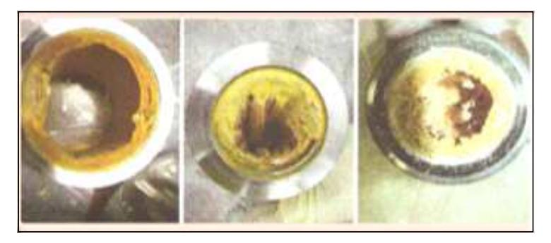

[그림 3-2] Powder Trap 미적용 시 Pumping line 내부 모양

(마) Powder Trap은 상기 이유로 인해

- 1) 포집 능력이 우수해야 한다. 즉, 미반응 gas가 Pumping line 및 Vacuum pump 에 그대로 들어가서 그 내부에 Powder성 부산물(By-product)이 생성되지 못하 도록 대부분을 Trap 내부에서 포집할 수 있어야 한다.
  - 2) 따라서 Heating 온도 Control이 우수해야 하며 냉각장치의 구조 등이 포집효 율이 최대화될 수 있게 설계되어 있어야 한다.
- 3) Trap은 빈번한 Overhaul이 필요하므로 필히 보수유지가 쉽도록 해체, 조립 등 이 쉽게 제작되어야 한다.

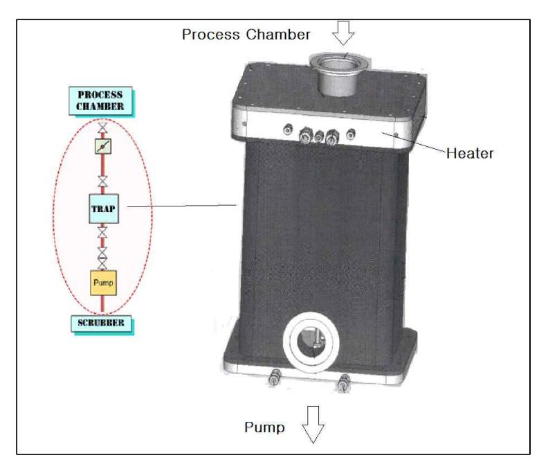

[그림 3-3] Powder Trap 이 설치된 위치

[그림 3-4] Powder Trap 을 적용했을 때 Pumping line 내부 모양

#### (3) 원리

#### (가) Heating

Process 챔버로부터 Trap 쪽으로 Gas가 들어오는 입구에는 Heater를 장착하여 배 기가스를 400도~ 900도(℃)의 온도 범위로 가열시켜 배기가스에 포함된 미반응 가 스 입자를 활성화시킴으로써 증착을 유도하는 역할을 한다.

#### (나) Cooling

Trap의 Body 내부에는 Plate를 냉각하는 냉각수가 흐르게 되어 있는데 이는 배기가 스를 급속 냉각시켜 배기가스에 포함된 반응부산물을 응축시켜 Plate에 Gas 입자가 Deposition이 되게 하기 위함이다.

즉, 활성화된 미반응 가스는 다수의 증착판들이 다단으로 배치된 포집판들을 zigzag 로 통과하면서 cooling line에 의해 냉각된 포집판들 표면에 배기가스가 포집된다. 아래 그림에서 가장 아랫부분에 있는 육면체 모양이 포집판 이다.

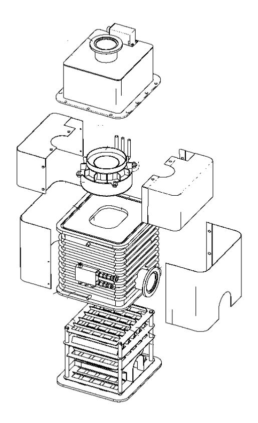

[그림 3-5] Powder Trap의 내부구조

- (4) Powder Trap 적용 효과
  - (가) 반도체, LCD, AMOLED 등 제품의 생산성 증대
  - (나) 반도체, LCD, AMOLED 등 제품의 품질 보증
  - (다) 반도체, LCD, AMOLED 제조 장비의 유지관리비용 절감 효과
- 2. 가스 스크러버(Gas scrubber)에 대해 이해한다.
  - (1) 개요

반도체산업에서 사용되는 가스 스크러버(scrubber)란 반도체 제조공정 중에 발생하는 각종 독성가스 및 산성가스, 가연성가스(SiH4, SiH6, DCS, As3, PH3), 환경 유해가스 (PFC계: SF6, NF3, F4, C2, C3 등)를 정제해 배출하는 장비로 세정방식에 따라 습식 (wet), 건식(dry), 연소식(burn), 흡착식, 플라즈마법 등으로 분류된다. 국내 스크러버 시장은 지난 95년 초 한국 DNS가 국내 최초로 완전 국산화에 성공한 이래 많은 국내 반도체 장비 업체들이 개발에 나서 연간 1천여 대에 이르는 시장을 놓고 각축전을 벌이고 있다. 특히 2009년 4월 세계반도체협의회(WSC)에서의 의결에 따 라 과불화 탄소(PFC) 방출량 10% 감소에 본격적으로 나서면서 이후 전 세계 반도체 제조 업체들과 장비 업체들에게는 스크러버 종류중 PFC 스크러버의 개발이 최대 화두 로 대두되었다.

#### (2) 기존 가스 세정방식의 특징 및 장단점

기존 반도체용 가스 스크러버의 가스 세정방식은 크게 습식, 건식(직접 연소식, 간접 연소식), Plasma Scrubber 등 3가지로 구분할 수 있다.

(가) 습식 스크러버(Wet Scrubber)

습식 스크러버는 수용성 가스들의 처리에 효율적이며 대용량 가스세정에 적합하다 는 점이 특징이다. 그러나 처리효율이 낮고 상대적으로 배관의 부식이 초래된다는 점은 문제점으로 지적된다. 아래 [그림 3-6]과 [그림 3-7]은 Wet Scrubber(습식 가스 스크러버)의 내부 구조이

며 공정 장비에서 공정 후 나온 가스를 중화제 성분의 용액을 이용하여 유해성분 등을 제거 후 외부로 나가게 하는 역할을 한다.

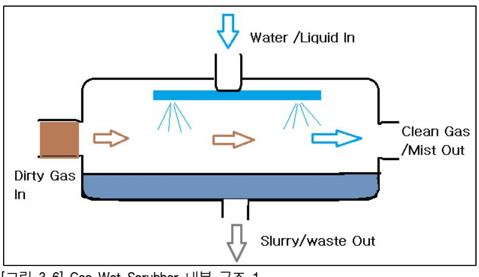

[그림 3-6] Gas Wet Scrubber 내부 구조-1

#### (나) 건식 스크러버 (Burn Dry Scrubber)

아래의 [그림 3-7] Gas Dry Scrubber 내부 구조도는 Burn Dry Scrubber(건식 가스 스크러버)를 뜻하며 공정 장비에서 공정 후 나온 가스를 태워서 유해성분 등을 제 거 후 외부로 나가게 하는 역할을 하며 아래와 같이 2가지 종류가 있다.

#### 1) 직접 연소식

직접 연소식 스크러버는 LPG, 화석연료 등의 연료를 사용해 높은 온도에서 처 리하기 때문에 효율이 크고 일부 PFC 가스도 처리가 가능하다. 반면 이 방식은 질소산화물(NOx) 발생이 많고 유틸리티가 복잡하고 위험하다는 면이 단점이다.

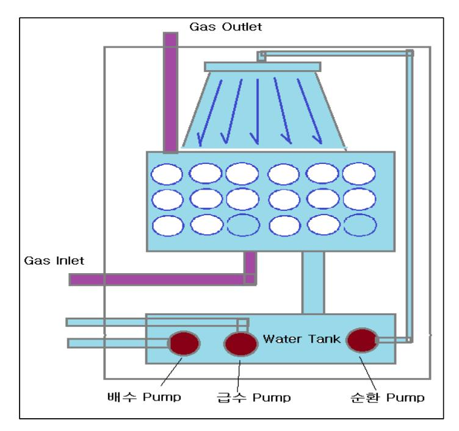

[그림 3-7] Gas Wet Scrubber 내부 구조-2

2) 간접 연소식

간접 연소식 스크러버는 전기 히터를 사용하는 비교적 안정적인 분위기에서 연 속적인 가스 처리가 가능하지만, 히터가 돌발적인 문제를 일으킬 수 있고 할로 겐 가스의 처리가 불가능하다.

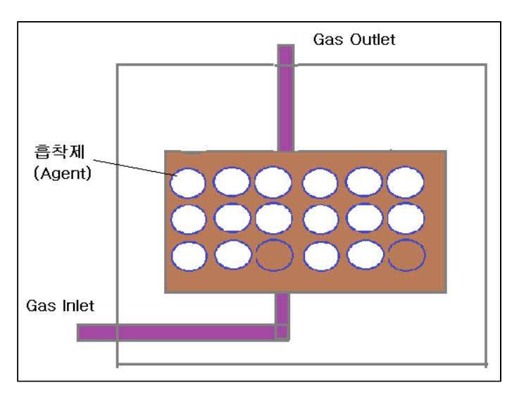

[그림 3-8] Gas Dry Scrubber 내부 구조

(다) 저온 플라즈마식 가스 스크러버

플라즈마 공정기술을 사용한 스크러버는 주로 과불화탄소(PFC)의 세정을 위해 사 용되는데 최근 전 세계 반도체업체들의 PFC 배출 축소결의 등으로 환경 친화형 공 정도입에 대한 관심이 증대되면서 국내 장비 업체들도 대응하는 제품을 개발하였 다. 플라즈마식 스크러버는 미국 리트머스社가 저온 플라즈마를 이용한 PFC 가스 처리기술을 선보인 이후 국내에서도 많은 연구 및 제품화가 진행되고 있는 상황이 다.

이처럼 전 세계가 PFC 가스 배출감소의 필요성을 강조하고 있는 것은 PFC 가스가 매우 높은 지구온난화 함수(GWP: Global Warming Potential)를 지니고 있으며 배출 가스양도 지속적으로 늘고 있기 때문이다. 또한, 이러한 이유로 대기(大氣)의 수명 을 증대시키고자 하는 것도 중요한 이유이다.

저온 플라즈마식은 저압의 전원을 방전시켜 그 사이로 유해가스를 통과시켜 분해 하는 방식으로 크게 연소식, 극초단파식(Microwave), ICP식, RTT식 등으로 분류할 수 있다. RTT타입 저온플라즈마 가스 스크러버의 유해가스 제거효율을 나타내는데 CHF3와 CF4를 대상으로 실험한 결과 플라즈마를 작동시켰을 경우와 그렇지 않았 을 경우의 차이가 확연히 나타났다. 프라즈마를 작동시켰을 경우 유해가스의 제거 율은 최대 89%에 달했다.

고온 플라즈마식 스크러버는 저온 플라즈마식과 달리 고압의 직류전원을 이용해 연속적인 방전을 일으키고 그 사이로 처리대상 가스를 흘림으로서 이를 분해 처리 하는 방식이다. 이러한 고온 플라즈마식은 기존 방법으로 처리할 수 없었던 PFC 가스도 90% 이상 처리할 수 있다는 점이 큰 장점이다.

구체적으로 PFC 가스를 고온 플라즈마 장치에 투입하면 연소실 내에서 PFC 가스 는 플라즈마에 의해 C+, C, F-, F2, H+, H, OH-, N, N+, N2 등으로 변환된다. 이 를 별도의 흡수제를 통해 흡수하면 세정이 완료되는 것이다.

② 반도체용 공정 가스는 고순도를 필요로 하기 때문에 가스제조업체에서는 고품질화(가스의 고순도화, 품질의 안정화, Particle-less 등을 위하여 많은 노력을 기울이고 있다. 구체적으 로 어떠한 Spec 으로 관리하는지에 대해서 알아본다.

#### 수행 tip

- 반도체 가스 제조공정에 대한 문제점을 이해한다.
- •점검 포인트를 설정해본다.

# **3-2.** 가스 제조 파라미터 파악 및 적용

학습 목표 • 반도체 가스 재료별 제조(공정/장비) 파라미터를 파악하고 적용할 수 있다.

#### 필요 지식 /

 가스 제조 과정 가스 제조 과정은 아래의 그림과 같다.

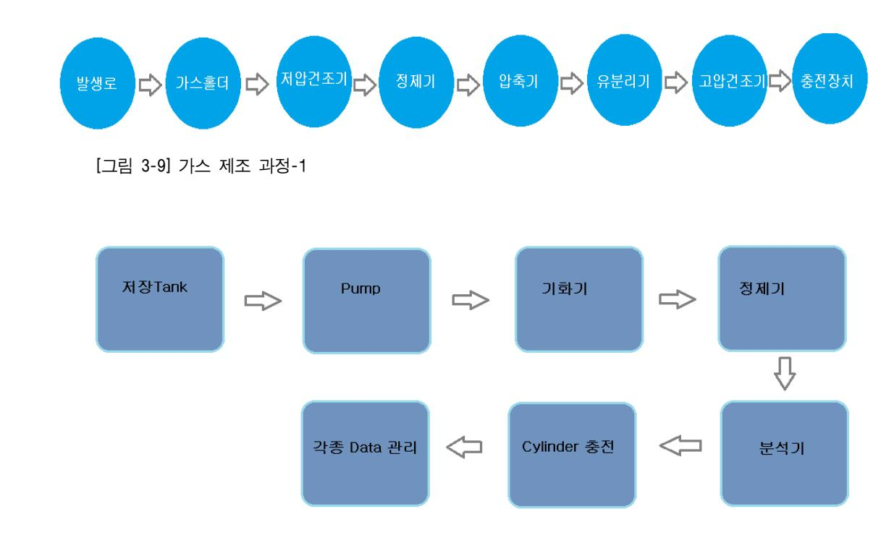

[그림 3-10] 가스 제조 과정-2

1. 발생로 (반응기 ; REACTOR )

자연계에서는 항상 반응이 일어나고 있다. 식물의 광합성, 사람의 위 속에서의 소화과정을 비롯하여 자동차 엔진에서의 연료의 연소 등 주변의 모든 현상이 반응 현상이라고 할 수 있겠다. 하지만 여기에서 다루는 반응은 필요한 반응을 효과적이고 주변의 불순물이나 영 향을 받지 않기 위하여 원하는 반응만이 효율적으로 이뤄지도록 공간을 제공하는데 그러 한 공간을 반응기라고 할 수 있겠다. 반응기에는 원자력 발전소의 핵반응기, 반도체 에칭 공정의 진공 챔버, 정유공장의 반응탑

등이 주변에서 쉽게 소식을 접할 수 있는 반응기의 대표적인 경우라고 할 수 있겠다.

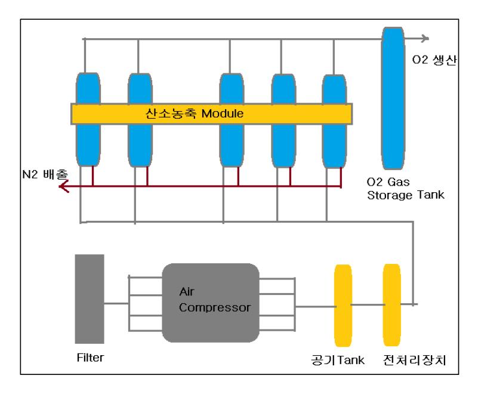

[그림 3-11] 산소 발생장치

반응 파라미터

순수한 가스를 얻기 위해서는 다음과 같은 파라미터를 활용할 수 있다. 1. 장치 파라미터

장치를 구성하는 파라미터로 저장용기, 반응용기, 연결배관, 제어밸브, 안전밸브, 무게, 제 어방식 등이 있다. 2. 제어 파라미터

장치 운전을 위한 파라미터로 이후 공정 파라미터를 통한 장치의 생산성과 성능을 결정하 는 요소가 된다.

(1) 기계적 제어

기계적 구동을 제어하는 것으로 구동 모터, 구동 밸브 등의 제어

(2) 피드백 제어

연속공정에서 센서와 구동부를 연계시켜서 생산 유체의 상태(온도, 유속, 성분)를 제어 하는 것

3. 반응 파라미터

반응의 직접성을 제어하는 것으로 반응의 요소를 기계 및 제어 파라미터를 통제하여 반응 성을 제어하는 것으로 장비 모델에 따라서 레시피 등으로 관리되기도 한다.

- (1) 온도
- (2) 재료의 배합량
- (3) 압력

69

#### 수행 내용 / 가스 제조 파라미터 파악 및 적용하기

#### 재료·자료

- Ÿ 외부 가스 유입에 대한 테스트 자료
- Ÿ 인화성 가스 시료
- Ÿ 가연성 도표에 작성에 자료

#### 기기(장비 ・ 공구)

- Ÿ 외부 가스 유입 가연성 실험 KIT(장비)
- Ÿ 온도 및 압력 측정 및 기록장치
- Ÿ 압력 조절용 진공 및 가압 펌프

#### 안전 ・ 유의 사항

- Ÿ 폭발 및 연소 반응에 대한 방호
- Ÿ 압력 제어용 펌프의 취급
- Ÿ 정밀 측정기기의 취급

#### 수행 순서

가스 제조과정을 구체적으로 파악한다. 1. 가스 정제기(Purifier)에 대해 이해한다.

(1) 가스의 압력을 변화시켜 흡착과 탈착을 반복함으로써, 원하는 가스를 분리 정제하는 방법을 말한다. 즉, 압력이 높을수록 단위흡착제에 대한 흡착량이 많다. 반대로 압력이 낮 을수록 흡착량이 적다. 이 원리를 이용하여 상온의 등온선상에서 흡탈착을 행하게 된다. 또한, 온도가 낮을수록 단위흡착제에 대한 흡착량이 많다. 반대로 온도가 높을수록 흡착량 이 적다. 이 특성을 이용하여 상온과 고온에서의 2개의 흡착 등온선 사이에 상하 직선에 의해 흡탈착이 이루어진다. [그림 3-12]를 참조한다.

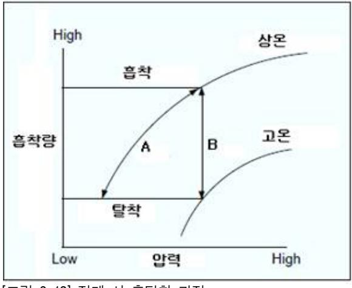

[그림 3-12] 정제 시 흡탈착 과정

(2) 가스 분리시스템에서는 분리대상 가스에 따라 각종 흡착제가 달리 사용되며 흡착제 재료의 종류는 다음과 같다.

N - CMS (Carbon Molecular Sieve)

O - 합성 Zeolite

H - CMS (Carbon Molecular Sieve), 합성Zeolite

(3) O 가스 정제를 예를 들면 필터를 통해 제진된 원료공기는 공기블로워로 약 0.039MPaG까지 가압 되어 흡착조로 보내진다. 조 안으로 충진되는 합성제오라이트에 의 해, 질소/수분 및 탄산가스가 흡착되어 산소가 상부에서 발생한다. 이 공정을 흡착공정이 라 하고, 이 공정이 완료된 시점에 진공펌프에서 약 200Torr(약 0.027MPa)까지 감압 되어 흡착성분을 탈착하는 공정이 된다. 이와 같이 흡착조에서 흡착/탈착의 각 공정을 약 30초 마다 반복하여 연속적으로 90%~95%의 산소를 발생시키게 된다.

 결과의 해석과 보고서의 작성방법에 대해 이해한다. 외부로의 유출이나 외부로부터의 유입을 예방하기 위하여 점검항목과 점검 포인트를 설정 하여 정기 또는 비정기적 점검을 진행해야 한다. 1. 시설점검표

공장 시설에 대한 점검 포인트 선정 생산 시설에 대한 점검 포인트 선정 보호 및 방호 시설에 대한 점검 포인트 선정

#### 2. 프로세스점검표

메인공정 진행 상태의 점검 포인트 선정 긴급 상황에 대한 바이패스 라인 점검 포인트 선정 정비 부분에 대한 점검 포인트 선정 PID 상에서 벨브 및 기기 접촉 부분은 점검 포인트 선정

#### 수행 tip

- •가스 정제에 대한 문제점을 이해한다.
- ●점검 포인트를 설정해본다.

# **3-3.** 도출된 문제점에 대한 해결방안 강구

학습 목표 • 반도체 가스 재료별 제조공정의 도출된 문제점에 대한 해결방안을 제시할 수 있다.

#### 필요 지식 /

반도체용 초고순도가스 특수가스 제조 (Ultra High Purity Gases for Semiconductors)

공장 운전에 대하여 ; 안전

가스 제조 연속공정에서 안전에 대한 문제는 사람과 환경에 중요한 영향을 미치므로 생산 과정에서 필요한 주의를 충분히 기울여야 한다. 1. 유독 물질 혼합에 대한 모델링

본 텍스트에서는 가스의 유출에 대해서만 고려한다.

- (1) 가스의 유출에 대한 문제
  - As, P 등 맹독성 기체의 유출
  - Silane 등 발화성 기체의 유출
  - 기타 인체 및 환경 유해물질의 유출
- (2) 외부 가스 유입에 대한 문제

반응 및 보관 탱크에 외부 가스가 혼합되어 들어오는 경우가 일반적이다. 2. 생산 제품 품질 문제에 대한 문제 모델링

외부 Gas 및 불순물이 가스 반응 회로 내부로 포함되어 들어가면 반도체 재료의 경우 순 도에 대한 부분에 치명적인 품질 저하를 가져올 가능성도 있다.

공정위험 점검 ; 점검표

공정을 진행 하는 데 있어서 점검해야 할 항목을 정리해서 주기적인 점검을 해야 한다. 1. 시설점검표

- - 공장 시설에 대한 점검
  - 생산 시설에 대한 점검
  - 보호 및 방호 시설에 대한 점검
- 2. 프로세스점검표
  - 메인공정 진행 상태의 점검
  - 긴급 상황에 대한 바이패스 라인 점검

- 정비 부분에 대한 점검
- PID 상에서 밸브 및 기기 접촉 부분은 점검 포인트로 봐야 한다.

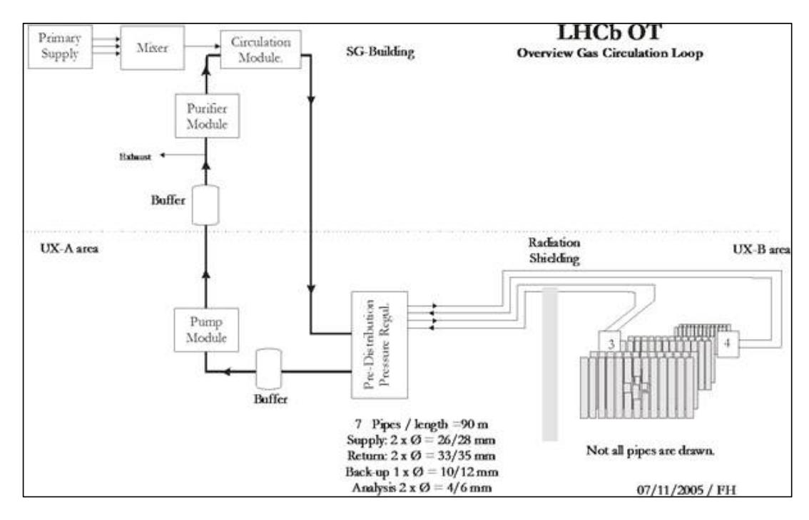

[그림 3-13] 가스 제조 계통도

- 3. 검사결과 확인과 분석
  - 검사 결과의 확인 및 현장 확인
- 4. 검사결과 판정에 대한 대응
  - 대응 여부의 판단
  - 대응 범위의 판단
  - 대응 시기의 판단
  - 정비 및 보완 결과확인을 위한 테스트 진행

#### 수행 내용 / 도출된 문제점에 대한 해결방안 강구하기

#### 재료·자료

- Ÿ 외부 가스 유입에 대한 테스트 자료
- Ÿ 인화성 가스 시료
- Ÿ 가연성 도표에 작성에 자료

#### 기기(장비 ・ 공구)

- Ÿ 외부 가스 유입 가연성 실험 KIT(장비)
- Ÿ 온도 및 압력 측정 및 기록장치
- Ÿ 압력 조절용 진공 및 가압 펌프

#### 안전 ・ 유의 사항

- Ÿ 폭발 및 연소 반응에 대한 방호
- Ÿ 압력 제어용 펌프의 취급
- Ÿ 정밀 측정기기의 취급

#### 수행 순서

- 가스 유입, 유출에 대한 상황을 시뮬레이션해본다. 정해진 조건에서 공기의 유입으로 인한 위험을 확인해본다. 1. 외부 가스 유입에 대한 문제
  - 반응 및 보관 탱크에 외부 가스가 혼합되어 들어오는 경우가 일반적이다. 가스의 유출에 대한 문제 (1) As, P 등 맹독성 기체의 유출 (2) Silane 등 발화성 기체의 유출
    - (3) 기타 인체 및 환경 유해물질의 유출

- 2. 가연성 실험 KIT를 설치하여 실험상황을 모니터링 한다.
  - (1) 실험방법

KIT의 내부를 압력 조건과 온도 조건을 설정하여 내부에 탱크 내부의 물질을 상징할 수 있는 물질을 넣고 점화 또는 반응을 유도하고, 내용을 모니터하고 계측 장비로 계 측 기록한다.

- (가) 압력에 대한 조건
  - 0.5ATM
  - 1.0ATM
  - 1.5ATM
  - 2.0ATM
- (나) 온도에 대한 조건
  - 기화온도 이하
  - 기화온도 이상
  - 인화온도 이상
  - 기타 필요한 온도 포인트
- (2) 관련 데이터

다음의 표는 반도체 공정 가스와 허용농도 (표 3-6), 반도체 공정별로 본 가스의 특징 (표 3-7)을 각각 나타내고 있으며 가연성 등의 실험 때 참고자료로 유용하게 사용할 수 있다. 특히 반도체 공정 가스와 허용농도 (표 3-6)에서는 다음과 같은 내용을 포함 하고 있으며 맹독성 가스를 미세량 흡입 시 인체에 허용되는 한계를 수치적으로 나타 내 주고 있다.

(가) TLV(Tolerance Limit Value)

ACGIH-1978(American Conference of Governmental Industrial Hygienists 1978)에서 제정된 시간 가중 평균농도이며 하루 8시간의 평균허용농도이다. 가스의 경우 ppm, 먼지형인 때 공기 1m3 중의 수치로 표현한다.

(나) TWA(Time Weighted Average)

1일 8시간 작업을 기준으로 하여 유해요인의 측정치에 발생시간을 곱하여 시간으 로 나눈 값을 말한다.

(다) 최고 노출 기준(C)

근로자가1일 작업시간 동안 잠시라도 노출되어서는 안 되는 기준을 말하며 노출 기준 앞에 'c'를 붙여 표시한다.

#### <표 3-6> 반도체 공정가스와 허용농도

| 공정        | 가스명     | 분자식                     | 허용 농도 (TLV치) *(가) | 노출 기준 (TWA)*(나), (다) |
|-----------|---------|-------------------------|----------------------|-------------------------|
|           | 염소      | $Cl_2$                  | 1                    | 1 (노동부고시)               |
|           | 염화수소    | HCI                     | 5                    | C5 (노동부고시)              |
|           | 3염화붕소   | BCl 3        | 5                    |                         |
|           | 불소      | $F_2$                   | 0.1                  | 0.1 (노동부고시)             |
|           | 4염화규소   | ${ m SiCl}_4$           | 5                    |                         |
|           | 브롬수소    | HBr                     | 3                    | C3 (노동부고시)              |
|           | 6 불화유황  | $SF_6$                  | 1000                 | 1000 (노동부고시)            |
|           | 불화메탄    | $\mathrm{CHF}_3$        | 3                    |                         |
| ETCH      | 4염화탄소   | $CCIF_4$                | 10                   |                         |
|           | 3불화염소   | $CIF_3$                 | 3                    |                         |
|           | 3불화질소   | $NF_3$                  | 10                   |                         |
|           | 불화수소    | HF                      | 3                    | C3 (노동부고시)              |
|           | 4 불화규소  | ${\sf SiF}_4$           | 3                    |                         |
|           | 프레온12   | $CCL_2F_2$              | 3                    |                         |
|           | 4브롬규소   | ${\sf SiBr}_4$          | 3                    |                         |
|           | 브롬불화탄소  | $CF_3Br$                | 3                    |                         |
|           | 8 불화프로판 | $C_3F_8$                | 3                    |                         |
|           | 시란      | ${\sf SiH}_4$           | 0.5                  |                         |
|           | 디시란     | ${\sf Si}_2{\sf H}_6$   | 0.5                  |                         |
|           |         | $S_2H_6$                | 0.1                  |                         |
| PECVD     | 포스핀     | $PH_3$                  | 0.3                  | 0.3 (노동부고시)             |
|           | -       | TEOS                    | 10                   |                         |
| LPCVD     | 디클로로시란  | ${\sf SiH}_2{\sf Cl}_2$ | 5                    |                         |
|           | 4불화탄소산소 | $CF_4/O_2$              | 3                    |                         |
|           | 6불화에탄산소 | $C_2F_6/O_2$            | 3                    |                         |
|           | 불화텅스텐   | WF 6         | 0.75                 |                         |
|           | 아르신     | ASH 3        | 0.05                 | 0.05 (노동부고시)            |
| IMPLANTER | 포스핀     | PH 3         | 0.3                  | 0.3 (노동부고시)             |
|           | 3 불화붕소  | $BF_3$                  | 1                    | C1 (노동부고시)              |

<표 3-7> 반도체공정별로 본 가스의 특징

| 공 정               | 공정별 가스                                                                                                              | 부산물 배기처리 문제                                                                                                                                                    | 분자식                                                                | 가스 특징                        |
|-------------------|---------------------------------------------------------------------------------------------------------------------|----------------------------------------------------------------------------------------------------------------------------------------------------------------|--------------------------------------------------------------------|---------------------------------|
| Etch Metal     | $Cl_2/BCl_3/SiCl_4$ $CHF_3/SF_6$                                                                                 | <ul> <li>기체응고에 의한 Exhaust Blockages 수증기에 의한 Powder 발생</li> <li>Toxic halogenated organic 에 의한 부식 및 by-products,</li> <li>Dry 가스 처리시스템 사용 요망</li> </ul> | $Cl_2$ SiCU BCl_3 SF_6                                    | T,C T,C T,C T,C T,A |
| Poly              | $HBr/Cl_2/NF_3/SF_6$                                                                                                | - 유독성 부산물에 의한 강한 부식성 생성 - 수증기에 의한 부식성 증가 - Dry 가스처리 시스템 사용요망                                                                                             | ${\sf HBr} \ {\sf Cl}_2 \ {\sf NF}_3 \ {\sf SF}_6$                 | T,C T,C T,O T,A        |
| Nitride           | $HBr/NF_3/SF_6$                                                                                                     | - 유독성 부산물에 의한 강한 부식성 생성 - 수증기에 의한 부식성 증가 - Dry 가스 처리시스템 사용요망                                                                                             | ${\sf HBr} \\ {\sf NF}_3 \\ {\sf SF}_6$                            | T,C T,O T,A               |
| Oxide             | $CHF_3/NF_3$ $CF_4C_2F_6$                                                                                        | <ul> <li>유독성 부산물 처리기능 요망</li> <li>Dry 가스 처리시스템 사용요망</li> <li>Global Warming Gases(C2F2) 처리기능 요망</li> </ul>                                                 | ${ m NF}_3$ CHF $_3$ C2F $_6$                                | T,O A GW                  |
| Tungsten          | $\text{Cl}_2/\text{SF}_6$                                                                                           | - 유독성 과부식성의 부산물 생성 - 부착, 퇴적에 의한 문제점 - Dry 가스처리 시스템 사용 요망                                                                                                 | $\begin{array}{c} {\rm Cl}_2\\ {\rm SF}_6\end{array}$              | T,C T.A                      |
| PECVD BPSG     | TOES/ TMB/ TMP/ $N_2O/$ C $_2F_6/$ NF $_3$ (clean)                                                                  | <ul> <li>화재 가능성 가스</li> <li>상반되는 가스를 계속적으로 사용</li> <li>예) SiH4 / NF3</li> <li>화재 발생과 유독가스 처리 요망</li> </ul>                               | ${\sf NF}_3$ ${\sf C}_2{\sf F}_6$                               | T,O GW                       |
| Oxide/ Nitride | SiH 4 / NH 3 / N 2 O C 2 F 6 / NF 3 (clean) | - 화재 가능성 가스 - 상반되는 가스를 계속적으로 사용 예) SiH 4 / NF 3                                                                                    | $\begin{array}{c} SiH_4\\ NF_3\\ C_2F_6 \end{array}$               | P,T Y,O GW                |
| Tungsten          | ${ m WF}_6/{ m SiH}_4/{ m NF}_3$                                                                                    | <ul> <li>화재 가능성 가스</li> <li>상반되는 가스를 계속적으로 사용</li> <li>예) SiH4 / NF3</li> </ul>                                                          | ${f WF}_6$ SiH $_4$ NF $_3$                                  | 0,C, P,T T,O              |
| LPCVD Nitride  | DCS/ NH 3                                                                                                | - 기체응고에 의한 Exhaust blockage - 고체생성물질 및 DCS, Chlorides 처리기능 필요                                                                                            | $\begin{array}{c} {\rm Cl}_2\\ {\rm SiH}_2 {\rm Cl}_2 \end{array}$ | T,C T,C                      |
| Poly              | SiH 4                                                                                                    | - 혼합된 가스에 의한 화재 발생 가능                                                                                                                                          | $SiH_4$                                                            | P,T                             |
| Doped             | TOES/ TEAs TOES/ TEAs+CIF 3 Clean                                                               | - 혼합된 가스에 의한 화재 발생 가능 :가연성, P:자연발화성, O:산화제 GW: Global Warming                                                                                               | $\mathrm{PH}_3$                                                    | P,T                             |

T:유독성, C:부식성, A:질식성, F:가연성, P:자연발화성, O:산화제 GW: Global Warming Gas

 결과 해석 보고서를 작성한다. 외부로의 유출이나 외부로부터의 유입을 예방하기 위하여 점검항목과 점검 포인트를 설정 하여 정기 또는 비정기적 점검을 진행해야 한다. 1. 시설점검표

- - 공장 시설에 대한 점검 포인트 선정
  - 생산 시설에 대한 점검 포인트 선정
  - 보호 및 방호 시설에 대한 점검 포인트 선정
- 2. 프로세스점검표
  - 메인공정 진행 상태의 점검 포인트 선정
  - 긴급 상황에 대한 바이패스 라인 점검 포인트 선정
  - 정비 부분에 대한 점검 포인트 선정
  - PID 상에서 밸브 및 기기 접촉 부분은 점검 포인트 선정

수행 tip

- 외부로부터의 불순물 유입의 문제점에 대해 알아본다
- 점검 포인트를 설정해본다.

#### 학습3 교수·학습 방법

#### 교수 방법

- 반도체 가스 제조 공정 기술에 대한 이론적 지식을 충분히 설명한다.
- 반도체 가스 제조공정을 쉽게 설명한다.
- 디스플레이 박막 제조공정을 쉽게 설명한다.
- 반도체 제조공정용 동영상을 통해 시청할 수 있도록 한다.
- 교수 주도로 현장에서 표준화한 공정 매뉴얼과 관련 공정 재료에서 제공되는 자료 등의 내용을 PPT 자료로 제시한 후에 설명한다.
- 가능한 한 사전에 제조 현장에서 사용하는 사례를 수집하여 자료를 준비하고 이해하기 쉬운 방법을 논의하는 방식의 문제 해결식 수업을 하도록 한다.
- 가스 종류에 대한 상세한 이론 강의와 실습을 병행하여 학생의 이해를 높여야 한다.
- 장비에 대한 실습이 불가능할 경우 동영상 및 시청각 강의 자료를 활용하여야 한다.
- 가스 공정 및 종류에 대해 기술적 토론을 유도하고 발표하여 이해하도록 해야 한다.

#### 학습 방법

- 생산에 필요한 가스 공정 파악을 스스로 점검하고 알려는 적극적인 태도를 가져야 한다.
- 고객의 요청에 적극적인 수용 태도로 스스로 점검하고 알려는 자세를 가져야 한다.
- 새로운 기술에 대한 학습 자세를 스스로 점검하고 알아야 한다.
- 최신 반도체 기술 동향 파악 능력을 스스로 점검하고 알려는 태도를 지녀야 한다.
- 최신 반도체 시장 동향 파악 능력을 스스로 점검하고 알려는 태도를 지녀야 한다.
- 가스 품질을 이해할 수 있도록 공정에 이용되는 가스 종류에 대해 알려는 태도를 지녀야 한다.
- 가스의 품질에 문제없도록 신뢰성 항목 부분에 대해 알려는 태도를 지녀야 한다.

## 학습3 평 가

#### 평가 준거

- 평가자는 피평가자가 수행 준거 및 평가 내용에 제시되어 있는 내용을 성공적으로 수행할 수 있는지를 평가해야 한다.
- 평가자는 다음 사항을 평가해야 한다.

| 학습 내용                     | 평가 항목                                            | 성취수준 |   |   |
|---------------------------|--------------------------------------------------|------|---|---|
|                           |                                                  | 상    | 중 | 하 |
| 공정별 장단점 파악             | 반도체 가스의 제조 공정별 장단점을 파악할 수 있다.                    |      |   |   |
| 가스 제조 파라미터 파악 및 적용  | 반도체 가스 재료별 제조(공정/장비) 파라미터를 파악하 고 적용할 수 있다.    |      |   |   |
| 도출된 문제점에 대한 해결방안 강구 | 반도체 가스 재료별 제조 공정의 도출된 문제점에 대한 해결방안을 제시할 수 있다. |      |   |   |

#### 평가 방법

• 서술형시험

| 학습 내용                     | 평가 항목                                        | 성취수준 |   |   |
|---------------------------|----------------------------------------------|------|---|---|
| 러답 네중                     |                                              | 상    | 중 | 하 |
| 공정별 장단점 파악             | - 반도체 가스의 제조 공정별 장단점 파악                      |      |   |   |
| 가스 제조 파라미터 파악 및 적용  | - 반도체 가스 재료별 제조(공정/장비) 파라미터 파악 및 적용       |      |   |   |
| 도출된 문제점에 대한 해결방안 강구 | - 반도체 기스 재료별 제조 공정의 도출된 문제점에 대 한 해결방안의 제시 | 0    |   |   |

#### • 사례연구

| 학습 내용                     | 평가 항목                                       |   | 성취수준 |   |  |
|---------------------------|---------------------------------------------|---|------|---|--|
| 러남 네중                     |                                             | 상 | 중    | 하 |  |
| 공정별 장단점 파악             | - 반도체 가스의 제조 공정별 장단점 파악                     |   |      |   |  |
| 가스 제조 파라미터 파악 및 적용  | - 반도체 가스 재료별 제조(공정/장비) 파라미터 파악 및 적용      |   |      |   |  |
| 도출된 문제점에 대한 해결방안 강구 | - 반도체 가스 재료별 제조 공정의 도출된 문제점에 대한 해결방안의 제시 |   |      |   |  |

#### • 평가자 체크리스트

| 학습 내용                     | 며기 친모                                       | 성취수준 |   |   |
|---------------------------|---------------------------------------------|------|---|---|
| 역급 대 <del>용</del>         | 평가 항목                                       |      | 중 | 하 |
| 공정별 장단점 파악             | - 반도체 가스의 제조 공정별 장단점 파악                     |      |   |   |
| 가스 제조 파라미터 파악 및 적용  | - 반도체 가스 재료별 제조(공정/장비) 파라미터 파악 및 적용      |      |   |   |
| 도출된 문제점에 대한 해결방안 강구 | - 반도체 기스 재료별 제조 공정의 도출된 문제점에 대한 해결방안의 제시 |      |   |   |

#### 피드백

| 1 | 서술형시험 |  |
|---|-------|--|
|   |       |  |

- 평가 결과에 대한 일정 점수 누락에 해당하는 학생은 재평가를 통하여 학습을 이수할
   수 있도록 지도한다.
- 2. 사례연구
- 학습한 내용이 효과적으로 전달되지 않은 경우에는 발표방법에 대한 추가 지도를 수행 한다.
- 3. 평가자 체크리스트
- 평가 결과, 일정 점수 이하인 학생들은 추가 학습 후, 결과를 제출하도록 한다.

| 학습 4 | 반도체용 가스 제품특성 검증하기 (LM1903060403_14v1.4) |
|------|--------------------------------------------|
| 학습 3 | 반도체용 가스 제조하기(LM1903060403_14v1.3)          |
| 학습 2 | 반도체용 가스 재료 선정하기(LM1903060403_14v1.2)       |
| 학습 1 | (LM1903060403_14v1.1)                      |
| 히스 네 | 반도체용 가스 재료 요구사항 파악하기                       |

## 4-1. 반도체 공정가스의 제품특성 검증

|       | ●반도체 공정 가스의 분석 시 문제점에 대한 해결방안을 제시할 수 있다. |
|-------|------------------------------------------|
| 학습 목표 | ●반도체 공정 가스의 시험 시 문제점에 대한 해결방안을 제시할 수 있다. |
| 의급 속표 | ●반도체 공정 가스의 평가 시 문제점에 대한 해결방안을 제시할 수 있다. |
|       | ●반도체 공정 가스의 검증 시 문제점에 대한 해결방안을 제시할 수 있다. |
|       |                                          |

## 필요 지식 /

- 반도체 가스 분석 및 시험
   먼저 반도체 가스 제조 공정 원리를 이해하고, 공정별 재료에 사용되는 가스의 문제점 및 공정을 알아야 한다.
- 2 분석 시 문제점

분석화학이란 물질의 화학적 특성과 대상물이 무엇이(정성적) 어느 정도 있는지(정량적)에 대한 질문에 대한 답이라고 할 수 있다. 이 두 가지는 화학물질의 품질에 대한 중요한 포 인트라고 할 수 있다. 분석에 있어서 통상적으로 분석에 있어서 문제점으로 인식되는 부분 은 통상 다음과 같은 부분이 있다.

1. 분석작업자

상당한 종류의 계측 및 측정기기는 고도의 전문성과 숙련도를 필요로 하게 되고 그에 따 른 교육과 숙련과정을 필요하게 된다.

(1) 전문성

반도체 재료뿐만 아니라 반도체 산업에서 사용되는 많은 종류의 계측 및 측정기기는 전문적인 지식이 필요하다. 대표적으로 아래와 같은 측정과 계측 방법이 있다.

- (가) 분광화학법
- (나) 원자분광법
- (다) 크레마토그래피
- (라) 전위차법
- (2) 숙련도

상기 방법을 포함하여 측정과 계측에는 일정 정도의 숙련도를 필요하다. 2. 분석 장비

분석 요구사항에 대해서 대응 할 수 있는지에 따른 분석 장비의 능력을 확인해야 한다.

(1) 분석능력

각종 분석이 가능한지에 대한 장비의 능력을 뜻한다. 분석 작업 전에 필히 해당 분석기가 분석 능력이 있는지 확인할 필요가 있다.

(2) 분석능력의 일관성 : 교정

장비는 일정 시간이 지나면 기능의 저하와 교정 포인트의 변경 현상이 일어날 수 있 다. 따라서, 공인된 기관을 통하여 일정 기간마다 계측성능을 확인하는 것을 법이나 규 칙으로 규정하는 경우가 많다. 품질관리의 대표적인 인증인 ISO에서는 생산에 사용되 는 계측 장비의 정기적인 검정 및 교정은 가장 중요한 항목 중 하나로 선정되어 있다. 3. 분석샘플

대상물의 구성물과 불순물의 구성이 무엇인지 확인하는 분석에 있어서 풀기 어려운 딜레 마는 대상물 전체를 실시간으로 검사할 현실적 방법이 없다는 것이다. 그에 따라서 샘플 의 채취방법, 장소, 시간에 따른 편차를 고려할 수밖에 없는 상황이다. 그 때문에 경우에 따라서 표준 샘플이나 채취방법을 표준화하는 방법이 보완적으로 도입되어 있기도 하다.

- 관련 분석기 List
  - 1. FT-IR 분석기
    - (1) 특징
      - (가) 다양한 종류의 Gas Cell을 이용한 다양한 농도의 Gas를 정량, 정성분석 (1cm, 10cm, 15cm, 4m, 6m, 10m, 20m)
      - (나) HF, HBr, HCl등의 부식성 Gas의 분석에도 사용 가능
      - (다) 고온 가스의 응축을 막기 위해 Gas Cell 250℃까지 가열 가능
      - (라) Real Time으로 정량 Data를 얻을 수 있음

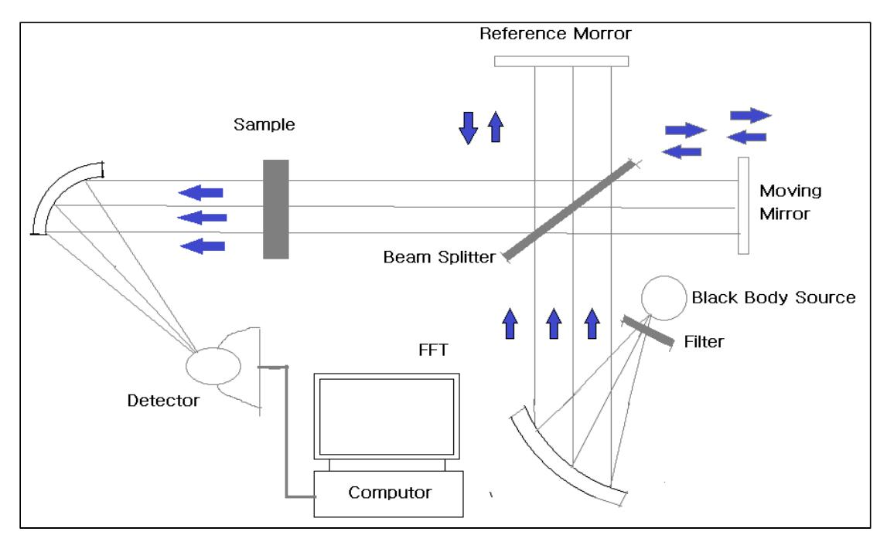

[그림 4-1] 반도체 및 산업용 FT-IR

(2) 적용응용분야

- (가) CVD, Etch, diffusion 공정의 on-line Monitoring
- (나) Scrubber의 효율 평가
- (다) 이동 차량에 장착하여 현장에서 대기 Gas 분석
- (라) Stack Gas 분석
- (마) 반도체 Gas 등의 부식성 Gas의 정량, 정성 분석
- (바) 촉매 개발을 위한 NOx , SOx , NH3 동시 분석
- (사) 연소 시 발생되는 Toxic 가스의 정량 정성 분석
- (아) 특수 Gas 중 Moisture ( $H_2O$ )를 ppb 정량 분석
- 2. High Purity Gas Analysis System (고순도 가스 분석기)
  - (1) 특징
    - (가) 20 Meter Gas Cell을 이용한 ppm ~ ppb 단위의 Gas 정량, 정성 분석
    - (나) 고순도 반도체 가스 중 Impurity 분석
    - (다) 고온 가스의 응축을 막기 위해 Gas Cell 250℃까지 가열 가능
    - (라) 4 Meter, 6 Meter, 10 Meter, 20 Meter Micro Cell 적용 가능
  - (2) 적용 응용 분야
    - (가) 반도체 가스의 불순물 분석 (HF, HCl, HBr, Cl2, C4F6, C2F6, SF6)

- (나) 배기가스 분석 (NO, NO2, SO2, NH3, HCl, HBr. Hydrocarbon 등)
- (다) 고순도 가스 중 ppb 단위의 수분 분석
- (라) 촉매 개발을 위한 SCR 공정 분석
- (3) Fab Gas Monitor System (반도체 생산현장 가스 누출 감지 장치)
  - (가) 특징 및 용도
    - 1) FAB 내부의 누설 가스 감시 (예:C4F6)
    - 2) 20 Meter Cell 적용
    - 3) 연속제어 기능
    - 4) 고온 가스의 응축을 막기 위해 Gas Cell 250℃까지 가열 가능
    - 5) Peripheral Device 적용, 다양한 부가 장치 설치
    - 6) 경보 기능
    - 7) 실시간 Gas 모니터링
    - 8) 46 Port Sampling point들의 연속 Monitoring
    - 9) Clean Room Monitoring

#### ④ 시험 및 평가 시 문제점

재료를 사용하기 전에 시험과 평가를 진행 하는 데 있어서 회사나 생산방식마다 차이는 있으나 대략 구분해보면 다음과 같은 과정을 진행하게 된다.

1. 시험

완전 적용 전에 적용 가능성 여부에 대한 시험을 단계별로 진행한다.

(1) 선행적 적용

생산 공정 적용에 앞서 연구소나 실험실에서 시험을 진행한다.

(2) 부분적 적용

양산적용 전에 웨이퍼 한 장 또는 한 Lot(대략 25장)을 적용해서 전후 공정과의 영향 성을 시험해본다.

(3) 양산적용 시험

전면적용 전에 하루 생산량 또는 일정 기간의 생산량에 적용해서 전 후 공정과의 영 향성과 최종 제품까지 생산해서 시험을 진행한다.

2. 평가

각 단계별 시험에 대한 평가를 진행하여 적용 가능성이 평가에서 확인되어야 다음 단계로 의 시험과 평가가 진행된다.

검증 시 문제점

검증은 시험과 평가에 대한 결과를 확인하여 일관성을 확보하는 작업이라고 생각할 수 있다. 1. 실험실 검증

실험실에서 만들 수 있는 조건을 형성하여 제품의 성능과 단계별 성능을 확인할 수 있도 록 한다.

2. 가속 및 가혹 실험 (가혹스트레스에 대한 내력 평가)

각 진행 단계별 특성을 확인할 수 있도록 하는 검증 실험을 진행한다. 예를 제시하면

- (1) 환경적 조건
  - (가) 온도 : -45℃ 이하, 70℃ 이상 등의 조건을 설정하여 진행

(나) 진동 등 사용환경 : 해당상황에 맞추어 평상보다 과도한 진동, 취약부위 환경, 복합 환경 등에 노출상태로 진행

(다) 구동 속도 : 해당상황에 맞추어 평상보다 과도한 주파수 등에 노출상태로 진행

- (2) 사용적 조건
  - (가) 주파수 특성
  - (나) 전압 불안 특성
- 3. 정성분석

대상물의 구성물과 불순물의 구성이 무엇인지 확인하는 분석

4. 정량분석

대상물의 구성성분과 불순물의 구성비와 함유량이 얼마인지를 확인하는 분석으로 반도체 재료에서는 정성분석을 넘어 정량분석에서의 함유량을 정확하게 확인하는 게 필요하다.

#### 수행 내용 / 분석하기

#### 재료·자료

- Ÿ 분석 대상 시료
- Ÿ 분석 대상의 자료 : MSDS, CAS Sheet 등
- Ÿ 분석 시료 및 샘플 수납 용기 : 칼럼 등
- Ÿ 측정기기의 매뉴얼 및 사용설명서

#### 기기(장비 ・ 공구)

- Ÿ 기체 크로마토그래피 기기(장비)
- Ÿ 조정 장비(공구) : Pressure Control
- Ÿ 기기(장비·공구) : Carrier Gas (He, N2, H2, Ar, CO2), Injector(주입부), Column, Oven, Detector

#### 안전 ・ 유의 사항

- Ÿ 가스 및 샘플의 취급에 유의한다.
- Ÿ 측정기기는 초정밀 기기이므로 취급과 운전에 주의를 기한다.
- Ÿ안전·유의 사항에 적합한 가운, 비닐장갑 등의 방호 도구를 착용한다. 수행 순서

 특성의 검증방법에 대해 파악한다. 측정기기를 이용하여 측정 장비의 운전과 측정결과의 해석 측정결과의 판정과 검증실험을 진행해본다. 1. 장비의 사양과 매뉴얼의 확인

장비의 매뉴얼을 숙지하고, 작업 순서를 작성한다.

- (1) 기계적 사양 확인
- (2) 측정성능 사양의 확인
- (3) 측정 방법과 장비 사용방법에 대한 확인
- (4) 샘플 제작과 샘플 장착에 대해서 확인
- (5) 측정 결과 생성방법의 확인

2. 전원을 투입하고 측정을 진행한다. 측정 과정에 대해서 진행순서를 정하고 과정을 진행 시킨다.

3. 검증

측정의 정확성을 확보하기 위한 방법

(1) 추가 샘플의 확인

샘플을 복수로 확보한 경우 샘플의 추가 검사를 통해서 재현성을 확보하도록 한다.

- (2) 측정 장치의 기초특성 재확인 및 측정 장비의 검교정 주기 확인 등
- 결과의 해석과 보고서의 작성방법에 대해 파악한다.

측정 내용에 대한 결과와 판정에 필요한 항목의 수치를 비교하여 보고서를 작성한다.

- 가스 Chromatography에 대해 파악한다. 1. 개요
  - - (1) 1850년경 F. F. Runge가 염료를 분리 (Paper chromatography)했는데 이때 분자량의 차이를 이용하여 여러 가지 염료를 분리하였다.
    - (2) 1903년 러시아 식물학자인 미하일 츠베트 ( Michael Tswett )는 유리관 내에 CaCO 를 채우고 용매로 HC을 사용하여 식물색소를 분리하였다.
    - (3) Chromatography는 그리스어가 어원이며 Chroma는 색, Graphein은 기록을 뜻한다.
  - 2. 가스 Chromatography를 부르는 각각의 명칭 비교
    - (1) 크로마토그래피(Chromatography) : 방법의 명칭을 뜻한다.
    - (2) 크로마토그래프(Chromatograph) : 장치(기기)를 뜻한다.
    - (3) 크로마토그램(Chromatogram) : 기록된 그림을 뜻한다.
  - 3. 원리
    - (1) 가스크로마토그래피

시료를 기화시켜 고정상에 채워져 있는 분리관 위에 주입하고 비활성 기체 이동상의 흐름을 따라 분리되면서 고정상과 이동상 사이에 물리, 화학적 작용에 의해 분배되면 서 분리된다.

[그림 4-2] 가스 Chromatography의 원리

- 4. 가스크로마토그래피의 6개 중요 부분
  - (1) 압력 조정기와 유량계를 부착한 운반 기체의 고압 실린더
  - (2) 시료 주입 장치
  - (3) 분리칼럼
  - (4) 칼럼을 통해 분리된 성분을 검출하는 검출기
  - (5) 검출기에서 검출한 신호를 전환하고 기록할 수 있는 전위계와 기록기
  - (6) 칼럼, 시료 주입기 및 검출기의 각 부분의 온도를 조정할 수 있는 항온 장치

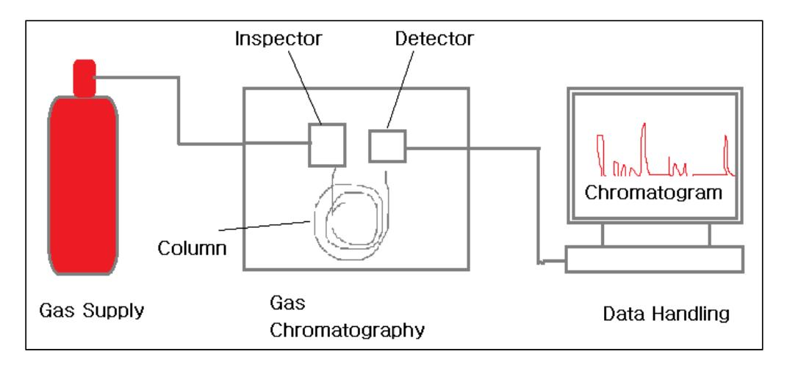

[그림 4-3] 가스 Chromatography의 외부 구성

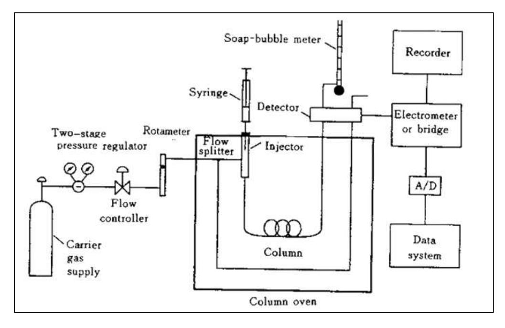

[그림 4-4] 가스 Chromatography의 내부 구성

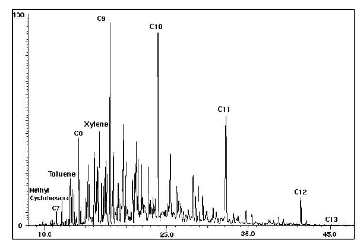

[그림 4-5] 가스 Chromatography 로 분석한 Graph

## 학습4 교수·학습 방법

#### 교수 방법

- 분석에 대학 개론을 설명한다.
- 대표적인 분석방법에 대한 개론적 원리를 설명한다.
- 분석 장비의 분석능력에 대한 개론을 설명한다.
- 준비된 샘플의 측정을 진행한다.
- 도출된 결과를 해석한다.

#### 학습 방법

- 측정 장치의 매뉴얼을 숙지한다.
- 동등한 성능의 다른 방식의 측정 장치에 대해서 학습하고 매뉴얼을 학습한다.
- 장비운용에 대해서 학습한다.
- 결과 해석에 대한 사례연구를 진행한다.

## 학습4 평 가

#### 평가 준거

- 평가자는 학습자가 학습 목표를 성공적으로 달성하였는지를 평가해야 한다.
- 평가자는 다음 사항을 평가해야 한다.

|                      | 평가 항목                                   | 성취수준 |   |   |  |
|----------------------|-----------------------------------------|------|---|---|--|
| 학습 내용                |                                         | 상    | 중 | 하 |  |
| 반도체 공정가스의 제품특성 검증 | - 가스의 분석시 문제점에 대한 해결방안을 제시할 수 있다. |      |   |   |  |
|                      | - 가스의 시험시 문제점에 대한 해결방안을 제시할 수 있다. |      |   |   |  |
|                      | - 가스의 평가시 문제점에 대한 해결방안을 제시할 수 있다. |      |   |   |  |
|                      | - 가스의 검증시 문제점에 대한 해결방안을 제시할 수 있다. |      |   |   |  |

#### 평가 방법

• 논술형 시험

|                      | 평가 항목                        | 성취수준 |   |   |  |
|----------------------|------------------------------|------|---|---|--|
| 학습 내용                |                              | 상    | 중 | 하 |  |
| 반도체 공정가스의 제품특성 검증 | - 가스의 분석시 문제점에 대한 해결방안 제시 |      |   |   |  |
|                      | - 가스의 시험시 문제점에 대한 해결방안 제시 |      |   |   |  |
|                      | - 가스의 평가시 문제점에 대한 해결방안 제시 |      |   |   |  |
|                      | - 가스의 검증시 문제점에 대한 해결방안 제시 |      |   |   |  |

#### • 사례연구

|                      | 평가 항목                        | 성취수준 |   |   |  |
|----------------------|------------------------------|------|---|---|--|
| 학습 내용                |                              | 상    | 중 | 하 |  |
| 반도체 공정가스의 제품특성 검증 | - 가스의 분석시 문제점에 대한 해결방안 제시 |      |   |   |  |
|                      | - 가스의 시험시 문제점에 대한 해결방안 제시 |      |   |   |  |
|                      | - 가스의 평가시 문제점에 대한 해결방안 제시 |      |   |   |  |
|                      | - 가스의 검증시 문제점에 대한 해결방안 제시 |      |   |   |  |

#### • 평가자 체크리스트

| 학습 내용                | 평가 항목                        | 성취수준 |   |   |
|----------------------|------------------------------|------|---|---|
|                      |                              | 상    | 중 | 하 |
| 반도체 공정가스의 제품특성 검증 | - 가스의 분석시 문제점에 대한 해결방안 제시 |      |   |   |
|                      | - 가스의 시험시 문제점에 대한 해결방안 제시 |      |   |   |
|                      | - 가스의 평가시 문제점에 대한 해결방안 제시 |      |   |   |
|                      | - 가스의 검증시 문제점에 대한 해결방안 제시 |      |   |   |

#### 피드백

| 1. 논술형 시험                                                      |  |
|----------------------------------------------------------------|--|
| - 평가 결과에 대한 일정 점수 누락에 해당하는 학생은 재평가를 통하여 학습을 이수할                |  |
| 수 있도록 지도한다. 2. 사례연구                                         |  |
| - 측정 사례를 통해 반복적으로 측정에 대한 이미지를 갖도록 하고 학습한 내용이 효과                |  |
| 적으로 전달되지 않은 경우에는 발표방법에 대한 추가 지도를 수행한다.                         |  |
| 3. 평가자 체크리스트 - 평가 결과, 일정 점수 이하인 학생들은 추가 학습 후, 결과를 제출하도록 한다. |  |
|                                                                |  |

- ∙ 그린가스산업(주)『물질안전보건자료 (MSDS)』.
- ∙ 와사 기요다까, 하야가와 시게루 저 (2007). 『박막화 기술』. 원용신 역. 겸지사.
- ∙ 요꼬야마 히로시 저(2008). 『나노재료과학』. 윤창주, 김태수 역. 겸지사.
- ∙ 한국반도체산업협회 저(2014). 『2014국가직무능력표준 반도체장비』. 고용노동부.
- ∙ 한국반도체산업협회 저(2014). 『2014국가직무능력표준 반도체제조』. 고용노동부.
- ∙ 허규성 저(2014). 『반도체 공학』. 일진사.
- ∙ 황호정 저 (2015). 『반도체공정기술』. 생능출판사
- ∙ 히라오 다까시 저(2001). 『박막기술과 응용』. 백낙선 역. 겸지사.
- ∙ Dieter K. Schroder (2014). 『Semiconductor material and device characterization』 John Wiley & Sons, Inc.
- ∙ Michael Shur (2004), 『최신반도체소자의물성』곽계달 역 Prentice-Hall, 범한서적

#### **NCS 학습모듈 개발진**

| (대표집필자)    | (집필진)           | (검토진)            |  |
|------------|-----------------|------------------|--|
| 김관하(대덕대학교) | 강필승(메그나칩반도체)    | 권기백(대덕대학교)       |  |
|            | 김상용(한국폴리텍대학)*   | 김동표(케이디전자)       |  |
|            | 김종식(드림테크)       | 박태진(대덕대학교)       |  |
|            | 양민철(서울공업고등학교)   | 여순일(한국전자통신연구원)*  |  |
|            | 우종창(이너센서)       | 정용철(한국생산기술연구원)   |  |
|            | 이병철(비드앤마이크로)*   |                  |  |
|            | 장현경(강원대학교)*     |                  |  |
|            | 정재복(메이플테크)*     |                  |  |
|            | 제창한(한국전자통신연구원)  |                  |  |
|            | 홍진균((前) LG실트론)* |                  |  |
|            |                 |                  |  |
|            |                 |                  |  |
| (공동개발기관)   | (연구기관)          |                  |  |
| 권기백(대덕대학교) | 옥준필(한국직업능력개발원)  |                  |  |
| 김관하(대덕대학교) | 박종성(한국직업능력개발원)  |                  |  |
| 박태진(대덕대학교) | 나현미(한국직업능력개발원)  |                  |  |
|            | 최영인(한국직업능력개발원)  |                  |  |
|            | 구윤재(한국직업능력개발원)  | *표시는 해당 NCS 개발진임 |  |
|            |                 |                  |  |

※ 이 학습모듈은 자격기본법 시행령(제8조 국가직무능력표준의 활용)에 의거하여 개발하였으며, NCS 국가직무능력표준 통합포털사이트(http://www.ncs.go.kr)에서 다운로드 할 수 있습니다.

www.ncs.go.kr

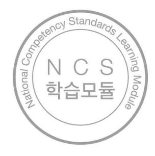