# 05 반도체용 습식화공약품 (Wet Chemical)재료 제조

LM1903060405\_14v1

к ви устрание и 🔊 대덕대학교

# 반도체재료 학습모듈

# 01. 반도체용 웨이퍼 재료 제조

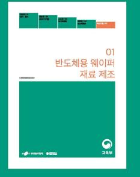

O5. 반도체용 습식화공약품(Wet Chemical)재료 제조

BROWN REPORT REPORT

U5 반도체용 습식화공약품 (Wet Chemical)재료 제조

9

02. 반도체용 리소그래피 재료 제조

**03.** 반도체용 가스 재료 제조

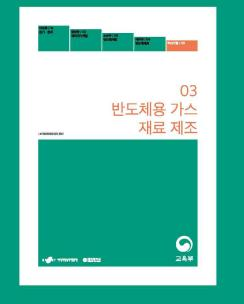

**07**. 반도체용 나노 소재 제조

A BOOM MANY AND AND AND AND AND AND AND AND AND AND

07 반도체용 나노 소재 제조

9

# 04. 반도체용 금속(Target)재료 제조

## **08**. 반도체 재료 개발

06. 반도체용 패키지 재료 제조

10. 반도체 재료 품질관리

**09.** 반도체 재료 생산

11. 반도체 재료 안전관리

# NCS 학습모듈의 이해

\*\* 본 하습모듈은 「NCS 국가직무능력표준」사이트(http://www.ncs.go.kr) 에서 확인 및 다운로드 할 수 있습니다.

# (1) NCS 학습모듈이란?

- 국가직무능력표준(NCS: National Competency Standards)이란 산업현장에서 직무를 수행하기 위해 요구되는 지식·기술·소양 등의 내용을 국가가 산업부문별·수준별로 체계화한 것으로 산업현장의 직무를 성공적으로 수행하기 위해 필요한 능력(지식, 기술, 태도)을 국가적 차원에서 표준화한 것을 의미합니다.
- 국가직무능력표준(이하 NCS)이 현장의 '직무 요구서'라고 한다면, NCS 학습모듈은 NCS의 능력단위를 교육훈련에서 학습할 수 있도록 구성한 '교수·학습 자료'입니다. NCS 학습모듈은 구체적 직무를 학습할 수 있도록 이론 및 실습과 관련된 내용을 상세하게 제시하고 있습니다.

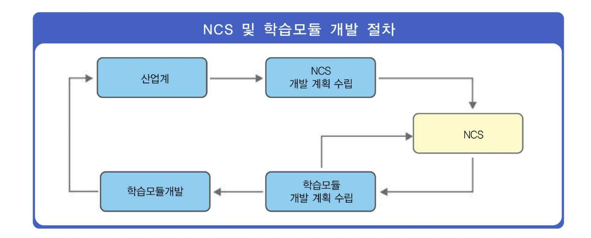

# ● NCS 학습모듈은 다음과 같은 특징을 가지고 있습니다.

첫째, NCS 학습모듈은 산업계에서 요구하는 직무능력을 교육훈련 현장에 활용할 수 있도록 성취목표와 학습의 방향을 명확히 제시하는 가이드라인의 역할을 합니다. 둘째, NCS 학습모듈은 특성화고, 마이스터고, 전문대학, 4년제 대학교의 교육기관 및 훈련기관,

직장교육기관 등에서 표준교재로 활용할 수 있으며 교육과정 개편 시에도 유용하게 참고할 수 있습니다.

● NCS와 NCS 학습모듈 간의 연결 체제를 살펴보면 아래 그림과 같습니다.

# (2) NCS 학습모듈의 체계

● NCS 학습모듈은 1.학습모듈의 위치 , 2.학습모듈의 개요 , 3.학습모듈의 내용 체계 , 4.참고 자료 ,
 5.활용 서식/부록 으로 구성되어 있습니다.

# 1. NCS 학습모듈의 위치

NCS 학습모듈의 위치는 NCS 분류 체계에서 해당 학습모듈이 어디에 위치하는지를 한 눈에
 볼 수 있도록 그림으로 제시한 것입니다.

예시 : 이 · 미용 서비스 분야 중 네일미용 세분류

NCS-학습모듈의 위치

| 대분류 | 이용 · 숙박 · 여행 · 오락 · 스포츠 |         |  |
|-----|-------------------------|---------|--|
| 중분류 | 이・미용                    |         |  |
| 소분류 |                         | 이미용 서비스 |  |

| 세 <del>분류</del> |             |           |
|-----------------|-------------|-----------|
| 헤어미용            | 능력단위        | 학습모듈명     |
| 피부미용            | 네일 샵 위생 서비스 | 네일숍 위생서비스 |
| 메이크업            | 네일 화장물 제거   | 네일 화장물 제거 |
| 네일미용            | 네일 기본 관리    | 네일 기본관리   |
| 이용              | 네일 랩        | 네일 랩      |
|                 | 네일 팁        | 네일 팁      |
|                 | 젤 네일        | 젤 네일      |
|                 | 아크릴릭 네일     | 아크릴 네일    |
|                 | 평면 네일아트     | 평면 네일아트   |
|                 | 융합 네일아트     | 융합 네일아트   |
|                 | 네일 샵 운영관리   | 네일숍 운영관리  |

| 학습모듈은                                                                                                                                                       |  |
|-------------------------------------------------------------------------------------------------------------------------------------------------------------|--|
| NCS 능력단위 1개당 1개의 학습모듈 개발을 원칙으로 합니다. 그러나 필요에 따라 고용 단위 및 교과단위를 고려하여 능력단위 몇 개를 묶어서 1개의 학습모듈로 개발할 수 있으며, NCS 능력단위 1개를 여러 개의 학습 모듈로 나누어 개발할 수도 있습니다. |  |

# 2. NCS 학습모듈의 개요

활용안내

예시 : 네일미용 세분류의 '네일 기본관리' 학습모듈

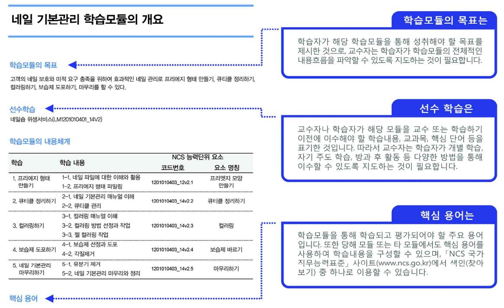

프리에지, 니퍼, 퓨셔, 폴리시, 네일 파일, 스퀘어형, 스퀘어 오프형, 라운드형, 오발형, 포인트형

# 3. NCS 학습모듈의 내용 체계

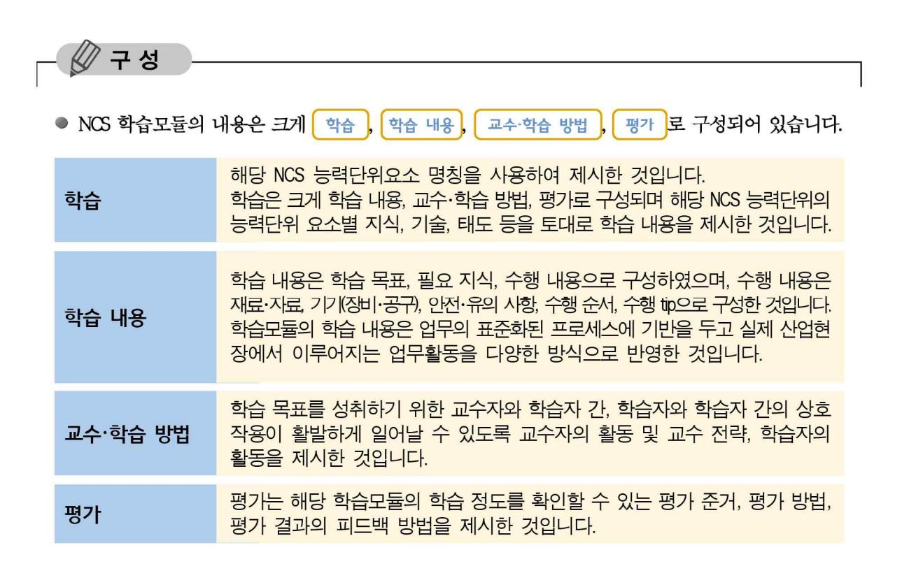

트를 도포하기 전에 사용한다.

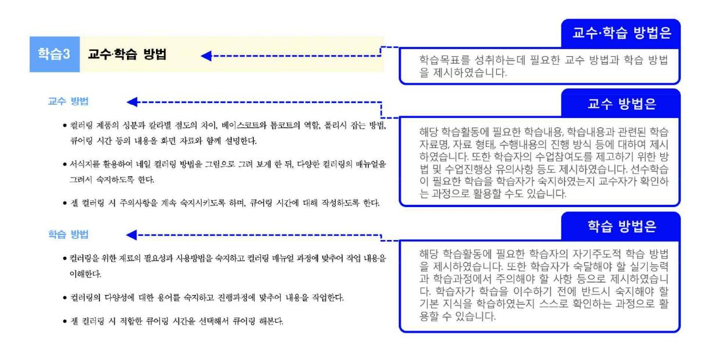

# [NCS-학습모듈의 위치]

| 대분류 | 전기・전자 |        |  |
|-----|-------|--------|--|
| 중분류 |       | 전자기기개발 |  |
| 소분류 |       | 반도체개발  |  |

# 세분류

반도체개발

반도체제조

반도체장비

반도체재료

|  | 능력단위                              | 학습모듈명                             |
|--|-----------------------------------|-----------------------------------|
|  | 반도체용 웨이퍼 재료 제조                    | 반도체용 웨이퍼 재료 제조                    |
|  | 반도체용 리소그래피 재료 제조               | 반도체용 리소그래피 재료 제조               |
|  | 반도체용 가스 재료 제조                     | 반도체용 가스 재료 제조                     |
|  | 반도체용 금속(Target)재료 제조           | 반도체용 금속(Target)재료 제조           |
|  | 반도체용 습식화공약품(Wet Chemical)재료 제조 | 반도체용 습식화공약품(Wet Chemical)재료 제조 |
|  | 반도체용 패키지 재료 제조                    | 반도체용 패키지 재료 제조                    |
|  | 반도체용 나노 소재 제조                     | 반도체용 나노 소재 제조                     |
|  | 반도체용 재료 개발                        | 반도체용 재료 개발                        |
|  | 반도체용 재료 생산                        | 반도체용 재료 생산                        |
|  | 반도체용 재료 품질관리                      | 반도체용 재료 품질관리                      |
|  | 반도체용 재료 안전관리                      | 반도체용 재료 안전관리                      |

| 학습모듈의 개요                                     | 1  |  |  |  |
|----------------------------------------------|----|--|--|--|
| 학습 1. 반도체용 습식화공약품(Wet Chemical) 재료 요구사항 파악하기 |    |  |  |  |
| 1-1. 고객의 요구사항 확인 후 사양서 작성                    | 3  |  |  |  |
| 1-2. 고객 요구사항에 대한 문제점 파악                      | 17 |  |  |  |
| 교수・학습 방법 •                                | 23 |  |  |  |
| 평가 •                                      | 24 |  |  |  |
| 학습 2. 반도체용 습식화공약품(Wet Chemical) 재료 선정하기      |    |  |  |  |
| 2-1. 반도체 집적회로 제조공정에 적합한 습식화공약품 선정            | 26 |  |  |  |
| 2-2. 습식화공약품의 공정적용에 대한 문제점 해결                 | 35 |  |  |  |
| 교수・학습 방법 •                                | 39 |  |  |  |
| 평가 •                                      | 40 |  |  |  |
| 학습 3. 반도체용 습식화공약품(Wet Chemical) 재료 제조하기      |    |  |  |  |
| 3-1. 습식화공약품 생산의 이해                           | 42 |  |  |  |
| 3-2. 습식화공약품 생산문제에 대한 해결                      | 50 |  |  |  |
| 교수・학습 방법 •                                | 55 |  |  |  |
| 평가 •                                      | 56 |  |  |  |
| 학습 4. 반도체용 습식화공약품(Wet Chemical) 제품 특성 검증하기   |    |  |  |  |
| 4-1. 반도체 습식화공약품(Wet Chemical) 제품 특성 검증       | 58 |  |  |  |
| 교수・학습 방법 •                                | 63 |  |  |  |
| 평가 •                                      | 64 |  |  |  |

| 참고 자료 | 66 |
|-------|----|
| 활용 서식 | 67 |

# 반도체용 습식화공약품(Wet Chemical)재료 제조 학습모듈의 개요

# 학습모듈의 목표

반도체 제조에 필요한 습식화공약품(Wet Chemical) 재료의 요구사항을 파악하여 선정하고, 제조 및 검증할 수 있다.

# 선수학습

분석화학, 반도체공학, 화학일반, 반도체제조, 반도체장비

# 학습모듈의 내용체계

| 학습                                                 | 학습 내용                                                                   | NCS 능력            | 력단위 요소                                           |
|----------------------------------------------------|-------------------------------------------------------------------------|-------------------|--------------------------------------------------|
| 의급                                                 | 익답 네상                                                                   | 코드번호              | 요소 명칭                                            |
| 1. 반도체용 습식화공약품(Wet Chemical) 재료 요구사항 파악하기 | 1-1. 고객의 요구사항 확인 후 사양서 작성 1-2. 고객의 요구사항에 대한 문제점 파악             | 1903060405_14v1.1 | 반도체용 습식화공약품 (Wet Chemical) 재료 요구사항 파악하기 |
| 2. 반도체용 습식화공약품(Wet Chemical) 재료 선정하기      | 2-1. 반도체 집적회로 제조공정에 적합한 습식화공약품 선정 2-2. 습식화공약품의 공정적용에 대한 문제점 해결 | 1903060405_14v1.2 | 반도체용 습식화공약품 (wet Chemical) 재료 선정하기      |
| 3. 반도체용 습식화공약품(Wet Chemical) 재료 제조하기      | 3-1. 습식화공약품 생산의 이해 3-2. 습식화공약품의 생산문제에 대한 해결                       | 1903060405_14v1.3 | 반도체용 습식화공약품 (Wet Chemical) 재료 제조하기      |
| 4. 반도체용 습식화공약품 (Wet Chemical) 제품 특성 검증하기  | 4-1. 반도체 습식화공약품(Wet Chemical) 제품 특성 검증                               | 1903060405_14v1.4 | 반도체용 습식화공약품 (Wet Chemical) 제품 특성 검증하기   |

# 핵심 용어

분석화학, 샘플, 유기화학, 무기화학, 불순물 관리, 정량분석, 정성분석, 반응공학

| 학습 1 | 반도체용 습식화공약품(Wet Chemical) 재료 요구사항 파악하기(LM1903060405_14v1.1) |
|------|-------------------------------------------------------------------|
| 학습 2 | 반도체용 습식화공약품(Wet Chemical) 재료 선정하기 (LM1903060405_14v1.2)        |
| 학습 3 | 반도체용 습식화공약품(Wet Chemical) 재료 제조하기 (LM1903060405_14v1.3)        |
| 학습 4 | 반도체용 습식화공약품(Wet Chemical) 제품 특성 검증하기(LM1903060405_14v1.4)      |

# **1-1.** 고객의 요구사항 확인 후 사양서 작성

|       | • 최종 제품의 생산에 필요한 습식화공약품(Wet Chemical) 공정을 파악할 수 있다. |
|-------|--------------------------------------------------------|
| 학습 목표 | • 고객의 요구사항에 의한 습식화공약품(Wet Chemical) 재료를 파악할 수 있다.   |

# 필요 지식 /

습식화공약품(Wet Chemical)을 사용하는 공정의 파악

반도체 공정에서 사용되는 케미칼에 대한 분류는 여러 가지가 있을 수 있겠지만, 본 텍스 트에서는 물질의 성상을 액체로 한정하나 경우에 따라서, 액체와 가스의 임계영역 또는 고 체의 파우더를 포함하고 있는 경우 등 다양한 경우가 있을 수 있으므로 필요한 경우에 설 명하도록 하고자 한다. 습식화공약품을 사용하는 데 있어서 적용되는 공정을 파악하는 것 은 매우 중요한 일이고, 사용 목적과 사용조건을 확인하는 것은 습식화공약품을 활용하는

데 있어서 가장 중요하다고 할 수 있다. 또한, 반도체 공정에서 사용되는 재료는 반도체 웨이퍼 공정의 전후방 산업과의 상호 간에 중요한 영향을 주고받게 되는데, 이러한 반도체 산업의 ROADMAP을 제시해주는 ITRS(예 : International Technology Roadmap for Semiconductors 2.0 2015 Edition)를 참고하고 방향성 을 확인할 필요가 있다. 또한, 한국반도체 협회에서 정리한 ROADMAP 또는 SEMI 등에서 정리한 자료를 충분히 참고할 필요가 있다.

<표 1-1> ITRS에서의 NAND Flash 예측 예

| Year of Production                                   | 2015     | 2016     | 2020     | 2022     | 2024     | 2028     | 2030     |
|------------------------------------------------------|----------|----------|----------|----------|----------|----------|----------|
| 2D NAND Flash uncontacted poly 1/2 pitch – F (nm) | 12       | 12       | 12       | 12       | 12       | 12       | 12       |
| 3D NAND minimum arry 1/2 pitch – F (nm)           | 80       | 80       | 80       | 80       | 80       | 80       | 80       |
| Number of word line in one 3D NAND string         | 384-512  | 384-512  | 384-512  | 384-512  | 384-512  | 384-512  | 384-512  |
| Dominant Cell type (FG, CT, 3D, etc.)             | FG/CT/3D | FG/CT/3D | FG/CT/3D | FG/CT/3D | FG/CT/3D | FG/CT/3D | FG/CT/3D |
| Product highest density (2D or 3D)                | 4T       | 4T       | 4T       | 4T       | 4T       | 4T       | 4T       |
| 3D NAND number of memory layers                   | 384-512  | 384-512  | 384-512  | 384-512  | 384-512  | 384-512  | 384-512  |
| Maximum number of bits per cell for 2D NAND       | 3        | 3        | 3        | 3        | 3        | 3        | 3        |
| Maximum number of bits per cell for 2D NAND       | 3        | 3        | 3        | 3        | 3        | 3        | 3        |

출처: International Technology Roadmap for Semiconductors 2.0 2015 Edition) P33

## 1. 적용공정의 구분

습식화공약품의 적용 공정을 구분하고 적절한 약품을 선정하고, 제안하고, 생산하는데 반 드시 필요한 일이라고 할 수 있다. 대표적인 공정 몇 가지를 설명하도록 한다.

(1) 공정 재료로서의 약품

반도체에서 웨이퍼링 프로세스를 적용하는데 주요 재료로 사용되는 재료로 공정 재료 로 정의하고자 한다. 즉 웨이퍼에서 반도체를 구성하는데 있어서 직접적으로 구성 재 료로 활용되거나, 디바이스의 구조를 형성하는데 직접적으로 사용되는 재료를 설명하 도록 한다.

(가) Photo Resister ; PR

에칭공정을 진행하기 위한 현상 막으로서 반도체 디바이스의 선폭을 결정짓는 중요 한 공정이고 재료로 서도 중요한 위치를 차지하고 있다. 주로 유기물로 구성되어 있는 경우가 많다.

(나) Wet Etching

2016년 현재 시점에서는 웨이퍼링 공정에서의 에칭은 대부분 Plasma Etching 기법 을 활용하여 에칭을 적용하지만, 경우에 따라서는 Wet Chemical을 활용한 에칭을 진행하는 경우가 있다. 1) Wet Etching

실질적으로 웨이퍼에서 디바이스 구조를 형성하는 역할을 하는 경우로 등방성 에칭 구조를 형성할 경우에 활용된다.

2) 웨이퍼 세정 ; PR 제거 등

웨이퍼에칭 후에 PR의 잔류물 등을 제거하는 공정이다.

(다) 막형성 재료 ; Wet 성막재료 : 메탈계 Gas

Wet Chemical이 웨이퍼의 디바이스 구조를 형성하는 재료로 재료자체의 특성 또는 사용자로부터의 요구되는 특성에 따라서 액체의 경우와 기체의 경우 또는 액체와 기체가 공존하는 형태로 존재할 수도 있다.

1) 메탈막 형성 재료 ; 전원 공급라인, 신호제어라인 등

2) 산화막 형성 재료 ; Gate Layer, Isolation layer 등

3) 기타 기능성막 형성 재료 ; Barrier layer 등

(2) 공정 보완재로서의 약품

공정 보완재로 정의하는 약품은 그 차체로는 기능을 하지 않거나 약하게 기능을 하지 만 주 공정 약품과의 배합을 통하여 공정 약품의 특성을 극대화하거나 반응의 속도를 제어하거나 안정성을 높여주는 역할을 하는 약품을 의미한다.

(가) H2O 초순수

물은 그 자체로는 화학적 반응을 하지 않거나 약하게 하지만 HCl, HF, 암모니아 등 을 흡수하여 수용액으로 염산, 불산, 암모니아수 등의 기능성 약액으로 기능하게 하고, 염산의 경우 사용농도를 9%, 18%, 35% 등의 농도를 조절하도록 하고, 불산의 경우 10%를 넘지 않도록 하는 기능을 수행한다. 1) 중성염의 제거 ; 녹여서 제거

- 2) 케미칼의 농도 희석
- 3) 파티클의 제거 ; 녹이거나 하지 않고 제거해내는 방식 ; 예 자동차 세차

(나) 유기용제 희석제 ; 벤젠, 신나, 알코올

주성분이 카본을 함유하는 유기물의 사용을 원활하게 하기 위한 배합 재료로서 Photo Resister의 점도 등을 제어하기 위한 용도로 사용되거나 PR 공정 후의 잔류 PR을 제거하기 위한 목적으로 사용되는 경우가 많다고 할 수 있다. 1) 카본체인 구조 ; IPA 등

2) 방향족 구조 ; 벤젠 등의 화학 구조

2. 세정을 위한 공정의 구분

반도체제조공정에서 웨이퍼위에서 디바이스를 형성하는 데에는 많은 종류의 재료가 사용 된다. 그중에는 다음 단계에서 진행하는 공정 또는 공정에 사용되는 재료 전부 또는 일부 의 재료와 불필요한 반응을 할 수 있는 불필요한 부산물을 제거하고, 또는 다음 과정에서 진행하려는 공정의 진행을 방해할 가능성이 있는 물질을 제거하거나 반응을 촉진시키기 위한 조건을 만들기 위해서 세정을 진행하게 된다. 따라서 세정을 진행하기 위해서는 다 음 공정에 대한 이해를 충분히 해야 할 필요가 있다.

# (1) 웨이퍼 세정 약품

웨이퍼링 과정에서의 각 공정에서는 웨이퍼의 앞뒤로 공정진행 후의 부산물이 발생하 거나 공정 후 제거해야 할 공정 후 잔류물이 발생하게 되는데 경우에 따라서 부산물이 나 공정 잔류물은 웨이퍼에서의 디바이스의 생산율 감소에 지대한 영향을 줄 수도 있 기 때문에 웨이퍼의 매 공정을 진행한 후에 웨이퍼 세정을 진행하게 된다. 과거에는 웨이퍼 세정은 약액(Wet Chemical)에 담가서 웨이퍼 앞뒷면의 불순물 및 잔류물을 제 거했지만 2016년 현재 시점에서는 약액(Wet Chemical)을 사용하지 않고, 히터나 플라 스마를 이용하여 세정의 효과를 보는 경우도 있다. 본 텍스트에서는 약액(Wet Chemical)을 사용하는 경우에 대해서 언급하도록 하겠다.

(가) PR 세정

Photo Resister 공정을 진행한 후에 다음 공정으로는 에칭을 진행하게 된다. 최근의 반도체 공정에서는 특수한 일부의 경우를 제외하고는 Wet Etching을 이용하는 경 우는 거의 없고, 진공 챔버에서 플라스마를 이용하는 드라이에칭을 진행하는데 드 라이 에칭이던지, Wet 에칭이던지 PR을 필요로 하게 되는데 에칭을 진행하고 나서 는 PR막을 제거해야 한다. 1) 잔류 PR의 제거

PR은 통상 에칭반응을 견딜 수 있는 재료로 구성되어 있다. 당연한 논리이겠지 만, PR의 역할은 구간의 선택적 에칭을 목적으로 하므로 에칭 공정 후에 PR이 잔류하게 된다. 따라서 에칭공정 후에 PR을 제거하기 위한 세정을 진행하게 된 다. 이 PR제거 과정에서 PR의 성분을 녹이거나 제거하기 용이한 화학 물질이 사용된다. 2) 부산물 PR의 제거

잔류 PR과 동일하게 취급되기도 하지만 성분의 구성을 들여다보면 약간의 차이 점이 있다는 것을 확인하게 된다. 이유는 반응 챔버 내부에서 목적으로 하는 공 정반응(예 ; 에칭공정) 외에 기대하지 않은 반응도 일어나기 때문이다. 따라서 반응 생성물의 특성도 고려한 세정을 진행해야 한다. 경우에 따라서는 각각의 단계별 레시피를 적용하여 잔류 PR과 부산물 PR을 각각 제거하기도 한다.

- PR과 에칭공정 Gas의 반응 생성물

- PR과 에칭공정 후 반응생성물과의 반응 생성물

(나) 기타 공정 전후 세정

앞에서 PR과 에칭공정 전후에 대한 세정을 중심으로 내용을 언급하였으나 그 외의 공정에서도 세정을 필요로 한다.

- 측정을 위한 세정
- 웨이퍼의 공정 투입 전 세정
- 웨이퍼 케리어 세정

## (2) 공정 진행을 위한 장비 세정 약품

반도체의 웨이퍼링 공정을 진행하기 위해서 재료의 품질이 중요하지만, 공정을 진행하는 장 비나 공정 반응이 일어나는 챔버의 세정도 재료의 품질 못지않게 중요하다고 할 수 있다.

(가) 공정 진행을 위한 세정 ; 공정 준비 작업

반응 챔버의 공정진행을 위한 준비 작업으로 챔버의 분위기를 맞춰준다는 표현을 쓰기도 합니다. 1) Bath 내부의 부산물 및 불순물 세정

- 2) Bath 내부의 산도(pH) 및 기타 화학적 특성의 사전 조정
- 3) Bath 및 챔버에 화학약품을 공급하는 공급배관의 세정
- (나) 장비 점검을 위한 세정 ; 중성세정

장비의 운용을 위해서는 정기, 비정기적인 점검이 필요하게 된다. 이러한 점검은 상당 부분 자동화가 진행되었지만, 최종적인 점검은 필수적으로 사람이 진행하게 되는 경우가 많다고 할 수 있다. 이 경우 위에서 언급한 장비운용을 위한 세정과는 다르게 사람이 접근했을 경우 안전성을 담보해야 한다.

1) 중화 세정

여러 가지 경우가 있지만, 가장 대표적으로 산(Acid)을 사용하는 경우 알칼리가 사용되기도 한다. 이처럼 Toxic 물질을 중성화하기 위한 세정이 진행되기도 한 다. 이런 중성화 작업은 장비의 최종단에서 스크러버 등의 장치를 통해서 진행 하기도 한다. 2) 중성세정 ; 물(H2O)

통상적인 세정으로 주로 물을 이용하여 세정을 진행하는 것으로 예를 들어 중 화 세정의 경우 강산이나 강알칼리를 처리하기 위하여 사용되는 중화제 자체가 Toxic 한 경우가 있으므로 사람의 안정성 및 환경의 안정성을 위해서 다량의 물 로 희석을 시키거나 물을 이용하여 중성화를 진행하기도 한다. 이러한 과정을 통해서 사람이 작업을 진행할 수 있는 안정성을 확보할 수 있다. 다만, 여기서 사용되는 물의 순도가 중요한 문제가 된다.

# (3) 기타 재료 및 용도로서의 약품

앞에서 언급되지 않은 용도 외에도 많은 화학약품이 사용된다.

- 운반제 : 반응에 관여하지 않지만, 물질을 운반하는 목적으로 사용되는 경우
- 전구체 : 반응 대상물의 불안정성을 고려하여 안정성을 확보한 물질
- 반응 촉매제 : 반응을 촉진하기 위한 재료
- 반응 지연제 : 반응의 속도를 조절하기 위한 재료
- 냉동기 및 히터의 냉매 : 공정온도를 제어하기 위한 온도 제어를 위한 물질

# 습식화공약품 구성 특성의 파악

화공약품의 기본적인 구성을 파악하고 안전성 및 취급에 대한 특성을 파악한다. 1. 유기용제 ; 카본계열 ; 화재위험이 크다

PR이 대표적인 물질로서 벤젠, 카본체인의 다양한 조합으로 구성되어 있다.

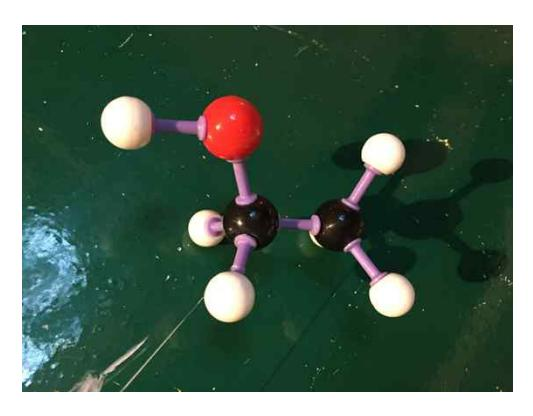

[그림 1-1] 카본체인의 예 에탄올

(1) 알코올 계열 ; 메탄올, 에탄올, IPA 등 카본체인 구조의 유기물을 제어하기 위한 배합 물질로 PR 등의 유기물을 제어하기 위 한 용도로 사용된다. 알코올 계열은 벤젠 등의 유기물과도 혼합이 가능하고 물(H2O)과 도 혼합이 가능하다. 단 정도의 차이가 있으므로 메탄올, 에탄올, IPA(이소프로필알코 올) 등이 사용된다.

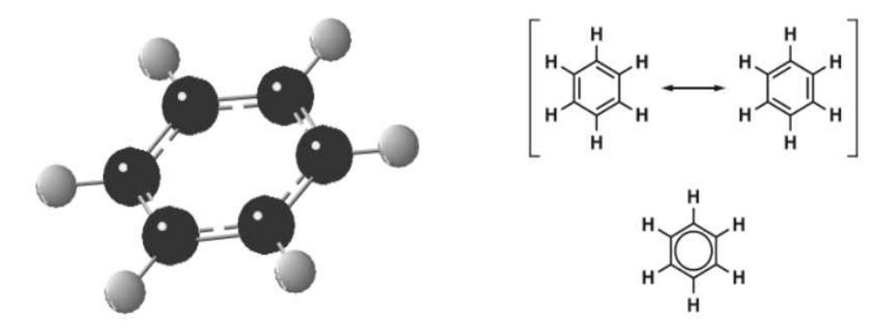

[그림 1-2] 벤젠형상 및 기호표현 예

(가) 메탄올 : CH3OH

알코올 계열의 물질로는 가장 작은 분자구조를 가진다. 메탄올은 사람이 흡입하면 시력을 상실하는 등의 치명적인 손상을 유발할 수 있으므로 취급에는 주의하여야 하고 호흡기 피부 등을 통해서 인체에 흡수될 수 있으므로 MSDS, CAS Sheet 등의 주의 사항을 충분히 숙지하여야 한다. 강한 인화성 물질이다.

(나) 에탄올 : C2H5OH

물과 혼합하면 사람이 마실 수 있을 정도로 주류의 기본 성분으로 인체에는 크게 유해하지 않아서 메탄올의 유해성이 알려진 후로는 메탄올의 대체재로 사용되고 있 다. 그러나 고순도의 에탄올도 사용되고 있고, 그럴 경우 인체에 유해할 수도 있다. 순도가 높으면 강한 인화성 물질이다.

(다) IPA : 이소프로필알코올 Isopropyl alcohol C3H7OH

장비 세정용으로 많이 사용되는 알코올로 여러 가지 기능적으로 에탄올과 메탄올의 대체재로 사용되고 있다. 최근에는 웨이퍼 세정용으로도 사용되고 있다. 인체에 무 해하다고 알려져 있으나 가스의 농도가 높으면 어지럼증 등을 일으킬 우려가 있고 강한 인화성 물질이다.

(2) 벤젠 계열

카본과 수소의 육각형 구조로 거의 대부분의 카본계열의 물질의 기본 구조이다. 대표 적으로 벤젠이 있다. PR에 벤젠 구조가 많이 활용되고 있다. 대부분이 인화성이거나 열에 민감한 특성을 가지고 있다.

2. 산 및 알칼리 계열 ; HCl, HF, H2O2, NH4OH 등

취급하는 화학물질의 산도를 파악하여 취급방법, 방호구, 사용 용기, 주변 물질, 보관방법 등을 고려해야 한다. 특히 강산과 강알칼리가 직접 섞이면 폭발적인 반응을 하게 되므로 취급에 주의를 해야 하고, 두 가지 약품 모두 인체에 치명적인 위해를 가하고, 금속 등의 구조물에 심각한 상해를 가할 수 있으므로 보관과 취급에 주의를 해야 한다. 기본 정보를 확인할 수 있는 자료는 다음과 같은 자료들이 있고 추가적으로 제조사에서 제공하는 자료 를 반드시 확인해야 한다.

- MSDS : 물질의 기본특성을 나타내는 제조사로부터의 자료

- CAS Sheet : 생산하는 물질에 부여되는 고유번호와 그 물질의 정보 자료

(1) 산 Acid

산도가 pH7 보다 낮은 수치를 가지는 물질로 숫자가 낮을수록 강한 산도를 가지고, 강 한 부식성과 반응성을 가지고 있어서 취급에 주의해야 한다. 황산 H2SO4, 염산 HCl, 질산 NHO3, 인산 H3PO4 등이 대표적이다. 황산의 경우 희석을 할 경우 물에 황산을 희석해야지 황산에 물을 희석하면 급격한 발열을 하므로 각각의 화학물질에 대한 기본 특성을 미리 확인해야 한다.

(2) 알칼리

산도가 pH7 보다 큰 숫자로 높은 숫자일수록 강한 알칼리성을 나타내고 반응성이 증 대한다. 강한 산과 마찬가지로 강한 알칼리도 강한 부식성과 반응성을 가지고 있다.

9

3. 중성계열 ; 초순수 H2O

물 H2O는 pH7이다. 즉 pH7은 중성 특성을 가지고 있다고 하겠다. 하지만 산이나 알칼리 와는 다르지만, pH7이 전부 안전하다고는 할 수 없다. 산과 알칼리의 반응 생성물, 또는 산과 금속의 반응 생성물은 물에 녹는 수용성인 경우가 있지만, 인체에 유해한 경우도 있 으므로 주의해야 한다.

(1) 초순수 H2O

HCl, HF 등의 물질을 희석하거나, 반도체를 직접 세정하는 용도로 사용되는 물로서 불 순물의 함유량도 제어를 해야 하고 물의 저항성도 10^7 Ohm 이상의 전기저항을 확보 해야 하는 경우가 많다.

(2) 부유 가스를 흡수해서 생기는 문제

반도체 공장 내에서 고인 물을 확인하기는 쉽지 않다. 다만 장비의 점검 중 냉각수 등 에 주변의 부유 가스가 녹아 들어가서 성질이 변하는 경우가 종종 있고, 경우에 따라 서는 프로세스용 초순수에도 섞여 들어가는 경우도 있으므로 주의해야 한다. HCl gas, Cl2 gas, NH4 gas 등이 대표적이다.

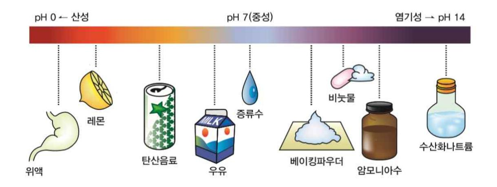

[그림 1-3] pH 수치 이미지

# 습식화공약품 성상 특성의 파악

반도체 공정에 사용되는 화학약품의 종류와 사용량이 가늠하기 어려울 정도로 계속 증가 하고 있고, 기존에 사용되던 화학약품도 사용방법의 개선 및 사용 순서의 변경만으로도 반 도체 공정에서 다른 효과를 기대할 수 있다. 따라서 다음의 내용을 고려하고 염두에 둘 필 요가 있다고 하겠다. 그러다 보면 기체와 액체의 경계에서 보관 사용하는 경우도 있다.

1. 액체와 기체 ; 액체와 기체 간의 성상

액체로 보관하고 기체로 사용하는 경우와 액체로 보관하고 액체로 사용하는 경우에 대해 서 언급한다.

- (1) 액체로 보관하고 기체로 사용하는 경우 ; 메탈계 재료(Gas), 분자량이 큰 가스 반도체 공정에서 사용되는 많은 공정재료들이 여기에 해당 된다고 볼 수 있다. 물질의 증기압, 보관압력, 보관온도 등의 물질 특성에 따라서 운반과 보관은 액체 상태이지만 실제사용은 가스화해서 사용하는 경우로 가스와 액체 상태에 대응을 해야 한다.
- (2) 액체로 보관하고 액체로 사용되는 경우

통상적인 액체 재료로 보관 용기가 그대로 사용 용기가 되는 경우로 Toxic 약품일수록 그런 특성이 강하다.

- (가) 보관상태 그대로 사용하는 경우 Toxic 약품일수록 보관 용기가 사용 용기가 되는 경우가 많다. 고압 또는 저압에서 사용되는 경우
- (나) 사용 시 희석 및 배합하는 경우 사용조건의 튜닝이 필요한 경우로 세정 조건의 변경 또는 웨이퍼의 세정 조건이 변 경되어 희석률이나 배합률을 변경할 경우
  - PR : 점도 제어
  - 세정 : 세정 대상물질의 성분구조에 따라서
- 2. 점성 상태에 대한 성상 ; 점도 구분

# 점도의 제어

- (1) 액체 상태 ; H2O 통상적인 액체상태
- (2) 고점도 상태 ; PR 점도가 있어서 계량과 계측에 전용 지그를 사용하는 경우가 많다.
- (3) 고체 분말을 포함한 액체 ; 슬러리 분산제와 역할재로 자성유체, CMP 슬러리 등이 대표적인 예이다.

# 수행 내용 / 고객의 사양을 파악하여 사양서 작성하기

# 재료·자료

- Ÿ 고객으로부터의 자료
- Ÿ 고객과의 미팅 및 회의록
- Ÿ 고객의 최종 제품에 대한 이해 및 공정을 이해하기 위한 자료

# 기기(장비 ・ 공구)

- Ÿ 자료 조사용 컴퓨터
- Ÿ 메모노트, 필기구 등
- Ÿ 음성 및 영상 기록기기 (가능한 경우에 한해서)

## 안전 ・ 유의 사항

- Ÿ 고객과의 회의 내용은 기업 기밀을 포함하는 경우가 있을 수 있으므로 수집과 취급에는 주의를 기울여야 한다.
- Ÿ 녹음기 등의 기록 장치를 휴대할 경우는 사용 가능할지에 대해서 사전에 확인하고 절차를 밟아야 한다. (일반적으로 녹음기 등의 저장 매체는 고객사의 정문에서 반입이 제한되는 경우가 많다)
- Ÿ 기록 장치를 사용할 경우는 상대방과 회의 참석자에게 사전에 정해진 절차를 통해서 동의를 구해야 한다. 수행 순서

 고객과의 인터뷰 내용을 정리한다. 고객과의 인터뷰 내용을 정리하는 정해진 양식은 없다. 그러므로 사내에서 선행하여 고객 이 필요로 하는 부분을 예측하여 사전에 정리할 필요가 있다. 역할을 나누어서 정해진 역 할에 따라서 인터뷰를 진행하고, 진행한 내용을 정리해본다. 인터뷰 아이템은 필요지식의 내용을 참고로 한다. 1. 고객과의 인터뷰 대상 리스트의 작성

- - (1) 사내 의견의 취합
    - (가) 경영진 의견의 취합
    - (나) 영업팀 의견의 취합

- (다) 사내 공정 엔지니어의 의견의 취합
- (라) 현장 공정 엔지니어팀 의견의 취합
- (마) 그 외 관계자의 의견의 취합
- (2) 취합한 질문을 통한 인터뷰 리스트의 작성

인터뷰 리스트에 정해진 양식은 없지만, 각각의 내용을 적절하게 파악할 수 있도록 한다.

- 2. 고객과의 인터뷰
  - (1) 준비된 인터뷰의 질문지 내용을 진행
  - (2) 준비된 질문지 이외에 고객의 의견과 제안 청취
- 3. 고객과의 인터뷰 내용을 정리한다.

 습식화공약품(Wet Chemical)을 사용하는 공정을 파악한다. 공정의 적용을 고려하여 아래의 내용을 파악한다. 정해진 양식은 없으나 내용이 확인되도 록 체크리스트를 작성한다. 보고서의 기본양식은 MSDS의 기본 항목을 참고로 하여 객관적 인 내용을 확인할 수 있도록 작성한다. 1. 적용공정을 구분한다.

- - (1) 공정 재료로서의 약품

사용될 약품의 적용 공정을 파악하도록 한다.

(가) Photo Resister ; PR

희망하는 구성과 기능을 취합한다.

(나) Wet Etching

에칭을 목적으로 하는지 세정을 목적으로 하는지 확인이 필요하고 바이프로덕트에 대한 부가적 액션을 파악한다. 1) Wet Etching

- 2) 웨이퍼 세정 ; PR 제거 등
- (다) 막형성 재료 ; Wet 성막재료 : 메탈계 Gas
  - 웨이퍼에서 디바이스 구조를 형성하는 재료로 어떤 기능의 막이 필요한지 파악한다. 1) 메탈막 형성 재료 ; 전원 공급라인, 신호제어라인 등 주파수, 허용전류, 등

    - 2) 산화막 형성 재료 ; Gate Layer, Isolation layer, 정전용량, 히스테리시스 특성
    - 3) 기타 기능성막 형성 재료 ; Barrier layer, CMP 높이제어용 적층 등
- (2) 공정 보완재로서의 약품
  - (가) H2O 초순수

사용 목적의 확인에 의하여 생성방법, 순수의 목적 수준을 결정할 수 있다.

- 1) 중성염의 제거 ; 녹여서 제거
- 2) 케미칼의 농도 희석
- 3) 파티클의 제거 ; 녹이거나 하지 않고 제거해내는 방식 ; 예 자동차 세차
- (나) 유기용제 희석제 ; 벤젠, 신나, 알코올
  - 1) 카본체인 구조 ; IPA 등
  - 2) 방향족 구조 ; 벤젠 등의 화학 구조
- 2. 세정을 위한 공정의 구분
  - 세정을 진행하기 위해서는 다음 공정에 대한 이해를 충분히 해야 할 필요가 있다.
  - (1) 웨이퍼 세정 약품
    - (가) PR 세정
      - 1) 잔류 PR의 제거
      - 2) 부산물 PR의 제거
      - PR과 에칭공정 Gas의 반응 생성물
      - PR과 에칭공정 후 반응생성물과의 반응 생성물
    - (나) 기타 공정 전후 세정
      - 그 외의 공정에서도 세정을 필요로 한다.
        - 측정을 위한 세정
        - 웨이퍼의 공정 투입 전 세정
        - 웨이퍼 케리어 세정
  - (2) 공정 진행을 위한 장비 세정 약품
    - 장비나 공정 반응이 일어나는 챔버의 세정
    - (가) 공정 진행을 위한 세정 ; 공정 준비 작업
      - 1) Bath 내부의 부산물 및 불순물 내용확인
      - 2) Bath 내부의 산도(pH) 및 기타 화학적 특성의 사전 확인
      - 3) Bath 및 챔버에 화학약품을 공급하는 공급배관의 상태확인
    - (나) 장비 점검을 위한 세정 ; 중성세정
      - 1) 중화 세정
      - 중화대상물의 확인
      - 중화 방법의 결정
      - 2) 중성세정 ; 물(H2O)
      - 중성화대상물의 확인
      - 중성화방법의 결정 : 중성화에 사용할 물질의 결정 및 확인

(3) 기타 재료 및 용도로서의 약품

앞에서 언급되지 않은 용도 외에의 필요성에 대해서 확인한다.

- 운반제 : 반응에 관여하지 않지만, 물질을 운반하는 목적으로 사용되는 경우
- 전구체 : 반응 대상물의 불안정성을 고려하여 안정성을 확보한 물질
- 반응 촉매제 : 반응을 촉진하기 위한 재료
- 반응 지연제 : 반응의 속도를 조절하기 위한 재료
- 냉동기 및 히터의 냉매 : 공정온도를 제어하기 위한 온도 제어를 위한 물질

 습식화공약품의 구성 특성을 파악한다. 화공약품의 기본적인 구성을 파악하고 안전성 및 취급에 대한 요구 성능 및 구조를 확인 한다. 1. 유기용제 ; 카본계열 ; 화재위험이 크다.

- - (1) 알코올 계열 ; 메탄올, 에탄올, IPA 등 베이스가 되는 주력 물질의 특성을 확인한다.
    - (가) 메탄올 : CH3OH
    - (나) 에탄올
    - (다) IPA : 이소프로필알코올 Isopropyl alcohol C3H7OH
  - (2) 벤젠 계열
- 2. 산 및 알칼리 계열 ; HCl, HF, H2O2, NH4OH 등 기본 정보를 확인할 수 있는 자료는 다음과 같은 자료들이 있고 추가적으로 제조사에서

제공하는 자료를 반드시 확인해야 한다.

- MSDS
- CAS Sheet
- (1) 산 Acid
- (2) 알칼리
- 3. 중성계열 ; 초순수 H2O
  - (1) 초순수 H2O
  - (2) 부유 가스 가능성 및 내용을 확인한다.

- 습식화공약품의 성상 특성을 파악한다. 1. 액체와 기체 ; 액체와 기체 간의 성상을 확인한다.
  - (1) 액체로 보관하고 기체로 사용하는 경우 ; 메탈계 재료(Gas), 분자량이 큰 가스
  - (2) 액체로 보관하고 액체로 사용되는 경우
    - (가) 보관상태 그대로 사용하는가?
    - (나) 사용 시 희석 및 배합하는가?
      - PR : 점도 제어를 목적으로 하는가?
  - 세정 : 세정 대상물질의 성분구조를 파악한다. 2. 점성 상태에 대한 성상 ; 점도 구분
  - - (1) 액체 상태 ; H2O
    - (2) 고점도 상태 ; PR
    - (3) 고체 분말을 포함한 액체 ; CMP 슬러리, 자성유체

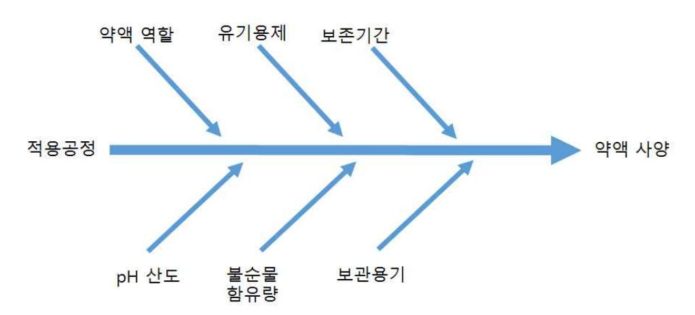

 [그림 1-4] 약액 상태에 대한 정보의 취합

사양을 정리한다.

[그림 1-4]의 그림을 참조하여 사양을 정리하여 보고서를 작성한다. 사양서에 정해진 양식 은 없으나 업계 및 사내에서 사용하는 양식의 유무를 확인하여 참고하고 작성한다. 사양서 의 정리 내용은 필요지식과 수행내용에서의 항목을 참고로 한다.

## 수행 tip

- 고객의 요구사항을 취합하는 연습을 해 본다.
- 고개의 요구를 사양서화 한다.

# **1-2.** 고객 요구사항에 대한 문제점 파악

학습 목표 • 품질관리를 위한 문제점을 파악할 수 있다.

# 필요 지식 /

# 고객의 요구사항이 구현 가능성 확인

반도체 공정에서 요구되는 화학물질 중 많은 종류는 불순물의 함유량, 보존 기간 동안의 안정성, 반응의 정확성, 반응 생성물의 안정성 등이 요구되어 지고, 이러한 요구는 경우에 따라서 상품생산이 어려운 경우가 있다. 그러한 경우 대안이나 차선책을 수립하기 위한 품 질관리의 문제점을 사전에 파악하고 대응할 필요가 있다.

여기서 중요하게 고려되어야 할 것은 고객의 요구 사양을 정리함에 있어서 안전과 품질관 리에 대한 부분은 충분히 고려되어야 한다. 본 학습모듈 외에 반도체 재료 품질관리 (193060410\_14v1)와 반도체 안전관리(193060411\_14v1)의 내용을 충분히 숙지하여야 한다. 1. 불순물

- - (1) 불순물 함유량

반도체 공정에서 가장 중요하게 여겨지는 항목이 불순물 함유량이다. 반도체 생산에 관여하는 담당자들은 제어되지 않는 불순물에 대해서는 극단적인 반응을 보이기도 하 고 실질적으로 실리콘의 웨이퍼 자체의 불순물 함유량 및 표면 오염은 가장 고급화된 기술로 관리되고 있다. 마찬가지로 웨이퍼를 세정 또는 공정용 화학약품에 대한 관리 도 엄격한 수준에서 제어되고 있고, 실제로 웨이퍼 세정용 베스의 오염으로 세정 대상 물이었던 웨이퍼들이 오염되어 사용할 수 없게 되는 경우는 반도체 디바이스 생산 공 장에서는 가끔 보고되기도 한다.

| 검출이온(+) | 검출량(ppb) | 검출이온(-) | 검출량(ppb) |
|---------|----------|---------|----------|
| NH4+    | N/D      | F-      | N/D      |
| Na+     | N/D      | NO3-    | N/D      |
| K+      | N/D      | SO42-   | N/D      |
| Ca2+    | N/D      | PO43-   | N/D      |
| Mg2+    | N/D      | Cl-     | N/D      |

<표 1-2> 금속이온 함유량 검사 항목의 예

\*N/D 검출한계 이하

# (2) 불순물의 종류

불순물의 함유량도 중요하지만, 불순물의 종류도 중요하다. 반도체에서는 칼륨 K, 칼슘 Ca, 나트륨 Na, 철 Fe 등의 금속은 극단적으로 싫어하는 금속이고, 알루미늄 Al, 니켈 Ni, 은 Ag, 텅스텐 W 등은 공정에 따라서 사용이 허용되는 금속이고, 구리 Cu는 사용 되는 경우와 제한되는 경우가 극단적으로 나뉘는 경우이다. 또한, 비메탈계 물질도 경 우에 따라서 제한을 받는다. 이상의 내용은 반도체 제품의 성능에 영향을 주는 금속이 지만 RoHS에서 정하는 사용을 금지하고 있는 내용도 주의를 기울여야 한다. RoHS에 대해서 간략하게 위키백과의 내용을 소개하면"유해물질 제한지침(Restriction of Hazardous Substances Directive)은 유럽연합(EU)에서 시행되며 해로운 물질을 사용 한 전자제품이나, 전기기기를 제한하는 지침이다."구체적으로는 납, 카드뮴, 수은, 6가 크롬, 프탈레이트, 브롬계난연제를 사용하지 않도록 하는 지침이다. 이는 유럽연합뿐만 아니라, 중국 등 대부분의 나라에서 요구되고 있다. 2. 보존의 안정성

보존에 있어서 화공약품을 장기간 보존하는 것은 어떠한 경우에도 좋지 않다. 다만, 사용 하는 입장에서는 보존 기간이 충분히 확보되길 희망하는 측면이 있다. 그러나 대부분의 약품은 보존 기간을 명기하고 있고, 그러한 내용과 희망하는 기간이 일치하는지 확인하여 야 한다. 통상 메탈계물질은 보존 기간이 길지 못하다. 자성유체의 경우 일정 기간 방치하 면 자성입자가 상호결합여여 기능을 못 할 수도 있다. 보존에 있어서 다음의 사항을 확인 할 필요가 있다.

- 보존 기간

- 보관온도 ; 인화성 및 자기반응 여부 ; 기화, 승화 조건 확인
- 광 반응성 : 재료 중 빛에 대한 반응성이 있는 경우도 있다 ; PR, 질산 등
- 보관 용기 내부 압력 확인

# 3. 반응의 정확성

화학 반응은 수소와 산소처럼 한 가지 한 번의 반응만으로 끝나는 경우도 있지만, 물과 철의 반응처럼 여러 가지 형태의 여러 가지 반응 생성물을 만들어 내는 경우도 있다. 반 도체 공정처럼 복잡한 반응을 이끌어 내는 경우는 의도하지 않은 반응이 동반될 수도 있 다. 따라서 반응의 정확성을 기하기 위하여 온도, 압력(가압), 빛, 진공, 플라스마 등의 여 러 가지 조건이 사용되기도 한다. 따라서 반응의 조건을 명확히 할 필요가 있다.

(1) PR의 경우

경화 : 빛 ; 자외선, KrF, ArF 등 에칭공정 시 최대온도 ; 통상 120도 이하 ; 타지 않을 온도 PR 제거 ; Dry 방식 : 400도 이상의 온도, O2 Gas, 플라스마 등 Wet 방식 : 유기용제 ; 신너, 벤젠, 알코올 등

(2) 질산 NHO3의 경우 ; 빛에 의하여 분해된다.

4. 반응 생성물의 안정성

반응 생성물은 통상 반응 결과로 원하는 반응과 그에 대한 부산물이 형성되는데 통상적으 로 반응 생성물은 제거나 세정의 대상이 된다. 그런데 경우에 따라서는 반응 생성물이 강 한 결합을 형성하여 세정이 불가능하거나 세정이 어려운 경우도 있을 수 있다.

- (1) 반응 생성물이 기체의 경우 반응 후 분산물이 기체의경우로 일산화탄소 CO, 이산화탄소 CO2, 수증기 H2O 등의 반을 생성물을 내놓는 경우이다.
- (2) 반응 생성물이 액체의 경우 반응 생성물이 점도를 가지거나, 반응 생성물에 다량의 H2O가 발생하여 수용성 반응 생성물이 녹아 들어가는 경우가 있다. 취급에 주의를 기울여야 하고 반응 챔버의 재질
  - 에도 주의를 기울여야 한다.
  - (3) 반응 생성물이 고체(Powder)의 경우

반응 후에 파우더의 형태로 존재하는 물질로 액체 약품보다는 Gas 반응에서 주로 발 생한다. Toxic인 경우도 있으므로 취급에 주의해야 한다.

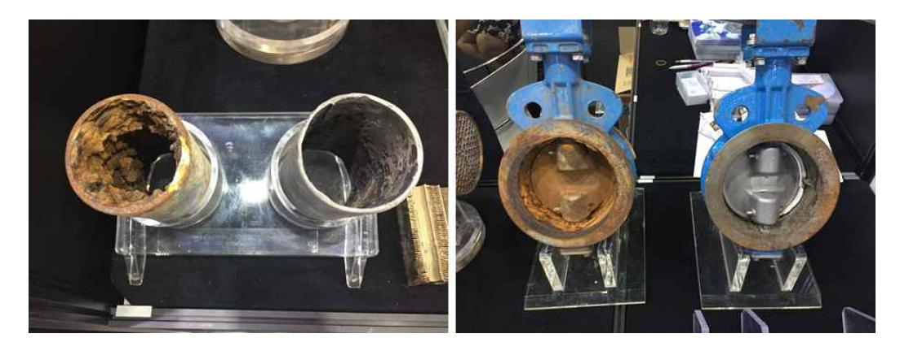

[그림 1-5] 배관 및 밸브에서 반응 생성물이 부착된 사례

# 고객의 요구사항이 당사에서의 대응 가능 여부 판단

고객의 요구가 기존에 시장에서 통용되고 있는 재료에 대한 요구라고 하더라고 수주를 희 망하는 회사의 설비가 고객의 희망 사양을 만족하지 못하면 제품의 수주를 진행할 수 없 다. 따라서 디바이스 메이커의 요구 사양을 신중하게 검토해야 한다. 1. 생산시설

통상의 산업용보다 엄격한 관리를 요구하고, 순도나 제품 안정성을 요구하므로 당사에서 대응이 가능한지 사양 단계에서 확인한다.

2. 품질관리를 위한 검사 시설

제품의 검사가 가능한지 확인하고 검토할 필요가 있다.

3. 고객에 대한 사후 관리와 지속적인 제품개발에 대한 대응이 가능 여부 반도체 산업에서 요구되는 지속적인 기술개발 및 현장 이슈에 대한 대응 능력이 있는가를 사전에 충분히 파악하고 있어야 한다.

# 수행 내용 / 고객 요구 사양의 안정성 시트 작성하기

# 재료·자료

- Ÿ 고객으로부터의 자료 및 회의록
- Ÿ 자사의 생산설비 관련 객관적 자료
- Ÿ 자사 및 주변 인프라의 분석 장비 및 자료

# 기기(장비 ・ 공구)

- Ÿ 자료 조사 및 분석용 컴퓨터
- Ÿ 품질관리를 위한 분석 툴 및 분석 장비
- Ÿ 각각의 물질에 적합한 측정 장비

# 안전 ・ 유의 사항

- Ÿ 고객 및 자사의 자료의 취급에는 주의를 기한다.
- Ÿ Sample 채집에 접합한 도구와 장비를 사용하고 안전·유의 사항에 충분히 주의를 기한다.
- Ÿ Sample 분석에 적합한 도구와 장비를 사용하고 sample 이라고 해도 Toxic 물질일 경우 적합한 방호구를 착용하고 안전에 주의하도록 한다. 수행 순서

 고객의 요구사항에 적합한 성능의 구현 가능한가를 확인한다. 고객의 요구 사양에 대한 적합성 확인을 위해서는 스펙서를 작성해야 하는데 임의의 공정 을 정하여 필요한 요구 사양에 대한 다음의 내용을 결정하고 시트로 작성하도록 한다.

- 1. 불순물 : 스펙서를 작성한다.
  - (1) 불순물의 종류를 결정한다.
  - Ÿ 금속 : Na, K, Ca, Mg, Fe, Cr 등
  - Ÿ 비금속 불순물 : C, H2O(수분 함유량), Gas 함유량 등

 Ÿ 기타 파티클 : 비반응성 물질 : Al2O3(산화알루미늄), SiO2(산화규소), 기타 카본체인 상기 물질 등의 허용량과 절대 함유 불가의 물질 등의 사양을 결정한다. 물질에 따라서 필요한 사양을 결정한다.

- (2) 불순물 함유량에 대한 스펙(단위)을 정한다.
- Ÿ ppm = ug/mL = mg/L
- Ÿ ppb = ng/mL = ug/L
- Ÿ ppt = pg/mL = ng/L
- 2. 보존의 안정성

보존에 관련된 요구 사양과 가능 사양서를 작성한다. 보존에 있어서 다음의 사항을 확인 하고 필요한 사양을 결정한다.

- Ÿ 보존 기간
- Ÿ 보관온도
- Ÿ 광 반응성
- Ÿ 보관 용기 내부 압력
- Ÿ 기타 추가적인 사양
- 3. 반응의 정확성

적확한 반응을 위하여 필요한 항목을 정하고 사양을 정한다.

(1) PR의 경우

경화 : 경화의 정도를 확인하는 데 필요한 방법을 명확하게 한다.

에칭공정 시 허용온도 : 에칭과정에서 발생하는 열과 PR의 내구온도를 확인한다. PR 제거 ; Dry 방식 : Plasma를 이용할 경우의 Recipe를 확인한다. Wet 방식 : Chemical을 사용할 경우의 배합비율과 Recipe를 확인한다.

- (2) 질산 NHO3 등 약액 반응의 경우 : 반응 생성물과 반응 잔류물의 여부를 확인한다.
- (3) 증착 물질의 경우 : 반응 증착 물질의 특성을 확인한다. 4. 반응 생성물의 안정성
- - (1) 반응 생성물 기체의 경우에 대한 안정성 확인
  - (2) 반응 생성물 액체의 경우에 대한 안정성 확인
  - (3) 반응 생성물 고체(Powder)의 경우에 대한 안정성 확인

21

- 고객의 요구사항이 당사에서 대응 가능한가를 확인한다. 1. 생산시설 측면에서의 대응 가능성 확인 : 순도관리, 생산의 안정성, 생산물량의 확보
  - 2. 품질관리를 위한 검사 시설 확보에 대한 능력 확인 : 품질관리 툴의 확보 여부 6-시그마를 통한 품질관리, 통계적 기법을 통한 품질관리 등
  - 3. 고객에 대한 사후 관리와 지속적인 제품개발에 대한 대응이 가능 여부 불순물 관리 시트에서는 검출 수치와 검출 불순물의 판정 기준수치를 표기하고 판정 여부 를 시트에 표기한다.

<표 1-3> 불순물 관리 시트의 작성 예 (수치는 예시임)

|          | K    | Ca   | Na   | Mg   | Fe   | Cu    | C | H2O |
|----------|------|------|------|------|------|-------|---|-----|
| 단위 (ppm) |      |      |      |      |      |       |   |     |
| 검출수치     | 15.0 | 22.0 | 18.0 | 23.0 | 15.0 | 10.00 |   |     |
| 허용기준     | 20.0 | 20.0 | 20.0 | 20.0 | 20.0 | 8.00  |   |     |
| 미만일 것    | 가    | 부    | 가    | 부    | 가    | 부     |   |     |
| 판정       |      |      |      |      |      | 불가    |   |     |

# 수행 tip

- 사양 요구에 대해서 수치화한다.
- 고객의 요구를 문서로 작성한다.

# 학습1 교수·학습 방법

# 교수 방법

- 고객의 요구 공정에 대한 사례를 제시하고, 그룹별로 사례를 분석하고 사양을 정하도록 진행하고 각각의 조별 역할 분담을 통하여 필요로 하는 공정에 대한 사양을 결정하고 사양서를 작성하도록 지도한다.
- 고객과의 재료 사양회의를 진행하기 위한 자료를 준비하도록 지도한다.
- 사양서의 내용에 적합한 설비를 선정하고 내용의 설비에서 가능한 사양에 대해서 정리하여 설명한다.
- 대상 물질 특성에 대해서 확인할 수 있도록 지도 교수 한다(MSDS, CAS Sheet 등).
- 사양을 항목을 직접 정할 수 있도록 지도하고, 사양의 스펙을 정할 수 있도록 지도한다.
- 사양서 작성을 각 단계별로 지도하여 사양서를 작성하도록 지도한다.
- 사양회의를 정리하도록 하고 보고사양서를 작성하도록 지도한다.

# 학습 방법

- 고객과의 미팅 내용을 사전에 준비해본다.
- 고객의 요구에 적합한 사양서를 작성해본다.
- 사양서에 적합한 물질의 특성을 파악한다.
- 사양서의 요구에 적합한지 측정해 본다.
- 물질의 안전성에 대해서 확인 해 본다.
- 반도체 공정을 이해하고 공정에서 필요로 하는 물질의 요구조건에 대해서 정리해본다.

# 학습1 평 가

# 평가 준거

• 평가자는 학습자가 학습 목표를 성공적으로 달성하였는지를 평가해야 한다.

# • 평가자는 다음 사항을 평가해야 한다.

|                       |                                                                    | 성취수준 |   |   |
|-----------------------|--------------------------------------------------------------------|------|---|---|
| 학습 내용                 | 평가 항목                                                              | 상    | 중 | 하 |
| 고객의 요구사항              | - 최종 제품의 생산에 필요한 습식화공약품(Wet Chemical) 공정을 파악할 수 있다. |      |   |   |
| 확인 후 사양서 작성        | - 고객의 요구사항에 의한 습식화공약품(Wet Chemical) 재료를 파악할 수 있다.            |      |   |   |
| 고객 요구사항에 대한 문제점 파악 | - 품질 관리를 위한 문제점을 파악할 수 있다.                                      |      |   |   |

# 평가 방법

• 서술형 시험

|                       |                                                                     | 성취수준 |   |   |  |
|-----------------------|---------------------------------------------------------------------|------|---|---|--|
| 학습 내용                 | 평가 항목                                                               | 상    | 중 | 하 |  |
| 고객의 요구사항을             | - 최종 제품의 생산에 필요한 습식화공약품(Wet Chemical) 공정의 지식의 이해도 여부 |      |   |   |  |
| 확인하고 사양서 작성        | - 고객의 요구사항에 의한 습식화공약품(Wet Chemical) 재료의 이해도 여부                |      |   |   |  |
| 고객 요구사항에 대한 문제점 파악 | - 품질 관리를 위한 문제점에 대한 이해도의 여부                                      |      |   |   |  |

# • 사례연구

| 학습 내용                                            | 편기 친모                                              |   | 성취수준 |   |  |  |
|--------------------------------------------------|----------------------------------------------------|---|------|---|--|--|
| 획급 네궁                                            | 평가 항목                                              | 상 | 중    | 하 |  |  |
|  고객의 요구사항을 확인하고 사양서                        | - 최종 제품의 생산에 필요한 습식화공약품(Wet Chemical) 공정을 파악 여부 |   |      |   |  |  |
| 작성 - 고객의 요구사항에 의한 습식화공약품(Wet Chemic 재료의 제시 여부 |                                                    |   |      |   |  |  |
| 고객 요구사항에 대한 문제점 파악                            | - 품질 관리를 위한 문제점을 파악하고 개선의 제안 여부                    |   |      |   |  |  |

# • 평가자 체크리스트

| 학습 내용                                                                | 평가 항목                                                     |   | 성취수준 |   |  |
|----------------------------------------------------------------------|-----------------------------------------------------------|---|------|---|--|
|                                                                      |                                                           | 상 | 중    | 하 |  |
| 고객의 요구사항을 확인하고 사양서                                                | - 최종 제품의 생산에 필요한 습식화공약품(Wet Chemical) 공정을 파악하고 있는가의 여부 |   |      |   |  |
| 작성 - 고객의 요구사항에 의한 습식화공약품(Wet Chemical) 재료를 파악하고 재료를 제시할 수 있는가의 여부 |                                                           |   |      |   |  |
| 고객 요구사항에 대한 문제점을 파악                                            | - 품질 관리를 이해하고 문제점을 파악하고, 개선안을 제시 여부                    |   |      |   |  |

# 피드백

1. 서술형 시험

- 상황에 대한 서술을 진행하고 부족 할 경우 내용에 대한 보완을 진행한다.

2. 사례연구

- 적용 약품에 대한 사례 연구를 진행하고 사례에서의 적합성을 검토하도록 한다.

- 3. 평가자 체크리스트
  - 작성된 사양서를 기준으로 평가하되 부족한 부분은 과제를 부여하여 확인하도록 한다.

| 학습 1 | 반도체용 습식화공약품(Wet Chemical) 재료 요구사항 파악하기(LM1903060405_14v1.1) |
|------|----------------------------------------------------------------|
| 학습 2 | 반도체용 습식화공약품(Wet Chemical) 재료 선정하기                           |
|      | (LM1903060405_14v1.2)                                          |
| 학습 3 | 반도체용 습식화공약품(Wet Chemical) 재료 제조하기                              |
|      | (LM1903060405_14v1.3)                                          |
| 학습 4 | 반도체용 습식화공약품(Wet Chemical) 제품 특성                                |
|      | 검증하기(LM1903060405_14v1.4)                                      |

# **2-1.** 반도체 집적회로 제조공정에 적합한 습식화공약품 선정

|       | • 반도체 공정별 습식화공약품(Wet Chemical) 재료의 장점과 단점을 파악할 수 있다. |
|-------|---------------------------------------------------------|
| 학습 목표 | • 반도체 집적회로 제조 공정에 적합한 습식화공약품(Wet Chemical) 재료를 선정할   |
|       | 수 있다.                                                   |

# 필요 지식 /

반도체 공정의 이해

최근의 반도체 웨이퍼 공정에서 액체를 사용하는 경우는 각 공정 전 세정을 목적으로 하 거나 공정 진행 후 공정 잔류물 및 바이프로덕트(부산물)을 제거하기 위하여 습식화공약품 (Wet Chemical)을 하는 경우가 많다. 그러나 뒤에 장에서 다루게 될 액체, 고체, 기체의 경 계 조건에 의하여 액체, 기체, 고체의 형상 구분이 어렵거나 보관 조건에 따라서 상이 변

하는 경우도 있다. 반도체 재료를 새롭게 설계해서 생산할 경우는 해당하는 제품에 대한 MSDS를 작성하고 사용자에게 제공하여야 한다. 산업보건안전법 제41조(물질안전보건자료의 작성비치 등)에 따르면 화학물질 및 화학물질을 함유한 제제를 양도하거나 제공하는 자는 이를 양도하거 나 제공하는 자는 이를 양도받거나 제공받는 자에게 화학물질관리법의 내용을 확인하여, 사용하고 관리하기 위해 필요한 정보를 기재한 Sheet로 제조자명, 제품명, 성분과 성질, 취 급상의 주의, 적용법규, 사고 시의 응급처치방법 등이 법률과 시행령에서 정한 지침대로 기입되어 있는 화학물질 등의 안전 Data Sheet이다. 법률상 정식명칭은 "물질안전보건자 료" 이고 영문 명칭은 "Material Safety Data Sheet : MSDS"로 사용하고 있다.

- 1. 기체 재료이지만 Process에 공급과정에서 기화되는 액체 재료 : CVD, Etching
  - (1) 증착 공정 ; CVD, PVD, ALD 등

증착 공정에 사용되는 재료는 통상 Gas 형태로 반응 챔버에 공급되지만 금속 계열의 증착 재료나 분자량이 큰 재료의 경우 액체 상태로 운반 및 보관하거나 보관 용기 안 에서 액체와 기체가 공존하는 경우가 있다.

(2) 에칭공정 ; Etching

에칭 공정은 대표적인 기체를 사용하는 공정이기는 하지만 반응 Gas 중 분자량이 큰 기 체가 공급 가스관의 압력과 온도 조건에 따라서 액체로 존재하는 구간이 있을 수 있다. 2. 액체 상태로 진행되는 공정 : 세정, Wet etching

반도체 공정에서 액체를 가장 많이 사용하는 공정으로 최근에는 세정과 Wet Etching을 한 공정으로 진행하는 경우도 있지만, 본 텍스트에서는 나누어서 구체적으로 언급해 보도록 하겠다.

(1) Wet Etching

초기 반도체 공정의 에칭공정을 담당하던 기술로 등방성 에칭의 특성을 가지나, 장비 에서 유체의 흐름 또는 온도를 제어해서, Dry 에칭 공정 이후에 PR 또는 부산물을 제 거하기 위한 공정으로 진행한다.

(가) HF : 불산을 적용하는 공정

강한 HF를 적용하여 Si 및 SiO2 막을 제거하기 위한 공정으로 실질적으로 에칭을 진행하기도 한다. 통상 HF의 수용액 농도는 10% 미만을 적용한다. 농도에 관계없 이 인체에 매우 유해하다.

(나) 산 염기를 적용하는 공정

제거할 대상의 성질 및 상태에 따라서 산과 알칼리를 적절하게 배합하여 사용한다. 대상물이 염기 이거나, 또는 반응 생성물이 알칼리인가에 따라서 배합 정도를 조절 하기도 한다. 어느 쪽이든지 불순물 함유량에 주의를 기울여야 한다.

- 산 : 염산, 질산, 황산, 인산 등

- 알칼리 : 암모니아, 수산화나트륨 수용액 등

(2) 세정

Wet Etching이 대상 물질의 반응을 유도하여 제거하거나 Etching을 한다고 하면, 세정은 중성 물질을 사용하여 대상물을 녹이거나 씻어내서 웨이퍼를 깨끗하게 하는 공정이다.

(가) 초순수를 사용하여 세정을 하는 경우

사용된 약액의 농도를 낮추고 중화반응을 하는 과정에서 생성된 부산물 중에서 물 에 녹는 수용성 부산물의 제거를 위한 목적으로 사용된다.

27

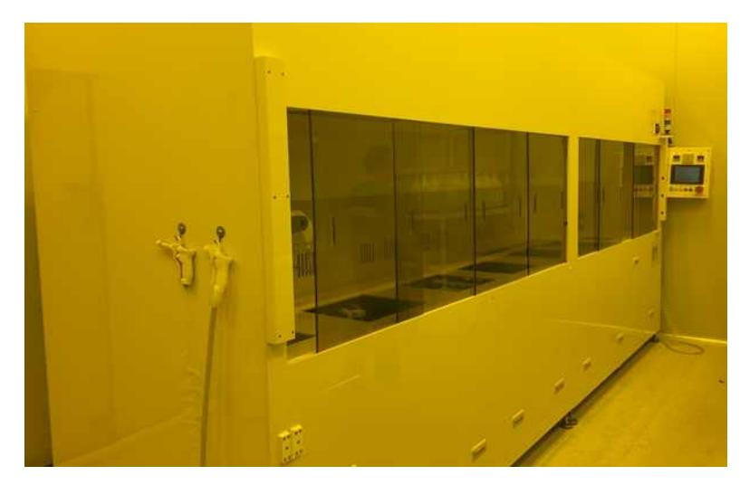

[그림 2-1] WetEtching 및 세정장비

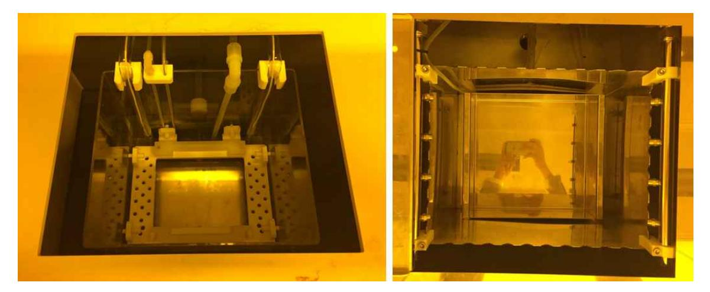

[그림 2-2] Wet 장비의 세정 Bath 예

# (나) 알코올을 사용하여 세정을 하는 경우

초순수와 사용 용도가 비슷하나 초순수와 함께 사용하여 계면 활성제 역할을 하거 나 유기용제에 녹은 부산물 및 불순물의 제거에 사용된다. 3. 포토공정 : Photo Resister

## (1) Photo Resister

반도체 생산에서 대표적으로 액체를 사용하는 공정으로, 반도체 생산에 있어서 중요한 공정으로 재료는 빛에 반응하여 경화되는 특성을 이용하는 경우와 반대로 빛에 반응한 부분을 제거하는 방식을 활용하는 방법이 있다. PR의 도포와 성형 및 불필요한 부분을 제거하는 공정 등에 액체를 사용하게 된다.

(2) 희석제 ; 벤젠, 알코올 등

PR의 중요한 성분 중 카본체인이 상당량 포함되어 있으므로 농도의 조절 및 웨이퍼 액션을 제어하기 위하여 희석제를 투입하는데 이 희석제의 조합은 중요한 포인트이다.

(3) 도포 : 스핀, 롤 프린팅

- 스핀 : PR을 웨이퍼에 균일하게 도포하기 위하여 웨이퍼를 회전시키는 방법

- 롤 프린터 : 반도체 웨이퍼에서는 거의 사용되지 않지만 PV, FPD 등에서 사용

- 스캐너 방식: 넓은 면적의 웨이퍼에 적용 ; 450mm 웨이퍼 적용이 검토되기도 한다.

- 공정 완료 후 웨이퍼에 존재 여부 : 공정 구조물 웨이퍼에 부착, 공정 후 제거 물질 공정 완료 후 제공된 재료가 어떠한 형태로든지 웨이퍼에 남는 경우와 웨이퍼에서 제거되 는 경우에 따른 관리와 공정 전후의 관리 및 대상물질의 관리가 필요하다. 1. 공정 후 부착

대표적으로 CVD 공정이 대표적으로 산화막 층, 질화막 층, 금속막 층을 형성하는 경우가 대표적이다.

- (1) 산화막 : SiO2, Al2O3, HfO2, Y2O3, Ta2O5, TiO2, ZrO2 등
- (2) 질화막 : SiN, HfSiON, TiN 등
- (3) 금속막 : Ni, Ti, W, Cu 등
- 2. 공정 후 제거

PR은 공정 진행 후 제거를 해야 하는 물질의 대표적인 대상 물질이다. 따라서 에칭공정 후의 PR을 확실하게 제거하기 위한 여러 가지 고려가 적용된 공정을 진행하게 된다. 에칭 공정 이후에 에셔공정은 에칭 이후의 PR 잔존물 및 부산물을 효과적으로 제거하기 위한 여러 가지 연구가 병행되고 있다.

물질 상태의 이해

물질의 상태는 온도와 압력에 따라서 액체, 기체, 고체를 결정하게 된다. 사전적으로 이상 기체 상태 방정식에 대한 이해가 필요하다. 1. 압력

반도체 공정에서 압력은 중요한 요소 중의 하나로서 압력 자체가 물질의 상태를 결정하는 요소이기도 하다. 통상 압력이 증가하면 고체나 액체로 존재하기가 쉽고, 압력이 낮아지면 가스로 존재하기가 쉽다. 반도체 공정에서 CVD 및 Dry 에칭공정의 경우 고진공 및 초고 진공 상태에서 진행하게 된다.

[그림 2-3] 이상기체 상태방정식

2. 온도

온도는 압력과 함께 물질의 상태를 결정 짖는 요소로 통상 온도가 증가하면 가스로 존재 할 가능성이 높아지게 되다. 아래의 그래프의 경우 물의 상평형 그래프이다. 물의 경우 대 기압 1기압(760mmHg 또는 1024mBar)에서 끓는점이 100℃이다.

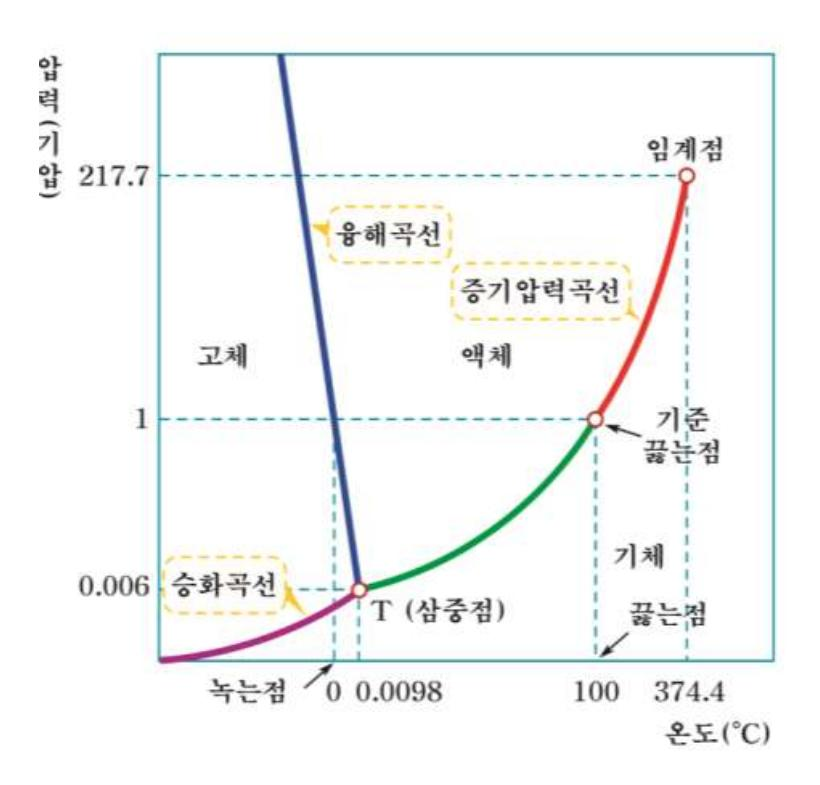

[그림 2-4] 물의 상평형 그래프

# 수행 내용 / 재료 특성 확인하기

# 재료·자료

- Ÿ 리트머스 시험지
- Ÿ 실험 재료의 MSDS, CAS. Sheet
- Ÿ 재료물질 : 순수 H2O, 테스트 시약

# 기기(장비 ・ 공구)

- Ÿ 압력과 온도 조절이 가능한 Chamber
- Ÿ 압력과 온도측정이 가능한 계측기
- Ÿ pH 측정기

# 안전 ・ 유의 사항

- Ÿ 고압의 폭발 비상에 대비한 보호 장구(보호구, 보호 안경, 보호복 등)를 착용한다.
- Ÿ 약액의 취급에 대한 안전·유의 사항을 준수한다.
- Ÿ기구 및 공구의 안전·유의 사항을 준수한다. 수행 순서

물질의 성질을 확인한다.

아래의 각 항목에 대한 조건을 확인하고 적용공정을 확정하고 재료의 특성을 확인하고, 각 재료의 MSDS를 확보하도록 한다. 아래 실험에 대한 실험보고서를 작성하도록 한다. 아래[그 림 2-5] [그림 2-6]에서의 pH 측정기나 [그림 2-7]의 리트머스 시험지를 활용하도록 한다. 1. 액체 상태로 진행되는 공정 : 세정, Wet etching

- - (1) Wet Etching
    - (가) 산을 적용하는 공정 : 수용액의 pH 농도를 설정하여 희석을 진행한다.
      - pH 농도를 설정한다.
      - 초기 상태를 확인한다.
      - 약액과 시약을 혼합한다.
      - 최종 상태를 확인한다.

- (나) 알칼리를 적용하는 공정
  - pH 농도를 설정한다.
  - 초기 상태를 확인한다.
  - 약액과 시약을 혼합한다.
  - 최종 상태를 확인한다.
- (2) 세정

Wet 세정을 진행한 후 최종 세정 수용액의 산도를 확인한다.

(가) 혼합약액을 사용하여 세정을 하는 경우

사용된 약액의 산과 알칼리를 혼합하여 pH7의 중성 약액을 혼합한다.

- pH 농도 7을 설정한다.
- 초기 상태를 확인한다.
- 약액을 혼합한다.
- 최종 pH7의 상태를 확인한다. 측정방법
- 리트머스 시험지법
- 산도 측정기 : pH 측정기
- (나) 알코올을 사용하여 세정을 하는 경우

유기물의 잔류를 확인하기 위하여 UV lamp로 상태를 확인한다.

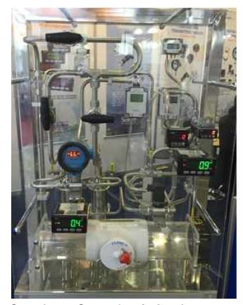

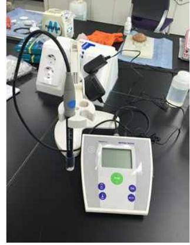

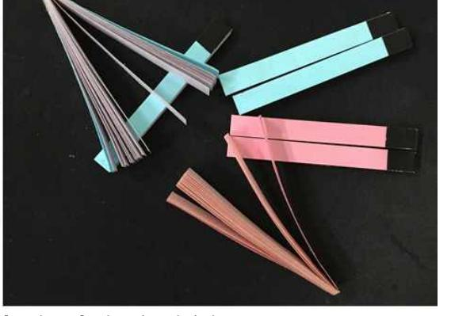

[그림 2-5] 분석 설비 예 [그림 2-6]휴대형 pH 측정기 [그림 2-7] 리트머스시험지

 압력과 온도에 대한 물질의 상태를 확인한다. 압력제어와 온도제어가 가능한 챔버를 준비하고 압력과 온도의 변화에 따른 물의 특성 변 화를 확인한다.

1. 압력 고정하고 온도 변화에 따른 물의 상변화를 모니터하고 기록한다. 압력 0.5ATM에서 10도씩 변화를 확인한다. 압력 1.0ATM에서 10도씩 변화를 확인한다.

- 압력 1.5ATM에서 10도씩 변화를 확인한다. 압력 2.0ATM에서 10도씩 변화를 확인한다. 2. 상기 실험 결과를 기본으로 앞에서 배운 물질들에 대한 상태에 대해서 토론해본다.

 물질을 이상기체 상태방정식으로 해석해본다. 이상기체 상태방정식은 압력[P], 체적[V], 온도[T]에 대하여 완전하게 설명되는 가상적인 기 체에 대한 해석을 할 수 있는 방정식으로, 보일의 법칙, 샤를의 법칙, 아보가드로의 법칙을 통하여 온도의 변화에 따른 물의 특성 변화를 확인한다. 예를 들어서 압력을 고정할 경우 체적의 변동에 따라서 온도가 변동하는 것을 수식을 통해서 확인할 수 있고, 실질적으로 실험을 통해서 수식의 경향성을 확인할 수 있다.

$$P = \frac{nRT}{V}$$

$$V = \frac{nRT}{P}$$

$$T = \frac{PV}{nR}$$

$$PV = nRT$$

$$\frac{PV}{T} = nR,$$

[그림 2-8] 이상기체 상태방정식의 변형 예

- 1. 압력 P를 고정하고 아래 상수의 변화에 대한 해석을 한다.
  - V 체적
  - T 온도
  - n, R 상수
- 2. 온도 T를 고정하고 아래 상수의 변화에 대한 해석을 한다.
  - P 압력
  - V 체적
  - n, R 상수

- 3. 체적 V를 고정하고 아래 상수의 변화에 대한 해석을 한다.
  - P 압력
  - T 온도
  - n, R 상수
- 4. 상수 n, R을 고정하고 아래 상수의 변화에 대한 해석을 해본다.
  - T 온도
  - P 압력
  - V 체적

# 수행 tip

- 물질의 기본 반응특성을 이해한다.
- 물질의 성상이 주변 환경에 따라서 변할 수 있음을 이해한다.

# **2-2.** 습식화공약품의 공정적용에 대한 문제점 해결

학습 목표 • 선정된 반도체 습식화공약품(Wet Chemical)의 재료의 도출된 문제점에 대한 해결방 안을 제시할 수 있다.

# 필요 지식 /

습식화공약품의 공정 적용에 대한 문제점에 대해서 몇 가지 사례와 구분을 가지고 정리하기 에는 내용이 방대하기는 하나, 작업 공정의 전과 후로 나누어서 구분을 해보기로 한다.

공정 전 문제에 대한 고려

습식화공약품을 공정에 적용하기에 앞서 약액의 불순물 함유량, 보관상태, 사용 전 준비상 태 등에 대한 점검이 필요하다. 1. 불순물함유량

반도체 공정에서 불순물 함유량에 대한 사양은 매우 중요한 문제로 반도체 재료는 초기제 조단계에서 불순물을 얼마나 포함하지 않고, 보관 중 불순물이 포함되지 않는 등 불순물 을 얼마나 제어할 수 있는지가 기술적 관건인 경우가 많다.

- (1) 불순물의 종류
  - 메탈계 불순물
  - 공기 중의 먼지 및 수분 함유량
  - 보관 용기의 용해 침투
- 2. 보관상태

재료 및 소모품을 공급받아서 바로 사용할 수 있다면, 재고 관리적인 측면 외에도 재료의 상태가 항상 최적의 상태일 것이나 현실적으로는 재료를 창고에 보관하여 사용을 하게 되 므로 보관 용기 및 보관 장소에 대해서 고려를 해야 한다. 보관에 대해서는 다음의 상태 를 확인하여야 한다.

- (1) 혼합보관에 대한 법적관리 항목의 확인 일정 보관량을 넘어가면 동일한 공간에서 함께 보관할 수 없는 경우에 대해서 법과 시 행령 MSDS등의 내용을 사전에 확인하여야 한다.
- (2) 보관환경에 대한 확인

재료별 온도, 습도, 통풍에 대해서 확인을 해야 한다. 통상 포토레지스트는 빛에 대해 서 민감하므로 조명에 주의하여야 한다.

(3) 보관 용기에 대한 고려

약액 재료의 유효기간도 중요하게 관리 되어야 하지만, 보관 용기의 유효기간도 중요 하게 관리 되어야 한다. 보관 용기의 오염 및 중간 용기의 오염은 반도체 공정 전체에 대한 문제 및 장비를 정비해야 하는 경우도 있다. HF 수용액이나 혼합수용액은 SiO2 즉 유리를 녹이는 걸로 알려져 있고, 염소 Gas는 에폭시 수지를 약화 시키는 걸로 알 려져 있다. 많은 화학약품이 속도의 문제는 있지만, 금속 및 플라스틱 재료와 반응을

지속하고 있다. 3. 사용 전 준비상태 확인

화학 약품을 사용하기에 앞서 사용조건에 맞추어서 배합을 해야 하는 경우 배합 조건에 대해서 확인하고, 배합 환경과 배합 전후의 배합상태에 대한 확인을 해야 한다.

공정 후 문제에 대한 고려

공정 전에 문제점에 대한 확인을 하고 문제가 없었다고 하면 통상 공정 진행 후에 문제는 없을 경우가 많으나, 현실적으로 반도체 생산 공정에서는 공정 후에 문제가 생기는 경우가 있다. 세정의 경우 공정 대상의 웨이퍼의 표면 구성이 바뀌거나 대상 막의 재료나 결합 구 조가 바뀔 경우 세정공정에서 문제가 발생하는 경우가 있다.

# 수행 내용 / 공정 전/공정 후 문제점 확인을 위한 샘플채취 하기

# 재료·자료

- Ÿ 보관 용기에 대한 정보 및 자료
- Ÿ 보관 방법에 대한 MSDS 상에서의 지시사항
- Ÿ 보관 용기 구조의 확인 자료
- Ÿ 실험 확인용 보관 용기

# 기기(장비 ・ 공구)

- Ÿ 보관 용기 절단기
- Ÿ 실험에 필요한 측정기
- Ÿ 측정에 필요한 샘플 채취 KIT

# 안전 ・ 유의 사항

- Ÿ 보관 용기 절단 작업 시에 주의해야 한다.
- Ÿ 보관 용기 안에 남아있을 잔류 물질을 주의해야 한다.
- Ÿ 샘플채취에 따른 안전 및 유의 사항을 숙지한다.

# 수행 순서

불순물 함유량 데이터의 해석을 위한 샘플을 준비한다. 습식화공약품을 운반 및 보관 과정에서의 이상 유무를 확인하기 위하여 용기에서 샘플을

채취하고 실험보고서를 작성하도록 한다. 1. 불순물함유량

용기 표면의 상태를 확인할 샘플을 채취한다.

- (1) 샘플의 종류
  - 용기 내부의 용액 샘플
  - 용기 내부 표면의 샘플
  - 용기의 절단 샘플
- 2. 측정샘플의 제작

채취한 샘플을 측정이 가능한 상태의 측정 샘플로 제작한다. 측정샘플은 채취샘플을 측정 이 가능 상태로 가공하거나 측정기에 삽입하기 위한 작업이다.

- (1) 표준 약액과의 혼합
- (2) 주사기 등 컬럼관에 챔플 충진 : HPLC 측정기용
- (3) 표준 페이퍼 등의 흡착 : 파티클 카운터용
- (4) 표준 시편의 제작 : 반도체 샘 시편 등

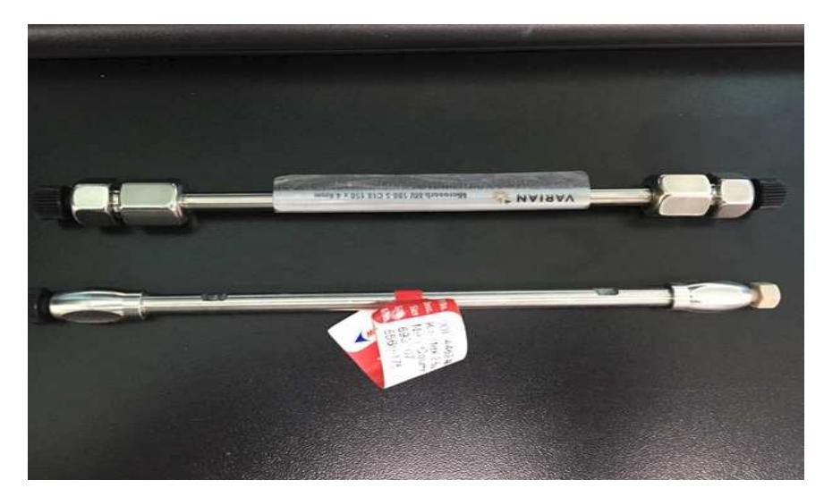

[그림 2-9] 샘플채취기의 예

3. 샘플의 측정

제작한 샘플을 측정기에 삽입하여 측정한다.

- (1) 표준 약액과의 혼합 : pH 측정기
- (2) 주사기 등 컬럼관에 챔플 충진 : HPLC 측정기
- (3) 표준 페이퍼 등의 흡착 : 파티클 카운터
- (4) 표준 시편의 제작 : 광학 현미경, 샘 사진 등
- 공정 후 문제에 대하여 확인한다. 반응 후 반응 생성물을 채취하여 앞의 과정을 반복한다.

# 수행 tip

- 공정에 투입하기 전의 약액 보관 용기 상태를 확인 한다.
- 샘플제작과 기본 내용을 확인한다.

# 학습2 교수·학습 방법

# 교수 방법

- 압력, 온도 등 여러 조건에 대한 물질의 성상을 확인할 수 있는 실험 킷을 구성하고 물질의 성상 변화를 모니터하도록 지도한다.
- pH 농도변화를 확인할 수 있는 실험 킷을 구성하고 변화를 모니터하도록 지도한다.
- 동일 약액의 성상별 특성에 대해서 설명한다.
- 환경에 따른 약액의 성상 변화 가능성에 대해서 설명한다.
- 샘플 채취에 대한 개념을 설명한다.
- 표준샘플(측정가능)에 대한 개념을 설명한다.
- 샘플 측정에 대한 데이터 해석에 대해서 설명한다.
- 각 실험의 과정과 결과를 실험 보고서를 작성하도록 하고 작성된 실험보고서를 토대로 상호 평가하도록 지도한다.

# 학습 방법

- 약품의 액체, 기체, 고체의 경우의 물리적 특성을 공부한다.
- 특정 약품에 대한 성상 변화 조건에 대해서 공부한다.
- 표준 샘플을 필요로 하는 측정기기 및 측정 방법에 대해서 학습한다.
- 샘플제작 및 샘플채취에 대한 사례를 학습한다.
- 샘플 데이터 해석 사례에 대해서 학습한다.

# 학습2 평 가

# 평가 준거

• 평가자는 학습자가 학습 목표를 성공적으로 달성하였는지를 평가해야 한다.

# • 평가자는 다음 사항을 평가해야 한다.

| 학습 내용                          | 평가 항목                                                              | 상 | 성취수건 | Ē |
|--------------------------------|--------------------------------------------------------------------|---|------|---|
| 의급 네용                       | 경가 왕국                                                              | 상 | 중    | 하 |
| 반도체 집적회로 제조공정에 적합하       | - 반도체 공정별 습식화공약품(Wet Chemical) 재료의 장 단점을 파악할 수 있다.              |   |      |   |
| ㅋ집원 습식화공약품 선정            | - 반도체 집적회로 제조 공정에 적합한 습식화공약품 (Wet Chemical) 재료를 선정할 수 있다.       |   |      |   |
| 습식화공약품의 공정 적용에 대한 문제점 해결 | - 선정된 반도체 습식화공약품(Wet Chemical) 재료의 도 출된 문제점에 대한 해결방안을 제시할 수 있다. |   |      |   |

# 평가 방법

• 서술형 시험

| 학습 내용                          | 평가 항목                                                    | 성취수준 |   |   |  |
|--------------------------------|----------------------------------------------------------|------|---|---|--|
| 약답 내용                       | 경가 양국                                                    | 상    | 중 | 하 |  |
| 반도체 집적회로 제조공정에 적합한       | - 반도체 공정별 습식화공약품(Wet Chemical) 재료의 사 양의 이해 여부         |      |   |   |  |
| - 집 근 습식화공약품 선정          | - 반도체 집적회로 제조 공정에 적합한 습식화공약품 (Wet Chemical) 재료의 이해 여부 |      |   |   |  |
| 습식화공약품의 공정 적용에 대한 문제점 해결 | - 선정된 반도체 습식화공약품(Wet Chemical) 재료에서 도출된 문제점에 대한 이해 여부 |      |   |   |  |

# • 사례연구

| 학습 내용                          | 편기 하모                                                              | 성취수준 |   |   |  |
|--------------------------------|--------------------------------------------------------------------|------|---|---|--|
| 익답 네동                          | 평가 항목                                                              | 상    | 중 | 하 |  |
| 반도체 집적회로 제조공정에 적합한       | - 반도체 공정별 습식화공약품(Wet Chemical) 재료의 사 례별 장단점의 파악 여부              |      |   |   |  |
| 습식화공약품 선정                   | - 반도체 집적회로 제조 공정에 적합한 습식화공약품 (Wet Chemical) 재료의 사례별 선정 여부       |      |   |   |  |
| 습식화공약품의 공정 적용에 대한 문제점 해결 | - 사례별로 선정된 반도체 습식화공약품(Wet Chemical) 재료의 도출된 문제점에 대한 해결방안을 제시 여부 |      |   |   |  |

• 평가자 체크리스트

| 하스 내요                           | 평가 항목                                                              | 성취수준 |   |   |  |
|---------------------------------|--------------------------------------------------------------------|------|---|---|--|
| 학습 내용                           | 경가 영국                                                              | 상    | 중 | 하 |  |
| 반도체 집적회로 제조공정에 적합하        | - 반도체 공정별 습식화공약품(Wet Chemical) 재료의 장 단점을 파악할 수 있다.              |      |   |   |  |
| 습식화공약품의 선정                   | - 반도체 집적회로 제조 공정에 적합한 습식화공약품 (Wet Chemical) 재료를 선정할 수 있다.       |      |   |   |  |
| 습식화공약품의 공정 적용에 대한 문제점의 해결 | - 선정된 반도체 습식화공약품(Wet Chemical) 재료의 도 출된 문제점에 대한 해결방안을 제시할 수 있다. |      |   |   |  |

# 피드백

1. 서술형 시험

- 학습한 내용에 대한 서술형 시험을 통하여 기본지식을 습득하도록 한다.

- 2. 사례연구
  - 사례연구를 통한 중간평가를 진행하여 부족한 부분에 대해서 보완하도록 한다.
- 3. 평가자 체크리스트
  - 실험보고서 작성을 통하여 평가하고 부족한 부분을 보완하도록 한다.

| 학습 1 학습 2 | 반도체용 습식화공약품(Wet Chemical) 재료 요구사항 파악하기(LM1903060405_14v1.1) 반도체용 습식화공약품(Wet Chemical) 재료 선정하기 |
|--------------|-----------------------------------------------------------------------------------------------------|
|              | (LM1903060405_14v1.2)                                                                               |
| 학습 3         | 반도체용 습식화공약품 (Wet Chemical) 재료 제조하기                                                               |
|              | (LM1903060405_14v1.3)                                                                               |

# **3-1.** 습식화공약품 생산의 이해

|       | • 반도체 습식화공약품(Wet Chemical)의 제조 공정별 장점과 단점을 파악할 수 있다.  |
|-------|-------------------------------------------------------|
| 학습 목표 | • 반도체 습식화공약품(Wet Chemical) 재료별 제조(공정/장비) 파라미터를 파악하고 적 |
|       | 용할 수 있다.                                              |

# 필요 지식 /

반응기 : REACTOR, Chamber

자연계에서는 항상 반응이 일어나고 있다. 식물의 광합성, 사람의 위 속에서의 소화과정을 비롯하여 자동차 엔진에서의 연료의 연소 등 주변의 모든 현상이 반응 현상이라고 할 수 있겠다. 하지만 여기에서 다루는 반응은 필요한 반응을 효과적이고 주변의 불순물이나 영 향을 받지 않기 위하여 원하는 반응만이 효율적으로 이뤄지도록 공간을 제공하는데 그러

한 공간을 반응기라고 할 수 있다. 반응기에는 원자력 발전소의 핵반응기, 반도체 에칭공정의 진공챔버, 정유공장의 반응탑 등이 주변에서 쉽게 소식을 접할 수 있는 반응기의 대표적인 경우라고 할 수 있다. 1. 회분식반응기 : Batch Reactor

반응을 한 번씩 진행하는 경우로 생산할 제품의 양을 계산하여 필요한 재료를 투입하거 나, 반응을 유도하는 방식으로 연속 생산방식과 대조된다고 할 수 있다.

- 빵집에서 하루 분량의 밀가루 반죽을 숙성시키는 경우
- 하루 먹을 분량의 청국장 숙성
- CVD 반응 공정의 1회 공정 진행

- 반도체 세정 장비의 세정공정

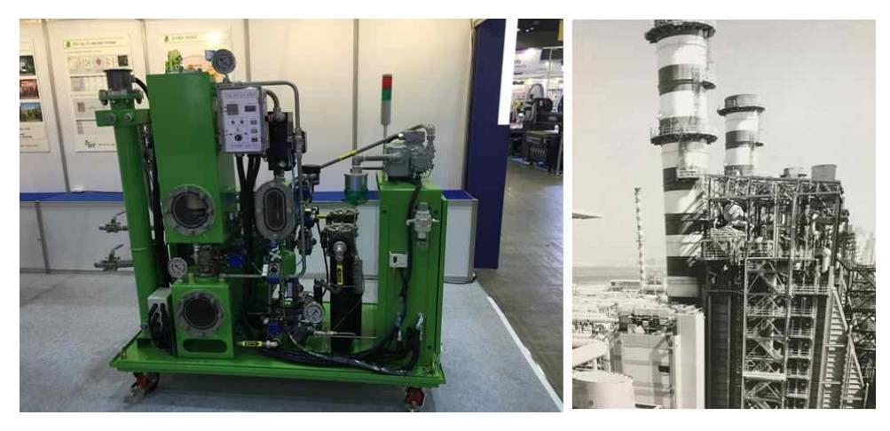

[그림 3-1] 반응 챔버 [그림 3-2] 반응 타워

## 2. 연속흐름반응기

생산물을 연속적으로 생산하기 위해 사용되는 반응기로 [그림 3-2]는 건물 수 층 높이의 반 응 탑으로 석유화학 정유 설비가 대표적인 연속흐름반응기라고 할 수 있겠다. 석유화학 정 제 탑은 연속생산방식의 대표적인 경우로 석유화학 정제물의 많은 종류를 생산하고 있다. 통상 보관 및 이송이 액체 상태인 경우 연속흐름반응기를 이용해서 생산하는 경우가 일반 적이다.

# (1) 연속교반탱크반응기 CSTR ; Continuous Stirred Tank Reactor

반도체 공정에서 중요하게 사용되는 초순수를 생산하는 과정에 사용되는 반응기가 대 표적인 경우로 그림b 와 같은 경우가 일반적이나 형상은 구형, 원추형, 원기둥형 등 여러 가지 형상이 있다.

(2) 관형반응기 tubular Reactor

연속 반응공정 중에서 반응에 필요한 조건이 긴 지속시간을 갖거나 좁은 관의 형상을 필요로 하는 경우 사용하는 반응기로 칼럼 내부에 배관을 배치하는 경우와 배관을 대 기 중으로 노출하는 경우도 있다. 냉각반응을 유도하기 위한 열교환기 등이 대표적이다.

(3) 충전층반응기 Reactor

반응 챔버의 내부에 반응을 도와줄 촉매나 구조물을 내부에 충진 시켜서 반응을 진행 하도록 하는 반응기로서 암모니아 Gas 물에 흡수시키는 공정이나, 염산을 물에 흡수시 키는 공정 등에서 활용된다.

# 설계반응식

반응을 유도하기 위한 설계를 진행함에 있어서 반응 설계를 하는 과정으로 고도의 화학적 전문성을 필요로 하는 과정으로 실질적으로 반응설계를 하는 작업으로 반응식, 필요한 에 너지, 필요한 재료, 생성물의 특성 등을 수식으로 표현하고 그 수식을 구체화 시키는 작업 이 시설 및 장치의 설계라고 하겠다. 1. 물 H2O 반응에 있어서 고려해야 할 사항

여기에서 고려해야 할 반응은 수소 H2 gas와 산소 O2 gas의 반응을 고려한다.

- (1) 화학식 : 2H + O = H2O + 방출에너지
- (2) 반응에 필요한 양 : 수소 2\*22.4리터 + 산소 22.4리터 => 22.4리터 물 H2O gas 1몰의 부피는 22.4리터이고 화학의 중요 단위이다. 따라서 물의 화학식을 고려하면 수소 H 44.8리터와 산소 O 22.4리터는 물 44.8리터를 생성하게 된다, 하지만

이는 화학식을 통한 계산으로 실제로 수소와 산소는 단분자 Gas가 아니다.

(3) 반응화학식 : 2H2 + O2 = 2H2O

실제로 몰 반응에 필요한 양은 수소 22.4리터의 두 배인 44.8리터와 산소 22.4리터를 반응시키면 22.4리터의 두 배인 44.8리터가 생성되게 된다. 따라서 물 H2O gas 1몰을 생성하기 위해서는 수소 22.4리터와 산소 11.2리터를 합성하면 물 Gas 22.4리터가 생성 되게 된다.

(가) 반응 전 보관용적

수소 22.4리터, 산소 11.2리터

(나) 반응용적

수소와 산소의 혼합 용적 33.6 리터

(다) 반응 후 반응용적

물 H2O gas 22.4리터

(4) 반응 시간의 제어

여기서 주의해야 할 것은 수소를 산소와 반응시키는 반응이라는 것이다. 수소는 산소 와 반응에 있어서 발열 반응이고 반응 시간이 매우 짧아 폭발적 반응이라는 것이다.

(5) 반응 온도의 제어

수소와 산소의 반응이 발열 반응이기도 하지만 물 H2O gas를 냉각하면 물 H2O 액체 로 상이 바뀌게 된다는 점이 중요하고 물에는 산소와 수소가 일정 부분 녹아들게 되는 등 예상하기 어려운 부분이 있어 순수한 물을 얻기 위해서 수소와 산소를 반응시키지 는 방법을 사용하지는 않는다.

# 반응 파라메타

순수한 물을 얻기 위해서 여과 방식과 이온교환방식을 기본으로 하는 연속공정 방식을 주 로 활용하고 있다. 1. 장치 파라메타

장치를 구성하는 파라메타로 저장 용기, 반응 용기, 연결배관, 제어밸브, 안전밸브, 무게, 제어방식 등이 있다.

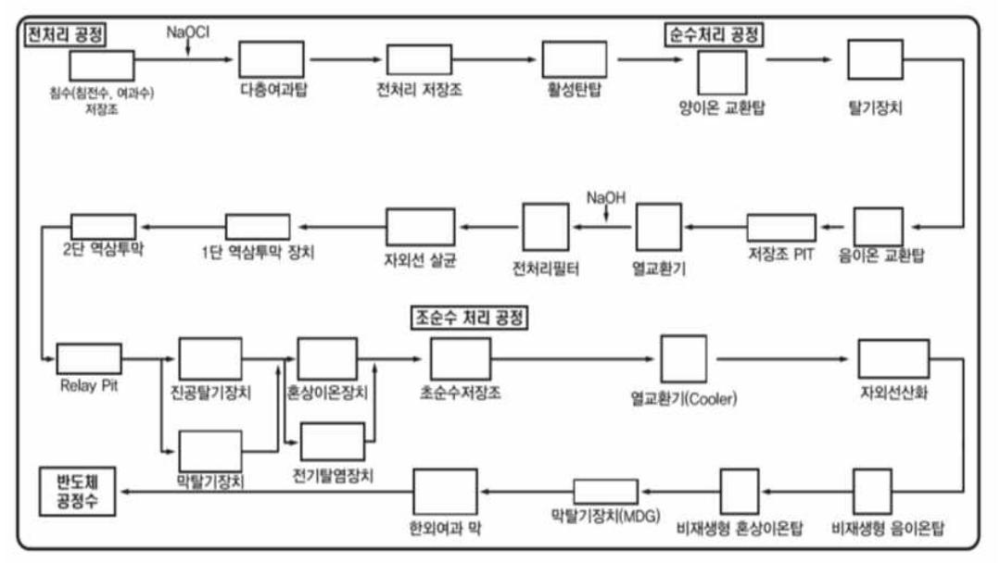

[그림 3-3] 초순수 생산 PID 예

2. 제어파라메타

장치 운전을 위한 파라메타로 이후 공정파라메타를 통한 장치의 생산성과 성능을 결정하 는 요소가 된다.

(1) 기계적 제어

기계적 구동을 제어하는 것으로 구동 모터, 구동밸브 등의 제어

- (2) 되세김 제어 : 피드백제어 연속공정에서 센서와 구동부를 연계시켜서 생산 유체의 상태(온도, 유속, 성분)를 제어 하는 것
- 3. 반응 파라메타

반응의 직접성을 제어하는 것으로 반응의 요소를 기계 및 제어 파라메타를 통제하여 반응 성을 제어하는 것으로 장비 모델에 따라서 레시피 등으로 관리되기도 한다.

- 온도
- 재료의 배합량
- 압력

# 수행 내용 / 초순수 제조하기

# 재료·자료

- Ÿ 시티워터 : 산업용수 및 도시용수(수돗물)
- Ÿ 초순수 제조설비의 사양서 및 매뉴얼
- Ÿ 장비 운전에 필요한 소모품 및 교체 부품

# 기기(장비 ・ 공구)

- Ÿ 초순수 제조기
- Ÿ 초순수 제조기 운전에 필요한 기기(장비·공구)
- Ÿ 장비 정비에 필요한 기기(장비·공구)
- Ÿ 초순수 화학적 농도를 확인할 수 있는 장비(pH 측정기 등)
- Ÿ 초순수의 전기적 비저항을 측정할 수 있는 장비(약액 (비)저항 측정기)

# 안전 ・ 유의 사항

- Ÿ 장비 취급에 필요한 안전·유의 사항을 숙지한다.
- Ÿ 약액 취급에 대한 안전·유의 사항을 숙지한다.
- Ÿ안전 보호구 및 보호 장비의 사용에 필요한 안전·유의 사항을 숙지한다. 수행 순서

초순수의 생산 준비를 한다.

반도체 공정에 필요한 초순수의 생산 준비를 한다. 1. 장비의 구조적 결합 상태의 확인

- (1) 장비의 상태와 장비의 사양서와 매뉴얼에서의 항목을 비교 체크
  - (가) 사양서를 확인한다.
  - (나) 매뉴얼을 확인한다.
  - (다) 사양서와 매뉴얼에서 체크항목을 도출 작성한다.
  - (라) 체크항목에 따른 판정 기준을 정한다.
  - (마) 체크리스트를 확인한다.

- 2. 반응 챔버와 연결 배관의 확인
  - (1) 반응 챔버와 PID의 연결 상태를 항목을 확인한다.
    - (가) 사양서 및 매뉴얼에서 PID를 확인한다.
    - (나) 장비와 매뉴얼을 확인한다.
    - (다) 사양서와 매뉴얼, PID에서 체크항목을 도출 작성한다.
    - (라) 체크항목에 따른 판정 기준을 정한다.
- (마) 체크리스트를 확인한다. 3. 전기적 연결 상태의 확인
- - (1) 장치의 사양서와 전기회로도에 따른 연결 상태를 확인한다.
    - (가) 사양서 및 매뉴얼에서 전기회로를 확인한다.
    - (나) 장비와 매뉴얼을 확인한다.
    - (다) 사양서와 매뉴얼, 전기회로에서 체크항목을 도출 작성한다.
    - (라) 체크항목에 따른 판정 기준을 정한다.
- (마) 체크리스트를 확인한다. 4. 소모성 부품의 상태확인
- - (1) 장치의 사양서와 매뉴얼에서 소모성 부품의 품목을 확인한다.
    - (가) 사양서 및 매뉴얼에서 소모성 부품의 품목을 확인한다.
    - (나) 장비와 매뉴얼을 확인한다.
    - (다) 사양서와 매뉴얼, 소모성 부품의 항목을 도출 작성한다.
    - (라) 소모성 부품의 상태 판정 기준을 정한다.
    - (마) 소모성 부품의 상태를 판정한다.

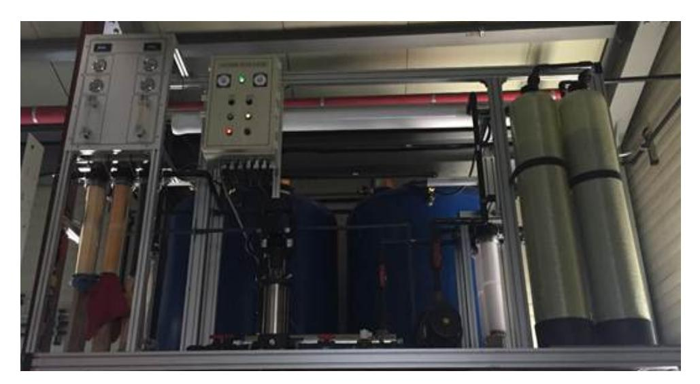

[그림 3-4] 초순수 생산 설비 설치 예

초순수를 생산한다. 초순수의 생산 장비를 기동하여 초순수를 생산한다. 1. 테스트 기동

상태확인에서의 체크리스트에서 확인된 내용에서 문제없음을 확인하고 테스트 기동을 시 작한다.

- (1) 제어계 전원을 ON 한다.
- (2) 동력계 전원을 ON 한다.
- (3) 기계 구동부를 구동한다.
- (4) 순수 생산을 시작한다. 2. 테스트 기동 결과의 확인 및 대응
  - (1) 생산된 순수 상태를 확인
  - (2) 문제점을 정리한다.
  - (3) 해결 방안을 정리한다.
- 3. 양산 기동

순수를 양산한다.

# 수행 tip

- 연속 생산 설비를 기동시켜본다.
- 약액 생산 설비의 구동을 이해한다.

# **3-2.** 습식화공약품 생산문제에 대한 해결

학습 목표 • 반도체 습식화공약품(Wet Chemical) 재료별 제조 공정의 도출된 문제점에 대한 해 결 방안을 제시할 수 있다.

# 필요 지식 /

공장 운전에 대하여 ; 안전

화학약품 연속공정에서 안전에 대한 문제는 사람과 환경에 중요한 영향을 미치므로 생산 과정에서 필요한 주의를 충분히 기울여야 한다. 1. 유독 물질 혼합에 대한 모델링

본 텍스트에서는 액체의 유출에 대해서만 고려한다.

- (1) 약액의 유출에 대한 문제
  - 벤젠, 알코올 등의 가연성 유체의 유출
  - 염산, 황산, 수산화나트륨 등 산, 알칼리의 유출
  - 기타 인체 및 환경 유해물질의 유출
- (2) 외부 가스 유입에 대한 문제

반응 및 보관 탱크에 외부 가스가 혼합되어 들어오는 경우는 삼각형 조성도표를 이용 하는 모델링을 많이 활용한다. 아래 그래프의 모델이 일반적으로 각 인화물의 특성에 따라서 작성 하는 경우가 일반적이다.

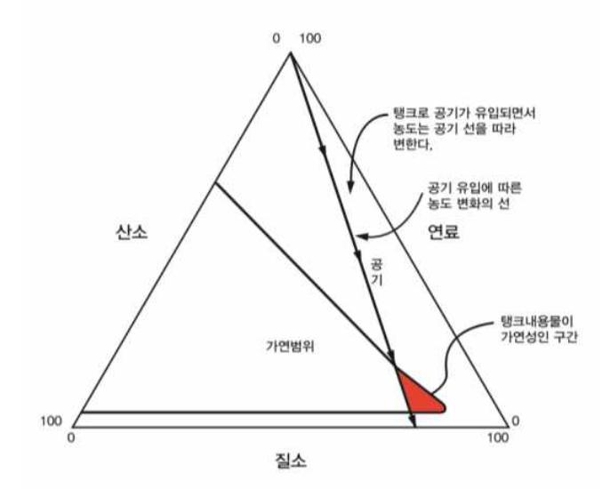

[그림 3-5] 삼각형 조성도표의 예

2. 생산 제품 품질 문제에 대한 문제 모델링

외부 Gas 및 불순물이 화학 반응 회로 내부로 포함되어 들어갈 경우 반도체 재료의 경우 순도에 대한 부분에 치명적인 품질 저하를 가져올 가능성도 있다.

공정위험 점검 ; 점검표

공정을 진행하는 데 있어서 점검해야 할 항목을 정리해서 주기적인 점검을 해야 한다. 1. 시설점검표

- - 공장 시설에 대한 점검
  - 생산 시설에 대한 점검
  - 보호 및 방호 시설에 대한 점검

## 2. 프로세스점검표

- 메인공정 진행 상태의 점검
- 긴급 상황에 대한 바이패스 라인 점검
- 정비 부분에 대한 점검
- PID 상에서 밸브 및 기기 접촉 부분은 점검 포인트로 봐야 한다.

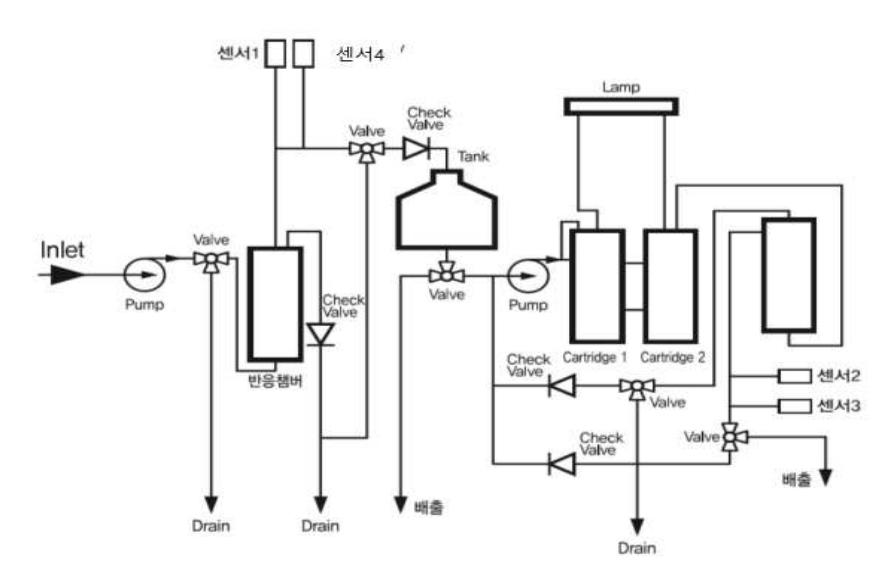

[그림 3-6] PID 표현 예

3. 검사결과 확인과 분석

- 검사 결과의 확인 및 현장 확인

- 4. 검사결과 판정에 대한 대응
  - 대응 여부의 판단
  - 대응 범위의 판단
  - 대응 시기의 판단
  - 정비 및 보완 결과확인을 위한 테스트 진행

# 수행 내용 / 외부 가스 유입에 대한 위험성 확인하기

# 재료·자료

- Ÿ 외부 가스 유입에 대한 테스트 자료
- Ÿ 인화성 가스 시료
- Ÿ 가연성 도표에 작성에 자료

# 기기(장비 ・ 공구)

- Ÿ 외부 가스 유입 가연성 실험 KIT(장비)
- Ÿ 온도 및 압력 측정 및 기록장치
- Ÿ 압력 조절용 진공 및 가압 펌프

# 안전 ・ 유의 사항

- Ÿ 폭발 및 연소 반응에 대한 방호를 한다.
- Ÿ 압력 제어용 펌프의 취급 시 주의한다.
- Ÿ정밀 측정기기의 취급 시 주의한다. 수행 순서

 외부 가스 유입에 대한 상황을 시뮬레이션해본다. 정해진 조건에서 공기의 유입으로 인한 위험을 확인해본다. 첨부된[그림3-8]과 같이 약액 을 정하여 폭발 시뮬레이션과 폭발 KIT을 이용하여 폭발 실험을 진행해본다. 실험에 대한 진행 보고서를 작성한다. 1. 가연성 실험 KIT 설치

- - (1) 실험방법

KIT의 내부를 압력 조건과 온도 조건을 설정하여 내부에 탱크 내부의 물질을 상징할 수 있는 물질을 넣고 점화 또는 반응을 유도하고, 내용을 모니터하고 계측 장비로 계 측 기록한다.

- (가) 압력에 대한 조건
  - 0.5ATM
  - 1.0ATM
  - 1.5ATM
  - 2.0ATM

(나) 온도에 대한 조건

- 기화 온도 이하
- 기화 온도 이상
- 인화 온도 이상
- 기타 필요한 온도 포인트

# 2. 가연성 실험의 정리

위 항목의 데이터를 삼각형 조성도표를 이용하여 폭발영역에 대한 해석을 진행한다.

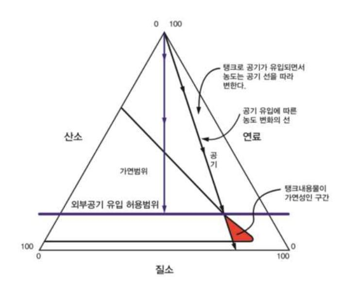

[그림 3-7] 삼각형 조성도표를 이용한 폭발 영역 해석 예

 결과의 해석과 보고서를 작성한다. 외부로의 유출이나 외부로부터의 유입을 예방하기 위하여 점검항목과 점검 포인트를 설정 하여 정기 또는 비정기적 점검을 진행해야 한다. 점검 포인트는 활용 서식의 공정 위험 점 검표를 참고로 한다. 또한, [그림 3-9]의 PID에서의 확인 포인트의 예도 참고로 한다.

- 1. 시설점검표 : 부록의 시설점검표 참조
  - 공장 시설에 대한 점검 포인트 선정
  - 생산 시설에 대한 점검 포인트 선정
  - 보호 및 방호 시설에 대한 점검 포인트 선정
- 2. 프로세스점검표 : 부록의 시설 점검표 참조 및 PID에서의 확인
  - 메인공정 진행 상태의 점검 포인트 선정
  - 긴급 상황에 대한 바이패스 라인 점검 포인트 선정
  - 정비 부분에 대한 점검 포인트 선정
  - PID 상에서 밸브 및 기기 접촉 부분은 점검 포인트 선정

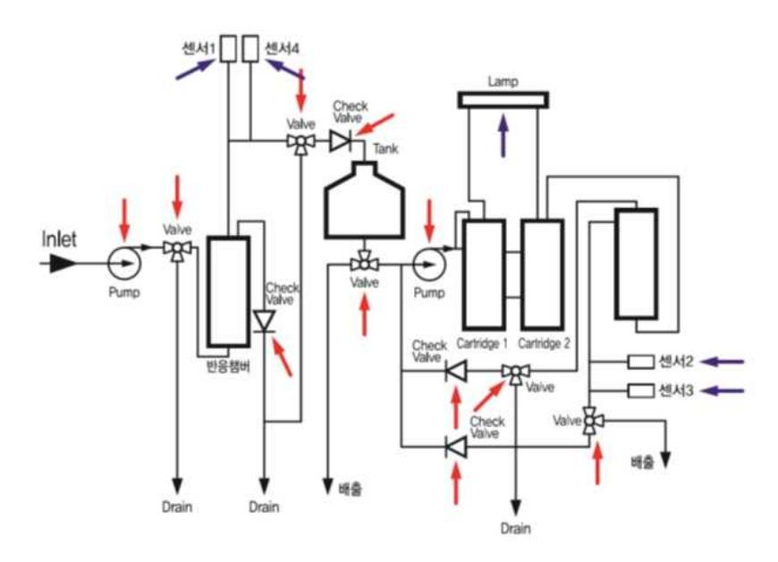

[그림 3-8] 점검 포인트의 예시 예

# 수행 tip

- 유입 유출에 대한 문제점을 이해한다.
- 점검 포인트를 설정해본다.

# 학습3 교수·학습 방법

# 교수 방법

- 반응 공간(챔버)에 대한 개념을 설명한다.
- 연속 반응설비에 대해서 설명한다.
- 연속 반응에 대한 내용과 반응 설계를 진행해본다.
- 반응에 필요한 변수와 관리 포인트에 대해서 설명한다.
- 물질 유입에 대한 유입 후 반응에 대한 실험을 진행한다.
- 연속공정 PID를 다양하게 준비하여 관리 포인트를 설정해보고 이유를 설명한다.
- 그룹 토론을 통하여 사례 연구를 하도록 한다.
- 실험과정에 대한 보고서를 작성하도록 하여 결과에 대하여 토론을 하고 최종 보고서를 작성하도 록 한다.

# 학습 방법

- 반응 챔버의 종류와 형상에 대해서 학습한다.
- 연속반응과 일괄반응에 대해서 학습한다.
- 여러 가지 종류의 PID를 해석해본다.
- 물질의 유출 및 유입에 의한 사고사례를 찾아본다.
- 산업단지의 산업 설비를 견학해본다.

# 학습3 평 가

# 평가 준거

• 평가자는 학습자가 학습 목표를 성공적으로 달성하였는지를 평가해야 한다.

# • 평가자는 다음 사항을 평가해야 한다.

| 학습 내용                     | · · · · · · · · · · · · · · · · · · ·                                 | 성취수준 |   |   |  |
|---------------------------|-----------------------------------------------------------------------|------|---|---|--|
| 익답 네용                     | 평가 항목                                                                 | 상    | 중 | 하 |  |
| 습식화공약품                    | - 반도체 습식화공약품(Wet Chemical)의 제조 공정별 장 점과 단점을 파악할 수 있다.              |      |   |   |  |
| 생산의 이해                    | - 반도체 습식화공약품(Wet Chemical) 재료별 제조(공정/ 장비) 파라미터를 파악하고 적용할 수 있다.     |      |   |   |  |
| 습식화공약품 생산 문제에 대한 해결 | - 반도체 습식화공약품(Wet Chemical) 재료별 제조 공정 의 도출된 문제점에 대한 해결방안을 제시할 수 있다. |      |   |   |  |

# 평가 방법

• 문제 해결 시나리오

| 학습 내용                     | 평가 항목                                                               | 성취수준 |   |  |  |
|---------------------------|---------------------------------------------------------------------|------|---|--|--|
| 익답 네동                     |                                                                     | 상    | 하 |  |  |
| 습식화공약품                    | - 시나리오에 대한 습식화공약품(Wet Chemical)의 제조 공정별 장점과 단점의 이해 여부            |      |   |  |  |
| 생산의 이해                    | <ul> <li>시나리오에 대한 습식화공약품의 재료별 제조(공정/장 비) 파라메터의 이해 여부</li> </ul> |      |   |  |  |
| 습식화공약품 생산 문제에 대한 해결 | - 시나리오에 대한 습식화공약품의 재료별 제조공정에 서 도출된 문제점에 대한 해결 방안의 제시 여부          |      |   |  |  |

# • 서술형 시험

| 학습 내용                     | · · · · · · · · · · · · · · · · · · ·                          | 성취수준 |   |  |  |
|---------------------------|----------------------------------------------------------------|------|---|--|--|
| 익답 네동                     | 평가 항목                                                          | 상    | 하 |  |  |
| 습식화공약품                    | - 습식화공약품(Wet Chemical)의 제조 공정별 장점과 단 점을 이해 여부               |      |   |  |  |
| 생산의 이해                    | - 습식화공약품(Wet Chemical)의 재료별 제조(공정/장비) 파라메터의 이해 여부           |      |   |  |  |
| 습식화공약품 생산 문제에 대한 해결 | - 습식화공약품(Wet Chemical)의 재료별 제조공정의 도 출된 문제점에 대한 해결 방안의 제시 여부 |      |   |  |  |

• 평가자 체크리스트

| 학습 내용                     | 평가 항목                                                         | 성취수준 |   |  |  |
|---------------------------|---------------------------------------------------------------|------|---|--|--|
| 러답 네중                     |                                                               | 상    | 하 |  |  |
| 습식화공약품                    | - 습식화공약품(Wet Chemical)의 제조 공정별 장점과 단 점을 파악하고 있는지 여부        |      |   |  |  |
| 생산의 이해                    | - 습식화공약품(Wet Chemical) 재료별 제조(공정/장비) 파라메터의 파악 및 이해도        |      |   |  |  |
| 습식화공약품 생산 문제에 대한 해결 | - 습식화공약품(Wet Chemical) 재료별 제조공정의 도출 된 문제점에 대한 해결 방안의 제시 여부 |      |   |  |  |

# 피드백

문제 해결 시나리오

 문제를 객관화하고 해결 시나리오를 구성할 수 있도록 사례를 지도한다.

 서술형 시험

 기본적 항목에 대해서 문제를 출제하고, 재시험을 통하여 필수적인 학습 하도록 한다.

 평가자 체크리스트

 최종 보고서의 내용을 확인하여 부족한 부분을 지도한다.

| 학습 4 | 반도체용 습식화공약품(Wet Chemical) 제품 특성 검증하기 (LM1903060405_14v1.4) |
|------|------------------------------------------------------------------|
| 학습 3 | 반도체용 습식화공약품(Wet Chemical) 재료 제조하기 (LM1903060405_14v1.3)       |
| 학습 2 | 반도체용 습식화공약품(Wet Chemical) 재료 선정하기 (LM1903060405_14v1.2)       |
| 학습 1 | 파악하기(LM1903060405_14v1.1)                                        |
|      | 반도체용 습식화공약품(Wet Chemical) 재료 요구사항                                |

# **4-1.** 반도체 습식화공약품(Wet Chemical) 제품 특성 검증

|    | • 반도체 습식화공약품(Wet Chemical)의 분석 시 문제점에 대한 해결방안을 제시할 수 있다. |  |
|----|-------------------------------------------------------------|--|
| 학습 | • 반도체 습식화공약품(Wet Chemical)의 시험 시 문제점에 대한 해결방안을 제시할 수 있다. |  |
| 목표 | • 반도체 습식화공약품(Wet Chemical)의 평가 시 문제점에 대한 해결방안을 제시할 수 있다. |  |
|    | • 반도체 습식화공약품(Wet Chemical)의 검증 시 문제점에 대한 해결방안을 제시할 수 있다. |  |

# 필요 지식 /

분석 시 문제점

분석화학이란 물질의 화학적 특성과 대상물이 무엇이(정성적) 어느 정도 있는지(정량적)에 대한 질문에 대한 답이라고 할 수 있다. 이 두 가지는 화학물질의 품질에 대한 중요한 포 인트라고 할 수 있다. 분석에 있어서 통상적으로 분석에 있어서 문제점으로 인식되는 부분 은 통상 다음과 같은 부분이 있다. 1. 분석작업자

상당한 종류의 계측 및 측정기기는 고도의 전문성과 숙련도를 필요로 하게 되고 그에 따 른 교육과 숙련과정을 필요로 하게 된다.

(1) 전문성

반도체 재료뿐만 아니라 반도체 산업에서 사용되는 많은 종류의 계측 및 측정기기는 전문적인 지식을 필요로 한다.

- 분광화학법
- 원자분광법

- 크레마토그래피

- 전위차법

(2) 숙련도

상기 방법을 포함하여 측정과 계측에는 일정 정도의 숙련도를 필요로 하게 된다. 2. 분석 장비

분석 요구사항에 대해서 대응이 가능한지에 따른 분석 장비의 능력을 확인해야 한다.

(1) 분석능력

 버어니어켈리퍼스와 마이크로켈리퍼스는 대표적인 사례가 되겠다. 샘플의 종류, 크기, 형상에 따른 분석 가능 여부에 대해서 확인할 필요가 있다.

(2) 분석능력의 일관성 : 교정

장비는 일정 시간이 지나면 기능의 저하와 교정 포인트의 변경 현상이 일어날 수 있다. 따라서 공인된 기관을 통하여 일정 기간마다 계측성능을 확인을 하는 것을 법이나 규 칙으로 규정하는 경우가 많다. 품질관리의 대표적인 인증인 ISO에서는 생산에 사용되는 계측 장비의 정기적인 검정 및 교정은 가장 중요한 항목 중 하나로 선정되어 있다. 3. 분석샘플

대상물의 구성물과 불순물의 구성이 무엇인지 확인하는 분석에 있어서 풀기 어려운 딜레 마는 대상물 전체를 실시간으로 검사 할 현실적 방법이 없다는 것이다. 그에 따라서 샘플 의 채취방법, 장소, 시간에 따른 편차를 고려할 수밖에 없는 상황이다. 그 때문에 경우에 따라서 표준 샘플이나 채취방법을 표준화하는 방법이 보완적으로 도입되어 있기도 한다.

시험 및 평가 시 문제점

재료를 사용하기 전에 시험과 평가를 진행하는 데 있어서 회사나 생산방식마다 차이는 있 으나 대략 구분해보면 다음과 같은 과정을 진행하게 된다. 1. 시험

완전 적용 전에 적용 가능성 여부에 대한 시험을 단계별로 진행한다.

(1) 선행적 적용

생산 공정 적용에 앞서 연구소나 실험실에서 시험을 진행한다.

(2) 부분적 적용

양산적용 전에 웨이퍼 한 장 또는 한 Lot(대략 25장)을 적용해서 전후 공정과의 영향성 을 시험해본다.

(3) 양산적용 시험

전면적용 전에 하루 생산량 또는 일정 기간의 생산량에 적용해서 전후 공정과의 영향 성과 최종 제품까지 생산해서 시험을 진행한다.

2. 평가

각 단계별 시험에 대한 평가를 진행하여 적용 가능성이 평가에서 확인되어야 다음 단계로 의 시험과 평가가 진행된다.

검증 시 문제점

검증은 시험과 평가에 대한 결과를 확인하여 일관성을 확보하는 작업이라고 생각할 수 있다. 1. 실험실 검증

실험실에서 만들 수 있는 조건을 형성하여 제품의 성능과 각 단계별 성능을 확인할 수 있 도록 한다.

(1) 정성분석

대상물의 구성물과 불순물의 구성이 무엇인지 확인하는 분석

(2) 정량분석

 대상물의 구성성분과 불순물의 구성비와 함유량이 얼마 인지를 확인하는 분석으로 반 도체 재료에서는 정성분석을 넘어 정량분석에서의 함유량을 정확하게 확인하는 게 필요 하다.

2. 가속 및 가학 실험

각 진행 단계별 특성을 확인할 수 있도록 하는 검증 실험을 진행한다. 예를 제시하면

- (1) 환경적 조건
  - 온도 : -45도 이하, 70도 이상 등의 조건을 설정하여 진행
  - 진동 등 사용 환경
  - 구동 속도 : 주파수
- (2) 사용적 조건
  - 주파수 특성
  - 전압 불안 특성

# 수행 내용 / 분석하기

# 재료·자료

- Ÿ 분석 대상 시료
- Ÿ 분석 대상의 자료 : MSDS, CAS Sheet 등
- Ÿ 분석 시료 및 샘플 수납 용기 : 칼럼 등
- Ÿ 측정 기기의 매뉴얼 및 사용설명서

# 기기(장비 ・ 공구)

- Ÿ 액체 크로마토그래피 기기(장비)
- Ÿ 조정 장비 (공구)
- Ÿ 기기(장비·공구)

# 안전 ・ 유의 사항

- Ÿ 약액 및 샘플의 취급에 유의한다.
- Ÿ 측정기기는 초정밀 기기이므로 취급과 운전에 주의를 기한다.
- Ÿ안전·유의 사항에 적합한 가운, 비닐장갑 등의 방호 도구를 착용한다. 수행 순서

 특성을 검증한다. 측정기기를 이용하여 측정 장비의 운전과 측정결과의 해석 측정결과의 판정과 검증실험을 진행하고 보고서를 작성한다. 1. 장비의 사양과 매뉴얼의 확인

- 장비의 매뉴얼을 숙지하고, 작업 순서를 작성한다.
  - (1) 기계적 사양 확인
  - (2) 측정성능 사양의 확인
  - (3) 측정 방법과 장비 사용방법에 대한 확인
  - (4) 샘플 제작과 샘플 장착에 대해서 확인
  - (5) 측정 결과 생성방법의 확인

2. 전원을 투입하고 측정을 진행한다. 측정 과정에 대해서 진행순서를 정하고 과정을 진행 시킨다.

3. 검증

측정의 적확성을 확보하기 위한 방법

(1) 추가 샘플의 확인

샘플을 복수로 확보한 경우 샘플의 추가 검사를 통해서 재현성을 확보하도록 한다.

- (2) 측정 장치의 기초특성 재확인 측정 장비의 검·교정 주기확인 등

결과의 해석과 보고서를 작성한다. 측정 내용에 대한 결과와 판정에 필요한 항목의 수치를 비교하여 보고서를 작성한다.

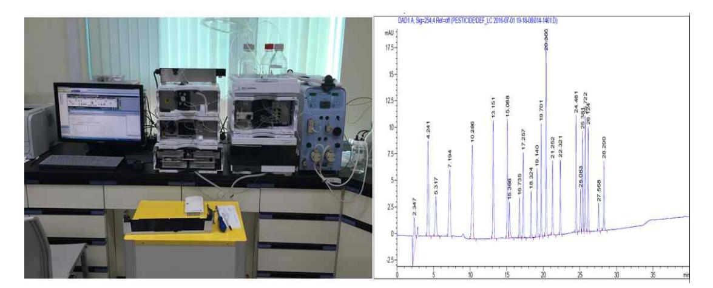

[그림 4-1] 측정 장비 [그림 4-2] 결과 데이터 예

# 수행 tip

- 기기 매뉴얼의 숙지한다.
- 측정 결과를 해석하는 연습을 한다.

# 학습4 교수·학습 방법

# 교수 방법

- 분석에 대학 개론을 설명한다.
- 대표적인 분석방법에 대한 개론적 원리를 설명한다.
- 분석 장비의 분석능력에 대한 개론을 설명한다.
- 준비된 샘플의 측정을 진행한다.
- 도출된 결과를 해석한다.
- 샘플 측정에 대한 데이터 해석에 대해서 그룹별 토론을 진행하도록 한다.
- 도출된 데이터와 해석된 내용을 토대로 최종 분석 보고서를 작성하도록 한다.

# 학습 방법

- 측정 장치의 매뉴얼을 숙지한다.
- 동등한 성능의 다른 방식의 측정 장치에 대해서 학습하고 매뉴얼을 학습한다.
- 장비운용에 대해서 학습한다.
- 결과 해석에 대한 사례연구를 진행한다.

# 학습4 평 가

# 평가 준거

• 평가자는 학습자가 학습 목표를 성공적으로 달성하였는지를 평가해야 한다.

# • 평가자는 다음 사항을 평가해야 한다.

|                       | 평가 항목                                                           | 성취수준 |   |   |  |
|-----------------------|-----------------------------------------------------------------|------|---|---|--|
| 학습 내용                 |                                                                 | 상    | 중 | 하 |  |
|                       | - 반도체 습식화공약품(Wet Chemical)의 분석 시 문제점 에 대한 해결방안을 제시할 수 있다. |      |   |   |  |
| 반도체 습식화공약품(Wet     | - 반도체 습식화공약품(Wet Chemical)의 시험 시 문제점 에 대한 해결방안을 제시할 수 있다. |      |   |   |  |
| Chemical) 제품 특성 검증 | - 반도체 습식화공약품(Wet Chemical)의 평가 시 문제점 에 대한 해결방안을 제시할 수 있다. |      |   |   |  |
|                       | - 반도체 습식화공약품(Wet Chemical)의 검증 시 문제점 에 대한 해결방안을 제시할 수 있다. |      |   |   |  |

# 평가 방법

• 논술형 시험

|                       | 평가 항목                                               | 성취수준 |   |   |
|-----------------------|-----------------------------------------------------|------|---|---|
| 학습 내용                 |                                                     | 상    | 중 | 하 |
|                       | - 반도체 습식화공약품(Wet Chemical)의 분석 시 문제점 에 대한 이해도 |      |   |   |
| 반도체 습식화공약품(Wet     | - 반도체 습식화공약품(Wet Chemical)의 시험 시 문제점 에 대한 이해도 |      |   |   |
| Chemical) 제품 특성 검증 | - 반도체 습식화공약품(Wet Chemical)의 평가 시 문제점 에 대한 이해도 |      |   |   |
|                       | - 반도체 습식화공약품(Wet Chemical)의 검증 시 문제점 에 대한 이해도 |      |   |   |

## • 사례연구

|                       | 평가 항목                                                              | 성취수준 |   |   |  |
|-----------------------|--------------------------------------------------------------------|------|---|---|--|
| 학습 내용                 |                                                                    | 상    | 중 | 하 |  |
|                       | - 사례에 대한 반도체 습식화공약품(Wet Chemical)의 분 석 시 문제점에 대한 해결방안의 제시 여부 |      |   |   |  |
| 반도체 습식화공약품(Wet     | - 사례에 대한 반도체 습식화공약품(Wet Chemical)의 시 험 시 문제점에 대한 해결방안의 제시 여부 |      |   |   |  |
| Chemical) 제품 특성 검증 | - 사례에 대한 반도체 습식화공약품(Wet Chemical)의 평 가 시 문제점에 대한 해결방안의 제시 여부 |      |   |   |  |
|                       | - 사례에 대한 반도체 습식화공약품(Wet Chemical)의 검 증 시 문제점에 대한 해결방안의 제시 여부 |      |   |   |  |

# • 평가자 체크리스트

|                       | 평가 항목                                                           | 성취수준 |   |   |  |
|-----------------------|-----------------------------------------------------------------|------|---|---|--|
| 학습 내용                 |                                                                 | 상    | 중 | 하 |  |
|                       | - 반도체 습식화공약품(Wet Chemical)의 분석 시 문제점 에 대한 해결방안에 대한 적합성 여부 |      |   |   |  |
| 반도체 습식화공약품(Wet     | - 반도체 습식화공약품(Wet Chemical)의 시험 시 문제점 에 대한 해결방안에 대한 적합성 여부 |      |   |   |  |
| Chemical) 제품 특성 검증 | - 반도체 습식화공약품(Wet Chemical)의 평가 시 문제점 에 대한 해결방안에 대한 적합성 여부 |      |   |   |  |
|                       | - 반도체 습식화공약품(Wet Chemical)의 검증 시 문제점 에 대한 해결방안에 대한 적합성 여부 |      |   |   |  |

# 피드백

| 1. 논술형 시험                                 |
|-------------------------------------------|
| - 샘플측정에 필요한 내용을 평가하여 재시험을 시행한다.           |
| 2. 사례연구                                   |
| - 측정 사례를 통해 반복적으로 측정에 대한 이미지를 갖도록 한다.     |
| 3. 평가자 체크리스트                              |
| - 작성된 최종 보고서를 확인하여 평가하고 부족한 부분을 보완하도록 한다. |

- ∙ 권기영 저(2015). 『핵심이보이는반도체공학』. 한빛아카데미.
- ∙ 이순원 외 편저(2013). 『무기화학실험』. 사이플러스.
- ∙ 한국반도체산업협회 저(2014). 『2014국가직무능력표준 반도체장비』. 고용노동부.
- ∙ 한국반도체산업협회 저(2014). 『2014국가직무능력표준 반도체제조』. 고용노동부.
- ∙ 허규성 저(2014). 『반도체 공학』. 일진사.∙ MASTERTON & HURLEY([2004] 2004.8). 『일반화학 (CHEMISTRY PRINCIPLES and REACTIONS FIFTH EDITION)』. 일반화학교재연구회 역자대표 이명수(역). 자유아카데미.
- ∙ Daniel A. Crowl, Joseph F. Louvar([2013] 2013). 『화학공정안전(Chemical Process Safety Fundamentals with Applications 2 nd edition)』. 역자 이영순 외(역). 도서출판 동화기술.
- ∙ Francis Rouessac & Annick Rouessac ([2004] 2009). 『현대기기분석 제6판(ANALYSE CHIMIQUE Methodes et techniques instrumentales modernes 6th edition)』. 역자 기기분석교재연구회(역). 자유아카데미.
- ∙ Gary D. Christian, Purnendu K. Dasgupta, Kevin A. Schug([2014] 2015). 『분석화학(ANALYTICAL CHEMISTRY 7th edition)』. 대표역자 이동수 외(역). 자유아카데미.
- ∙ Gary L. Miessler, Paul J. Fischer, Donald A. Tarr([2014] 2015). 『무기화학(INORGANIC CHEMISTRY Fifth edition)』. 역자 김주창 외(역). 자유아카데미.
- ∙ H. Scott Fogler([2006] 2016). 『화학반응공학 4판(ELEMENTS OF CHEMICAL REACTION ENGINEERING 4th edition)』. 역자 박인수 외(역). 프로텍미디어.
- ∙ Kenneth A. Solen, john N. Harb([2011] 2012). 『화학공학 입문설계 5판(Introdution to Chemical Engineering 5th edition)』. 역자 박진호 외(역). 한티미디어.
- ∙ Robert C. Atkins, Francis A. Carey([2003] 2009.9). 『유기화학(ORGANIC CHEMISTRY third editio n)』. 역자 김진호 외(역). 한티미디어.
- ∙ Telius SP(장치개요 Manual) R2.0.2
- ∙ 산업안전보건법 [시행 2015.1.1.] [법률 제11862호, 2013.6.4., 타법개정] 고용노동부
- ∙ LG화학 (160720 확인). 『물질안전보건자료 ISOPROPYL ALCOHOL』. LG화학여수공장
- ∙ INTERNATIONAL TECHNOLOGY ROADMAP FOR SEMICONDUCTORS 2.0 2015EDITION EXECUTIVE REPORT

# 작업 포트폴리오

MSDS 작성에 대한 항목 예

|                            | MSDS                     | 등록번호 |  |
|----------------------------|--------------------------|------|--|
| 제조사 정보                     | 물질명 : ******             | 페이지  |  |
|                            | CAS No.: **_**_*         |      |  |
| 1. 화학 제품 및 회사에             | 고하 저너                    |      |  |
| 가. 제품명(물질명) :              |                          |      |  |
| 나. 제품의 권고 용도               | 와 사용상의 제한                |      |  |
| 다. 제조자/공급자/유통              | 업자 정보                    |      |  |
| 2. 유해. 위험성                 |                          |      |  |
| 가. 유해 위험성 분류               |                          |      |  |
| 나. 경고 표지 항목                |                          |      |  |
|                            | 기준에 포함디지 않는 기태 유해 위험성    |      |  |
| 3. 구성성분 명칭 및 함 예) H2O3  | ·유량                      |      |  |
| 에) H2O3 4. 음급조치 요령      |                          |      |  |
| 가. 눈에 들어갔을 때               |                          |      |  |
| 나. 피부에 접촉했을 더              | 4                        |      |  |
| 다. 흡입 했을 때                 |                          |      |  |
| 라. 먹었을 때                   |                          |      |  |
| 마. 급성 및 지연성의               | 가장 중요한 증상/영향             |      |  |
| 바. 응급처치 및 의사의              | 의 주의사항                   |      |  |
| 5. 화재. 폭발시 대처방             | •••                      |      |  |
| 가. 적절한( 및 부적절              | 한) 소화제                   |      |  |
| 나. 화학물질로부터 생               | 기는 특정 유해성                |      |  |
|                            | 할 보호구 및 예방조치             |      |  |
| 6. 누출 사고 시 대처방             | '법 위해 필요한 조치 사항 및 보호구 |      |  |
|                            |                          |      |  |
| 나. 환경을 보호하기 역              |                          |      |  |
| 다. 정화 또는 제거방 7. 취급 및 저장 | 거 남                   |      |  |
| 가. 안전취급요령                  |                          |      |  |
| 나. 안전한 저장 방법(              | 피해야할 조건 포함)              |      |  |
| 8. 노출방지 및 개인보.             | 호구                       |      |  |

| 가. 화학물질의 노출 기준, 생물학적 노출기준 등                                 |
|-------------------------------------------------------------|
| 나. 적절한 공학적 관리                                               |
| 다. 개인 보호구                                                   |
| 9. 물리. 화학적 특성                                               |
| 1) 외관 2) 냄새 3) 냄새 역치 4) pH 5) 녹는점/어는점 6) 초기 끓는점과 끓는 점 범위    |
| 7) 인화점 8) 증발 속도 9) 인화성(고체, 기체) 10) 인화, 폭발 범위의 상한/하한 11) 증기압 |
| 12) 용해도 13) 증기밀도 14) 비중 15) n-옥탄올/물분배계수 16) 자연발화온도 17) 분해온도 |
| 18) 점도 19) 분자량                                              |
| 10. 안전성 및 반응성                                               |
| 가. 화학적 안정성                                                  |
| 나. 유해 반응의 가능성                                               |
| 다. 피해야 할 조건 및 물질                                            |
| 라. 피해야 할 물질                                                 |
| 마. 분해시 생성되는 유해불질                                            |
| 11. 독성에 관한 정보 가. 가능성이 높은 노출 경로에 관한 정보                    |
| 나. 물리적, 화학적 및 독성학적 특성에 관련된 증상                               |
| 다. 단기 및 장기 노출에 의한 지연. 급성 영향 및 만성 영향                         |
|                                                             |
| 라. 독성의 수치적 척도(급성독성 추정치 등) 12. 환경에 미치는 영향                 |
| 가. 수생 육생 생태독성                                               |
| 나. 잔류성 및 분해성                                                |
| 다. 생물 농축성                                                   |
| 라. 토양이동성                                                    |
| 마. 기타유해영향                                                   |
| 13. 폐기시 주의사항                                                |
| 가. 폐기방법                                                     |
| 나. 폐기시 주의사항 14. 운송정보                                     |
| 가. 유엔번호                                                     |
| 나. 유엔 적정 선적명                                                |
| 다. 운송에서의 위험성 등급                                             |
| 라. 용기등급                                                     |
| 마. 해양오염물질                                                   |
| 바. 사용자가 운송 또는 운송수단에 관련해 알 필요가 있거나 필요한 특별한 안전 대책             |
| 15. 법적사항                                                    |
| 가. 산업안전보건법에 의한 규제                                           |
| 나. 유해화학물질관리법에 의한 규제                                         |

| 다. 위험물안전관리법에 의한 규제 |  |  |
|--------------------|--|--|
|--------------------|--|--|

라. 폐기물관리법에 의한 규제

마. 기타 국내 및 외국법에 의한 규제

16. 기타 참고사항

가. 자료의 출처

나. 최초작성일자

다. 기타 물질안전 보건자료 작성과 관련된 정보

\* 추가자료 \*\* 이력관리

출처 : LG화학여수공장 물질안전보건자료 YHESA205501 필자재작성

공정 위험 점검표 예

| 일반적 배치                                 | 완벽함 | 적용불가 | 추가검토 |
|----------------------------------------|-----|------|------|
| 1. 적절한 지역으로 배수가 되는가?                   |     |      |      |
| 2. 통로는 마련 되었는가?                        |     |      |      |
| 3. 방화벽, 화류둑 및 방책이 필요한가?                |     |      |      |
| 4. 비상 접근로 및 출구가 있는가?                   |     |      |      |
| 5. 천정과 충분한 공간이 있는가?                    |     |      |      |
| 6. 비상용 차량의 통로가 있는가?                    |     |      |      |
| 7. 원료 및 최종 생산품의 안전한 저장공간이 있는가?         |     |      |      |
| 8. 안전한 보수작업을 실시할 수 있는 공간이 있는가?         |     |      |      |
| 9. 머리위를 지나는 전선과 충분한 거리가 있는가?           |     |      |      |
| 건축물 1. 적절한 사다리, 계단 및 비상구가 있는가?      |     |      |      |
| 2. 필요한 방화문이 있는가?                       |     |      |      |
| 3. 배기시설은 적절한가?                         |     |      |      |
| 4. 주변 건물과 적절한 거리를 유지하고 있는가?            |     |      |      |
| 5. 피난 공간은 준비되어 있는가?                    |     |      |      |
| 공정                                     |     |      |      |
| 1. 운전 중인 설비에서의 약품유출을 고려해야 하는가?         |     |      |      |
| 2. 특별한 흄 또는 분진 후드가 요구되는가?              |     |      |      |
| 3. 불안정한 물질들이 적절히 저장되었는가?               |     |      |      |
| 4. 폭발로부터 방호할 수 있도록 되어 있는가?             |     |      |      |
| 5. 오 조작 또는 오염물에 의하여 반응 폭주가 발생 할 수 있는가? |     |      |      |

# 제품 환경유해물질 관리시트 예

Product General information
 Product Name
 Prepare by
 TEL/E-MAIL

|    | Product   | 1100100 | No. of Concession |          | Weight | Component Substand (Mill Data) |       | ance |    |    | RoHS | (ppm) |     |      | ICP Test   | ICP TEST | TEST | ATTACH             | ED FILE | RoHS & Halogen   |
|----|-----------|---------|-------------------|----------|--------|-----------------------------------|-------|------|----|----|------|-------|-----|------|------------|----------|------|--------------------|---------|---------------------|
| No | (Portion) | Vendor  | Model             | Material | (mg)   | Substance                         | CAS # | Wt.% | Cd | Pb | Hg   | Cr+6  | PBB | PBDE | laboratory | REPORT # | DATE | ICP TEST REPORT | MSDS    | Exemption (MSDS) |
|    |           |         |                   |          |        |                                   |       |      |    |    |      |       |     |      |            |          |      |                    |         |                     |
|    |           |         |                   |          |        |                                   |       |      |    |    |      |       |     |      |            |          |      |                    |         |                     |

# **NCS 학습모듈 개발진**

| (대표집필자) (집필진)           | (검토진)                            |
|----------------------------|----------------------------------|
| 김관하(대덕대학교) 강필승(메그나칩반도체) | 권기백(대덕대학교)                       |
| 김상용(한국폴리텍대학)*              | 김동표(케이디전자)                       |
| 김종식(드림테크)                  | 박태진(대덕대학교)                       |
|                            | 양민철(서울공업고등학교) 여순일(한국전자통신연구원)* |
| 우종창(이너센서)                  | 정용철(한국생산기술연구원)                   |
| 이병철(비드앤마이크로)*              |                                  |
| 장현경(강원대학교)*                |                                  |
| 정재복(메이플테크)*                |                                  |
|                            | 제창한(한국전자통신연구원)                   |
| 홍진균((前) LG실트론)*            |                                  |
|                            |                                  |
|                            |                                  |
| (공동개발기관) (연구기관)         |                                  |
|                            |                                  |
| 권기백(대덕대학교)                 | 옥준필(한국직업능력개발원)                   |
| 김관하(대덕대학교)                 | 박종성(한국직업능력개발원)                   |
| 박태진(대덕대학교)                 | 나현미(한국직업능력개발원)                   |
|                            | 최영인(한국직업능력개발원)                   |

※ 이 학습모듈은 자격기본법 시행령(제8조 국가직무능력표준의 활용)에 의거하여 개발하였으며, NCS 국가직무능력표준 통합포털사이트(http://www.ncs.go.kr)에서 다운로드 할 수 있습니다.

www.ncs.go.kr

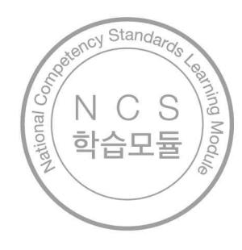